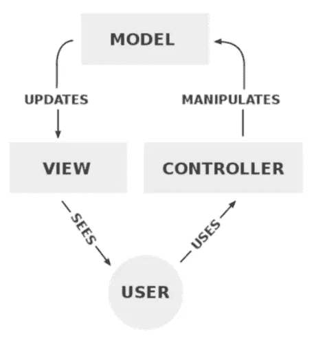
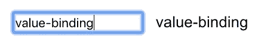

# 备选反应模式—第 1 部分:MVC

> 原文：<https://medium.com/hackernoon/alternate-react-patterns-part-1-mvc-b1f949d2f189>

这篇文章是关于 React.js，一个用于构建用户界面的 JavaScript 库，以及我们如何接受在 React 社区中不太流行的设计模式。

在构建 [**BuilderX**](https://builderx.io/) 时，一个将设计&代码带到一个公共场所的设计工具，我遇到了不同的设计模式，随着旅程的继续，这篇文章是我分享我的学习的一个小小的努力

React 或多或少是基于函数式编程概念的，这是 React 宣称的领导者已经接受的核心概念，如不变性。

# 但是，我们有空间选择其他模式吗？

React 及其社区慷慨地提供可供选择的模式，这就是它的美妙之处。例如，MobX 基于 OOPs 的概念，因此允许状态的可变性和嵌套。用 React 探索面向对象的概念！

# **用 React 探索面向对象的概念！**

我们在面向对象模式方面有几十年的工作经验，数以千计的应用程序都是使用这种模式构建的。我不打算比较函数性和 OOPs 概念，因为本文的目标是探索在 React 中采用这种模式的想法！

在 OOPs 中，我们有这样的模式

*   MVC 模式
*   MVVM 模式
*   MVP 模式
*   命令模式

# 首先，MVC 模式

MVC 代表模型-视图-控制器，下面是来自维基百科的正式定义:

> 模型-视图-控制器是一种架构模式，通常用于开发用户界面，将应用程序分成三个相互连接的部分。这样做是为了将信息的内部表示与信息呈现给用户和用户接受信息的方式分开。[1][2]MVC 设计模式将这些主要组件解耦，允许高效的代码重用和并行开发。

# 实验

为了简化这个实验，我将构建一个简单的应用程序，它包含以下内容:

一个简单的应用程序

*   一个输入框
*   显示在它旁边键入的任何内容

在这个特定的实验中，模型可以被命名为 **UserInputModel** 。视图是在屏幕上看到的 HTML 呈现，控制器处理用户动作。

## 模型

*UserInputModel.js*

# 视图和控制器

在 React 中，视图和控制器通常位于同一位置。姑且称之为**user input view controller**(或者我们甚至可以称之为 UserInputComponent)。

以后它可以像这样使用

# **但是有一个问题**

在上面的实验中，如果模型是从控制器之外的来源更新的，这个组件不会更新，这就是为什么 MVC 设计模式建议视图应该监听来自模型的变化。怎么才能做到呢？让我们看看！

让我们改进模型，以发出变化:

所以，这就是 MVC 在 React 中的实现方式！这是对 React 如何整合一系列设计模式的快速浏览，我希望在我的下一篇博客中涵盖其他模式。

到时候见！