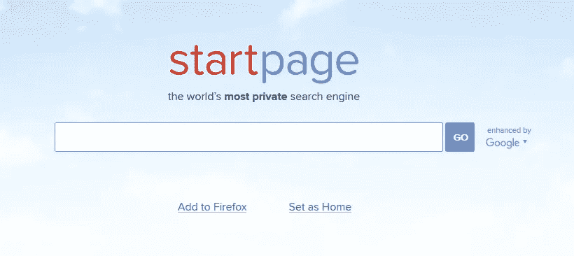

# DuckDuckGo 的替代私人搜索引擎

> 原文：<https://medium.com/hackernoon/alternative-private-search-engines-to-duckduckgo-bae758205c0>

Photo by [Agnieszka Boeske](https://unsplash.com/@kundeleknabiegunie?utm_source=medium&utm_medium=referral) on [Unsplash](https://unsplash.com?utm_source=medium&utm_medium=referral)

说到私人搜索引擎，DuckDuckGo 是目前最受欢迎的。如果有人听说过一个私人搜索引擎，它可能是 DuckDuckGo。它始于 2008 年，从那以后发展迅速。DuckDuckGo 目前每天记录超过 2000 万次搜索。

早在二月份，我发表了这个关于谷歌(T3)的最佳私人替代方案的故事:

 [## 最好的私人搜索引擎——谷歌的替代品

### 私人搜索引擎在过去的几年里有了巨大的增长。直到最近，还不可想象有人…

hackernoon.com](https://hackernoon.com/untraceable-search-engines-alternatives-to-google-811b09d5a873) 

从那以后，这个帖子已经有超过 22 万的浏览量。经过几个月的反馈，我意识到谷歌并不是人们寻找替代品的唯一搜索引擎。

虽然 DuckDuckGo 不跟踪使用其搜索引擎的人，但它不是一个完美的私人解决方案。它不会“用令人毛骨悚然的广告在网上跟着你”，但是对于[的安全和隐私来说，有更好的选择。](https://hackernoon.com/tagged/security)

# 搜索加密

[Search Encrypt](https://www.searchencrypt.com) 使用端到端加密来保证您的搜索完全保密。它始于 2016 年 4 月，一直在稳步增长。就私人搜索引擎而言，Search Encrypt 可能是最专注于加密以保持搜索隐私的搜索引擎。

你可以在线使用 Search Encrypt，或者将其作为安装在浏览器上的[扩展](https://chrome.google.com/webstore/detail/search-encrypt/gnlabkgljnlaidbnocfhgdeajcgmahml)。搜索加密和这个列表中的大多数其他搜索引擎一样，是一个元搜索引擎。这只是意味着 Search Encrypt 安全地从其他地方获得搜索结果，而不是使用自己的搜索技术。

当您使用 Search Encrypt 搜索时，您的搜索词会在本地加密，然后安全地传输到 Search Encrypt 的服务器。您的个人信息绝不会与您的搜索相关联。完成搜索后，搜索词的加密密钥会过期，因此它基本上永远消失了。

## Search Encrypt 如何保护您的搜索隐私:

1.  禁止跟踪
2.  过期浏览器历史记录
3.  SSL/HTTPS 加密
4.  设计隐私
5.  透明度

# 起始页

对于喜欢谷歌搜索结果的人来说，StartPage 是一个很好的私人搜索选项。StartPage 自称“世界上最隐私的搜索引擎”。它在 1998 年以 IxQuick 开始，但后来改用了更容易拼写和记忆的 StartPage，并吸收了谷歌的成果。

StartPage 在全球拥有庞大的用户群，尤其是在欧洲国家。它在保护用户隐私方面也做得很好。它不会存储任何用户数据，也不会与第三方共享信息。

StartPage 提供的另一个有用的特性是代理。这使你可以通过 StartPage 的代理服务访问搜索结果中的任何网站，进一步保护你的个人信息，如你的 IP 地址。

StartPage 允许用户更改他们的偏好，并以一种隐私友好的方式保存它们。您可以根据需要切换设置，然后 StartPage 会为您提供一个唯一的链接，让您可以访问您的“版本”StartPage。

# Qwant

Qwant 是一个总部位于法国的搜索引擎，它“[从不试图猜测](https://about.qwant.com/)你是谁或者你在做什么。”根据其第页的[，旺旺不会跟踪你的搜索，也不会将你的个人数据用于广告或其他目的。Qwant 有一个叫做 Qwick 搜索快捷方式的功能，类似于](https://about.qwant.com/) [DuckDuckGo 的！刘海](/digiprivacy/why-does-duckduckgo-offer-a-google-bang-ba75a98d382d)。

Qwant 提供了许多过滤器，可以更快地找到正确的搜索结果，包括网页、新闻、社交、图像、视频和音乐。另一个很酷的功能叫做 Qwant Lite。这是 Qwant 的一个特殊版本，针对使用旧浏览器或使用较慢网络连接和旧电脑的用户进行了优化。

# Searx

Searx 是一个完全开源的私有元搜索引擎。这使得任何人都可以使用它来创建自己的实例。然而，如果你使用你自己的实例，你的搜索结果将是唯一提供的，所以它减少了隐私。

有许多任何人都可以使用的公共实例，但因为它完全可以被黑客攻击，所以有人可以创建一个“流氓”实例，并可能记录您的搜索。因此，你可以使用官方的公共实例 [searx.me](https://searx.me/) 。

Searx 的结果页面提供了许多搜索类别，这有助于缩小搜索结果的范围。它有 It 选项卡，显示来自 Stack Overflow 和 GitHub 等网站的结果，这对开发人员来说绝对有用。

Searx 提供真正多样化的搜索结果，因为它从大约 70 个不同的搜索引擎获得结果。

# 关于私人搜索引擎的更多信息

 [## 什么是搜索加密？为什么你应该使用私人搜索引擎？-搜索加密博客

### Search Encrypt 是一个基于隐私的搜索引擎。它是基于隐私设计而构建的，这意味着它是为了…

choosetoencrypt.com](https://choosetoencrypt.com/news/search-encrypt-use-private-search-engine/)  [## 什么是搜索中立？你的搜索引擎有偏见吗？-搜索加密博客

### 搜索中立是指搜索引擎不会限制或影响一个人获取信息的能力…

choosetoencrypt.com](https://choosetoencrypt.com/news/what-is-search-neutrality-is-your-search-engine-biased/)