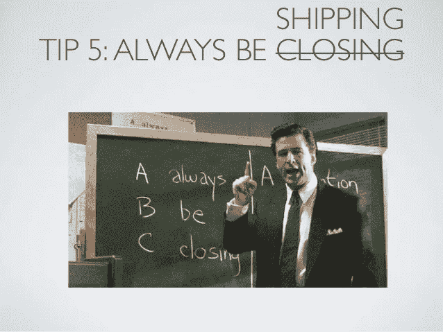

# 总是在运输

> 原文：<https://medium.com/hackernoon/always-be-shipping-bd338ebd8826>

Alec Baldwin in his epic ‘Always be closing’ speech. [https://www.youtube.com/watch?v=Q4PE2hSqVnk](https://www.youtube.com/watch?v=Q4PE2hSqVnk)

如果说我在多年的产品制造过程中学到了什么，那就是这个。

就算是小小的改变也没关系。

*如果不是完美的解决方案也没关系。*

*没有全部功能也没关系。*

完美的像素设计，关于新推送系统优越性的大辩论——除非发货，否则这些都不算数。

当我们回顾我们的生活和产品时，会觉得只有几件事是重要的，并真正产生了影响。就像那次你在公园遇见你的妻子或者发行一部史诗电影。人们很容易认为，如果我们只关注这些事情，让其他事情顺其自然，我们应该没问题。然而问题是——很难区分好坏。挑选赢家非常困难——问问风投就知道了。

> 变化是渐进和持续的

Android Froyo — released May 2010\. The version where Android took off. Image: Google

Android Oreo (Mar 2017) — We’ve come a long way from the first android version. Image: Google

有时你跳跃，有时你爬行。唯一重要的是继续前进。一段时间内的小优化累积起来是一个很大的数量。

然而，人们天生厌恶较小的变化。他们很无聊。它们没有一个大的发布让我们兴奋。大型政府项目，大型线下活动——这是令人兴奋的事情。所有政党都承诺一个新世界，一场革命，这太疯狂了。

Modi government promises a #NewIndia

航运帮助你把你的理论带到你的听众面前，帮助你获得有价值的反馈，这些反馈可以用来检验你的假设。在最坏的情况下，它证实了你的假设是不正确的。

运输也迫使我们检查一些我们在设计阶段忽略的小用例。它给我们一种成就感。它让团队专注于问题陈述。航运解决商业问题，为用户提供价值。

我曾经努力去写更多的帖子，直到我看到朱莉·周关于写作的建议，即使它并不完美。我去年写了 15 篇文章，今年已经写了 5 篇了！

换句话说，永远是航运！

# 如果你喜欢我的文章，请多次点击鼓掌按钮。

At Comic Con, 2 years ago! Hello 👋

请注意，我提倡的是持续变化的好处，而不是为了变化而变化。