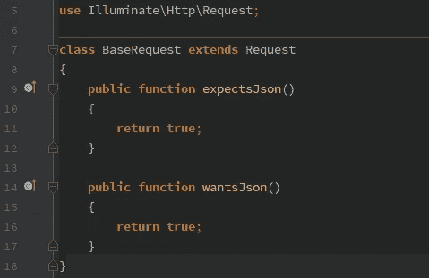

# 总是用 Laravel API 返回 JSON

> 原文：<https://medium.com/hackernoon/always-return-json-with-laravel-api-870c46c5efb2>



我最近开始做一些小项目，这些项目将只使用 Laravel 的后端部分。我们首先遇到的事情之一是试图重定向到`/home`或`/login`的认证异常。这种重定向成为另一个例外:`InvalidArgumentException: Route [login] is not defined.`。当您只想处理 API 响应时，这里有一个非常简单的解决方案。

## 1-写一个新的`BaseRequest`

通过扩展 Laravel 请求对象，我们可以覆盖框架使用的方法，该框架决定是否给出重定向响应或 JSON 响应，以始终首选 JSON。

## 2-交换实现

在`public/index.php`内部，我们可以找到 Laravel 构建请求对象的地方。让我们用新的`BaseRequest`类替换`\Illumiate\Http\Request`。

```
$response = $kernel->handle(
    $request = \App\Http\Requests\BaseRequest::*capture*()
);
```

## 3-搞定！

就这么简单，现在任何 HTTP 请求都将被当作它想要的响应`application/json`。不再有重定向异常。

## 更新

[Alexander Lichter](https://medium.com/u/af8b18bcd4e3?source=post_page-----870c46c5efb2--------------------------------) 有一个杀手级的单行中间件可以达到同样的效果。点击查看他的解决方案[。](https://twitter.com/TheAlexLichter/status/969879256271597568)