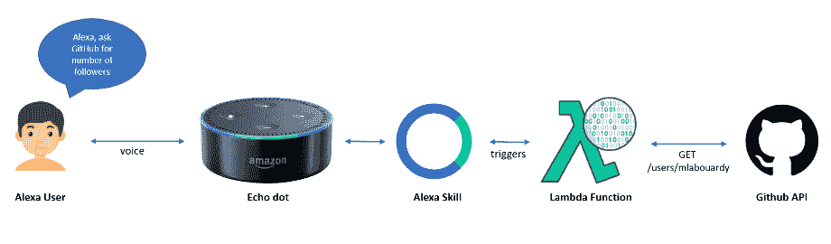

# 构建基于 Alexa 的 GitHub 追随者计数器

> 原文：<https://medium.com/hackernoon/amazon-alexa-github-followers-counter-3e435f703562>

本帖是“ **Alexa** 系列的一部分。我将带你了解如何用**节点构建一个**亚马逊 Alexa 技能**。JS** 和 **Lambda** 来实时获取 **GitHub** 中&仓库的追随者数量。

注:所有代码都在我的 [GitHub](https://github.com/mlabouardy/alexa-github) 中。

**亚马逊 Echo** 会捕捉语音命令，并发送给 **Alexa Skill** 将其转换成结构化的文本命令。一个被识别的命令被发送到一个 **AWS Lambda** 函数，该函数将调用 [GitHub API](https://developer.github.com/v3/) 来获得响应。

首先，注册[亚马逊开发者控制台](https://developer.amazon.com/)，创建一个新的 Alexa 技能:

调用名是用户触发技能时所说的话。在我们的例子中，它将是“ **github** ”。

点击“**下一个**”调出**交互模型**页面，使用下面的意图模式:

意图将用户的语音命令映射到我们的 Alexa 技能可以解决的服务。例如，这里我定义了一个名为 *GetGithubFollowerCount* 的意图，它将与我在 Lambda 函数中使用的一部分代码相匹配。

编程语言被定义为**自定义插槽类型**，具有以下可能值:

> go
> Java
> Python
> C
> c++
> Javascript
> HTML
> Scala
> Ocaml
> NodeJS
> Ruby
> PHP
> CSS
> c#
> Perl
> Shell
> Objective C

现在我们的意图已经定义好了，我们需要将它们链接到一个触发这种链接的人类请求。为此，列出了多个句子(**话语**)以使交互尽可能自然。

> GetGithubFollowerCount 我有多少个粉丝
> GetGithubFollowerCount 当前粉丝
> GetGithubFollowerCount 粉丝数量
> 
> GetGithubRepositoryCount 我有多少个存储库
> GetGithubRepositoryCount 存储库数量
> GetGithubRepositoryCount 当前存储库
> 
> GetGithubRepositoryCountByLanguage 有多少个{Language}储存库
> GetGithubRepositoryCountByLanguage 有多少个{Language}储存库
> GetGithubRepositoryCountByLanguage 当前{Language}储存库

结果:

点击“**下一步**，你将进入一个页面，允许我们使用 **ARN** (亚马逊资源名称)链接到 AWS Lambda。

在此之前，让我们创建我们的 lambda 函数，登录到 [AWS 管理控制台](https://console.aws.amazon.com/)，然后导航到 **Lambda 仪表板**并从头开始创建一个新函数:

选择 **Alexa 技能包**作为触发器:

我在**节点写了 Lambda 函数。JS** ，虽然这段代码实际上并不那么有趣，所以我不会详细讨论。

当有来自 Alexa 的传入请求时，这个函数被触发。该功能将:

*   处理请求
*   调用 [GitHub API](https://developer.github.com/v3/)
*   将响应发送回 Alexa

创建一个 **zip** 文件，包含上面的函数和任何依赖项( *node_modules* )。然后，指定**。在创建 Lambda 函数时，将 zip** 文件名作为您的部署包。不要忘记将您的 **GitHub 用户名**设置为环境变量:

回到 **Alexa 技能**我们需要链接我们的 Lambda 函数作为 Alexa 技能的端点:

就这样，让我们通过点击“**下一步**”来使用**服务模拟**进行测试。

**GetFollowerCount 意图:**

**GetRepositoryCount 意图**:

**GetGithubRepositoryCountByLanguage 意图:**

你可以看到 Lambda 的响应和预期的一样！

现在用**亚马逊 Echo** 测试一下，说“ *Alexa，向 GitHub 要…* ”: