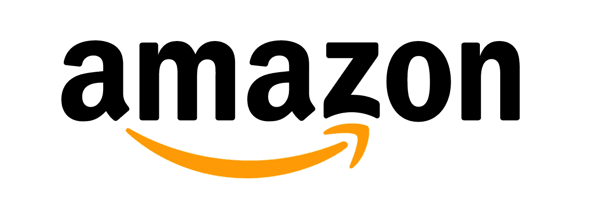
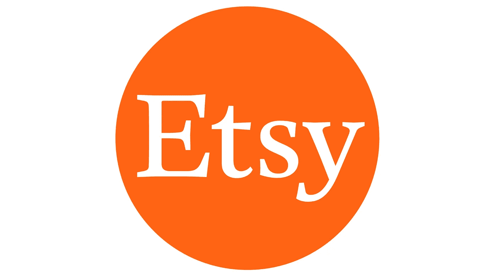
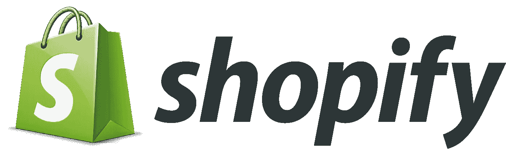
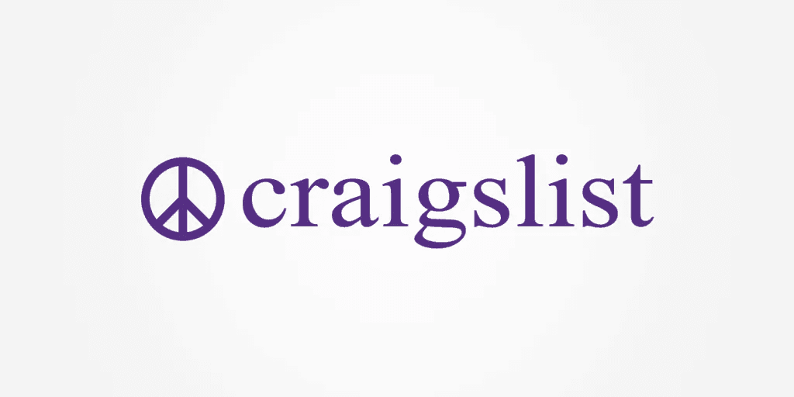
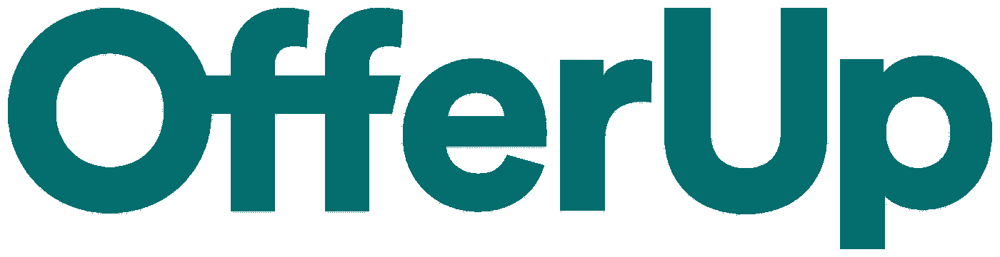
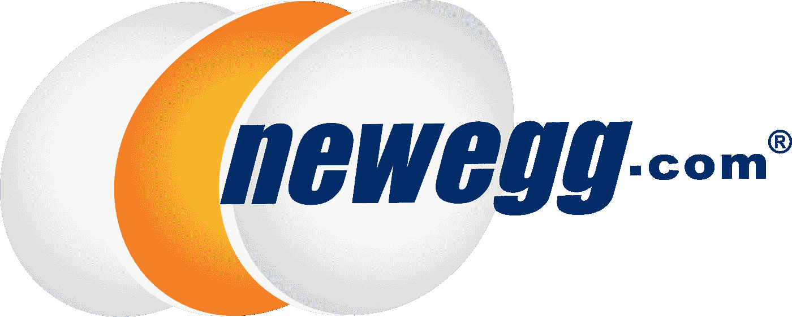
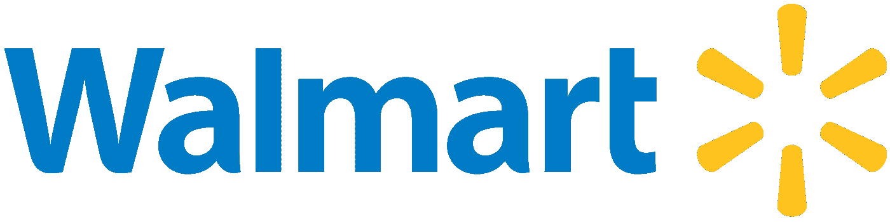

# 亚马逊和易贝的替代品——比较

> 原文：<https://medium.com/hackernoon/amazon-and-ebay-alternatives-a-comparison-ae66cd5fc7db>

除了亚马逊和易贝之外，出售商品的市场数量正变得越来越多。在做了一些研究后，我们发现了一些值得出售你的物品的亚马逊和易贝的替代品。我花时间将我的研究汇编成所有亚马逊和易贝的替代品，并对它们进行比较。

在比较了亚马逊和易贝之外的市场后，Forra 似乎是最令人印象深刻的销售对象，因为它的低费用和潜在的上升空间。Shopify 也是亚马逊或 ebay 的一个不错的选择。让我们更深入地了解一下除了亚马逊和易趣之外的其他销售你的商品的地方。

# Forra.io 帮助您发展电子商务业务的新市场

[Forra](https://forra.io) 是在被另一个大型市场禁止后产生的想法。Forra 有许多优势，是一个使用加密货币提高交易效率的商品销售平台。Forra 是一个很好的建立业务的方法。我想花时间比较我们的新市场和现有市场，如亚马逊，易贝。我们强烈认为回馈卖家是 Forra 的核心。Forra 作为一个整体，希望帮助卖家成功，并开始一个有利可图的电子商务业务。大多数在线销售的人已经知道易贝和亚马逊，所以我想接触一下除亚马逊和易贝之外的其他市场。

# 比较亚马逊和易贝以外的电子商务解决方案

这些电子商务解决方案以多种方式相互比较。他们被比作 forra，但也是为了让你赚更多的钱。市场和销售平台都有超高的费用。

> *有一种方法可以避免易贝和亚马逊的费用。停止在亚马逊和易贝上销售。*

我知道这听起来显而易见，但有很多电子商务卖家想知道他们的费用将流向哪里，以及他们如何才能增加他们的业务。本文旨在对易贝和亚马逊以外的市场进行比较。如果你正在寻找一个除了亚马逊或易贝之外的网上销售的地方，这是给你的。

如果你在 2018 年及以后建立电子商务业务，你需要知道该在什么平台上。我们需要展望未来，加密货币和区块链将在许多方面影响电子商务。除了亚马逊和易贝，这些是最好的销售市场。除了整体销售商品，我还加入了一些其他方法和选择。除了亚马逊和易贝，任何可以让你开始电子商务业务的东西。

# Etsy 手工市场

Etsy 是为那些自己生产商品的人设计的。它是为那些有激情的自己动手的人准备的，他们想围绕激情或爱好来创业。大多数在 Etsy 上销售的人没有时间做自己的营销。创造自己的产品已经够难了。Etsy 拥有一个买家网络，这些买家对购买小众、手工或整洁独特的物品感兴趣。如果你有手工制作的东西，或者是独特的精品风格的生意，你应该在 Etsy 上销售。

# Etsy 费用

与亚马逊和易贝相比，当你在 Etsy 上销售时，你不用支付太多费用。Etsy 允许用户拥有一个商店，并且只收取每件商品 5%的费用。这比亚马逊 15%的费用好得多，也比易贝 13%的费用好得多。使其成为亚马逊和易贝的首选替代品之一。

这是 Etsys 费用的明细，这是一种比易贝和亚马逊低得多的费用选择。

# shopify——拥有自己的网站和商店

Shopify 是一个很好的平台，适合那些只想建立一个网站，自己去工作的人。低廉的交易费用使得 Shopify 极具吸引力。如果你只是在 Shopify 上销售，你需要重新考虑如何发展你的业务。在 Shopify 上的大多数人都是经验丰富的专业人士，或者愿意长时间工作，只是为了让人们去他们的商店。

# 购物费

Shopify 确实是有收费的。Shopify 的“维护”和网站费用非常高。购物费。访问你网站的人数取决于你。这可能更难创建交易。一般来说，在市场上做生意更容易，因为店主们会互相吸引顾客。

Shopify 的费用低于亚马逊和易贝，对于经验丰富的企业主来说是一个很好的选择。这是一份关于[购物费用](https://ecommerce-platforms.com/articles/shopify-pricing-starter-vs-basic-vs-professional-vs-unlimited-which-plan-is-best-for-you)的深度指南。

# craigslist——本地市场的替代品

显然是美国人的最爱。自从互联网出现以来，Craigslist 几乎就是一个主要网站。它一直被称为美国的“去当地市场”,是除了亚马逊和易贝之外的一个很好的销售市场。Craigslist 有一些巨大的优势。易用性、超低费用、快速和“安全”的交易。

Craigslist 是一个很好的销售市场。与亚马逊和易贝不同，Craiglist 是一个超级易用的服务，只需要几秒钟就可以设置好。Craigslist 在本地工作。如果你有大量无法发货的产品，那么对你来说，craigslist 是比亚马逊和易贝更好的市场。

只要你以一种安全的方式去做，与人见面的安全感是安全的。如果你在当地市场销售，作为亚马逊的替代选择

# Craigslist 费用

在 craigslist 上出售一件商品的费用是零。唯一的代价是你的时间。销售商品时与某人会面所花费的时间。Craigslist 是唯一一个要求你与购买你商品的人见面的市场。这是一个与亚马逊和易贝非常不同的市场。接下来的几个也是。Craigslist 通过收取费用来发布某些广告来赚钱。

Craigslist 是亚马逊和易贝的绝佳替代品。Craigslist 就是这样赚钱的。

# 提供 Craigslist 的替代选择

Offer up 是一个与 craigslist 非常相似的业务。它的主要焦点是局部性。如果你在 offerup 上销售，作为亚马逊和易贝的替代产品，你要期待与人见面。如果你不喜欢 craigslist，或者你觉得你需要某种更好的用户体验，那么 Offer up 是一个很好的选择。报价是亚马逊和易贝的一个很好的选择，只要你不介意不发货。如今，大多数人可能会发现，去一趟邮局会更容易，而不必去应付可能遇到的陌生人。

# 提供费用

Offerup 在当地是免费使用的，但是如果你想出售一件物品并运送给某人，你最终要支付 7.9%的费用。Offerup 的一大好处是，如果你愿意与当地人见面，一切都是免费的。

相比亚马逊和易贝，Offer up 是一个不错的选择，因为它的费用更低。这是他们不得不说的关于他们的[在线费用](https://ask.offerup.com/Shipping/1070717331/Cost-of-shipping-for-sellers.htm)。

# 新蛋——亚马逊和易贝的替代技术

很多人甚至不知道这一点，但你真的可以在新蛋上销售。根据你的定位，这可能是一件对你的生意很有帮助的事情，或者是个人物品，这取决于你出售的物品类型。如果你有兴趣作为亚马逊或易贝的替代品在新蛋上销售，请点击这里。

在新蛋上销售是亚马逊和易贝的绝佳选择。为了在新蛋上销售，你需要被接受为卖家。这确保了卖家将维持一定水平的客户服务。新蛋公司在接受卖家方面是个硬汉。不像亚马逊和易贝会接受任何人。新蛋销售费用完全取决于你销售的产品类别。

新蛋是亚马逊和易贝的低价替代品。这些是在新蛋上销售的[费用](https://www.newegg.com/sellers/)。

# 沃尔玛——亚马逊的替代品

在 Walmart.com 上销售是在亚马逊或易贝上销售的一个很好的选择。大多数美国人一生中都会去几次沃尔玛。大多数人不了解沃尔玛的力量。沃尔玛是美国最大的实体零售商。

在 walmart.com 上销售不像在亚马逊和易趣上销售那么容易，但是如果你能做到的话，这是一件非常有利可图的事情。Walmart.com 实际上很难相处。如果你有自己独特的产品出售，Walmart.com 可能是一个很好的替代方式来提高收入远离亚马逊和易趣。这是一个关于如何进入 walmart.com 的很好的指南。如果你能利用沃尔玛，这可能会让你进一步远离亚马逊和易趣。

沃尔玛是亚马逊或易贝上销售的绝佳选择。它的竞争要少得多，但很可能会有更多的费用。下面是 walmart.com[费用](https://www.channelape.com/support/knowledgebase/referral-fees-contract-categories-walmart-marketplace/)的明细。

# 增加零售账户，而不是在亚马逊和易贝上销售

通过零售店网络发展业务是亚马逊和易贝的传统替代方式。如果你有某种类型的自有品牌或自己的产品，明智的做法是开始寻找零售客户和合作伙伴，否则，我不会推荐。获得零售账户很难。吸引大型零售商的兴趣很容易，只要你的产品有现有的需求。大多数零售商对他们放在商店里的东西非常开放。归根结底，他们只关心销售。

如果你想在亚马逊和易趣上销售，而不是在零售商那里销售，你需要弄清楚在哪里可以找到合适的人，这样你就可以在他们的店里买到你的产品。通常，大型零售商会不断寻找新产品。你需要在他们看的地方。去贸易展，聚会，和人们谈论你的产品。最重要的提示是这个。

联系 Linkedin 上的零售商。搜索职位名称，如“采购员”“采购员”“产品研究”,给他们发信息，打电话讨论他们测试你的产品的可能性。

# 亚马逊和易贝的加密货币替代品

加密货币电子商务市场是亚马逊和 ebay 的完美替代品。除了亚马逊和易贝，你还可以在以下网站出售你的商品。这些亚马逊和易贝的替代品具有相同的功能，但往往以更低的费用来实现。

# 福瑞拉

Forra 是我们心目中电子商务的未来。这是最便宜的在线电子商务方式。我们有一个对卖家零收费的平台，是最便宜的网上交易方式。我们认为，与亚马逊和 ebay 相比，我们是最好的市场。

从卖家的角度来看，Forra 是最便宜的网上交易方式。

*最初发表于* [*forra.io*](https://forra.io/amazon-and-ebay-alternatives/) *。*