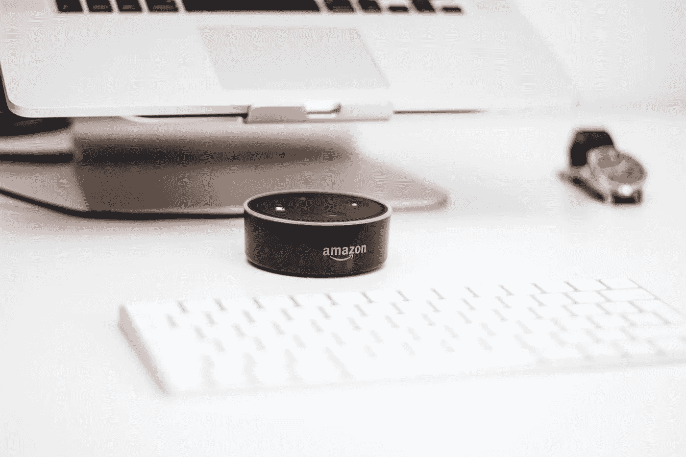

# 亚马逊成为第二家估值达到万亿美元的公司。

> 原文：<https://medium.com/hackernoon/amazon-becomes-the-second-company-to-reach-a-trillion-dollar-valuation-fb2de8494088>

Photo by [Piotr Cichosz](https://unsplash.com/photos/eds4moomBRk?utm_source=unsplash&utm_medium=referral&utm_content=creditCopyText) on [Unsplash](https://unsplash.com/?utm_source=unsplash&utm_medium=referral&utm_content=creditCopyText)

随着员工对亚马逊如何对待他们的大量抗议，该公司终于克服了一切困难，树立了人类历史上的一个里程碑。有一些关键的差异使苹果公司达到万亿美元的估值轻而易举，但同样的情况也应该阻止亚马逊这样做。

那亚马逊到底是如何熬过来，成为第二家估值达到万亿美元的公司的呢？

1.  期待。

无论我们把偏见放在哪里，我们都不能忽视这样一个事实:如果没有杰夫·贝索斯，亚马逊可能会呆在车库里。如果是别人处在杰夫的地位，情况肯定会大不相同。史蒂夫·乔布斯也是如此。至少可以说，他们的方法非常不同。

2.下注。

苹果在服务和产品方面确实受到了限制，亚马逊采取了完全相反的方式，试图收购尽可能多的业务类型。亚马逊以其电子商务而闻名，但现在相当多的人承认亚马逊是 Prime Video 和 Prime Music 的所有者。

3.少花钱多办事。

亚马逊凭借其 prime 会员资格，一直在提供苹果无法想象的更多专属服务。有了 prime 会员资格，你几乎可以在电子商务网站上得到你想要的一切，除此之外，你还可以订阅 Prime 视频和 Prime 音乐(额外付费的大量图书馆)。苹果对其订阅收取更高的费用，但最终我们不能低估订阅经济的力量，正如我们在“[帮自己一个忙，转向基于订阅的商业方法](https://hackernoon.com/do-yourself-a-favor-and-switch-to-subscription-based-business-approach-45db6997b0d4)”中讨论的那样。可以肯定的是，从万亿美元俱乐部的前两家公司来看，订阅方式是成功的唯一途径。

4.最以客户为中心的公司(从个人经验来看)。

亚马逊提供的客户满意度和服务让其他竞争对手望尘莫及。我有过无数次冲突，其中有些是我的错，你猜怎么着？

亚马逊从未让我失望过，哪怕一次。我认为，这项伟大的服务是亚马逊跻身万亿美元俱乐部的最大功臣。从另一方面来说，苹果的支持是好的，但我从未有过以对我有利的方式结束的冲突，当涉及到客户的钱时，苹果真的喜欢把他们撕成碎片。

5.最快的交货。

苹果可能会让你等 2-7 天才能更换 iPhone，但如果你从亚马逊订购，它会在第二天(在某些情况下，当天)送货上门。亚马逊已经掌握了通过其服务和支持来满足客户需求的艺术，无论是及时的送货还是无障碍的退货，亚马逊都是我们大多数人期待的选择。