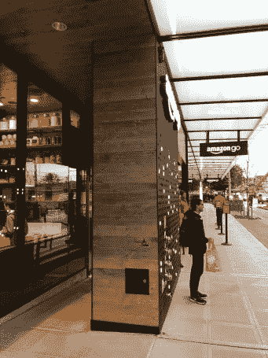

# Amazon Go: A.I .的冷酷脸？

> 原文：<https://medium.com/hackernoon/amazon-go-a-i-s-grim-face-c4fd62ccf57e>

自从大学以来，我一直在等待 RFID 未能兑现的承诺，即提供一种无人值守的结账体验，而亚马逊最终使之成为可能。在阅读了我的合作博客作者在 Amazon Go 商店的经历后，我不得不亲自体验一下，并为此感到兴奋。我朋友所有的照片都排了很长的队，但谢天谢地，我是个早起的人，当我到达那里的时候没有人排队。我的目标是假装我不知道它是什么，也不知道它是如何工作的。除了入职过程之外，我的总体体验很好。我居高临下的打了个招呼“*哦，你没有 app* ？”并被要求靠边站。我的 T-Mobile 信号很差，所以我花了一点时间才开始。一旦我下载了应用程序并登录我的亚马逊账户，一切都很顺利。任务完成！在这篇文章中，我不打算谈论实际的商店(Ivan 已经做得很好了)，而是谈论第一个有形的和成功的人工智能自动化商店的含义。

Exterior of the Amazon Go store

自动化一直是我们历史的一部分。自动化帮助我们进化成现在的社会。例如，自动化我们如何种植和种植食物，以便我们可以有一个良好的食物供应，工业革命使事情更快更便宜，装配线使它们更快更便宜，最后是计算机自动化的过程和任务。现在，人工智能在这里，它将自动化我们所有的生产力。

几年前，我在一次会议的观众席上，会上的主题发言人向我们展示了一幅关于自动化的非常严峻的画面:“*你们都会因为 AI* 而丢掉工作”。我们都笑了，但同时你可以感觉到低能量。我们可以看到它会取代许多其他工作…但是我们呢？我的意思是，我们都是程序员和技术行业的人，人工智能不会取代我们！

自那次会议以来，我一直在关注这个问题。人工智能将如何改变我们？作为社会，我们将如何适应？如果我们目前是一个分裂的社会，AI 会让它变得更糟吗？

亚马逊的 Go 商店可以开始给我们一些答案。如果你去商店，你会看到一群工人在外面，还有一些人透过窗户在准备食物。说实话，外面的人只是啦啦队员，直到人群死亡。我的意思是，如果你继续拥有所有的员工，那么做所有这些自动化有什么意义。现在，厨房里的人对这家商店来说可能是有意义的，因为它的日访问量很大，但从规模来看，他们不会在那里。食物准备将集中进行，这样三明治就可以送到一个区域内的所有商店。最终，你将只需要一名员工:一名保安。机器人会把东西放在架子上(他们已经在自己的仓库里这样做了，为什么不在商店里)，百分之一的人会制作食物。从商业角度来看，这是一个梦想成真，你可以以更低的成本更快地销售！这意味着更多的美元。

但是，如果大规模应用这个模型会怎么样呢？当卡车司机被优步的拖车自动化，出租车/优步司机被自动化汽车取代，工厂里的机器人被升级为执行人工任务，会计师/律师和其他商业职能角色被智能软件取代时，会发生什么？随着我们将所有这些伟大的事情自动化，谁会被留在经济体系中购买下一个令人敬畏的技术奇迹？如果没人买，谁来为我们买单？也许我们不会被自动化，但会被解雇。

这种自动化的另一个方面是社会的分化。我们已经看到了社会的分化，部分原因是收入的差距。然而，这种自动化将会产生更进一步的类分离。没有智能手机支付怎么办？如果你有像账单或食品券这样的低技术支付方式会怎么样？在我们努力做酷/棒的新事物的过程中，我们是否会进一步分化社会？

许多人要求确保人工智能自动化有一个有保证的最低收入和税收。让我们想象一下，我们确实实现了所有工作的自动化，GMI 和税收都实现了。所有的人会做什么？生存？每个人都应该有机会过上公平而充实的生活。每个人都应该有机会拥有目标。当你不再满足于自己挣钱的时候，这将会如何发展？我们会梦想什么，什么会让我们对明天充满期待？

我意识到这个帖子的问题比答案多。目前，这就是我所能提供的。如果问题能激发好奇心，那么它们就和答案一样好。人工智能是一个既令人兴奋又令人恐惧的现实。因此，当我们构建下一个令人惊叹的产品时，让我们想想它对其他人的影响，并帮助找到减轻这些后果的解决方案。忽视它们只会制造更大的问题。

直到后来，

阿尔瓦罗

你喜欢这篇文章吗？通过电子邮件订阅获取新帖子:

*原载于 2018 年 1 月 27 日*[*【geekonrecord.com】*](https://geekonrecord.com/2018/01/27/amazon-go-a-i-s-grim-face/)*。*