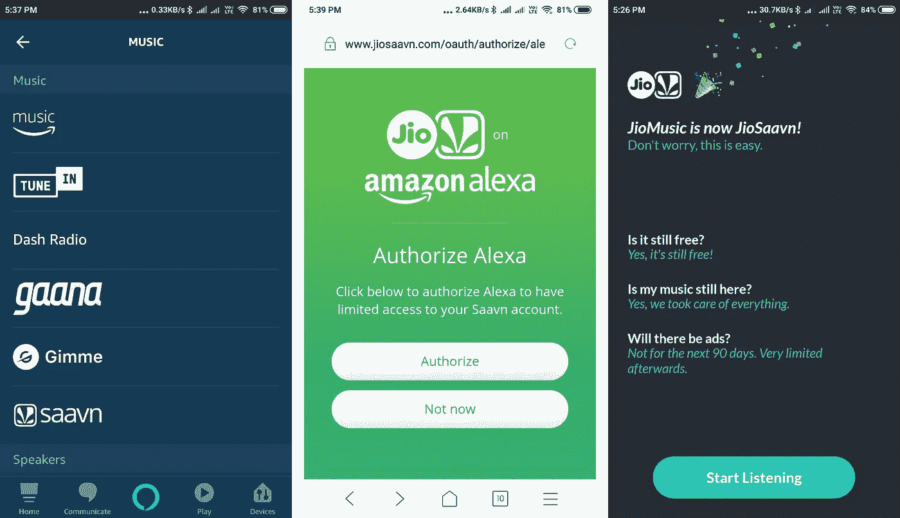
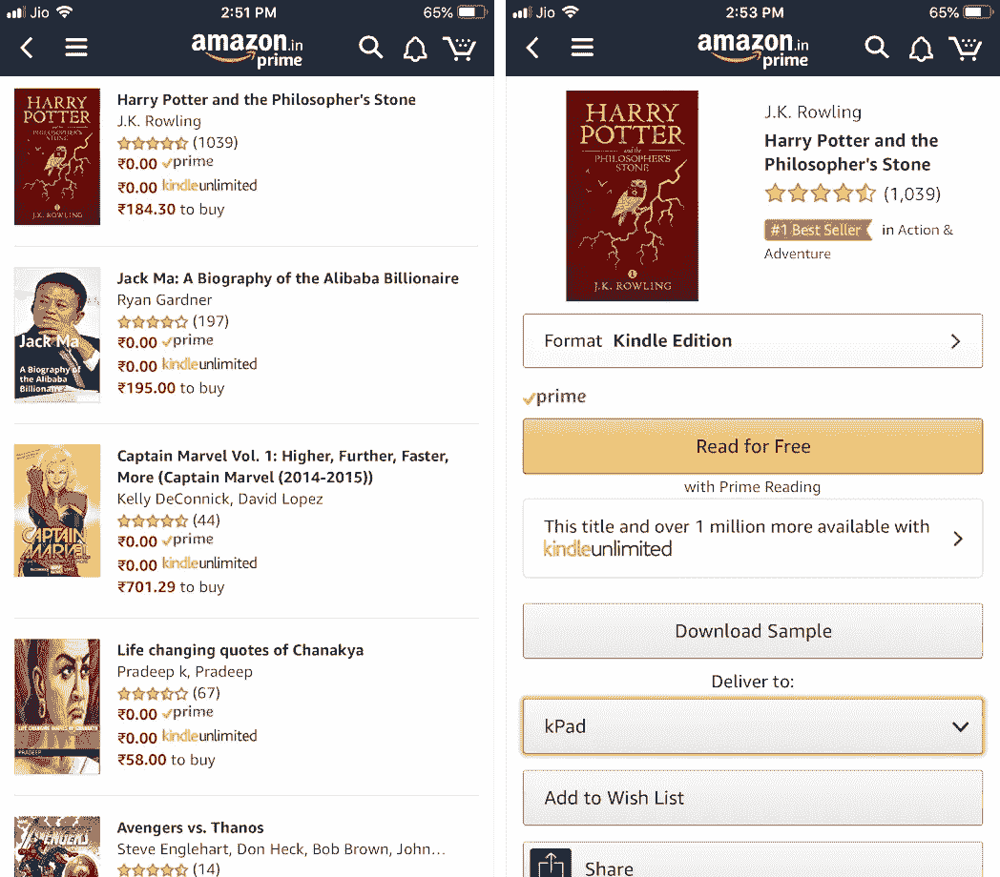
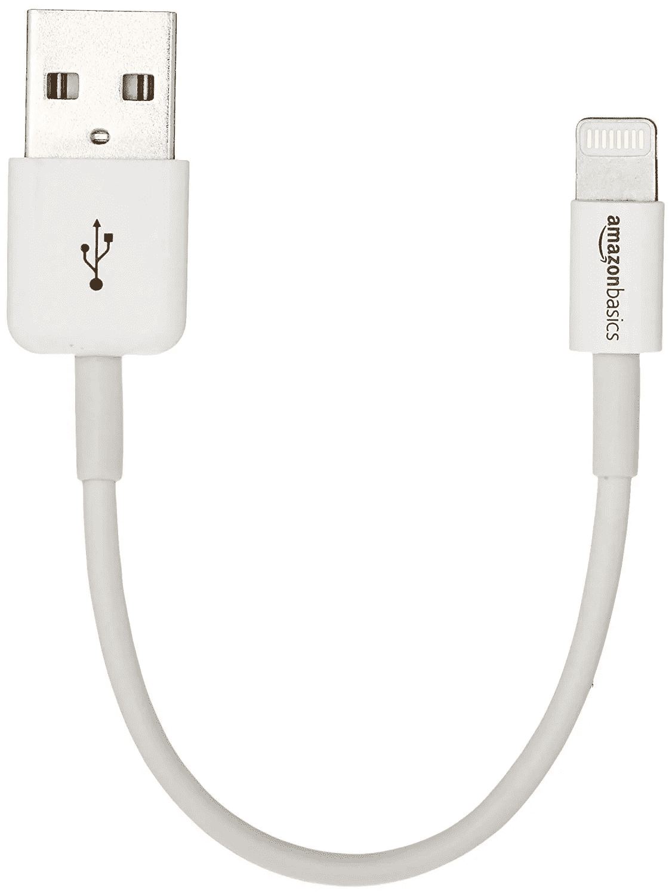

# 亚马逊希望成为我所有需求的门户

> 原文：<https://medium.com/hackernoon/amazon-wants-to-be-a-portal-for-all-i-need-ff01148df64f>

## 令人担忧的是，他们正在取得成功

Photo by [Pedro Lastra](https://unsplash.com/photos/Y9utglm0VpQ?utm_source=unsplash&utm_medium=referral&utm_content=creditCopyText) on [Unsplash](https://unsplash.com/search/photos/portal?utm_source=unsplash&utm_medium=referral&utm_content=creditCopyText)

昨晚，我和一个朋友聊天，他正试图说服我将网购转回当地的线下商家。他认为，如果我们不这样做，我们最终将帮助亚马逊和 Flipkarts 这些非印度商业实体，让越来越多的印度小企业破产。一旦发生这种情况，这些大企业将成为垄断或双头垄断，我们将在他们的摆布下，无论是在价格或选择或物品的可用性或其他方面。

奇怪的是，出于同样的原因，以及亚马逊缺乏道德，我一直在倡导抵制亚马逊，这是另一个故事。事实上，我已经设法避免了长时间的网上购物。可悲的是，令我自己感到屈辱的是，我最终还是回到了亚马逊。这种情况不断发生有两个原因:方便和价格。

## 便利因素

前几天，我妻子掉了她的 iPhone，打碎了它的钢化玻璃屏幕保护罩。现在，这个替换起来并不贵，但是真的很不方便。我不得不在拥堵的交通中跋涉一个小时，来到我所在城市的商业区，努力寻找停车位，最后找到一家出售屏幕保护装置的商店。而在亚马逊上，只需点击几下，屏幕保护将在几天内送货上门。战斗还没开始就结束了。我去年在亚马逊的订单显示，当我需要特定尺寸、特定用途或特定价格的物品时，我通常会在网上购物。

## 价格因素

尽管我心存疑虑，但我最近还是从亚马逊买了一台智能电视。如果我决定从当地的线下经销商那里购买电视，我将不得不购买一个不符合我需求的品牌的电视，并且至少要多花几千美元。对我来说，那笔钱实在太多了。以下是亚马逊说服我和他们一起购物的方式。

随着印度互联网费用的下降和数据的普及，智能电视终于在这里变得实用起来。但是我不想投资太多，因为技术变化很快。包括电视在内的大多数科技产品很快就会过时，我不想在结束时成为一个累赘。因此，我瞄准了小米的一款 32 英寸智能电视，它的功能和价格都很合适。现在，小米已经成为印度最畅销的手机。它的策略是以可承受的价格提供高质量的手机，并且只通过在线渠道销售(以省去中间商)。因此，当小米以当时闻所未闻的₹15000 价格(210 美元)推出 32 英寸智能安卓电视时，我绝对感兴趣。

这就是亚马逊的用武之地。他们与小米合作，成为其最新 32 英寸和 49 英寸小米电视型号在线销售的独家合作伙伴。亚马逊通过再次降价，将小米的降价策略推进了一步。他们通过捆绑银行和自己的支付钱包来获得额外的折扣。我最终以大约₹13000 的价格(181 美元)买到了这台电视。

当然，像这样的大额购买并不经常发生，一年前 Flipkart 的一台 IFB 洗衣机是我最后一次购买。但即使是在那种情况下，我也注意到 Flipkart 上的价格低于厂商自己的价格。事实上，我观察到，在安装过程中，IFB 的家伙拼命地试图推动配件，如支架，过滤器和清洁剂。我猜 IFB 正在尽最大努力让这笔交易可行，因为它的利润肯定会因为网上购物而受损。

然而，我知道 Flipkarts 和亚马逊不会亏本卖给我东西，除非他们能以某种方式获利。我不知道具体是怎么回事，尽管在 Quora 上有很多像这样的理论在流传。我可以肯定的是，这笔交易中的输家是其他电视制造商。我(和我的家人)以前从当地零售商那里买过飞利浦、索尼和三星等电视品牌。但是现在价格差距如此之大，以至于我都懒得去看那些电视了。在₹13000(181 美元)，我可以每两年升级一次我的电视，而这种想法甚至不会出现在我以 2-3 倍的价格从当地商人那里购买索尼或三星产品的脑海中。

问题是，如果大多数印度人开始像我一样思考，那些零售商将会倒闭，把市场留给亚马逊。到那时，亚马逊将处于强势地位。

## 如果不是购物，那是什么？

印度仍然是一个发展中国家，大多数印度人购物的预算是固定的或有限的。但企业认为它们必须每年增长，不这样做就等于死亡，亚马逊也不例外。就个人而言，我在亚马逊上的花费在过去几年里并没有真正增长。我猜还有很多像我一样的顾客。

现在亚马逊靠数据生存，他们早就注意到这个趋势了。所以他们开始寻找其他方法来增加我对他们服务的使用。在某种程度上，这让我想起了过去，当时雅虎希望成为一个能够满足我所有需求的门户网站。不同之处在于，雅虎惨败，而亚马逊却取得了成功。

## 视频和电影

以亚马逊 Prime 为例。我最初注册了免费送货服务。这在₹500/year(7 美元)很便宜，因为我在亚马逊早期从它那里买了很多低价值的东西。然而，一旦我意识到它正在影响当地的商家，我就减少了网上购物。而且去年续签服务也没什么意义。但亚马逊说服了我，坚持₹500/year 的价格标签，并通过免费添加亚马逊 Prime Video 来增加交易的甜头。

₹500/month 的视频和电影内容要花费网飞 7 美元。但这相当于亚马逊一个月对整个亚马逊 Prime 套餐收取一整年的费用。我必须补充一点，网飞提供的种类确实比亚马逊 Prime Video 多得多，亚马逊 Prime Video 是狂热观察者的交易破坏者。

## 音乐

今年，亚马逊 Prime 通过在套餐中加入亚马逊 Prime 音乐，加强了对我的控制。不过有一个问题。我不能把它作为我所有音乐的单一来源，因为亚马逊 Prime Music 没有我喜欢的所有歌曲。它的收藏仅限于 200 万首歌曲。如果亚马逊允许我在网上上传和存储我自己的音乐，这不会是一个问题，但他们今年早些时候停止提供这项服务。

亚马逊还有另一项音乐服务，亚马逊音乐无限。它提供数千万首付费歌曲，但这项服务在印度不可用。Spotify 有一个免费层，提供 3000 万首歌曲，据传将在印度开放，但这也没有发生。苹果音乐在印度可以访问，有 5000 万首歌曲，但价格为₹120/month(1.67 美元)。我给了苹果一个通行证，因为我更喜欢一次性付费订阅服务，因为它们往往会增加。

还有其他因素让我坚持使用亚马逊 Prime Music。一个原因是音乐只是亚马逊优惠套餐的一部分。其次，我已经设置了亚马逊自己的 Echo 智能音箱作为我在家里的默认音乐播放器。苹果音乐现在还不允许在这个平台上播放，尽管我相信随着我的打字，这种情况正在改变。第三，谷歌音乐有免费的存储服务，我已经上传了大约 10，000 首歌曲。我可以随时播放和收听这些音乐，但不幸的是不能通过亚马逊音乐。第四，我使用 Jio 手机，可以访问 Jio 音乐，但仅限于 Jio 网络上的用户。尽管 Jio 音乐应用的界面很笨拙，但 Jio 有大量的音乐收藏。我在那里发现了在别处找不到的意想不到的珍宝。就像昨天，我有听克里登斯清水复兴合唱团的《你见过雨吗》的冲动亚马逊只有这首歌的翻唱版，但 Jio Music 有原唱(Creedence 第二天又出现在亚马逊上)。

既然我说的是音乐，我必须补充一点，我没有把印度音乐包括在讨论中。这是因为像 Gaana、Saavn 和 Wynk 这样的印度本地音乐应用程序拥有大量的收藏。他们也可以选择免费的基于广告的服务，这对我来说已经足够了。

有一些问题领域。就像我不能在我的回声扬声器上播放谷歌音乐一样。但这可能不会是一个长期的问题，在印度，Alexa/Echo 允许我在亚马逊音乐，Saavn 和 Gaana 之间选择作为 Alexa 的默认音乐库。因此，随着 Jio 和 Saavn 的合并，我想我很快就可以在亚马逊音乐中访问 Jio 的在线收藏了。Jio 音乐是否会长期免费，并且没有广告，这是一个我没有问的问题，Jio 似乎已经回答了这个问题(见右下)。

## 书

在此过程中，亚马逊开始向印度的 Prime 会员提供大量 Kindle 电子书供免费阅读。里面有很多适合大人和小孩的好东西。

我还在使用 Audible 免费试用版，看看是否值得在₹199/month 注册有声图书服务(在 3 个月的 Prime 会员延长试用后)。我一个月听一本书。因为我一直想成为白宫墙上的一只苍蝇，所以我现在正在听米歇尔·奥巴马的传记，是用她自己的声音录制的。如果我不在 Prime 上，我会花掉₹888(12.52 美元)。

## 亚马逊制造

亚马逊上有如此多的业务，所以当亚马逊决定加入这一行列，以自己的品牌制造和销售产品时，我并不感到惊讶。一年左右的时间里，我拒绝购买那些“亚马逊制造”的产品。但亚马逊最终抓住了我的致命弱点:他们大幅降价。因此，我从亚马逊订购了一根 6 英寸长的闪电电缆(₹500，37 美元)，这在闪电大甩卖期间非常合适。以亚马逊基础品牌出售，电缆是苹果认证的，大小正好适合我的便携式充电器。

一年后，我拿起了一个 Echo 音箱，今年又拿了一个做家庭音箱网络。我都是在印度大减价时买的，当时价格下跌，让人无法抗拒。毫无疑问，Alexa 在家里听我们说的每一句话是一种担忧。但是，就像谚语中的鸵鸟一样，我把头埋在沙子里，因为通过问 Alexa 就可以找到我想要的任何歌曲，这是一种不可思议的便利。

## 账单支付

支付每月账单是每个人都做的事情，亚马逊试图通过向我提供现金返还来分享它的份额，因为我通过他们的钱包 Amazon Pay 进行支付。返现金额很小，只能用于通过 Amazon pay 支付，但有总比没有好。到目前为止，我已经支付了我的固定电话、手机、网络电缆、电视(DTH)和电费。此外，如果有许多法案，返现可以积累相当可观的储蓄每年。

## 旅行

我还用我的亚马逊钱包支付了公交和机票费用。几天前，我给₹1000 买了一张₹7000 的机票，一半是即时折扣，一半是我的亚马逊支付的返现。很难拒绝。

## 保险

这是一项新服务，我注意到亚马逊通过与一家名为 Acko 的新在线保险公司合作，在其钱包中做广告。总之，几天前，我的汽车保险到期了。保险公司说，这将花费我₹9600(137 美元)左右。出于好奇，我打开我的亚马逊应用程序中的广告，点击它，填写一些关于我的车的细节，要求一个比较报价，惊讶地发现它只是我目前的保险公司要价的一半(₹5000 或 71 美元)。我在网上做了一些研究，以确认这是一笔好交易，并看到了对 Acko 的评论。看起来 Acko 有能力提供这笔交易并仍然盈利，因为他们是一个拥有最少基础设施和员工的在线实体。事实上，是我必须通过在网上输入细节来完成所有的保单文书工作，如果我想要一份保险单的物理副本放在我的车上，我必须自己打印出来。这是一个令人信服的论点，我签了名。

## 与印度电信价格战相似

虽然亚马逊一直在网上购物中打价格战，但印度的手机网络提供商之间也在进行同样激烈的价格战。强大的 Reliance Group 推出的新成员 Jio 通过大幅降价撼动了垄断企业的虚高价格。

两年后，一半的竞争对手已经倒闭，而剩下的那些已经合并和整合，只剩下三个主要的市场参与者。当 Jio 推出时，Airtel 是最大的参与者，现在是第二大参与者，仅次于合并后的沃达丰-Idea 集团，Jio 是第三大参与者。消费者是这场价格战的受益者。₹300 过去每月给我 1Gb 的 3G 速度数据，语音通话、短信和漫游费都是额外的，这很容易使每月的账单增加一倍。事实上，印度人过去常常通过“未接来电”来省钱。现在，同样的钱可以让你每天获得 1.5GB 的 4G 数据(这不是一个打字错误)，外加无限制地与印度任何地方通话和发送信息。如今，“未接来电”现象已不复存在。

亚马逊的降价效果不太明显，但总的来说，顾客受益了。就像如果没有亚马逊的支持，我不会考虑为我的汽车保险 Acko 并为自己节省₹5000(71 美元)。

## 当一扇门关闭时，另一扇门就会打开

亚马逊的折扣和向其他活动的扩张开始影响竞争。线下商店经常是空的，尽管他们用折扣反击，但他们有租金等开销，会发现很难与亚马逊相比。甚至其他在线商店也感受到了压力。易贝印度公司被 Flipkart 吞并，而 Flipkart 又被沃尔玛收购。

假设大多数线下商店关门的最坏情况发生了，亚马逊开始大幅涨价。我相信，如果发生这种情况，市场力量将创造替代方案。例如，我最近通过亚马逊的竞争对手 Snapdeal 从中国为我的手机订购了一包三个卡扣式镜头。我不是真的想要镜头套件，但我只是订购它来测试服务。优点是价格很好，质量和光洁度都可以接受。这套 3 镜头的套装只花了₹250。问题是交货花了两个月的时间，因为我是直接从中国订购的，而且必须一路运送才能使交易可行。Snapdeal 有 100%退款的退货政策，但我记得在订单的某个阶段看到一个免责声明，说明该产品不符合退货条件。

我的结论是，即使我在某个时间点完全退出亚马逊，如果我愿意在送货时间上妥协，我仍然能够以合理的价格买到东西。至于退货政策，我再也看不到无退货免责声明，所以我想 Snapdeal 找到了一个解决方案。

## 权力导致腐败

我不知道未来会怎样，但我不禁想起那句关于权力的老话。一旦亚马逊的大部分竞争对手倒闭，它会帮助我像现在一样节省成本吗？亚马逊对待员工的方式并没有让我感到太乐观。如果你错过了这条新闻，请在这里阅读[这里](https://www.theguardian.com/business/2018/may/31/amazon-accused-of-treating-uk-warehouse-staff-like-robots)和[这里](https://www.businessinsider.in/What-its-really-like-to-work-at-Amazon-according-to-employees/articleshow/62762659.cms)。甚至有一场运动正在进行中，那就是[取消](/fast-company/why-its-time-to-cancel-your-amazon-prime-account-78f9512a57f6)你的亚马逊 Prime 账户。

## 等着瞧

考虑到这种相似性，印度的移动网络产业可能会成为网上购物的先行者。截至目前，移动数据价格下降，通话和信息免费，还有很多免费的东西。例如，除了免费的 Jio 音乐服务，Jio 还提供免费的 Jio 电视应用程序，允许我在我的智能电视上免费观看直播电视，如 NBA 比赛。同样，免费的 Jio Cinema 应用程序也有很好的电影收藏。问题是 Jio 的附加服务会永远免费吗？当我找到这个问题的答案时，我可能也能预测亚马逊会做什么。

随着 Jio 和 Amazon 的事情变得如此不确定，我认为在到达之前不要过桥是有意义的。如果将来 Jio Music 转变为订阅服务，定价为₹120(与苹果持平)，我很可能会放弃 Jio Music，继续使用亚马逊 Prime Music。或者，如果亚马逊 Prime Music 也这样做，而 Jio Music 仍然免费，我会转用 Jio。最后，如果这两种服务都是付费的，我可能会在亚马逊、苹果和 Jio 中找到最好的交易。例如，我的孩子经常使用亚马逊 Prime Music，如果这三种音乐的价格都是₹120，我会以学生折扣价 50%给她买苹果音乐。这完全取决于当时的情况。

## 尽我的绵薄之力

我尽自己的一份力量支持当地的商家，在任何可行的地方进行线下购物。就像我在当地超市买所有的食物一样。价格差异不大，有几个积极因素。我得到当地种植的新鲜食物，我不会用亚马逊的包装污染环境。我必须承认，如果亚马逊茶水间来到我的城市，这将变得更加困难。但是现在还没有，所以我一周两次拖着我的杂货回家，并且不会像周日晚上亚马逊快递员在我家门口嗡嗡叫我时那样感到内疚。我打算尽可能地继续线下购物，除非价格差异大到无法避免网上购物。

## 为什么担心

我的朋友试图说服我完全离开亚马逊，但他不同意上述观点。他认为当地的商人正面临巨大的生存压力，需要我们每个人的帮助。

我向他承认原则上放弃几千卢比对我来说很难。我知道亚马逊认为这是在印度的蜜月阶段，并且正在用它的金钱力量用许多令人垂涎的好东西来吸引我。在这些优惠中，它甚至可能会损失很多钱。

在我看来，我还不如趁我能拿的时候拿走我能拿的东西。因为一旦竞争被扼杀，亚马逊可能会竭尽全力挤压市场，并连本带利地榨取它放弃的一切。

## 实用主义规则

然而，我告诉我的朋友，我钦佩他的原则立场，我们真诚地同意保留不同意见。当我正准备和他告别时，我注意到他在沃达丰网络上，我寻求交易的大脑突然灵光一闪。我的亚马逊 Prime 将在一两天内到期，亚马逊没有像过去两年那样为我提供₹1000 年费的 50%折扣。但亚马逊想要新的客户，它与沃达丰合作，为网络的后付费用户提供一年免费的亚马逊 Prime 服务。我问我的朋友，我是否可以接受亚马逊的提议，因为他不打算这么做。他优雅地同意了，打开手机，递了过去。我打开他手机上的沃达丰应用程序，找到报价，申请，很快就收到了用我的亚马逊账户注册激活亚马逊 Prime 一年试用期的请求。我签了名，契约就完成了。

天下没有不散的宴席，我还不如趁早享受。