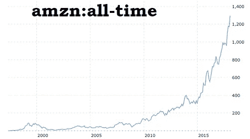
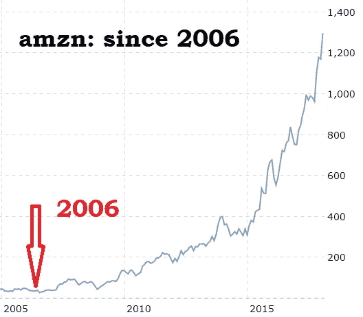

# 亚马逊的 HQ2——这是它的发展方向

> 原文：<https://medium.com/hackernoon/amazons-hq2-here-s-where-it-s-going-13b862a47431>

你不需要成为一名火箭科学家，就能猜出亚马逊的 HQ2 将走向何方。很有可能，这是从一开始就预料到的结果。在这个线索的小游戏中，只有三到四个可能发生犯罪的房间。

为什么？因为你不能在浴缸里建造战舰。

不过，你不得不佩服他们，整个狗展让北美的每个城市都在与北美的其他城市竞争——这是营销天才，也是一种不用动一根手指就能收集满满一钱包免费优惠的甜蜜方式。

不要认为亚马逊也不会使用这些优惠券——在“宣布”后，他们肯定会回到天真无邪的恳求者面前，说，嘿，坏消息——我们没有选中你。不过，好消息是:我们 ***将*** 在你的引擎盖上建造一个配送中心/履行仓库/数据中心/alexa 工厂/电影工作室/机器人医院/无人机机场/等等，我们 ***将*** 带你去那些美味的免税债券，那些免费租赁，那些你想给我们的空玉米地(等等)。

美国各地的城市——你摊牌了。你告诉二手车销售员你愿意出多少钱。

不过，回到那个浴缸——在过去十年里，亚马逊是一家什么样的公司变得越来越清晰。跟着钱走就行了，记住亚马逊是一个有三个 CEO 的公司。当然是贝佐斯，还有杰夫·威尔基(亚马逊“一切商店”的首席执行官)和安迪·杰西。

Jassy 是 AWS 的首席执行官。AWS 是公司唯一利润丰厚的部门。AWS 是云提供商细分市场，是弹性豆茎，是推动亚马逊股价飙升的盈利阶梯。AWS 为亚马逊做了什么？看一看。这是自发布以来的图表:

它勉强熬过了 90 年代“世界上最大的书店”的日子，然后遭遇了纳斯达克(Nasdaq)每只互联网股票都一飞冲天的泡沫。然后，互联网泡沫破裂了，就像市场上几乎所有的互联网股票一样，它直线下跌，像哈德逊河上冰冷的奇迹一样滑向 21 世纪。我们勇敢的 AMZN 在那里蹦蹦跳跳，派对后悲伤地抱着地毯的氦气球，被极薄的利润所困扰，被花掉所有现金的不可抑制的欲望所困扰，不断变大，但从未真正变好。直到 2006 年。然后它穿过屋顶。

2006 年发生了什么？AWS 推出。毫无疑问，如果没有 AWS，亚马逊将处于两种境地之一——股价停滞不前，投资者越来越失望，或者破产，被分拆出售，或者像网景、Geocities、Broadcast.com、Excite、雅虎、美国在线一样彻底破产——你知道死亡、行尸走肉和肢解的点名。

AWS 是黑色墨水，它让红色墨水 Everything Store 中的其他所有东西——成为可能。

这让我们回到 HQ2 和战舰。认为 HQ2 不会首先考虑 AWS 是很难让人相信的。西雅图仍然是“一切”的总部。HQ2 将是 AWS 总部。它将会而且必须去互联网骨干可以支持它的地方，去有空间和基础设施来建造、发射、转向和管理这艘战舰的地方，这艘战舰是让杰夫·贝索斯成为世界首富的金鹅。

> AWS 是黑色墨水，它让红色墨水 Everything Store 中的其他所有东西——成为可能。

你可以阅读茶叶来寻找可能有基础设施的地点:最大的 Equinix 交易所在纽约市、硅谷和华盛顿 DC 地区。美国有三个主要的互联网中心，在 UUNet 时代的古雅电信语言中称为“MAEs”。他们在圣荷西、达拉斯，还有——哦，又来了——华盛顿 DC 地区。

或者，你可以跳过茶叶，直接切入正题，所有 AWS 用户都已经知道这一点——有三个美国 AWS 区域边缘缓存——这些是大型缓存，为整个北美和世界的 AWS 可用区(他们喜欢他们的行话)中更本地化和更多的“边缘位置”提供服务。这三处藏身地分别位于俄亥俄州的哥伦布地区、俄勒冈州以及——令人惊讶的是——华盛顿州的 DC 地区。哪一个最大最重要？毫无疑问，DC 地区。互联网在像阿什伯恩、赫恩登、尚蒂伊这样的地方生存和消亡——弗吉尼亚的郊区城镇，曾经是令人心碎的美丽的马乡，现在越来越多地覆盖着亚马逊数据中心和为它们提供动力的风力和太阳能农场。这些不断扩张的郊区离杜勒斯国际机场仅一箭之遥，其[即将完工的 DC 地铁线](http://http://thehill.com/policy/transportation/240193-dc-metro-extension-to-dulles-airport-delayed-until-2019)就在前门。

本质上，这是一个房地产故事。像每一个房地产故事一样，它是关于位置，位置，位置。还包括关于[协同定位](http://www.datacenterknowledge.com/archives/2017/03/08/n-virginia-landgrab-continues-next-amazon-data-center-campus)，以及粗管在哪里。他们在北弗吉尼亚。[当阿什伯恩倒下，互联网也跟着倒下](http://www.dailymail.co.uk/sciencetech/article-4268850/Amazons-cloud-service-partial-outage-affects-certain-websites.html)。

 [## 名词（noun 的缩写）弗吉尼亚土地掠夺继续:下一个亚马逊数据中心园区？

### 在炙热的北弗吉尼亚数据中心市场，争夺适合大型园区的土地…

www.datacenterknowledge.com](http://www.datacenterknowledge.com/archives/2017/03/08/n-virginia-landgrab-continues-next-amazon-data-center-campus) 

抱歉，匹兹堡。再见，哥伦布。遗憾地飞往波士顿、奥斯汀、洛杉矶、多伦多、罗利、迈阿密、亚特兰大。再见，其他人。

HQ2 几乎毫无疑问会去 DC 的华盛顿州。亚马逊甚至没有试图隐瞒这一点。它的“入围者”名单只包括一个主要的大都市地区，其余三个竞争者的半径都在 50 英里以内——北弗吉尼亚的哥伦比亚特区和马里兰州的蒙哥马利县。这是一个很好的接触，如果不完全是一个扑克脸的举动——留下三个竞争者可以让剩下的有希望的人相互竞争，在决定可能已经做出的情况下增加他们的交易。来吧，伙计们，互相出价。或者聪明点，收回你的提议。不管有没有甜味剂，亚马逊都要来了。

顺便说一句，嘿，弗吉尼亚州的费尔法克斯，你可以停止在西雅图的 NPR 上做那些关于你的国家有多棒的广告了。你的四人组已经开球了。

**HQ2 =美东-1** 。

PS——你们伴娘留在了 20 人的候选名单上——亚马逊想从你们这里得到些什么。他们会得到它的。尤其是你，哥伦布。敬请关注。