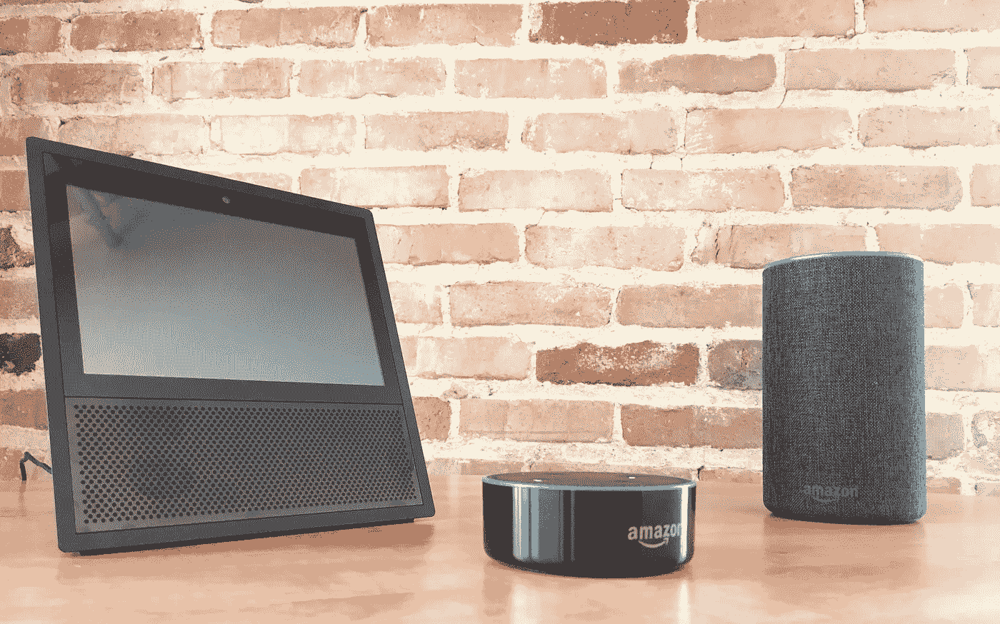
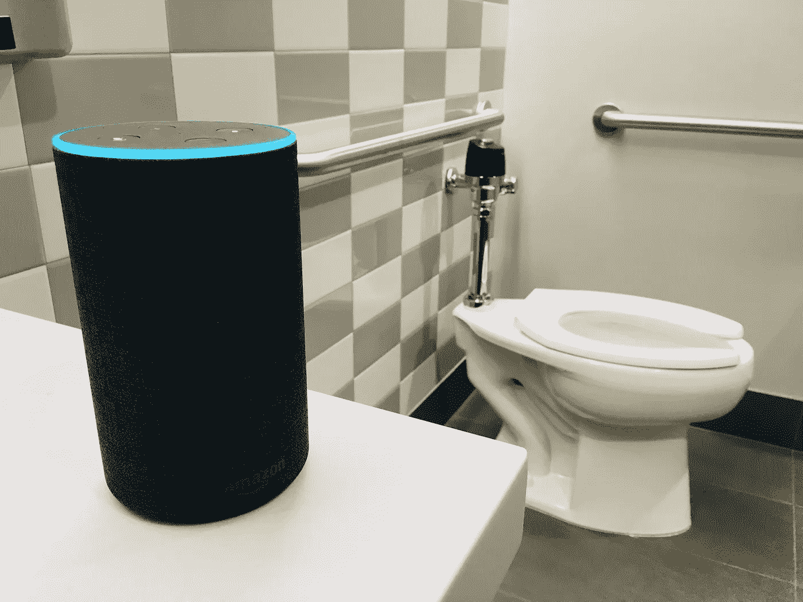
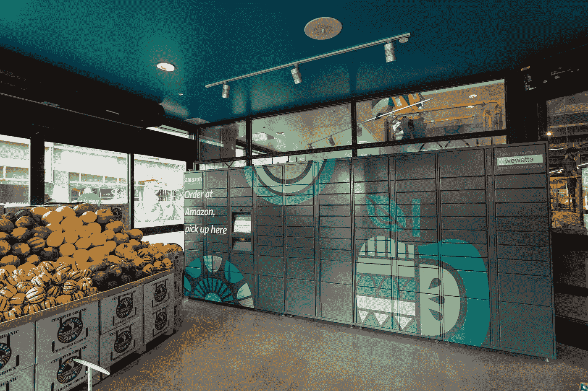
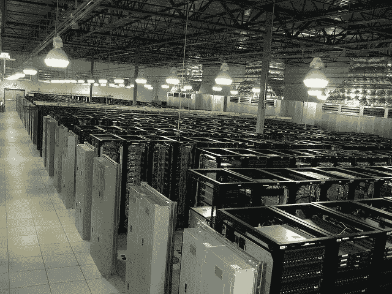
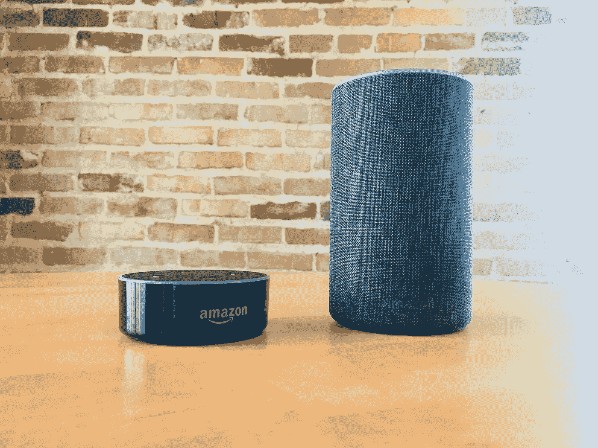
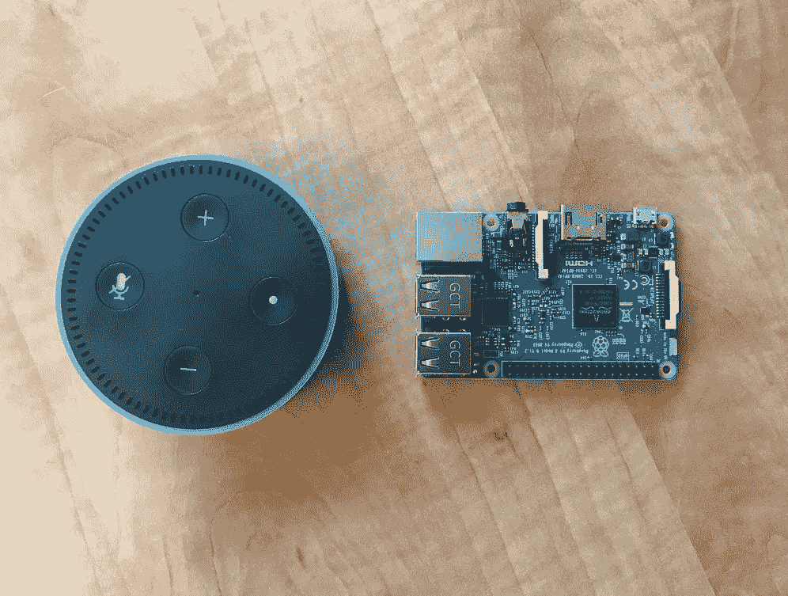
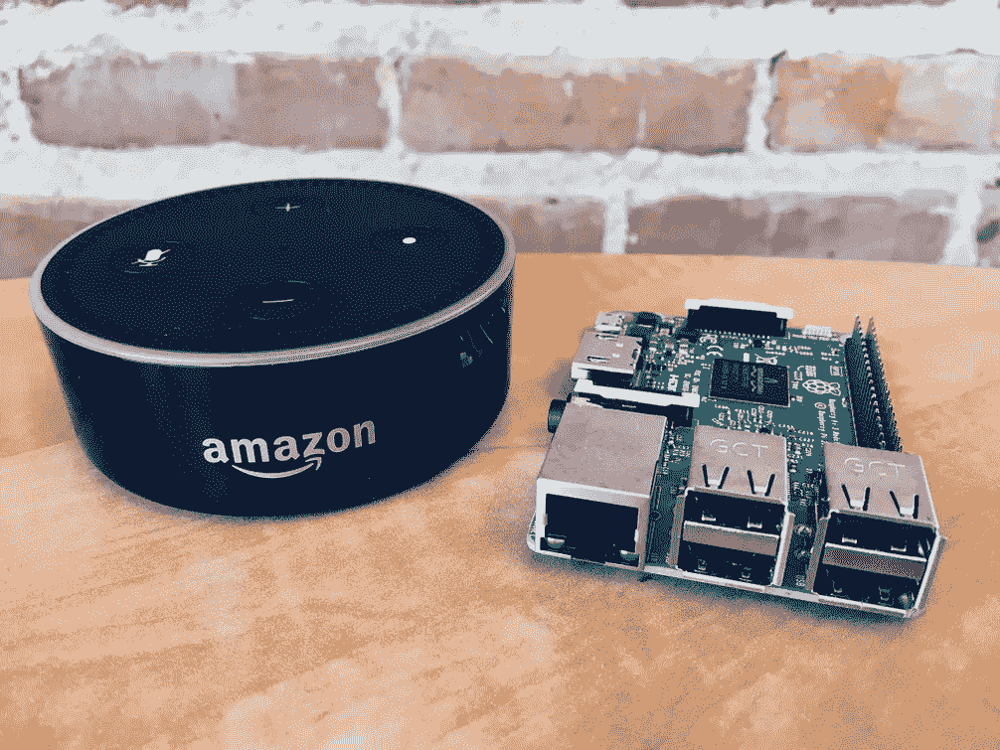

# 亚马逊的下一个云就在你的浴室里

> 原文：<https://medium.com/hackernoon/amazons-next-cloud-is-in-your-bathroom-30da79af4712>

## 亚马逊是在利用 Alexa 和她的 Echo 大军建立第二个云吗？

这是我对 Alexa 在亚马逊战略未来中的作用的看法(结合了深思熟虑的观察和阴谋论),以及我为什么相信#EchoArmy 将让亚马逊迎来下一波云浪潮。

语音和对话式用户界面肯定会成为未来技术领域的一块基石。亚马逊**在假期期间卖出了数千万台******支持 Alexa 的设备**，并可能在黄金日平均每分钟卖出 [**数千台 Echo 设备**](https://www.voicebot.ai/2017/07/12/amazon-echo-dots-sold-thousands-a-minute-on-prime-day-and-are-still-on-sale/) ！但如果你认为这只是一场赢得智能扬声器市场的竞赛，那你的想法就不够宏大。亚马逊有更大的计划，语音只是一个开始。**

# **大局**

**亚马逊已经成功地在你的家庭和企业中安装了数千万台微型的联网电脑。**

# **不是巧合**

**有一点很清楚:**

> **杰夫·贝索斯有一个计划。杰夫·贝索斯所做的一切都不是巧合。**

**此外，这也不是这家零售巨头转变为科技公司第一次让数百万台服务器上线。你可能听说过亚马逊的云计算业务，[亚马逊网络服务](https://aws.amazon.com/)。让我提醒你，*在线图书零售商*也有一个云部门，它在 2017 年带来了[17+10 亿美元](https://venturebeat.com/2018/02/01/amazon-revenue-grows-38-to-60-5-billion-in-q4-2017-aws-sales-up-45/)。亚马逊已经证明，他们有战略眼光和工程信誉来完成他们想要的任何事情。不相信我？回顾[他们开始](http://www.latimes.com/business/la-fi-amazon-history-20170618-htmlstory.html)的地方，然后观看[AWS 副总裁 James Hamilton](https://www.youtube.com/watch?v=AyOAjFNPAbA) 在 2016 年描述 AWS 内部工作的令人印象深刻的演讲。从现在开始，让我们假设我们从亚马逊看到的一切都是一个更大战略的一部分。**

**AWS re:Invent 2016: Tuesday Night Live with James Hamilton**

> **“让我们与众不同的真相是:……我们真正着眼于长远，我们真正喜欢发明。大部分公司都不是那些东西。”—杰夫·贝索斯**

# **战略**

**亚马逊网络服务将自己描述为提供 [*一个高度可靠、可扩展、低成本的基础设施平台*](https://aws.amazon.com/about-aws/) *。*亚马逊的云业务很简单。以最便宜的价格向世界添加尽可能多的计算硬件。有了 Alexa 和她的 Echo 大军，亚马逊似乎即将实现突破:一种新的*云，由消费者高度补贴，尽可能靠近用户——是的，甚至在你的浴室里。***

****

## **最后一英里**

****Alexa 代表了亚马逊云业务的最后一英里战略，这是一个** [**角色**](http://www.slate.com/articles/business/moneybox/2017/06/amazon_s_purchase_of_whole_foods_is_about_the_last_mile_problem.html) **与全食超市为亚马逊零售业务提供的角色几乎相同。**花点时间想想相似之处。再一次，让我们假设杰夫·贝索斯所做的一切都不是巧合。**

****

> **“我们现在正在播种更多的种子，现在谈论这些还为时过早，但我们将继续播种。我可以向你保证我们所做的一切都不会奏效。而且，我从来不担心这个…我们在视觉上很固执。我们在细节上很灵活。我们不会轻易放弃事情。”—杰夫·贝索斯**

## **一朵新的云——有声音**

***如果亚马逊的第一个云战略是建立* [*服务器农场*](https://en.wikipedia.org/wiki/Server_farm) *，那么亚马逊的第二个云战略可能会被称为“放飞小鸡”(与农场类比*😒…🦗🦗🦗…没有？…难缠的人群*)。***

****

**Photo by [John Allspaw](https://flic.kr/p/53Snfz)**

> **如果亚马逊的*第一云*由数百万台服务器组成，这些服务器被收集并堆放在世界各地仓库的天花板上，那么亚马逊的*第二云*由数百万台微服务器组成——我们称之为 echo——分散并嵌入到我们物理世界的每个角落。**

****

# **扩展其他 AWS 产品的覆盖范围**

## **AWS Lambda 的未来是 Echo。**

**随着开发人员开始转向[微服务架构](https://hackernoon.com/monolith-vs-microservice-vs-serverless-the-real-winner-the-developer-8aae6042fb48)、[无服务器技术](https://serverless.com/)和服务，如 [AWS 的 Lambda](https://aws.amazon.com/lambda/) ，不难想象有一天开发人员的代码会在 Echo 设备上实际执行。毕竟，物联网 DIY 者已经可以在[通过几个简单的步骤](/@gomaketeam/connecting-raspberry-pi-zero-with-amazon-web-services-iot-part-i-working-with-aws-iot-caa8a0f6f91b)将类似大小的树莓 Pi 连接到 AWS-cloud。树莓派[和 AWS T2-Micro 有什么不同吗？](https://news.ycombinator.com/item?id=5083172)**

********

## **AWS Edge 的未来是 Echo。**

**同样，AWS 正在逐步改进 AWS 基础设施，通过越来越接近用户来降低延迟。亚马逊[不断在没有成熟](https://aws.amazon.com/about-aws/whats-new/2017/11/cloudfront-adds-six-new-edge-locations/) [AWS 区域](https://docs.aws.amazon.com/AWSEC2/latest/UserGuide/using-regions-availability-zones.html#concepts-available-regions)的主要城市增加这些边缘位置。最终的边缘位置将是您的社区和办公室中的 Echo 服务器，这难道不可行吗？**

# **暗示**

**但是在你把所有的 [*红色手推车*](https://www.bustle.com/p/what-does-red-wheelbarrow-mean-on-mr-robot-the-recurring-phrase-connects-two-key-players-2807000) 都推到我身上之前，让我们记住“云”计算的好处是显著的。企业和个人从共享计算资源的效率和规模经济中受益匪浅。人们经常认为云计算让小企业能够与大企业竞争。同样，一个拥有这种身临其境的世界，微云也会让世界上的 [*小人物*](https://www.nytimes.com/2016/08/12/opinion/too-poor-to-afford-the-internet.html) 受益。**

## **那么这个微云到底会做什么呢？**

****

****对于开发者来说，** AWS 的基础设施变得更大、更冗余，并且更加接近用户。服务于较小地理区域的应用程序开发者可以将代码部署到单个社区，而不是相同的旧区域( *us-east-1* 有人知道吗？).**

****

****对于消费者来说，**你的 Prime 会员将获得更多价值！想象一下，如果成员可以从附近的 Echos 获得额外的计算能力。如果你曾经使用过远程桌面，那么你可以想象它是如何工作的。能够打开一个便宜的 100 美元的 Chromebook 并控制一台强大的 PC 是一种很棒的感觉。感觉就像你在作弊。**

**现在想象一个城市，有一个由这些 Echo 服务器(你的+我的+其他人的)组成的网络，提供额外的计算和互联网。你扔掉 sim 卡，轻装上阵，带着你最喜欢的外设四处旅行。所有的处理和互联网连接都发生在最近的 Echo 上，当你在城市中移动时，它会将内容无线传输到你的设备上。我个人会带上我的无线耳塞(我敢说 AirPods 吗？？)以及类似手机的未来派流式触摸显示屏(姑且称之为 iPhone 9……)，用于视频、阅读、网页浏览、信息传递等。**

> **那么我们离这样的未来还有多远呢？承认吧。可能没有你最初想的那么遥远。**

**不要低估回声。语音正处于一场激动人心的技术变革的前沿。**

****

**我们全押在语音技术和 AWS 上。我们在 Vocool 的团队正在寻找开发人员来帮助构建这个语音驱动的未来。如果您使用技术解决大问题或渴望这样做，请使用我们网站上的联系表格联系我们，或在 Twitter 上关注我们，地址为@getvocool。**

****