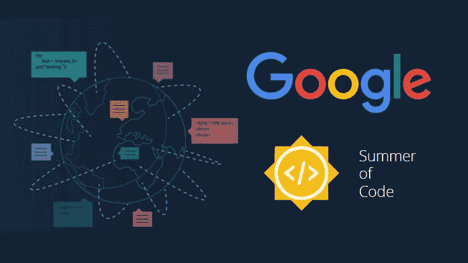

# 成为谷歌代码学生之夏的可行清单

> 原文：<https://medium.com/hackernoon/an-actionable-checklist-to-being-a-google-summer-of-code-student-47ca97e521f3>

## 写项目建议书之前、之中和之后要做什么？

谷歌代码之夏(Google Summer of Code)是一个全球性的项目，它鼓励学生在大学休学期间与开源组织一起从事一个 T2 编程项目。如果你不太了解它，请花几分钟时间到[观看这个视频](https://www.youtube.com/watch?v=QVnN34YGz8s)，并阅读[官方常见问题](https://developers.google.com/open-source/gsoc/faq)。

哦！这看起来很有趣。兴奋地开始了吗？

但是等等，你到底该怎么做……我希望下面的清单能帮助你找到自己的路。我们走吧。

# 抢先一步

1.  **早点开始，现在就开始
    等等，它的名字里有一个夏天。为什么现在开始？不要认为现在开始还为时过早。你的目标应该是了解社区，探索他们从事的项目，并与成员建立真正的关系。你的努力可能会导致你和他们一起度过这个夏天，但这不应该是你现在谈话的驱动因素。**
2.  ***“可是我什么都不知道！”*** 那完全没问题。GSoC 是一个项目，在这个项目中，学生们(真正地)被鼓励利用暑假学习新东西。所以，放下你所有的禁忌，决定投入其中。
3.  **寻找一个开源社区，成为它的一部分。这个人可能是，也可能不是你最终要与之共度夏天的人。你可以选择一个社区，因为你喜欢他们正在做的项目，这是在大学的一门课程中，或者只是因为你的朋友为它做出了贡献。正式申请将于 3 月下旬开始，所以如果你利用这段时间与你潜在的导师和其他社区成员建立关系是很好的。**
4.  **等等，你不知道怎么找社区？**
    借助 GSoC 上一年的组织。2018 年有 [206 个组织](https://summerofcode.withgoogle.com/archive/2018/organizations/)参加。探索项目、学生所做的工作以及每个组织拥有的沟通渠道。不要偷懒，做你的研究。
5.  开始四处潜伏。
    在 IRC 频道、Telegram、Slack、Gitter 和邮件列表上闲逛。观察一群陌生人，在遥远的地方，如何完美和谐地工作。学习如何沟通的规则，无论是在 IRC 还是任何其他平台上。尊重他们。
6.  **该跳进去了。**
    探索你喜欢的组织的代码库。大多数项目都有关于项目是什么以及如何做出贡献的完整文档。

# 开始投稿

1.  **受够了潜伏。**
    找一个小 bug 来修复或者做一个小的改进。查找标有#简易解决方案、#黑客啤酒节、#新手等标签的问题。你不需要移山。甚至，修复 README.md 中的一个错别字作为开始已经足够好了。
2.  哦，等等，你记得我告诉过你我什么都不知道吗？！！别担心，那也是我。[学够 git 才危险](https://www.learnenough.com/git-tutorial)。[学够命令行才危险](https://www.learnenough.com/command-line-tutorial)。
3.  **设置本地开发环境**
    为您想要为之做出贡献的组织设置本地开发环境。这通常很棘手。不要根据它来估计你的技能。阅读文档。遇到困难时寻求帮助。不要半途而废！
4.  **开始考虑你的项目提案。到目前为止，您必须已经建立了一个本地开发环境，解决了一些问题，甚至与社区成员聊过天。组织通常会在学生申请期之前发布项目创意。请随意提出你的想法。**
5.  **帮助其他新人。随着申请期的临近，IRC 频道开始变得拥挤。不要没有安全感。别傻了，很容易认出一个。**

# 写下你的提议

1.  组织你对提案的想法查看该组织学生过去的提案。浏览社区提供的任何可用指南，[比如 KDE 的这个](http://teom.org/blog/kde/how-to-write-a-kick-ass-proposal-for-google-summer-of-code/)，或者 Fedora 的[这个](https://docs.fedoraproject.org/en-US/mentored-projects/gsoc/2018/application/)。开始按照要求的格式组织你的想法。我的意见是，有一个可靠的提议，而不是多个松散的提议。
2.  收集来自导师和社区的早期反馈，并在最终方案中付诸实施。
3.  **不要做个跟踪狂或讨厌鬼。**
    和潜在导师谈谈你的想法。除非导师建议，否则不要发送私人信息。没人会窃取你的想法。你已经花了时间建立与社区的信任，这将为你现在的工作。关键不在于想法，而在于执行想法的潜力。
4.  **公平竞争。**
    对自己夏天的日程安排、空闲时间和现有技能诚实交代。
5.  **记住时间表。**
    GSoC 对比特币的要求非常严格，如果错过了就没办法了。没错，就是再等一年。
6.  **点击提交。哒哒！**
    提交方案，屏住呼吸。开个玩笑，深呼吸。你干得真棒！

## 多方面的

在开始我的旅程之前，我曾在 GSoC 的一次经历中读到过这个建议，这个建议就是黄金。这是一段漫长的旅程，自我怀疑是一回事。

## 找到一群比你更相信你自己的人。

阅读大量的博客。我们鼓励所有的学生记录他们的旅程，所以有很多这样的学生。[sambav Kothari](https://medium.com/u/501aa4930ba?source=post_page-----47ca97e521f3--------------------------------)[Rajika Imal](https://medium.com/u/528e15e0a560?source=post_page-----47ca97e521f3--------------------------------)[harsh it DWI](https://medium.com/u/e478da964ee?source=post_page-----47ca97e521f3--------------------------------)发布

 [## 夏天的 500 次承诺:自由/开源软件和 GSoC 的故事

### 这个夏天的故事始于家里一个灰暗沉闷的冬天。无聊的时候，我开始徘徊在 IRC 频道和很多…

hackernoon.com](https://hackernoon.com/500-commits-of-summer-my-story-of-foss-and-gsoc-40bb8b325f65)  [## 谷歌夏季代码成功秘诀

### GSoC 简介

medium.freecodecamp.org](https://medium.freecodecamp.org/a-recipe-for-google-summer-of-code-success-cb0ceb1ae895)  [## 谷歌代码之夏一站式指南

### 考虑到离 2019 年谷歌代码之夏还有将近一年的时间，写这个博客可能不是最好的时机……

medium.com](/coding-blocks/one-stop-guide-to-google-summer-of-code-a9e803beeda7) 

继续看大局。如果没有，你现在是一个社区的一部分，你所做的工作是在那里的公开让你在未来的工作申请中使用。

> 我希望这能有所帮助。借此机会，我打算继续写下自己作为 GSoC 设计师的心路历程，我在这个神奇的社区中的经历，以及关于如何为[开源软件](https://hackernoon.com/tagged/open-source)和 GSoC 做贡献的建议。我错过了在实习期间做它，大约是时候我弥补和做我的一份！:)