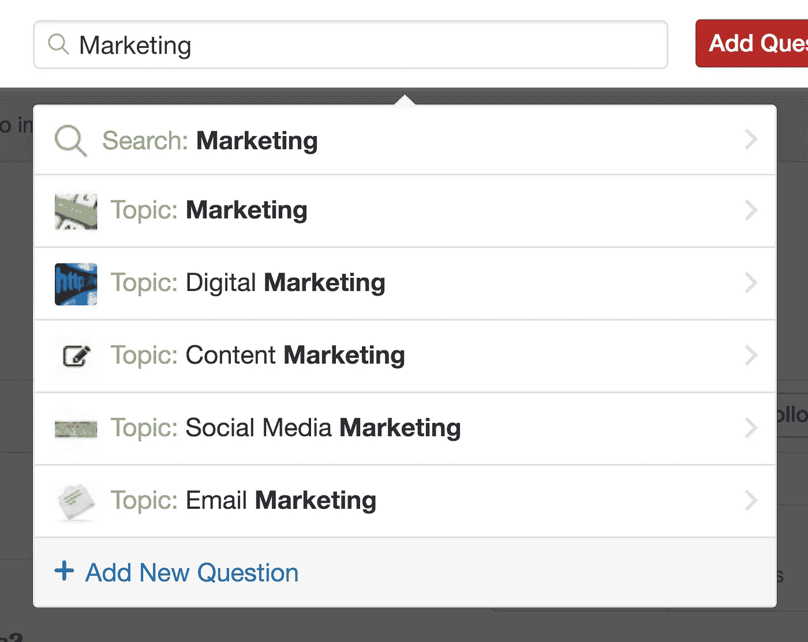
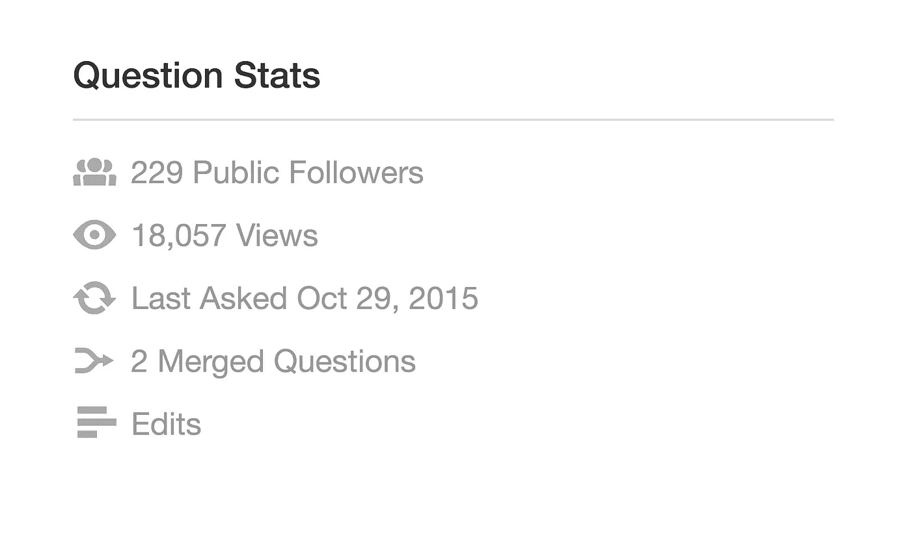
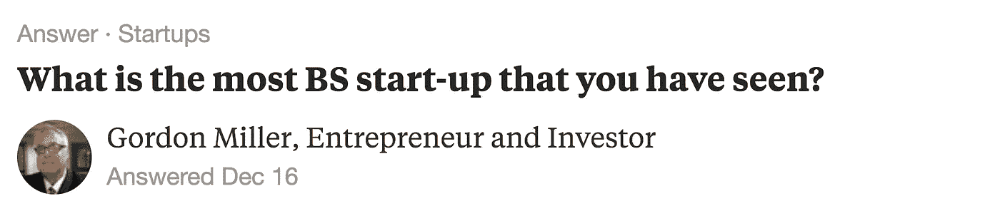

# 搜索引擎优化的替代方案

> 原文：<https://medium.com/hackernoon/an-alternative-to-seo-328ed661571c>

发布你精心起草的内容，但没有收到任何流量会很累。给你一种没人听的感觉。它产生了怀疑。

如果没人听，你的帮助有什么用？有很多方法可以让你的内容呈现在观众面前。你可以尝试不同的外向策略，但你不确定是否有人想听你说话，所以你可能想尝试一些内向策略。

你知道搜索引擎优化，但爬上顶端是很难的。你也要确保你的内容能引起你的观众的共鸣，然后再把这么多的精力投入到这样一个长期战略中。

本文是系列文章的第三篇。这是第一个和[这是第二个](https://hackernoon.com/how-to-pull-people-in-711ec591256e)。

Photo by [Anthony Martino](https://unsplash.com/@amartino20?utm_source=medium&utm_medium=referral)

# 替代方案

这就是 Quora 发挥作用的地方。Quora 不会取代 SEO，但是它可以产生大量的流量，甚至可以提高你的 SEO。

Quora 是一个很好的平台，可以为有问题的人提供解决方案(你的产品或内容)。不要把你的东西扔在每个人的眼前(做广告)，你不仅可以把这些信息给那些觉得有用的人，也可以给那些自己寻求解决方案的人。
一个人问一个问题，你回答它，很多人看到你的回答。

# Quora 的基础知识

## 创建个人资料

为了让你的活动转化，你应该制作一个好的个人资料页面。人们经常会在看了你的回答后去看你的个人资料，所以一定要用你的个人资料。像在你的网站上一样写一些好的文章。你可以在 Quora 上查看受欢迎作家的简介，了解你可以做些什么。在 Quora 上，有一件事要时刻牢记，那就是保持真实。

Photo by [Daniel Hjalmarsson](https://unsplash.com/@artic_studios?utm_source=medium&utm_medium=referral)

## 开始前的一些事情

你现在可以回答一些问题了。
开始前你必须知道的事情:

*   这是一项长期战略，没有立竿见影的效果
*   真诚地给予帮助
*   要可信
*   不要卖得太多
*   你应该成为一名优秀的作家

知道了所有这些事情，你现在就可以搜索问题了。

## 发现好问题

将你的努力集中在你所在行业的 Quora 主题上是很重要的。你想让那些可能对你的产品感兴趣或者有兴趣和你一起工作的人阅读你的答案。专注于几个话题。如果你写你的行业，你会得到你想要的流量。写一些完全不同的东西，人们可能仍然会觉得你要说的东西很有趣，你甚至可能获得更广泛的观众，但这不会是你所追求的观众。

知道了这一点，你应该在 Quora 上选择 2-3 个话题。只需使用 Quora 的搜索为您的行业找到一些主题。

话题有关注者。一定不要选太少的。

现在你有了你的主题，开始搜索一些问题。虽然问题的标题是最重要的因素，但它不是你在写答案前唯一应该看的。有几个数据你应该看看。

一个问题有它自己的统计部分。也可以看看回答的数量。确保已经没有太多的答案。顶部的答案比下面的有更多的点击率，所以你应该有信心在回答之前爬到顶部。如果你刚刚开始，你可能应该只回答少于五个答案的问题。关注者和回答的比例应该很高。回答量基本上是唯一应该低的数字。

你可能要经过许多问题才能找到一个有说服力的问题。为了让这变得简单一点，你可以使用[寻找更好的问题](http://findbetterquestions.com/)，它可以自动完成你的研究，并为你提供一个简单的电子表格。

Photo by [Dana Marin](https://unsplash.com/@amsterdamian?utm_source=medium&utm_medium=referral)

## 写下你的答案

情绪化。
最受欢迎的答案让你开怀大笑。个人故事登上了 Quora 的顶端。不是任何人都可以谷歌到的事实。

***格式:***

**使用粗体文本**

*   使用列表

最重要的是:回答问题。
许多人在推销自己或自己的企业时，都注重传达自己的信息。如果你只是这样做，你不仅不会得到任何意见，但你有被踢出 Quora 的风险。

在你发布答案之前还有一件事:更新你的简历。它可以针对不同的主题进行定制，最大长度为 50 个字符。单击您答案下方的小圆点打开一个菜单，然后单击编辑凭据。
你可以针对不同的话题更新你的标语，但不要改变太多，否则人们更难认出你。

这篇文章是系列文章的一部分。下一篇文章还没有发表，所以如果你喜欢这篇文章，请继续关注。