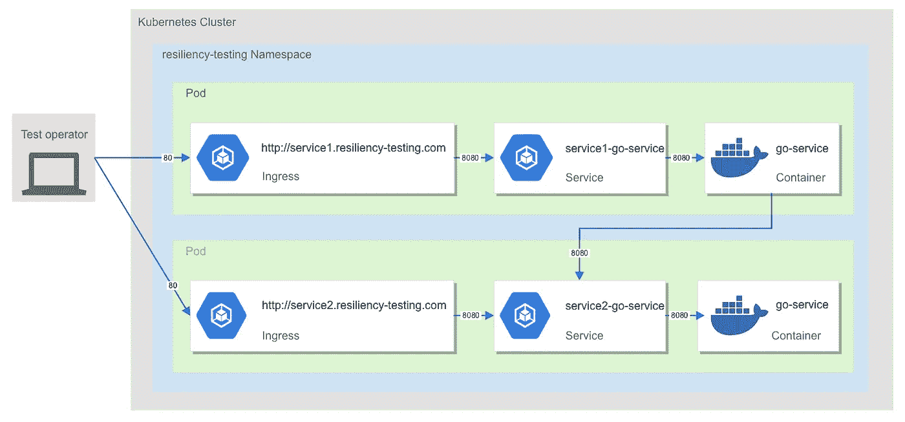
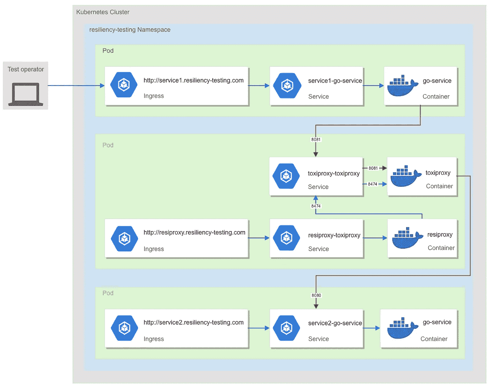

# 一种使用 Kubernetes 自动化应用弹性测试的方法

> 原文：<https://medium.com/hackernoon/an-approach-to-automating-application-resiliency-testing-with-kubernetes-c336a4836c19>


# 目录

如果你从未失败过，你就没有活过

[可靠性和弹性](#f257)

[所以让它破碎吧…但是要为它做好计划！](#c287)

*   [为什么选择 Kubernetes？](#797f)
*   [用 ToxiProxy 组织抗性](#37c0)
*   [ResiProxy:一个 Kubernetes 同伴](#fb9a)
*   [快乐 vs 另类路径](#6e62)
*   [用空手道保持冷静和克制](#2e2b)

[结论](#7f16)

# 如果你从未失败过，那你就没有活过

不要对微服务过于悲观，这句俗语也是有道理的:失败是任何分布式系统的固有特征。数百个独立的实体试图沟通和合作，以实现更大的利益…其中至少有一个肯定会失败。

试图避免所有这些失败是一厢情愿的想法，有时会导致额外的复杂性，这会直接影响架构及其成本，特别是限制其发展、测试和维护的能力。

一如既往，需要一种平衡:即使我们显然应该通过增加冗余来显著限制它们，接受失败和尝试弹性在构建架构时提供了一系列不同的方法和机会。

一旦理解了不同类型的可能故障以及如何设计和构建系统来处理它们，在生产中体验它们之前进行测试是很自然的。

本文关注最后一个方面，并展示了一种在微服务级别自动测试弹性的方法。

# 可靠性和弹性

任何系统的一个重要方面是其可靠性:

> 可信性或可靠性描述了系统或组件在规定的条件下运行一段时间的能力。可靠性与可用性密切相关，可用性通常被描述为组件或系统在特定时刻或时间间隔内运行的能力。— [维基百科](https://en.wikipedia.org/wiki/Reliability_engineering)

它隐含地捕获了系统避免故障的能力，因此在给定的时间内是可用的: [x 9 的可用性](https://landing.google.com/sre/sre-book/chapters/availability-table/)。

然而，对于由多个独立服务组成的系统，有效地计算和管理全局开始变得棘手。[这篇来自网飞的旧文章](/netflix-techblog/fault-tolerance-in-a-high-volume-distributed-system-91ab4faae74a)有助于你了解更大的图景。

失败可能有多种来源:微服务可能会耗尽资源，在较重的负载下失败，或者仅仅是因为对于分布式系统来说，构建无错误的应用程序更加复杂。

此外，仅仅因为网络的[可靠性方面，平台(硬件、软件+、网络)永远无法保证 100%的可用性。](https://en.wikipedia.org/wiki/Fallacies_of_distributed_computing)

然后，透过**弹性:**的透镜来观察系统变得很重要

> 弹性是系统从容处理故障并从故障中恢复的能力。云托管的本质是应用程序通常是多租户的，使用共享平台服务，竞争资源和带宽，通过互联网进行通信，并在商用硬件上运行，这意味着出现暂时性和永久性故障的可能性增加。检测故障并快速高效地恢复，对于保持弹性是必要的。— [微软 Azure](https://docs.microsoft.com/en-us/azure/architecture/patterns/category/resiliency)

尽管不能在沙箱中测试每种类型的故障，但是可以模拟它们对客户端的影响。

最终，目标是做好准备。回退策略(例如在降级模式下运行)可以在应用程序级别实施，随后需要进行验证。

# 所以让它破碎吧…但是要为它做好计划！

事不宜迟，这最后一部分展示了如何模拟 Kubernetes 集群中独立(微)服务之间的故障，并通过自动化测试捕获这些场景。

## 为什么是 Kubernetes？

对于那些必须处理集成问题的人来说，试图找出为什么在开发或 QA 环境中工作的服务在生产中会失败，通过只采用一种部署模型来最小化这些差异是显而易见的。

除此之外，我们希望支持另外一种类型的测试，而且受环境拓扑的影响，其中一个需求是使用生产中使用的相同部署平台进行测试，即 Kubernetes。

下面所有的例子都基于一个部署，该部署由两个相同的 go 微服务组成，公开了同一个`/status` REST 端点:服务 1 依赖于服务 2，比如当它接收到一个 GET 请求时，它将它转发给服务 2，并在返回全局状态之前聚合响应。

此处提供了该示例微服务的代码[，两种部署都可以使用提供的舵图进行设置:](https://github.com/marqub/go-service)

```
$ helm install chart/ --name service1 --namespace resiliency-testing --set DEPENDENCY_NAME=http://service2-go-service.resiliency-testing:8080$ helm install chart/ --name service2 --namespace resiliency-testing
```

它创建了以下 Kubernetes 资源:

```
$ **kubectl get pods,services,ingresses -n resiliency-testing**NAME                                       READY     STATUS    
pod/service1-go-service-7b4bc7c444-mnfvz   1/1       Running   
pod/service2-go-service-6dff85ff9c-8rzg6   1/1       RunningNAME                          TYPE         PORT(S)          
service/service1-go-service   NodePort     8080:32564/TCP   
service/service2-go-service   NodePort     8080:30829/TCPNAME                                     HOSTS                             
ingress.extensions/service1-go-service   service1.resiliency-testing.com   
ingress.extensions/service2-go-service   service2.resiliency-testing.com
```

简单来说:

*   每个微服务有一个 pod，
*   微服务可通过其专用的 K8s 服务在内部访问，
*   K8s 服务重定向到 pod，
*   入口通过重定向到 K8s 服务，允许集群外部的客户端通过主机名与微服务进行交互。



对于此请求:

```
curl -X GET [http://service1.resiliency-testing.com/status](http://service1.resiliency-testing.com/status)
```

一个健康的系统会返回:

```
{
    "status": "OK",
    "name": "service1",
    "dependencies": [
        {
            "status": "OK",
            "name": "service2"
        }
    ]
}
```

## 用毒素组织抵抗

我们首先寻找的是一种篡改网络通信的方法，然后，它在 Kubernetes 集群中工作。

[ToxiProxy](https://github.com/Shopify/toxiproxy) 来了，[点击这里](https://medium.com/u/bab76dfc19b0#defining-a-service)。

为了完成这项工作，我们想到了 ResiProxy:一个用 Go 编写的轻量级 ToxiProxy K8s 伙伴，它代理对 tox proxy 的调用。这里是 git 存储库。

它用于 **only** 拦截**REST admins**对 tox proxy 的调用，如果需要，执行 K8s 相关操作，然后将调用转发给 tox proxy 完成。

提供了用于部署 ResiProxy 和 ToxiProxy 的舵图:

```
helminstall chart/ --namespace resiliency-testing --name resiproxy
```

它创建了一个额外的 pod，其中包含 ResiProxy 和 tox proxy 容器、两个关联的服务以及一个用于访问 ResiProxy(并配置 tox proxy)的入口:

```
$ **kubectl get pods,services,ingresses -n resiliency-testing**NAME                                       READY     STATUS    
**pod/resiproxy-resiproxy-7dd7867984-sjk8r   2/2       Running** pod/service1-go-service-56f6b67c6b-czjjg   1/1       Running
pod/service2-go-service-6dff85ff9c-8rzg6   1/1       RunningNAME                          TYPE       PORT(S)                                        
**service/resiproxy-resiproxy   NodePort   8080:32342/TCP                                 
service/resiproxy-toxiproxy   NodePort   8474:31974/TCP**
service/service1-go-service   NodePort   8080:31666/TCP                                 
service/service2-go-service   NodePort   8080:30829/TCPNAME                                     HOSTS                              
**ingress.extensions/resiproxy-resiproxy   resiproxy.resiliency-testing.com**
ingress.extensions/service1-go-service   service1.resiliency-testing.com
ingress.extensions/service2-go-service   service2.resiliency-testing.com
```

**想要**配置 ToxiProxy** 的外部客户端**将使用**入口来 ResiProxy。**随后**，一个希望**与另一个**依赖**的**对话的微服务**将使用**ToxiProxy 的 K8s 服务**和之前创建的端口。

默认情况下，这个服务只“公开”一个端口，ToxiProxy 在这个端口监听 REST 调用，ResiProxy 将配置请求转发到这个端口:8474。

```
$ **kubectl describe service resiproxy-toxiproxy -n resiliency-testing**Name:                     resiproxy-toxiproxy
Namespace:                resiliency-testing
Labels:                   app=resiproxy
                          chart=resiproxy-0.0.1
                          heritage=Tiller
                          release=resiproxy
Annotations:              <none>
Selector:                 app=resiproxy,release=resiproxy
Type:                     NodePort
IP:                       xxx.xxx.xxx.xxx
**Port:                     http-toxiproxy  8474/TCP
TargetPort:               8474/TCP**
NodePort:                 http-toxiproxy  31974/TCP
Endpoints:                xxx.xxx.xxx.xxx:8474
Session Affinity:         None
External Traffic Policy:  Cluster
Events:                   <none>
```

如上所述，为了配置服务 1 和服务 2 之间的桥，我们需要使用 ResiProxy。

```
curl -X POST [http://resiproxy.resiliency-testing.com/proxies](http://resiproxy.resiliency-testing.com/proxies) \  
  -H 'Content-Type: application/json' \
  -d '{
    "name": "proxy_service2",
    "listen": "[::]:8081",
    "upstream": "service2-go-service.resiliency-testing:8080",
    "enabled": true
}'
```

现在，发送到 ToxiProxy 的端口 8081 的每个请求都将被转发到 service 2 的端口 8080。不出所料，ToxiProxy 的 K8s 服务级别现在开放了一个新端口:

```
$ **kubectl describe service resiproxy-toxiproxy -n resiliency-testing**Name:                     resiproxy-toxiproxy
Namespace:                resiliency-testing
Labels:                   app=resiproxy
                          chart=resiproxy-0.0.1
                          heritage=Tiller
                          release=resiproxy
Annotations:              <none>
Selector:                 app=resiproxy,release=resiproxy
Type:                     NodePort
IP:                       xxx.xxx.xxx.xxx
**Port:                     http-toxiproxy  8474/TCP
TargetPort:               8474/TCP**
NodePort:                 http-toxiproxy  31974/TCP
Endpoints:                xxx.xxx.xxx.xxx:8474
**Port:                     8081  8081/TCP
TargetPort:               8081/TCP**
NodePort:                 8081  30795/TCP
Endpoints:                xxx.xxx.xxx.xxx:8081
Session Affinity:         None
External Traffic Policy:  Cluster
Events:                   <none>
```

然后，我们可以重新部署服务 1 以指向 ToxiProxy 打开的新端口，该端口重定向到服务 2 ( [而不是像以前那样直接指向服务 2](#4c1c)):

```
$ helm install chart/ --name service1 --namespace resiliency-testing --set DEPENDENCY_NAME=http://resiproxy-toxiproxy.resiliency-testing:8081
```

总而言之，弹性测试部署模型现在看起来像这样:



## 快乐 vs 另类路径

有趣的是，在这个初始部署之后，代理在默认情况下是启用的，并且将从服务 1 发起的任何请求转发到服务 2:

```
{
    "name": "proxy_service2",
    "listen": "[::]:8081",
    "upstream": "service2-go-service.resiliency-testing:8080",
 **"enabled": true,**    "toxics": []
}
```

从客户端来看，测试快乐路径与我们的第一个测试完全相同。

测试替代路径(例如，在服务 2 不可达的地方)非常简单，并且只需要一个先前的 REST 请求来禁用该代理。

```
curl -X POST \
 [http://resiproxy.resiliency-testing.com/proxies/proxy_service2](http://resiproxy.resiliency-testing.com/proxies/proxy_service2) \
  -H 'Content-Type: application/json' \
  -d '{
    "name": "proxy_service2",
    "listen": "[::]:8081",
    "upstream": "service2-go-service.resiliency-testing:8080",
 **"enabled": false** }'
```

相同的先前 REST 请求

```
curl -X GET [http://service1.resiliency-testing.com/status](http://service1.resiliency-testing.com/status)
```

现在将返回一个完全不同的结果:

```
{
    "status": "OK",
    "name": "service1",
    "dependencies": [
        **{
            "status": "UNKNOWN",
            "name": "**[**http://resiproxy-toxiproxy.resiliency-testing:8081**](http://resiproxy-toxiproxy.resiliency-testing:8081)**"
        }**
    ]
}
```

测试这个场景可以确保它是否以及如何被计划。例如，通过重试，返回预定义的错误，或者在这种情况下，**返回降级的部分响应**。

## 用空手道保持冷静和控制

> [空手道](https://github.com/intuit/karate)是唯一一个将 API 测试自动化、[模仿](https://github.com/intuit/karate/blob/master/karate-netty)和[性能测试](https://github.com/intuit/karate/blob/master/karate-gatling)结合成一个单一的、*统一的*框架的开源工具。Cucumber 推广的 BDD 语法是语言中立的，即使对于非程序员也很容易理解。除了强大的 JSON & XML 断言，您还可以并行运行测试以提高速度——这对 HTTP API 测试至关重要。
> 
> 您可以轻松地构建(或重用)复杂的请求负载，并从响应数据中动态构造更多的请求。有效负载和模式验证引擎可以对两个 JSON 或 XML 文档进行“智能比较”(深度相等)，您甚至可以在需要时忽略动态值。
> 
> 测试执行和报告生成感觉就像任何标准的 Java 项目。但是也有一个[独立的可执行文件](https://github.com/intuit/karate/blob/master/karate-netty#standalone-jar)供不熟悉 Java 的团队使用。只需用简单的、*可读的*语法编写测试——为 HTTP、JSON、GraphQL 和 XML 精心设计。

空手道是一种工具，我们用它来自动化所有的测试，直到现在我们都是手工进行的。通过这种方式，我们可以轻松地将它们集成为 CI/CD 管道的一部分，并增强我们对生产系统整体稳健性的信心。

这最后一部分通过在单独的自动化场景中捕捉所有前面的例子，给出了}
"""
**Given** url '[http://resiproxy.resiliency-testing.com/proxies/proxy_service2'](http://resiproxy.resiliency-testing.com/proxies/proxy_service2')
**And** request proxy
**When** method post
**Then** status 200

然后我们可以定义一个场景来捕捉我们之前用 [curl 命令](#592a)手动测试的快乐路径:

```
Background:
*** url '**[**http://service1.resiliency-testing.com'**](http://service1.resiliency-testing.com') *** call read('failures/service2-delete.feature')
* call read('failures/service2-create.feature')****Scenario**: Retrieve status when service 2 is available*** call read('failures/service2-enable.feature') { enabled: true }****Given** path 'status'
**When** method get
**Then** status 200
**Then** match response ==
  """
    {
    "status":"OK",
    "name":"service1",
    "dependencies":[
        {
            "status":"OK",
            "name":"service2"
        }
    ]
    }
  """
```

最后，服务 2 不可用时的备用路径也可以在不同的场景中定义:

```
**Scenario**: Retrieve status when service 2 is not available*** call read('failures/service2-enable.feature') { enabled: false }****Given** path 'status'
**When** method get
**Then** status 200
**Then** match response ==
  """
    {
    "status":"OK",
    "name":"service1",
    "dependencies":[
        {
            "status":"UNKNOWN",
            "name":"#ignore"
        }
    ]
    }
```

ToxiProxy 公开了一组 Restful APIs，使得在服务之间动态创建代理和模拟“问题”变得容易。如果大多数时候我们想玩网络延迟或者只是模拟不可用性，ToxiProxy 支持更广泛的被称为 [*毒物*](https://github.com/Shopify/toxiproxy#toxics) 的东西。

空手道提供了清晰的 BDD 可读语法(GIVEN/WHEN/THEN)来捕获这些测试并防止将来的回归。

这些测试的完整代码可以在[这个 git 库](https://github.com/marqub/resiliency-testing)中找到。

# 结论

这篇文章不是关于:

*   描述分布式系统中可能发生的不同类型的故障，
*   构建弹性应用程序，
*   详述测试弹性的不同方法，
*   或者以后如何利用可观察性来监控、检测和理解故障以及适当的策略。

所有这些都将是后续帖子的好主题，尽管其中一些内容已经被广泛传播，从[的优秀书籍*发布开始！*](https://pragprog.com/book/mnee2/release-it-second-edition) 。

从全局来看，架构的弹性方面创造了不同的机会，如提供不同的用户体验、扩展和支持更重的负载，以及构建更健壮的系统。

这篇文章是关于给开发者合适的工具来关注这个方面，并且除了常规的单元测试之外，简单地用 Kubernetes 测试它。

另一个好处是其他人，比如 QA 团队，能够在以后查看完成的工作，检查不同的部分是否一起工作，以及它们是否与外部系统配合良好。

ResiProxy/ToxiProxy 和空手道是添加到您的测试工具箱中的新工具。它们有助于将这些类型的测试从其他测试中分离出来，并强调它们的重要性。

你可以回头看看这篇文章中列出的不同 git 库的所有代码: [ResiProxy](https://github.com/marqub/resiproxy) ，[样例 go 微服务](https://github.com/marqub/go-service)和[空手道测试](https://github.com/marqub/resiliency-testing)。

*觉得这篇文章有用吗？关注我上* [*中*](/@bmarquie)*[*推特*](http://bit.ly/2G40HXe) *，还有*[*Linkedin*](http://t.co/JI0k1ZMs9k)*！请👏这篇文章分享一下吧！**