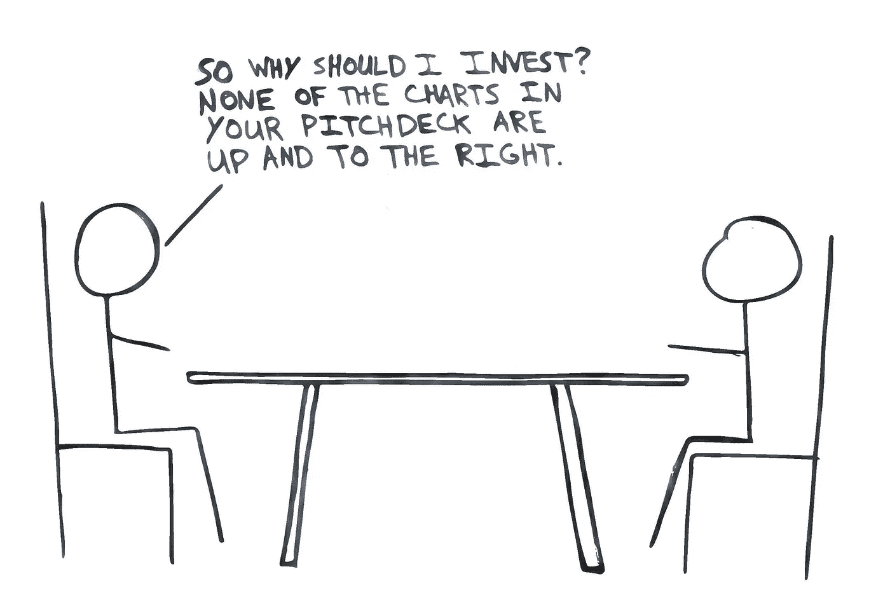
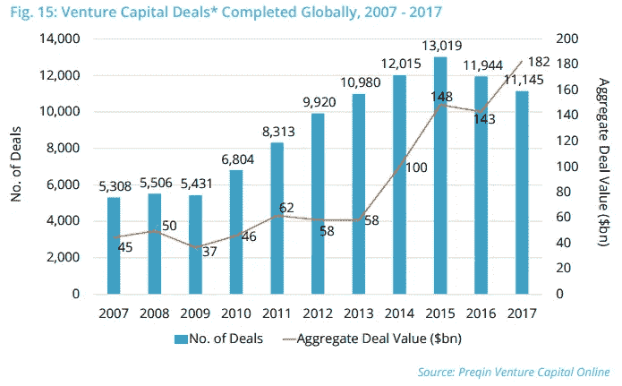
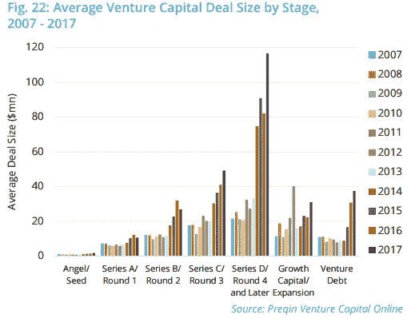
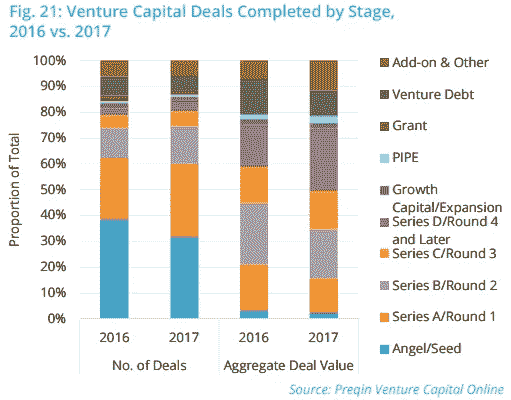
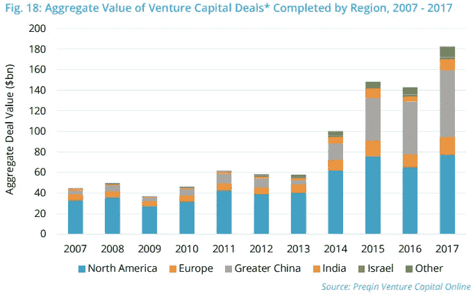
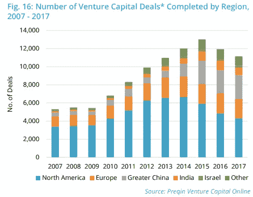

# 任何其他名称的资产类别

> 原文：<https://medium.com/hackernoon/an-asset-class-by-any-other-name-venture-capital-33e9cfb6ff54>

“GREAT question.”

最近，一家总部位于奥斯汀的名为 Think3 的基金推出了针对风险投资支持的增长放缓的软件初创公司的。他们的方法在几个方面是独一无二的。他们在投资后取代初创公司的创始团队，然后投资于该团队的下一个项目——同时甚至不要求这些创始人在下一个项目中出售股权。这感觉就像投资一个风险包装公司。对私募股权来说，积累毛利率盈利的业务并简化运营是一个有趣的策略，但这些类型的业务没有创业公司那么大的产品/市场风险。用来让更多老牌公司扭亏为盈的公式可能会在量子层面失效。

然而，与其他风险基金(或私募股权基金)相比， [Think3](https://www.think3.com/) 与众不同的另一点是，他们打算“永远经营这些公司”，而不是“翻转”这些公司，而是为如何让公司成功制定更长远的计划这似乎表明这是一个永久的资本工具，这实际上给了他们不受有限合伙人压力产生现金分配的灵活性。

与有限合伙人的压力相关，Think3 还与风险投资基金合作，“审查他们的投资组合，确定哪些公司符合标准”。Think3 的创始人可能没有包括在他们的标准中，但他们会逆向选择的是风险投资基金投资组合中最古老的初创公司。这些投资是风险基金的有限合伙人在年度会议和定期投资组合更新电话会议上询问的投资(如果他们正在做他们的工作)，是在承诺期早期(或在以前的基金中)进行的投资，是在投资组合中持续存在对基金经理从事新的(更令人兴奋的)投资的能力产生负面影响的投资。这些 2000 年代中期至后期的老牌风险基金意识到，至少需要返还投资者的资本，而那些年份的中值基金还没有做到这一点。你没有先听到，但是风险投资确实有流动性问题。

Think3 已经筹集了大量资金投资于创业公司，但最终这只是投资于风险投资或以软件为重点的私募股权融资总额的一小部分。进一步关注风险投资，自 2013 年以来，全球实际投资于交易的金额每年都在增加，从 580 亿美元增加到 2017 年的 1820 亿美元——这还不包括附加收购、赠款、合并、二次购买和风险债务。有很多资本在周围打转，而且不仅仅是干粉，它已经投入了，等待着有一天在股票交易所的交易大厅里随着开盘铃声响起与投资者重聚。

Didn’t even bother attempting to draw this one. All credit to Preqin in pulling together this [chart/report](http://docs.preqin.com/reports/2018-Preqin-Global-Venture-Capital-Extract-Report.pdf).

或许投资者在等待首次公开募股时变得越来越没有耐心了。让我们看看同一时期风险资本的平均交易规模是如何变化的。

Onwards and upwards!

因此，后期融资获得了大量资本，自 2013 年以来，平均交易规模增加了一倍多(D 轮及以后的融资规模增加了两倍)。现在让我们看看后期融资是否在这些交易中占了很大一部分。

Yes, I’m aware this chart’s Fig. number comes before that of the prior one.

越来越多的资本流入风险资本，对该资产类别来说似乎不是一个积极的信号，对那些后期阶段的交易来说是一个非常消极的信号，对大中华区的交易来说也是一个非常非常消极的信号。

So this is an example of where “up and to the right” isn’t necessarily good.

尽管自 2013 年以来，北美风险资本交易的总价值几乎翻了一番，但大中华区的增长还不止这些。像这样的资金流入可能预示着海外风险生态系统的繁荣——或者一个地区正经历一段过度兴奋和估值过高的时期。

This chart is technically out of order too, I know.

此外，虽然其他地区完成的交易数量已经稳定或增加，但在北美，自 2014 年以来实际上一直在下降。资本正在流入北美较大的后期交易，而不是较小的早期交易。而且，如果机会存在的话，只要资本流向相反的方向，机会就会存在。

> 2017 年有 2784 笔天使/种子融资(比 2016 年减少 26%)，总价值为 38 亿美元，比 2016 年减少 3.64 亿美元

从这句话和那些丰富多彩、精心设计的图表(全部来自[这里是](http://docs.preqin.com/reports/2018-Preqin-Global-Venture-Capital-Extract-Report.pdf))可以看出，随着后期交易变得严重过度投资，早期交易正在下降*只是*有点失宠。在近期*哪些应该* 1) **让风险投资的早期阶段在经济上更有吸引力**，以及 2) **为 Think3 这样的投资工具创造机会，在令人失望的后期交易后进行清理**。

风险资本作为一种资产类别被神化了，而其他资产则没有，比如说，固定收益。这可能是因为风险投资催生了像英特尔和亚马逊这样的公司，同时要求其从业者不断观察下一件大事的前景(在它成为一件大事之前)。 [Founders Fund 可能会争辩说](https://foundersfund.com/the-future/)这些从业者中的许多人事实上并没有关注众所周知的地平线——不管怎样，他们仍然在评估处于婴儿期的公司，这些公司不会在一天之内成为英特尔或亚马逊。

我曾经认为风险投资只是私募股权的一个子集，但这太简单了:它也是一种不良投资的形式。史蒂夫·布兰克写道，[“初创公司是一个临时组织，旨在*在*寻找可重复和可扩展的商业模式。”](https://steveblank.com/2014/03/04/why-companies-are-not-startups/)它们是暂时的，通常会在找到可重复和可扩展的商业模式之前耗尽资本。虽然这家公司可能还年轻，销售的产品将[让世界变得更美好](https://vimeo.com/98720197)，但时间在流逝，创始人非常清楚需要从客户(收入)或投资者(股权/可转换债券)那里筹集资金。如果创始人无法用收入弥补资金缺口，那么投资者就成了一个必要条件。此外，如果一家公司没有外部投资就无法生存，那么它就会陷入困境。

尽管创业的最早期阶段应该是一个有吸引力的机会，但最早期阶段的公司最符合困境的定义。这些公司的失败率，加上投资者开始认识到增长缓慢的初创公司的机会，告诉我专业投资者撰写的[初创公司](https://hackernoon.com/tagged/startup)剧本需要修改。软件初创公司理论上是资本高效的，但他们获得了如此多的资本，[限制了他们的退出，并导致他们以不那么有用的方式花费他们的现金](https://techcrunch.com/2016/09/16/venture-capital-is-a-hell-of-a-drug/)。像 Think3 这样的基金存在的事实似乎证明了这一点。

我开始越来越想知道风险资本是否应该投向资本效率低下的机会，真正的问题需要更长的时间来解决。我之前提到过创始人基金，但随着投资者寻找创始人来抓住这些机会，Lux Capital 和 T2 Bolt 也会出现在我的脑海中。还需要更多，我肯定会努力找出那些投资者是谁。至于资本效率更高的机会，我确实相信在某些情况下[，其他类型的融资可能比股权更合适。](https://austinstartups.com/if-not-convertible-notes-safes-term-loans-then-what-bd94d05f7073)[更轻的资本](https://www.lightercapital.com/how-it-works/faq/)和 [OATV/Indie.vc](http://www.indie.vc/) 应该会引起正在成长的软件初创公司的兴趣，而且*实际上*拥有适合市场的产品——即客户群支付真正的钱来解决未满足的需求。筹集股本可能会很昂贵，尤其是当它被用于追逐实际上并不需要你的产品的客户时(并且可以在 Excel 中用胶带粘贴一个解决方案)，或者如果它被用于“错误的”运营领域(比如设计糟糕的 t 恤)。

风险投资可能不会被打破，但它的剧本需要修改。所有各方都需要更好地了解投资的方向、支出方式以及资本创造的价值:接受投资的公司、风险投资者及其有限合伙人。将这三者结合起来可能会对流动性问题产生有意义的影响——也许会将这种困境转化为压力。