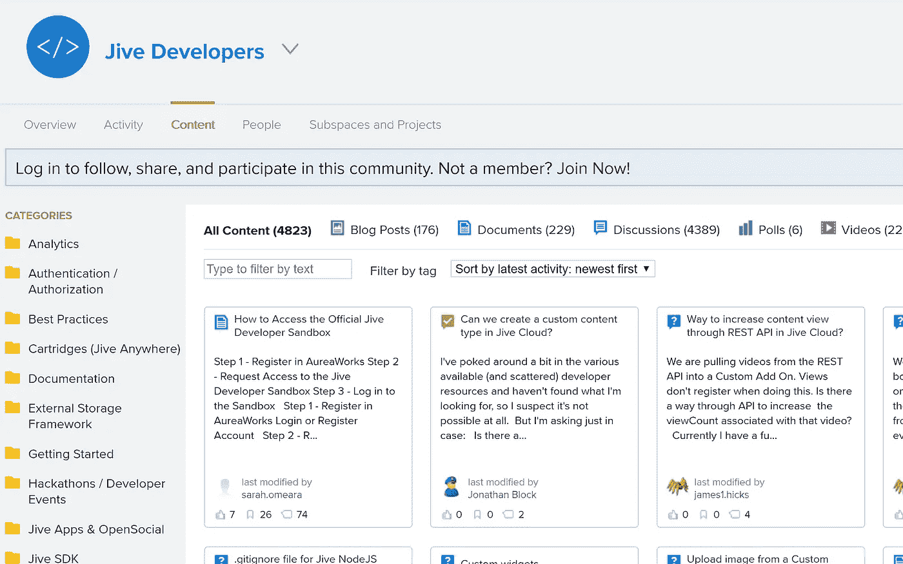
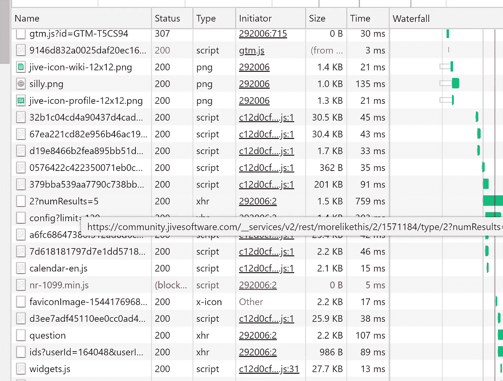
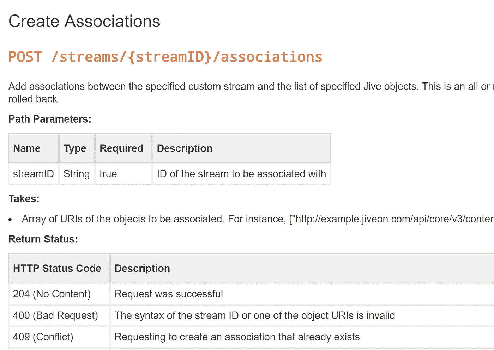

# 一个工程师的成长之道黑进了一个公司的社交网络

> 原文：<https://medium.com/hackernoon/an-engineers-approach-to-growth-hacking-a-corporate-social-network-6727358cc78d>

当你有很多同事时，为什么还要增加你的 Instagram 粉丝呢？

想象一下，你在一家拥有数万名员工的公司。你是如何接触到他们所有人的？通过群发电子邮件密件抄送给他们？与通信部门合作发送时事通讯？

没有。你成为了影响者——相当于你的公司社交网络。😎

几年前，我工作的公司给公司带来了一个叫做 Jive 的新的社交网络工具。虽然 Jive 更倾向于成为一个社区平台，而不是一个文档平台——不像 MediaWiki 或 Confluence 这样的工具——但它能够做到这两者。

几年来，我花了大量时间在内部撰写关于云平台的文档，在博客上直播[技术](https://hackernoon.com/tagged/technology)论坛，发布技术演示的视频和摘要，创建相关主题的讨论(例如，“人工智能会影响呼叫中心吗？”)，并普遍提高对以技术为中心的话题的认识。

到我在该公司的任期结束时，该公司 50，000 名员工中有超过 1/4 的人看过我的内容、看过我的视频或点击过我的链接。

考虑到这一点，让我们深入了解一下我是如何扩大我的内容的覆盖范围和增长的——黑进一个企业社交[网络](https://hackernoon.com/tagged/network)。

# 一点背景:什么是 Jive？

正如我提到的，我使用的社交网络工具是 Jive。除其他功能外，它还具有以下特点:

*   您可以创建组、空间和项目来保存和分割内容
*   您可以创建不同类型的内容，如文档、博客帖子、讨论、投票、事件、视频等
*   用户可以相互关注，选择性地接收平台内和/或电子邮件通知

下面是 Jive 网站上 Jive 开发者空间[的一些内容:](https://community.jivesoftware.com/community/developer)

Content in the Jive Developers space

# 内容是基础

在我开始放大我的内容之前，我首先需要内容。相关内容是企业社交网络世界的关键。这个[加里·维纳查克引用](https://www.garyvaynerchuk.com/biography/)是一个好的开始:

> *“再多的付费媒体也无法将糟糕的创意变成好的内容。”*

这是事实，尤其是在一家大公司，人们受到电子邮件、即时消息、会议、视频电话、实体海报和数字标牌的轰炸。你的内容的相关性会吸引更多的观众。你需要专注于创造真实的、有帮助的、令人难忘的内容。

如果你是工程师，这意味着两件事:有用的技术文档和面向非技术受众的技术信息。

Simple documentation for a dependency I used (Ora)

现在，作为一名工程师，为你的工作编写技术文档是最好的做法，但是你可以通过编写人们*自愿*选择参考的*有用的*技术文档来升级。面向非技术受众的技术信息通常是工程师的致命弱点。但是有一些方法可以让每个人都能开始简单的对话。

# 获得更好的指标

现在你有了内容，下一个问题是它是否有影响。每个企业社交平台都包括某种观众指标。Jive 是我使用的平台，它包含了对你内容的[影响指标](https://docs.jivesoftware.com/8.0_on_prem_int/end_user/jive.help.core/#user/UnderstandingImpactMetrics.html)。

对于你发布的每一条内容，你都可以看到浏览量、点赞数、独立浏览者和评论数。下面是一个文档的影响度量视图:

Impact metrics for a sample document

虽然查看单个文档的这些指标很有帮助，但是查看所有内容的这些指标会更有帮助。我希望能够回答这样的问题:

*   谁是我所有内容的最高观众？
*   哪些内容的点赞/评论/浏览量最多？
*   帖子或话题的年龄与反应之间有什么关联吗？

不幸的是，Jive 不支持这一点。但是 Jive 确实有 v3 API 文档[在这里](https://developers.jivesoftware.com/api/v3/cloud/rest/index.html)。

对于这个特定的项目，我选择了 Node.js，这既是为了降低其他工程师的入门门槛，也是为了提高我对 Node 的了解。在学习了 API 和节点几天之后，我的工具的第一个版本做了以下事情:

1.  通过调用 API 来检查用户名和密码是否有效
2.  通过使用 [/contents](https://developers.jivesoftware.com/api/v3/cloud/rest/ContentService.html#getContents(List%3CString%3E,%20String,%20int,%20int,%20String,%20boolean,%20boolean)) 资源为所需用户检索所有内容
3.  对于每一条内容，检索视图、喜欢、独特的观众等。

An example v2 API call

但这里有一个问题:我上面提到的“影响指标”只能通过一个未记录的“v2”Jive API 访问，并且该公司没有使用[数据导出服务](https://community.jivesoftware.com/docs/DOC-99916)。

与 v3 API 不同，它不支持基本身份验证。但是，它适用于 cookie，因此修改后的步骤是:

1.  通过调用 API 来检查用户名和密码是否有效
2.  通过 POST 请求登录以检索会话 cookie 并存储它以备后用
3.  通过使用 [/contents](https://developers.jivesoftware.com/api/v3/cloud/rest/ContentService.html#getContents(List%3CString%3E,%20String,%20int,%20int,%20String,%20boolean,%20boolean)) 资源为期望的用户检索所有内容
4.  将包含赞数、评论数和浏览量的内容列表保存在 CSV 中
5.  对于每一条内容，检索视图、喜欢、独特的观众等。通过使用未记录的 v2 影响度量 API(将每条内容的唯一查看者总数保存为 CSV，并将每条内容的每个唯一查看者的完全扩展列表保存为 CSV)
6.  保存一个摘要文本文件，其中包含所有内容中唯一查看者的数量、前 10 名唯一查看者以及内容的数量

上面有几个小问题，包括:

*   影响指标仅适用于特定类型的内容
*   您(通常)无法检索其他用户发布的内容的影响指标

在该工具的第一个版本中，我自己处理命令行输入。后来的迭代使用了像[指挥官](https://www.npmjs.com/package/commander)和[奥拉](https://www.npmjs.com/package/ora)这样的软件包来使 CLI 工具更加简洁。

最后，我得到了我想要的指标。我知道谁是我最忠实的读者。我可以看到观点和喜欢的上升趋势。我可以看到哪些科目表现最好。

但是现在我想让数字增长得更快。

# 为连接而连接

“追随追随”或“f4f”的想法在社交媒体时代已经很老了，但在企业社交网络世界中还没有它的时代！或者至少这是我下一步行动的前提。😉

The Jive /streams resource

我的工作理论是，类似于脸书、Instagram 和其他社交网络，如果你在 Jive 上关注很多人，他们中的一部分人会关注你。使用 Jive v3 API，做到这一点非常容易。例如，您可以调用 [/streams](https://developers.jivesoftware.com/api/v3/cloud/rest/StreamService.html#addAssociations(String,%20String)) 资源来创建“关联”并跟踪用户。

我还希望能够取消关注用户，因为这将允许我稍后重试，并再次出现“新关注者”通知。当然，这也有助于遵循社交媒体保持良好比例的智慧。😆

1.  根据标志，以跟随或不跟随模式开始。通过另一个标志，跟随/取消跟随一个用户或使用列表
2.  通过调用 API 来检查用户名和密码是否有效
3.  保存我关注的用户的当前列表
4.  如果是列表，浏览并执行所需的跟随/取消跟随操作
5.  在处理过程中，将新的关注或取消关注保存在一个文本文件中(这主要是为了以后能够从该列表中取消关注)

为了进一步完善这个过程，我使用了我以前构建的 CLI 工具来从内部目录中检索用户列表。这意味着我可以选择“关注 X 城市的所有用户”或“取消关注 Y 部门的用户”

结果？我追随了数千人，作为回报，我获得了数百名追随者，轻而易举。🍰

# 外卖食品

许多公司仍然主要依靠几十年前的工具来接触大量受众，如企业通信电子邮件或季度市政厅。在大公司进行一对多的对话尤其困难。

企业社交网络虽然在原始协作方面可能效率较低，但却能让普通员工创建一对多的对话。通过将有用的内容与简单的工程技术结合起来，我可以绕过传统的渠道，对各种主题有更大的影响力。

这是一个实际的例子，可以表述为“重要的不是你知道什么，而是谁了解你”，这是对更常见的格言的修改。Instagram 影响者知道这一点。LinkedIn 的领导人知道这一点。

但是企业界还不知道，这意味着一个有时间的工程师可以拥有它。

如果你喜欢这篇文章，请告诉我，并与他人分享！

*如果你有兴趣接触，我在* [*LinkedIn*](https://go.mattj.io/MedFooter-MyLI) *，*[*Twitter*](https://go.mattj.io/MedPost-MyTw)*，*[*GitHub*](https://go.mattj.io/MedPost-MyGH)*，Medium 等许多平台上。*