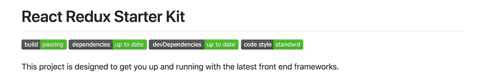

# 一个非常不错的产品就绪型 React/Redux 启动项目

> 原文：<https://medium.com/hackernoon/an-extremely-decent-react-redux-starter-project-7242d150cea2>

## 使用监控的当前依赖项和 TravisCI

 [## btg 5679/反应还原生产启动器

### react-Redux-prod-starter-react js/Redux 生产就绪项目基础

github.com](https://github.com/btg5679/react-redux-prod-starter) 

这个项目的主要目标是为您使用(但不限于)ReactJS 和 Redux 构建生产就绪的应用程序提供一个坚实的基础。它应该足够灵活，可以让你根据自己的需要进行定制，而且在例子和假设方面也有意做到简洁。起始项目越固执己见，就越难扩展。

如果你和我一样，每次开始一个新项目，你都会发现自己在重复相同的步骤，创建相同的模板代码。有时候家务本身会摧毁你的动力。我希望这个入门项目可以减轻你的负担，让你更快地做你喜欢的事情——**编码**！

# 图书馆

*   反应堆
*   Redux
*   带有开发和生产配置文件的 Webpack 4
*   连接的反应路由器
*   巴比伦式的城市
*   埃斯林特
*   阿佛洛狄忒

在 [README.md](https://github.com/btg5679/react-redux-prod-starter/blob/master/README.md) 中有更多的文档。

让我知道你的想法，如果你注意到一些需要修复或可以改进的地方，提交一份公关！在推特[上给我一个关注](http://twitter.com/_bengarrison)并保持关注！