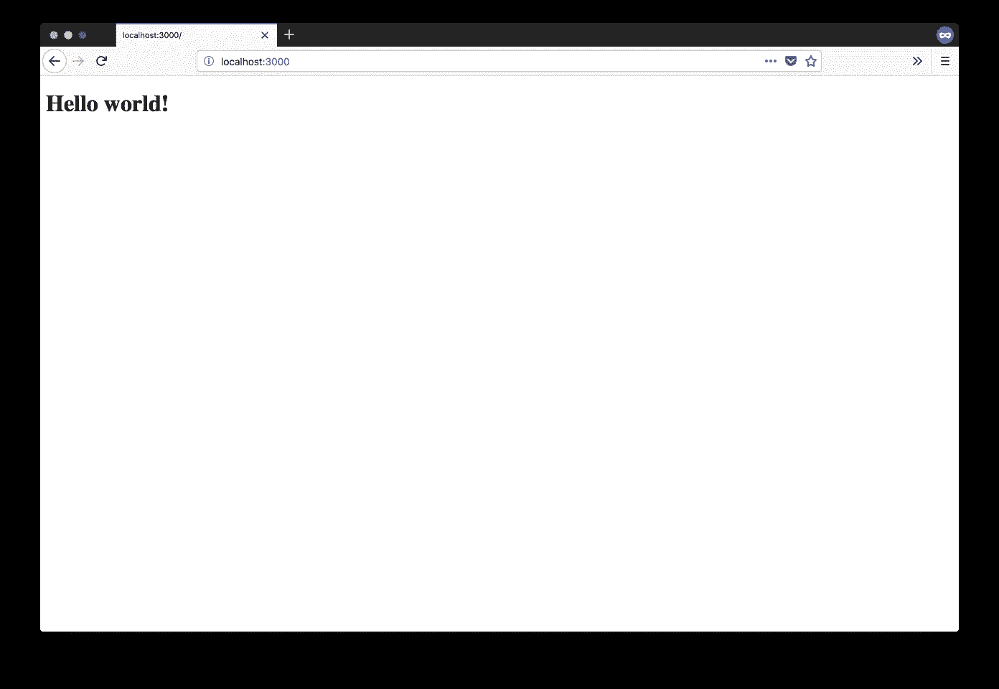
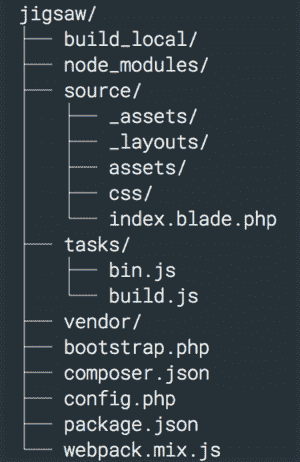
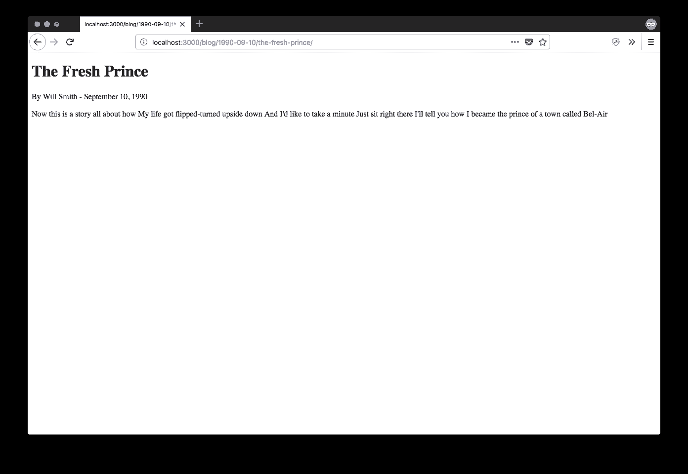

# 一个极其挑剔的开发人员对 PHP 静态站点生成器的看法:第 2 部分——Jigsaw

> 原文：<https://medium.com/hackernoon/an-extremely-picky-developers-take-on-static-site-generators-for-php-part-2-jigsaw-b21a17f9b80e>


在系列的第一篇文章[中，我们看了一下](https://www.contentful.com/blog/2018/04/04/an-extremely-picky-developers-take-on-php-static-site-generators-part-1-sculpin/?utm_campaign=php-ssg-developer-review-jigsaw&utm_medium=referral&utm_source=medium&utm_content=php-ssg-developer-review-jigsaw&utm_term=) [Sculpin](https://sculpin.io/) ，这是目前 Github 上最受关注的 PHP 静态站点生成器。今天我们将探索 [Jigsaw](https://jigsaw.tighten.co/) ，这是一款有望将基于 Laravel 的方法引入 PHP 静态站点生成器(SSG)世界的工具。

老实说，我不是 Laravel 的最大用户。我欣赏它为 PHP 所做的一切，以及它如何在旧框架难以跟上来自其他平台的创新的时候帮助推动 PHP 开发的世界。这也是 PHP 世界中发生的一个很好的交叉授粉的例子:它使用了 Symfony 世界、PHP 联盟、Doctrine 等等的包。这是一个很好的教训，在伟大的基础上建立一些很酷的东西，而不必不断地重新发明轮子。总的来说，我认为 Laravel 是一个优秀的框架，但我对它毫无经验。如果你认为我忽略或误判了某些事情(包括 Laravel 和 Jigsaw 相关的)，请随时在 Twitter 上联系我:建设性的批评总是受欢迎的！

# 拼图(~900★)

就像我对 Sculpin 所做的那样，我将直接进入操作，所以让我们创建一个示例项目并使用它！我们将打开[官方文档](http://jigsaw.tighten.co/docs/installation/)并从那里开始。

与 Sculpin 不同，Jigsaw 没有提供一个我们可以用作快速入门的框架项目。相反，我们必须创建一个普通的项目，添加`tightenco/jigsaw`作为依赖项，并使用它的 CLI:

```
mkdir jigsaw-example && cd jigsaw-example
composer require tightenco/jigsaw
./vendor/bin/jigsaw init
```

让我们看一下刚刚生成的默认目录结构。在顶级目录中，我们有一个代码为的`config.php`:

```
<?php

return [
    'baseUrl' => '',
    'production' => false,
    'collections' => [],
];
```

我还不确定这是什么意思，但是清楚地放置一个配置文件似乎是一个好方法👍。第二个 PHP 文件叫做`bootstrap.php`，它是空的(只有一些注释掉的代码)，但是它暗示了我们如何在某些时候使用事件系统。

我们也有 Javascript 依赖。我看到一个`webpack.mix.js`，它让我知道正在使用 [Laravel Mix](https://laravel.com/docs/5.6/mix) 。所以我运行`npm install`,与此同时，我将浏览文档，试图更多地理解我正在做的事情😉。

大约 10 个依赖项和 300MB 在`node_modules`之后，我们回来了。现在，让我们尝试建立我们的网站。看来我们有两种方法可以做到这一点:我们可以使用 Jigsaw CLI 来构建并提供服务，或者使用 npm 及其由 Browsersync 提供的实时重新加载功能:

```
# With Jigsaw CLI
./vendor/bin/jigsaw build
./vendor/bin/jigsaw serve # localhost:8000

# With npm
npm run watch # localhost:3000
```

不管怎样，工作和你得到这个！



自然，只有约翰·奥利弗能真正传达我对这一页的反应。


# 目录结构

现在让我们来研究一下之前生成的框架项目。我们探索项目各部分的顺序可能看起来是随机的，因为，事实就是如此。这就是发现新事物的酷之处，对吧？探索阶段，你偷看这个，看看那个，哦，一个`source`目录！其中蕴含着什么？



作为一个基于 Laravel 的项目，我发现一个包含闪亮的 *Hello world 的`index.blade.php`文件并不奇怪！*从上面。`@extends('_layouts.master')`指令提示我应该在`_layouts`目录中寻找一个`master.blade.php`模板，瞧，它就在那里。模板看起来一切都很好，让我们看看资产是如何处理的。

# 资产和配置

Laravel Mix 提供了对 Sass 的现成支持，因此`source/_assets/sass/main.scss`是您的起点。SCSS 可能不是 CSS 领域最新最闪亮的东西，但它经过了战斗的考验，肯定能完成任务，所以我赞成它的加入。让我们把这一页变成能引起你注意的东西

```
/* source/_assets/sass/main.scss */
$bg-color: red;

body {
  background-color: $bg-color;
}
```

让我们点击保存，webpack 应该会变魔术，把我们的背景变成红色，对不对？是的，它是！为了你的眼睛着想，我就不截图了，现在我们继续探索。

我想建立一个基本的博客，用 Markdown 文件写文章。为此，让我们引入[集合](http://jigsaw.tighten.co/docs/collections/)的概念，正如文档所述，*让您能够在聚合级别访问您的内容*。听起来很适合写博客。还记得之前的`config.php`文件吗？让我们调整一下，告诉 Jigsaw 我们收集的博客帖子:

```
<?php

return [
    'baseUrl' => '',
    'production' => false,
    'collections' => [
        'posts' => [
            'path' => 'blog/{date|Y-m-d}/{filename}',
        ],
    ],
];
```

Jigsaw 将为我们定义的每个集合寻找相应的目录。在我们的例子中，`posts`将变成`source/_posts`，所以让我们在那个目录中创建一个博客帖子来表达我们对有史以来最伟大的歌曲之一的热爱。

```
---
extends: _layouts.post
title: The Fresh Prince
author: Will Smith
date: 1990-09-10
section: content
---Now this is a story all about how
My life got flipped-turned upside down
And I'd like to take a minute
Just sit right there
I'll tell you how I became the prince of a town called Bel-Air
```

让我们把这个文件保存为`the-fresh-prince.md`，然后按照前面的`extends`部分指定的那样创建合适的模板:`source/_layouts/post.blade.php`。

```
@extends('_layouts.master')

@section('body')
<h1></h1>
    <p>By  - </p>

    @yield('content')
@endsection
```

让我们运行`./vendor/bin/jigsaw build`，我们会有一个漂亮的`build_local`目录，这个目录是用我们闪亮的网站生成的，所以让我们打开 URL(我们仍然需要自己构建)然后…它工作了！



(作者注:在这一点上我想添加更多的 gif，但我必须保持专业。让我们都假装有一张杰克·佩拉尔塔的 GIF 照片，照片上他说*noise*，谢谢。)

# 竖锯满足了吗？

我们已经介绍了一些基础知识，那么现在是最重要的问题:Jigsaw 内容丰富了吗？当然，我的意思是存储在 Contentful 中的内容可以多么容易地集成到一个 Jigsaw 支持的网站中。我们打开关于事件监听器的[文档页面，在标签中打开该页面，我们可以尝试一下。还记得`bootstrap.php`吗？它包含一些注释掉的代码，暗示了事件是如何工作的，所以让我们重新开始:](http://jigsaw.tighten.co/docs/event-listeners/)

```
<?php

use TightenCo\Jigsaw\Jigsaw;

/** @var $container \Illuminate\Container\Container */
/** @var $events \TightenCo\Jigsaw\Events\EventBus */

/**
* You can run custom code at different stages of the build process by
* listening to the 'beforeBuild', 'afterCollections', and 'afterBuild' events.
*
* For example:
*
* $events->beforeBuild(function (Jigsaw $jigsaw) {
*     // Your code here
* });
*/
```

好的，看起来相当容易。作为额外的帮助，在谷歌搜索之后，我找到了一篇关于用 Jigsaw 创建网站地图的[文章](https://mattstauffer.com/blog/adding-an-auto-generated-sitemap-to-your-jigsaw-based-static-site/),以及事件特性的原始 [pull 请求](https://github.com/tightenco/jigsaw/pull/189),所以我有足够的信息来解决这个问题。咱们`composer require contentful/contentful`一起黑这个东西吧！

```
// In bootstrap.php

require_once 'contentful_fetcher.php';
$events->beforeBuild(ContentfulFetcher::class);

// In contentful_fetcher.php

use Contentful\Delivery\Client;
use Contentful\Delivery\Resource\Entry;
use TightenCo\Jigsaw\Jigsaw;

class ContentfulFetcher
{
    /**
     * Jigsaw requires either a callable or the name of
     * a class which implements a method called "handle"
     *
     * @param Jigsaw $jigsaw
     */
    public function handle(Jigsaw $jigsaw): void
    {
       // Let's only build for production
        if ($jigsaw->getEnvironment() === 'local') {
            return;
        }

        $client = $this->getClient($jigsaw);

        foreach ($jigsaw->getCollections() as $collection) {
            $this->cleanSourceDir($jigsaw, $collection);
            $entries = $this->getPlainEntries($client, $collection);

            foreach ($entries as $entry) {
                $this->writeEntryToMarkdownFile($jigsaw, $entry, $collection);
            }
        }
    }

    private function getClient(Jigsaw $jigsaw): Client
    {
        return new Client(
            $jigsaw->getConfig('contentful.accessToken'),
            $jigsaw->getConfig('contentful.spaceId')
        );
     }

    /**
     * Before every run, we remove the previous contents of the source directory.
     */
    private function cleanSourceDir(Jigsaw $jigsaw, string $collection): void
    {
        $dir = $jigsaw->getSourcePath().'/_'.$collection;
        $jigsaw->getFilesystem()->deleteDirectory($dir, true);
    }

    /**
     * We transform objects of type Contentful\Delivery\Resource\Entry
     * into plain arrays for ease of use later on.
     */
    private function getPlainEntries(Client $client, string $collection): array
    {
        // Convention:
        // Every defined collection corresponds to a content type ID in Contentful
        $query = (new Contentful\Delivery\Query())
            ->setContentType($collection)
        ;
        $entries = $client->getEntries($query);

        if (!count($entries)) {
            return [];
        }

        /** @var Contentful\Delivery\Resource\ContentType $contentType */
        $contentType = $entries[0]->getContentType();

        return \array_map(function (Entry $entry) use ($contentType) {
            // Convention:
            // The content types may contain a field called body,
            // which will be used as the markdown content of the generated file,
            // so we give it a default value
            $plainEntry = [
                'id' => $entry->getId(),
                'body' => '',
            ];
            foreach ($contentType->getFields() as $field) {
                $plainEntry[$field->getId()] = $entry->get($field->getId());
            }

            return $plainEntry;
        }, $entries->getItems());
    }

    /**
     * Converts an entry into a markdown file and writes it to disk.
     */
    private function writeEntryToMarkdownFile(Jigsaw $jigsaw, array $entry, string $collection): void
    {
        $contents = '---
extends: _layouts.'.$collection.'
section: content
';
        $body = '';
        foreach ($entry as $field => $value) {
            if ($field === 'body') {
                $body = $value;

                continue;
            }
            $contents .= $field.': '.$value."\n";
        }

        $contents .= '---'."\n\n".$body;

        $path = sprintf('_%s/%s.md', $collection, $entry['id']);
        $jigsaw->writeSourceFile($path, $contents);
    }
}
```

这段代码与其说是完整的实现，不如说是概念的证明(它非常依赖于约定，并且缺少对特殊字段(如位置、链接等)的处理)；然而，对于一个基本的例子来说，它应该可以完成工作。

首先，我们将一个完全限定的类名(FQCN)传递给`$events->beforeBuild()`，Jigsaw 将知道它必须创建该类的一个实例，并执行它的`handle`方法。说实话，我认为应该有一个接口，以便有一个更强的契约，就像这样:

```
namespace TightenCo\Jigsaw;

use TightenCo\Jigsaw\Jigsaw;

interface EventHandlerInterface
{
    public function handle(Jigsaw $jigsaw);
}
```

或者可能只需要任何有效的可调用对象(因此包括实现`__invoke`的对象)。它在目前的状态下工作，但我喜欢强合同，你现在应该知道我很挑剔——这是系列的标题！

这是对`ContentfulFetcher`实际功能的概述:

*   如果检测到`local`环境，整个过程将停止。这样做是为了避免性能影响，因为每次构建时都必须从 Contentful 获取所有数据(如果在监视模式下运行，这可能非常频繁)。想法是首先运行一个`./vendor/bin/jigsaw build production`来获取所有内容，然后用本地存储的内容进行操作。当然，一个好主意是将生成的文件添加到本地`.gitignore`，以避免将它们保留在版本控制中(内容不属于那里)。
*   我们使用 Contentful Delivery SDK for PHP 创建了一个客户机对象的实例。
*   我们遍历所有已定义的集合，并使用约定将本地集合映射到 Contentful 中的内容类型 ID。然后我们清理相应的目录，在那里我们将转储生成的文件。
*   我们获取给定内容类型的条目，并使用`Contentful\Delivery\Resource\ContentType`对象获取字段列表。利用这些字段，我们构建了适当的 YAML 前端内容部分，然后我们在末尾添加了主体(这里的字符串处理非常基本，还可以改进)。
*   我们最后转储生成文件的内容。我们使用 Contentful ID 来保存它们，因为我们可以在配置集合时定义一个漂亮的 URL。

有很多胶合正在进行，但它的工作对我的 machine™️.通过更灵活的配置，这可以做得更好一千倍，但作为概念验证，我对此相当满意。

# 裁决

在我们的最终裁决之前，我想公平地提一下，在写这篇文章的过程中，我经历了几个问题，这些问题后来都被解决了。在发布之前，我联系了 Matt Stauffer(Jigsaw 的幕后人员之一)，并解释说我在处理资产和事件时遇到了一些困难(前者配置错误，后者缺少文档)。经过一个周末，这两个问题都得到了解决👏

我很喜欢 Jigsaw，但它的开箱即用配置相当简单。与 Sculpin 不同，它没有假设您将对它有什么样的用途，这是一把双刃剑:它避免了混乱并给了您完全的控制权，但它也为简单的用例(如 blog)创建了更高的准入门槛。

为了解决这个问题，马特向我透露，他们正在用网站框架构建一个生成器，以解决最常见的需求(如博客、文档网站等)，用一个 [Github 问题](https://github.com/tightenco/jigsaw/issues/236)来跟踪进展。他还提到他们刚刚推出了一个新的用 Jigsaw 构建的网站展示，我鼓励你去看看。

作为一名非 Laravel 开发人员，我担心 Jigsaw 很难上手和使用，但事实绝对不是这样。它正在积极开发中(events 系统是几个月前才添加的),按照 Github 上的 stars，它有望迅速成为最受欢迎的 PHP 静态站点生成器。它提供了非常好的默认值，并且资产被预先配置为使用现代的堆栈(CSS 使用 Sass，JS 使用 webpack with Babel)。

我能提出的唯一真正的批评实际上和我讨论 Sculpin 时一样:内容和表示(资产和模板)可以更加分离；相反，它们属于同一个`source`目录，我希望能够有一个更明确的集合结构，而不是在实际降价内容之前完全依赖 YAML 位。

下一篇文章将是关于 [Couscous](http://couscous.io/) ，它将自己描述为一个文档生成器。敬请期待！

*原载于 2018 年 8 月 1 日*[*www.contentful.com*](https://www.contentful.com/blog/2018/08/01/extremely-picky-developers-take-php-static-site-generators-part-2-jigsaw/)*。*