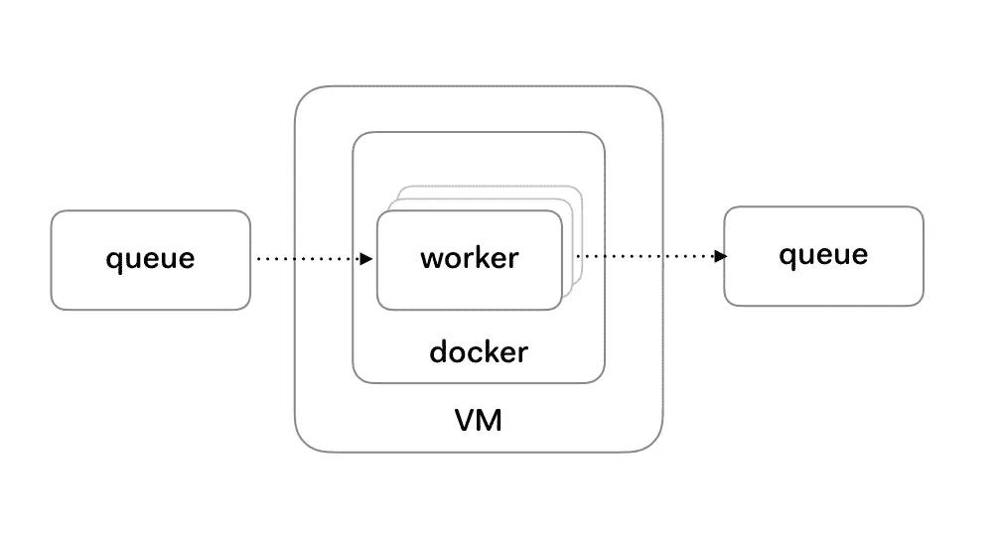

# 深入了解 Terraform 的 100%零停机部署

> 原文：<https://medium.com/hackernoon/an-in-depth-look-at-100-zero-downtime-deployments-with-terraform-checkly-58cdda2784e8>


“Sailing on a Blue Ocean” by Shotei Takahashi (1871–1945) — [Japanese Open Art Database](http://www.jaodb.com/db/ItemDetail.asp?item=38681)

在 Checkly，我们在 Terraform 管理的 AWS EC2 实例上运行我们的[浏览器检查](https://checklyhq.com/docs/browser-checks/quickstart/)。在发布新版本时，我们不想中断服务，因此我们需要零停机部署。Hashicorp】有他们自己的关于零停机升级的文章，但它只介绍了 Terraform 配置，而没有很多在现实生活中实际实现该配置所需的上下文、工作流程或其他细节。

这是自发布以来，我们在生产中对大约 150 万基于 Chrome 的浏览器进行检查的全部内幕。

# 问题

对于那些对“作为代码的基础结构”和“不可变基础结构”不太熟悉的人，让我们更仔细地看看这个问题。您将会看到，您必须以特定的方式构建您的应用程序，并准备好一些特定的中间件(即队列)才能从这种方法中受益。如果你是一个头发花白的老兵，跳过这一步。

你可以把这个问题分成许多部分。有些与地形有关，有些与地形无关，但它们都需要在不打扰用户的情况下完成。

举个例子，这个应用可以被定义为一个“工作者”。工作者基于工作队列处理传入的请求。在[架构](https://checklyhq.com/blog/2018/08/an-in-depth-look-at-100-zero-downtime-deployments-with-terraform/#architecture)部分会有更多相关信息。现在，让我们看看我们对员工和员工部署流程的要求:

**架构问题**

1.  工人应该是“可杀死的”,而不影响用户体验。
2.  多个版本的工人应该能够共存。
3.  工人应该独立升级。

**部署问题(由 Terraform 解决)**

1.  新工人一旦准备好就应该开始接受生产工作。
2.  只有当新员工开始工作并接受工作时，才能终止旧员工。
3.  拙劣的版本应该会停止推出。
4.  它应该在多个 AWS 区域上工作。

**操作问题**

1.  新工人应该自动加入你的监控库。
2.  拙劣的发布应该会触发警报。

其中一些问题应该在推广过程中解决，而其他问题应该在您的应用程序架构中解决。

# 建筑

上面提到的一些问题可以通过遵循典型的扇出/扇入模式或主/工作模式来解决。这对于 Checkly 用例特别有用，因为用户不直接与工作人员交互。



在 Checkly 的例子中，架构如下:

1.  cron 进程将支票推送到 SQS 队列。每张支票都是一条 JSON 格式的消息，代表客户账户中一张支票的一次运行。
2.  工作人员订阅队列。每个 EC2 实例有 5 个活动的工作线程。worker 是 Docker 容器中的 Node.js 进程。Docker 不是必需的，但是它使部署变得更容易，这一点你将在下一章中看到。工人使用 [SQS 消费者图书馆](https://github.com/bbc/sqs-consumer)。当一个作业完成时，它调用一个`done()`回调，从队列中删除消息。
3.  如果工作没有成功完成，`done()`回调就不会被调用，或者调用时出现错误`done(err)`。这触发了 SQS 特有的行为，消息在队列中再次可见，其他工作人员可以拾取它。这是关键，因为我们现在可以自由地杀死一个工人而不会错过任何工作。这是一个 SQS 函数，但是几乎任何排队平台都有。
4.  如果工作成功完成，结果将被发送到另一个队列进行处理和存储。

应用这种模式解决了与模式固有的负载平衡和解耦属性相关的架构问题。当然，这种模式也允许非常容易的伸缩。更多消息===更多工人。

此外，这还允许基于负载特征的**自动伸缩**，比如队列中的消息数量(以及它们的相对年龄)或者 EC2 实例的 1m、5m 和 15m 平均负载。这是因为向上扩展很容易，但是在不打扰用户或影响您的服务的情况下向下扩展要困难得多。解决部署的这个问题也解决了自动扩展的问题。一石二鸟。

> *用于任何远程有状态或交互的东西(即具有会话状态、数据源等的 API / Web 服务器)。)如果没有类似请求排出、基于粘性会话的路由或中央会话存储，这种模式几乎就是一个 nogo。*

# Terraform 模块和配置

如前所述，Terraform 为您提供了两个原语来实现零停机部署。

*   `lifecycle`配置块中的`create_before_destroy`标志。有点不言自明。在新服务器上线之前，你不能关闭现有的服务器。
*   `local-exec`或`remote-exec`供应器。这将执行一个命令。当它返回时，Terraform 继续其计划执行。

您将会发现，要在多个地区实现这一目标，您还需要一系列其他东西。让我们看看 Checkly 的. tf 文件中的`aws_instance`配置。

```
// workers/module.tf

resource "aws_instance" "browser-check-worker" {
  ami = "${data.aws_ami.default.id}" // AWS Linux AMI
  instance_type = "${var.instance_type}"
  count = "${var.count}"
  tags {
    Name = "browser-check-worker-${count.index}"
    Version = "0.9.0",
    Env = "${var.env}" // prod or test
  }
  user_data = "${var.user_data}" // User data pulls & starst the app

  key_name = "checkly"

  lifecycle  {
    create_before_destroy = true
  }

  // Every 5 seconds, check if the launcher.js process is up.

  provisioner "remote-exec" { 
    inline = [
      "until ps -ef | grep [l]auncher.js > /dev/null; do sleep 5; done"
    ]

    connection {
      type     = "ssh"
      user     = "ec2-user"
      private_key = "${file("~/.ssh/checkly.pem")}"
    }
  }
}
```

该文件的一些要点:

1.  我们可以调整 AMI 类型、实例类型和每个区域的总实例数。
2.  我们用每个 EC2 实例运行的代码版本来明确标记它。
3.  我们引入一个`user-data.yml`文件来引导应用程序。更多详情见下文。
4.  我们提供了一个 SSH 密钥，这样我们就可以连接到实例。

回报在于使用`remote-exec` provisioner(它使用 SSH 密钥)。它每 5 秒检查一次`launcher.js`进程是否正在运行。注意我们使用`grep [l]auncher.js`语法从进程列表中排除 grep 命令本身。不这样做将会立即返回这个命令并破坏整个目的。

不可否认，这是相当简单的，但是对于我们的用例来说，这正是我们所需要的。启动器进程的存在意味着我们的代码正在运行，它已经准备好从 SQS 队列中读取新消息。

为了充分理解这一点，我们需要查看一个用户数据文件。

```
#cloud-config
packages:
  - docker

write_files:
  - path: /root/.profile
    owner: root:root
    permissions: '0644'
    content: |
      # ~/.profile: executed by Bourne-compatible login shells.

      if [ "$BASH" ]; then
        if [ -f ~/.bashrc ]; then
          . ~/.bashrc
        fi
      fi

      export NODE_ENV=production
      export AWS_REGION=ap-south-1    
      export WORK_QUEUE=https://sqs.ap-south-1.amazonaws.com/xxxx/checks
      export RESULTS_QUEUE=https://sqs.ap-south-1.amazonaws.com/xxxx/results
runcmd:
  - service docker start
  - [., /root/.profile]
  - [docker, login, -u, checkly, -p, "pwd"]
  - [docker, pull, "checkly/browser-checks-launcher:latest"]
  - . /root/.profile && docker run -d -e NODE_ENV=$NODE_ENV ... checkly/browser-checks-launcher:latest
```

1.  我们将`docker`包作为一个要求。我们用的 AWS AMI 预装了 Docker，但是谁知道…
2.  我们创建一个`.profile`文件，其中包含我们的工作人员需要操作的必要环境变量，比如它与之通信的两个队列的地址、它服务的区域以及它工作的环境(生产或测试)。
3.  在启动时，我们启动 Docker 并登录到我们的私有 Docker repo。我们取出我们工人的最新图像，并`docker run`传入所有的环境变量。

请记住，从 Terraform 的角度来看，这些都没有标志着我们的新实例已经“完成”。`remote-exec`命令只在 docker 容器完全运行并启动相关节点进程后返回。

结果如下所示:


请注意，这个过程相当普通。你可以对任何 Dockerized 应用程序或任何 Ruby、Python、Java 等应用程序做同样的事情。

AWS 多区域地形配置对于 AWS 如何管理命名、资源、访问等非常具体。每个地区。我们也有数字海洋的地形配置，它们使实现这一目标变得更加简单。我们利用这篇博文中描述的地形策略[。](/@ctindel/multi-region-aws-app-deployments-with-terraform-modules-859c9ecb64f4)

要掌握的主要事情是，对于每个 AWS 区域，您在您的`main.tf`文件中创建一个模块，并使用`source`属性引用 a 模板。

```
// main.tf

module "workers-us-east-1" {
  source = "workers"
  region = "us-east-1"
  count = 1
  user_data = "${file("user-data-us-east-1.yml")}"
  env = "prod"
}

module "workers-us-west-1" {
  source = "workers"
  region = "us-west-1"
  count = 3
  user_data = "${file("user-data-us-west-1.yml")}"
  env = "prod"
}
```

这利用了 Terraform 的模块层次结构，并允许您针对不同的区域使用不同的变量。更重要的是，它允许用一个命令部署到多个区域。

> 但是为什么要创建新的实例呢？worker 被发布为 Docker 容器，难道我们不能拉一个新的容器，循环旧的容器，然后结束它吗？是的，那行得通。我们一直在开发过程中使用它。但是，对于生产，我们希望确保配置没有因手动干预而漂移

# 部署工作流程

设置好所有这些之后，我们如何发布我们 worker 的新版本呢？一般来说，步骤如下:

首先，我们构建一个新的 Docker 容器。将其标记为最新，并将其推送到我们的私人回购。这里没什么特别的。

其次，我们更新我们的`module.tf`文件中的版本。

然后，我们使用 Terraform `taint`命令强制执行创建/销毁循环。为什么？因为 Terraform 没有办法知道我们想要拉一个新的容器。仅仅修改版本不足以触发 EC2 实例的替换。

```
terraform taint -module=runners-us-west-1 aws_instance.browser-check-worker
```

注意，`-module`根据`main.tf`文件中的模块声明将 AWS 区域作为目标。从这里开始，这是一个简单的`terraform plan`和/或`terraform apply`，✨看到了零停机时间的魔力。✨

不需要天才就能看出，这可以很容易地转换成在 CI/CD 平台上运行的脚本。它遵循以下一般模式:

*   建设
*   试验
*   包裹
*   部署
*   班长

其中每个阶段可以中断并将控制返回给操作者。当这种情况发生时，你的 CI/CD 平台可能会给你发一封电子邮件。

# 监视

以上所有方法都可能失败。失败的原因可能很迟钝，比如 AWS 改变了一些 API(破坏了 Terraform)，你的错误代码，或者仅仅是星期五下午。一般来说，失败分为两类:

1.  **部署失败**。这些既容易又棘手。首先，它们在您部署时出现。您的 Terraform 命令返回错误。这可能会使您的多区域部署处于不确定状态。我建议以这样一种方式编写您的代码，使您的应用程序能够处理这种情况。另一种方法是完全回滚，这可能会更加困难。可能需要一些手工操作。
2.  **代码故障**。您的新版本可能会部署甚至启动良好。它只是可能在开始接收流量时由于一些逻辑错误而失败。为此，您应该使用错误跟踪服务(如 Sentry、Bugsnap 或 Rollbar)来检测您的代码。其次，我强烈建议在 x 时间内“当什么都没发生时”触发某种警报。举个例子，我们运行[appoptics.com](https://appoptics.com/)(以前的 Librato)，当某个特定区域的工人“什么都没发生”时，它会提醒我们。


请注意，这只是因为我们的代码在每次运行时都显式地调用了 AppOptics API，以及一些关于 worker 正在哪个区域运行的基本细节，使用下面的代码。

```
const *axios* = *require*('axios')

*axios*.defaults.*baseURL* = `https://${*config*.appOptics.apiToken}@api.appoptics.com/v1`

const *namespace* = 'checkly'

const trackRunCount = function () {
  const *payload* = {
    *tags*: {
      *region*: process.*env*.AWS_REGION || 'local'
    },
    *measurements*: [
      {
        *name*: `${*namespace*}.browser-check-worker.count`,
        *value*: 1
      }
    ]
  }
}
```

这也是我们的具体情况，因为用户不直接与工作人员交互。在典型的客户机/web 服务器场景中，500 个错误或缺少 200 个响应代码可以作为类似的触发。最后，**您需要确定您的应用程序正在成功处理用户请求，而不管您的部署是否成功**。

Terraform 还[提供了大量的监控提供者](https://www.terraform.io/docs/providers/type/monitor-index.html)，你可以把它们钩入你的部署程序。如果您有特定的监控解决方案，请使用它。

# 结论

在不造成服务中断的情况下，使用 Terraform 进行零停机部署比仅仅使用正确的 Terraform 命令和配置要复杂得多。要点是:

*   您的体系结构决定了实现零停机部署的难易程度。
*   有效的基础设施不等于有效的服务。
*   一切都有可能中断，请在基础架构和服务级别使用监控。
*   当事情发生时，将需要人类。

【checklyhq.com】最初发表于[](https://checklyhq.com/blog/2018/08/an-in-depth-look-at-100-zero-downtime-deployments-with-terraform/)**。**

*附:如果你喜欢这篇文章，请用**鼓掌**来表达你的欣赏👏下面还有 [**在 Twitter 上关注我**](https://twitter.com/tim_nolet) **！**但是等等，还有更多！*

*[](https://checklyhq.com)*