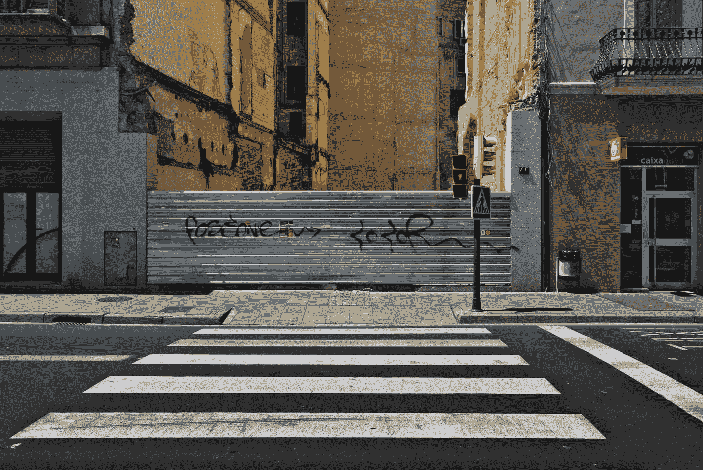
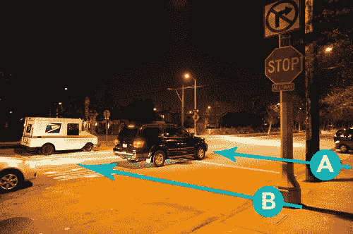
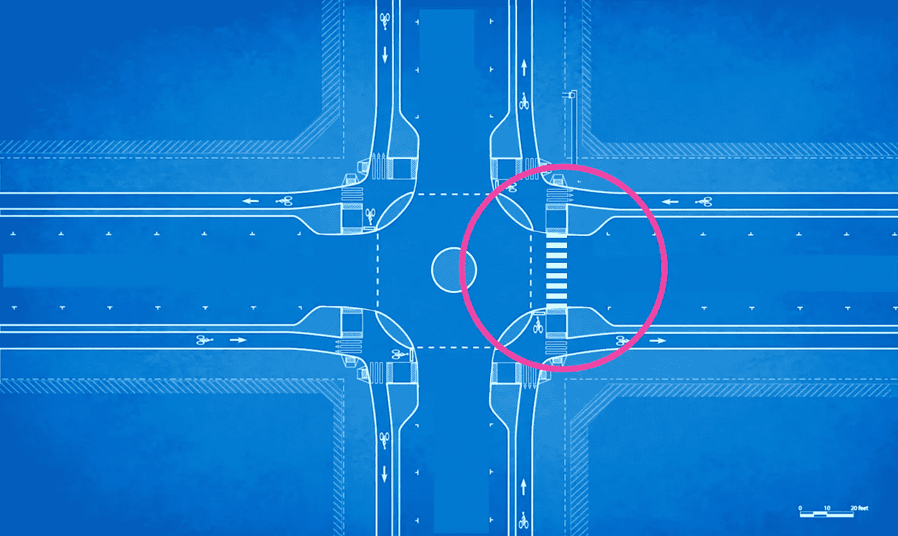
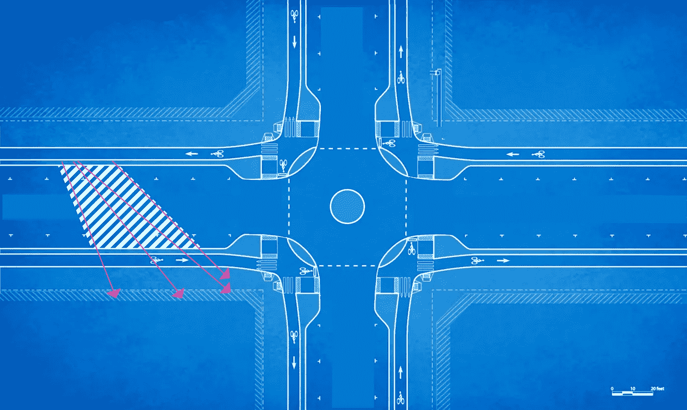
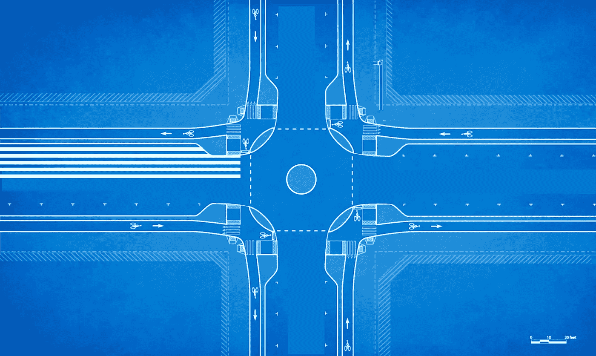
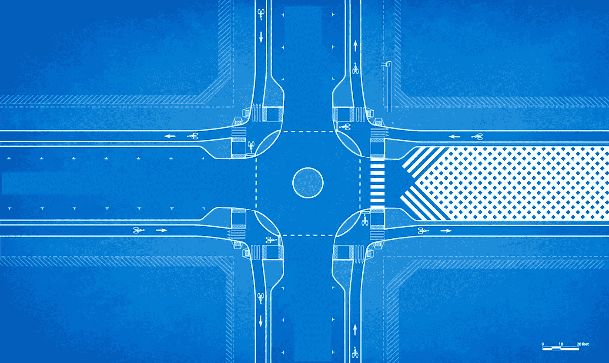
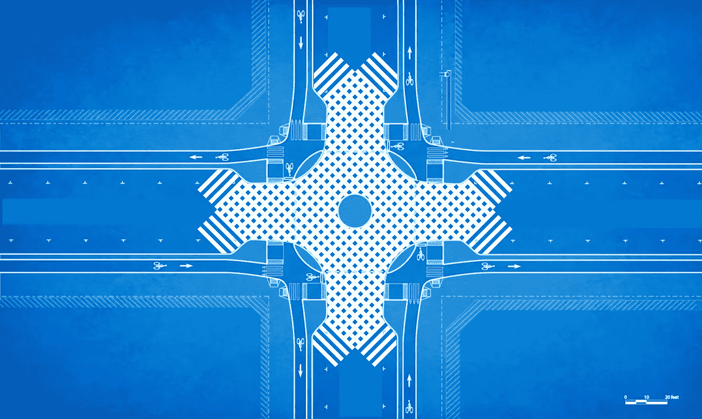
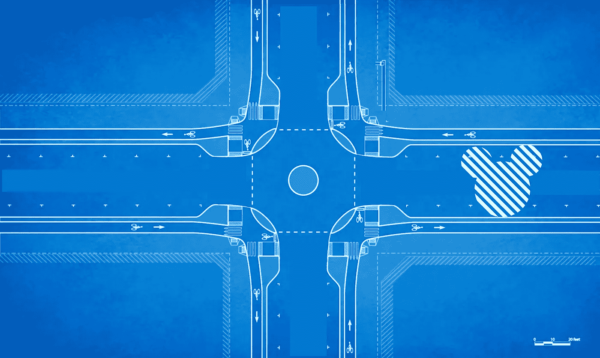

# 关于行人的一个难以忽视的事实

> 原文：<https://medium.com/hackernoon/an-inconvenient-truth-about-pedestrians-f843c48139d6>

[https://urbanphotomag.wordpress.com/category/empty-streets/](https://urbanphotomag.wordpress.com/category/empty-streets/)

问你一个问题:当你等待穿过像下面十字路口的车辆时，你是走 A 路走在前面，还是走 B 路走在后面？

作为一名行人和司机，看到有人在车辆前横穿马路让我感到愤怒。在停车标志处，在车道上，在停车场，甚至在交通灯路口，当你知道灯要变了。只要可行，我就跟在领头车后面。

这不仅仅是因为领头车需要关注很多东西(我、标志、其他车辆、他们想走的路等等)，也不仅仅是因为他们后面的任何一辆车只需要关注他们车辆的前面(我所在的位置)，还因为第二辆车的加速空间是有限的，并且在给定领头车的位置的情况下是可预测的。这也是因为，在所有条件相同的情况下，当我绕着汽车多走几步时，消耗的宇宙能量比汽车必须在它们的首选点前停下时要少。事实上，我认为所有的人行横道都应该在领头车的后面。理论上。

汽车经常需要闪开，获得更好的视野，为它们的运动计时……如果我让它们在最佳视角之前停下来，那么我很可能会迫使它们两吨重的烧汽油的车停下来两次，等待更长时间。毫无疑问，如果我多消耗 3 卡路里，走在车后，对环境会更好。

还有一个难以忽视的事实:因为行人很少，可以自由走动，可以随时转弯，并且使用更少的能源，所以在设计街道时不考虑他们，让行人简单地处理就容易多了。

在孤立的情况下，这听起来没问题。但是，当你采取宽泛的方法来设计以汽车为中心的街道时，你开始只优化吞吐量，这将行人选择路径的自由降至最低，从而减少了他们与城市环境的接触，这导致了更糟糕的城市环境，从而否定了你为汽车确定的巨大吞吐量指标的价值。

我们看到了一些解决衔接问题的创新，尽管其中许多仍然主要用于保护行人免受汽车的伤害，而不是释放更多的路径选择。

你有你的非正统人行横道:

 [## 弯曲的人行横道会减少事故吗？

### 我们总是说街道是为人们准备的，但是没有人非常努力地让人们感到舒适，而不是…

www.treehugger.com](https://www.treehugger.com/cars/would-a-curvy-crosswalk-reduce-accidents.html) 

你的白痴灯让人们知道他们什么时候可以走路:

 [## 这座城市开始在人行横道上放置彩色 LED 灯条，这样人们就可以低头看手机了…

### 949 分* 87 条评论——这个城市开始在人行横道上放置彩色 LED 灯条，这样人们就可以低头看着他们的…

iwastesomuchtime.com](https://iwastesomuchtime.com/OffensiveVarietyExceed) 

还有人行横道上的“智能”街灯:

 [## 5 -判定流量

### 我们的智能人行横道解决方案将 LED 路灯、VMs、道路车道标志和灯线与最新的…

www.roadtraffic-technology.com](http://www.roadtraffic-technology.com/contractors/traffic-signal/dsta-led/attachment/dsta-led5/) 

这些都很好，但是它们并没有改善行人的选择。圣杯是最大化吞吐量*和*选择，这与传统的交通规划是矛盾的。如果每个人都可以选择他们想去的地方和时间，吞吐量就会直线下降，对吗？如果所有这些街头用户能够以某种方式协调起来，那肯定会很棒——这就是阻止任何优化发生的原因。

哦，妈的，没错——自动驾驶汽车创造协调。那么，如果我们能同时与所有的交通工具进行交流，那么我们也许能依次提高这些行人交流工具的赌注？虽然我对“智能城市基础设施”的下意识反应是一个戏剧性的青少年眼球转动，但这实际上可能是一个有用的机会。

这是一个静态的(尽管[设计得非常好](https://vimeo.com/86721046))城市十字路口，有一个传统人行横道的例子。我还添加了环岛功能。

如果我们不强迫我们的方向驱动者——行人——走固定的 90 度路线，而是根据行人的需求，用科技来覆盖临时的人行横道，会怎么样？

你走到街区的中间(在这里插入智能路缘/灯/无论什么),因为你正试图到达你所在的东南方向。你指向，或站着，或轻敲，或把你的 GPS 设置到那个方向，最终一条人行横道为你打开。如果更多的人加入进来，它会打开得更快，因为你为这条道路创造了更多的需求。所有车辆都知道发生了这种情况，并选择路线避开该区域——可能是通过停车，但也可能是通过改变路线或绕过环形交叉路口/街区来保持流动。根据当前优先级优化吞吐量。

请注意，这也教育行人更好地理解高效行为，这是人工智能[的潜在好处，我非常支持](/@mitchturck/self-driving-cars-and-sound-cannons-an-indecent-proposal-43ebf99fafc)。如果你想斜着穿过一整条街，你将会坐在那里很长很长时间，等待优先次序。你的交叉角度越垂直，你越愿意跟随别人的方向，你就越快被优先考虑。

有一大群人从像宾州车站这样繁忙的交通枢纽站出来？智能电网可以打开街道的北半部分，让行人挤进一个安全的集结地，一旦交通缓解，这将使他们的南行穿越距离减半，整个街区可以暂时成为人行横道。还要记住，有了全自动交通网络，车辆就不必一直停在路的一边。下面的选项仍然可以在人行横道完全扩展之前让一些西行车辆挤过，方法是将东行车辆转移到一条车道上(有效地将四车道双向街区变成了两车道双向街区)。)

说到这个，也许这个城市想在午餐时间建立一个覆盖整个街区的禁行区。酷，这很容易做到。

不如来一场疯狂的大争夺，它实际上不必像我们今天发现的那样，作为一种永久性的诱发癫痫的绘画作品而存在？

还有…赞助人行横道？我不得不花很长时间努力思考为什么我们想要一个米老鼠形状的人行横道，但是当然。

现在，我想公平地对待那些实际上必须设计这些算法来管理整个城市的动态路径并决定如何区分人与车的优先次序的人:我知道这是非常困难的。但这也是我们对互联交通网络的延伸。至于可行性，对于世界上不太拥挤的地区来说，真的如此遥不可及吗？郊区街道？也许像亚利桑那州坦佩那样的路？

是的，这可能仍然非常困难。好吧。现在回到我的洞里。