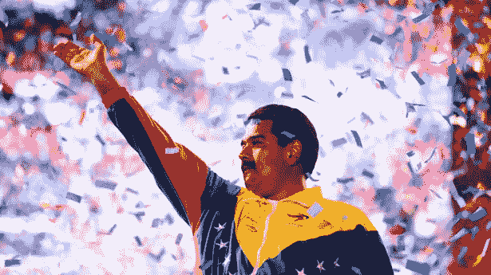
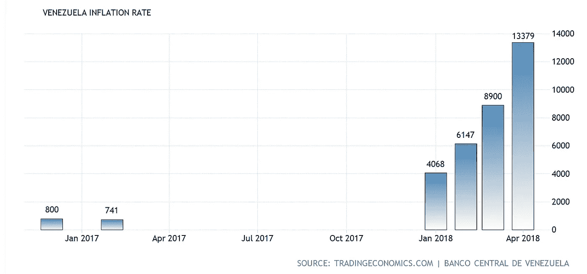
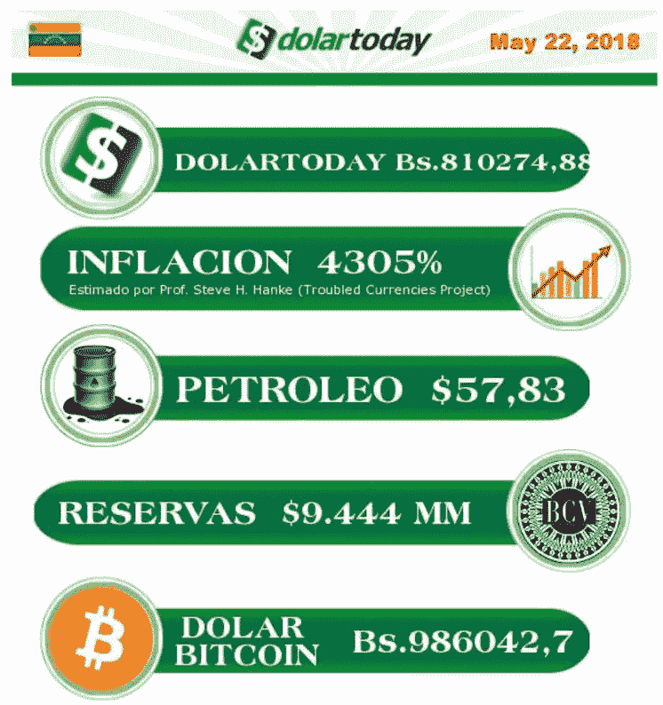

# 深入了解委内瑞拉和加密货币

> 原文：<https://medium.com/hackernoon/an-inside-look-into-venezuela-and-cryptocurrency-1b60c1c966a6>

2013 年，凯萨·查维斯当选总统，但随后因癌症去世。尼古拉斯·马杜罗随后通过特别选举以 50.62%的微弱优势当选总统。在接下来的 11 月，他通过第号法令的[规则，迅速将委内瑞拉的民主转变为独裁，之后他会偶尔短暂放弃这一权利。](https://en.wikipedia.org/wiki/Rule_by_decree)

自马杜罗担任总统以来，委内瑞拉陷入了社会经济衰退的状态。该国严重依赖其石油收入，部分原因是查韦斯的政策，这不可避免地使其易受市场影响。当[油价在 2014 年](https://www.eia.gov/todayinenergy/detail.php?id=19451)受到冲击时，整个国家都陷入了[经济萧条](https://www.reuters.com/article/us-venezuela-economy/recession-hit-venezuela-vows-new-year-reforms-foes-scoff-idUSKBN0K81KV20141231)。委内瑞拉中央银行开始印刷玻利瓦尔进行补偿，最终导致 12 个月的通货膨胀率达到 63.6%。

自那以后，该国陷入了恶性通货膨胀状态，仅去年一年的通货膨胀率就超过了 13，000%。

[https://tradingeconomics.com/venezuela/inflation-cpi](https://tradingeconomics.com/venezuela/inflation-cpi)

换句话说，Venezeula 是比特币旨在防范的一切事物的显化现实:

*   一个不保护本国政府支持的法定货币价值的政府
*   一个积极监视其公民寻找诽谤者的独裁者。

正是在这种背景下，对于许多生活在那里的人来说，加密货币已经成为抵御玻利瓦尔快速贬值的对冲工具。然而，比特币的国际化，或者说恢复比特币作为一个国家的标准货币，还没有实现。其中一个原因是因为政府实际上已经限制商店只接受玻利瓦尔。(更新 7–11–18:根据其他消息来源，政府并没有将支付选项仅限于玻利瓦尔。)

# 认识佩德罗·佩雷斯

佩德罗是委内瑞拉人，我有幸在网上采访了他。佩德罗其实不是他的真名。这是委内瑞拉的无名氏。他选择匿名，因为他害怕委内瑞拉政府会认出他的声音，找到他，然后把他关进监狱。以下是我采访佩德罗的摘要翻译，你可以在这里找到:

## 佩德罗，告诉我。委内瑞拉到底有多糟糕？

最低工资 250 万玻利瓦尔。一公斤肉要 450 万玻利瓦尔，一磅大米和一磅鸡肉要 130 万玻利瓦尔。

作为参考，让我们假设你在美国从周一到周五每天工作 8 小时，每小时工资 8 美元。这样你每月总共可以得到 1300 美元，然后你去杂货店，你会看到一公斤肉是 2500 美元。你看到了吗？

当然，经济的一部分与低工资有关，但这些工资每次都越来越低。唯一与工资成比例的是公共服务，如电、水、电话线、煤气、燃料、公共交通和互联网。仅此而已。

更不用说你还面临着医院和诊所的不安全、短缺和问题。委内瑞拉现在是拉丁美洲最不安全的国家

## 买一杯咖啡要多少钱？一年前是多少钱？

一杯咖啡加牛奶在一月份是 30，000 玻利瓦尔，两周后是 50，000 玻利瓦尔。今年 2 月，它涨到了 70，000 玻利瓦尔。三月份，我想价格是 10 万玻利瓦尔。这一价格一直保持稳定，直到 4 月份涨到 25 万玻利瓦尔。它仍然是那个价格，但我不知道还要多久。

## 委内瑞拉如何看待加密货币？

几年来，很多人在委内瑞拉采矿赚了很多钱。电力质量很差，但基本上是免费的，因此采矿非常有利可图。开始采矿的人通常是上流社会，有能力购买蚂蚁矿工或图形处理器。

随着时间的推移，很多人都读过这个话题，尤其是年轻人。幸运的是，除了 2、3 个网站，互联网没有被审查。而且它的价格也非常便宜，这使得全球新闻可以在世界任何地方看到。

就像世界各地发生的一样，没有多少人理解这个主题(我的父母就是其中之一)。去年年底，马杜罗宣布了石油币。政府创造的第一种加密货币。这使得许多人做了一些研究，并在这个问题上自学。政府的宣传说，只有石油币，国家才会复苏。这甚至没有提供任何进一步的细节，狂热分子一遍又一遍地重复这一点，而不理解加密货币的真正概念。

## 这对我来说太疯狂了。我第一次读到 Petro 应该是一个 ERC20 令牌，马杜罗说它将被“开采”然后他们决定将[切换到 NEM](https://www.ccn.com/eth-nem-confusion-surrounding-venezuelas-petro-token-blockchain/) 作为底层区块链。我觉得他们不知道自己在说什么。这可能是迄今为止最严重的 ICO 骗局之一。一个中央政府，私人集资一个 ICO，只有一个白皮书，他们的项目不是开源的。

是的。他们在瑞士联邦理工学院和 NEM 之间转换，完全消除了对石油硬币的任何信心。然而，需要明确的是，石油将是政府创造的 NEM 象征。在我看来，主要目标是跳过美国和欧盟对这些机构和政府官员征收的罚款。

我要说的是，今天不可能用玻利瓦尔购买 Petros。从法律上讲，委内瑞拉人只能得到玻利瓦尔。

## 说到这里，加密货币的“开”和“关”坡道是什么？

获取 crypto 的方法是通过挖掘，接受 crypto 中的付款(许多说英语的年轻人、平面设计师、翻译、程序员和远程工作人员都这样做)。另一种方法是用玻利瓦尔用本地比特币购买。在 LocalBitcoin 中，你可以同时进行购买和/或出售。

另一种方法是通过 PayPal、Payza、Netteller 或 support 接收资金，并将其转移到 AirTM，然后兑换成玻利瓦尔。顺便说一下，AirTM 网站在委内瑞拉被 DNS 封锁了。这是名为" Manos de Papel "的行动的目标之一。

## 加密货币正在取代委内瑞拉的法定货币用于日常购买吗？

不幸的是，还没有。事实上，如果你有很多加密货币或美元，你必须想办法将它们兑换成玻利瓦尔，因为根据法律，商店和企业只能接受玻利瓦尔。(编辑 7/11/18:根据其他消息来源，商家可以接受加密货币)。这已经成为一个问题，因为例如，1 立特等于 126，000，000 玻利瓦尔，相当于一个工人 60 个月的工资。因此，政府在银行(包括私人银行)的帮助下开始“分析”账户之间的流动，以查看谁在购买和/或出售美元和/或密码。

委内瑞拉有两种兑换方式。一个在街上被叫做 Negro 或 Paralelo(这是非法的)。这一个目前是 900，000 玻利瓦尔每美元，它是基于供求关系。另一种方式是由政府建立和控制的拍卖，称为“DICOM ”,每美元的价格为 70，000 玻利瓦尔。相差差不多 13 倍。即使使用政府的汇率，最低工资也是 36.42 美元，这是非常低的！

基本上，如果我的一个家庭成员寄给我 100 美元，按照政府的汇率，我只能得到 700 万玻利瓦尔。这意味着我只能买不到 2 公斤的肉。如果在黑市上兑换同样数量钱(100 美元)，我将得到大约 90，000，000 玻利瓦尔，可以买 20 公斤肉。这现在与国际价格一致。

所以政府想以 1 美元兑换 70，000 玻利瓦尔的价格买入美元，但不想以这个价格卖出(报价有限)。这就给了它黑市存在的理由。

一个严肃政府可以取消 DICOM 并使黑市价格合法化。这将使汇率更加稳定。一些经济学家实际上已经说过，200，000 玻利瓦尔兑换 1 美元将使汇率保持一致。

## 我听说有报道说，现在用比特币而不是美元来衡量玻利瓦尔。

我不认为那是真的。知道和使用密码的人必须先兑换美元，然后再兑换密码。

DolarToday is a website that shows the blackmarket value of Bolivares to USD. It is run by several people who are presumably out of reach of the Venezuelan gov’t. But some people suspect that it was compromised around Dec 2017 because there was a divergence between DolarToday and other blackmarket exchanges like AirTM.

## 有人说政府接管了 DolarToday 网站。这是真的吗？

直到几个月前，很多人还把 DolarToday.com 当作参照物。这是一个被委内瑞拉 DNS 封锁的网站。

几个月来，价格为每美元 20，000 玻利瓦尔，而产品和服务的价格一直在上涨。在 1 月份，当有人每月给委内瑞拉的一个家庭成员寄 40 美元时，这就足够了，但在 3 月份，这 40 美元现在是一个不同的价值，因为 DolarToday 仍然显示汇率为 200，000 玻利瓦尔。

这使得人们把它固定在他们想要的价格，高于 DolarToday 上的价格。DolarToday 是 200，000 玻利瓦尔，人们卖 300，000 玻利瓦尔。就在今天，DolarToday 的价格是 710，000 玻利瓦尔，而这里的人们正在以 900，000 玻利瓦尔的价格出售。

很多人说这是因为政府接管了 DolarToday。我不相信。他们只公布基于库库塔(库库塔是哥伦比亚的一个城市)汇率的汇率，在库库塔，哥伦比亚比索、美元和玻利瓦尔的兑换是以供求为基础的自由方式进行的。另外，你应该知道 DolarToday 不卖也不买美元。

## 佩德罗，谢谢你花时间和我聊天。这是迄今为止我做过的最重要的采访之一。我希望这有助于让世界了解委内瑞拉的生活。我钦佩你的勇气，你求生的意志和你的力量。**日期。**