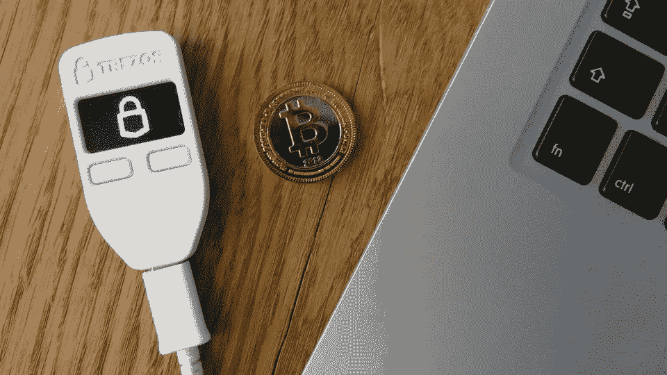
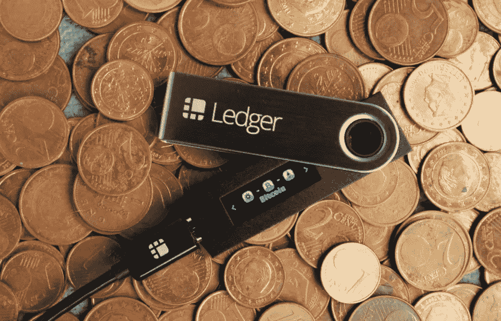

# 加密货币钱包简介

> 原文：<https://medium.com/hackernoon/an-introduction-to-cryptocurrency-wallets-288629d879a4>

如果你最近读了我最近的几篇文章“[比特币简介，它是什么，它为什么存在，在哪里买](https://hackernoon.com/an-introduction-to-bitcoin-what-it-is-why-it-exists-where-to-buy-it-6f2b17b548ad)”和“[以太坊简介](https://hackernoon.com/an-introduction-to-ethereum-68fb9b95fc62)”，你现在可能是加密货币的所有者。如果是这种情况，你需要使用一个加密货币钱包，里面有你的私钥，可以解锁区块链上存储的令牌。

通常，你购买加密货币的交易所或应用程序，比如[比特币基地](https://www.coinbase.com/join)或 [Square Cash](https://squareup.com/help/us/en/article/6307-getting-started-with-bitcoin-in-cash-app) 应用程序，会提供他们自己版本的加密货币钱包。其他数字钱包也存在，但它们都是各自为政的。例如，MyEtherWallet 用于以太和 ERC20 代币，Bitcoin wallet 用于比特币，Stellar wallet 用于 XLM(流明)。

有了加密货币钱包，你可以使用你的私钥，然后是公钥。这是一个重要的区别，因为当有人向您发送加密货币或您需要请求加密货币支付时，会使用您的公钥。您的私钥不应该被共享，应该保持脱机状态。

如果您将加密货币存放在交易所，则您不拥有自己的私钥，并且您只能在提交卖出请求时取回您的加密货币。

## **为什么要买硬件钱包？**

如果你是一个拥有多种加密货币的投资者，很难跟踪多个钱包和在线场所中的所有货币，这就是为什么购买硬件钱包很重要。将你的加密货币转移到硬件钱包中是“冷存储”的一种形式，本质上意味着你的加密货币不会留在交易所或钱包中。换句话说，冷存储意味着它完全保持脱机状态。

此外，投资者保持对加密货币的控制，而不是仅仅因为他们的数字钱包或交易所出现问题或网站宕机而被迫持有代币，这一点很重要。通过硬件钱包访问您的加密货币，您可以在几乎任何其他全球交易所出售，而不用担心任何网站或应用程序相关的问题或锁定。

此外，正如我们在 Mt.Gox 事件后所熟知的那样，交易所可能并且已经遭到黑客攻击。虽然许多交易所声称将他们的加密离线转移到冷存储中，并提供 2FA(双因素身份验证)，但保持加密货币在线仍然存在风险，因为许多钱包已经被黑客攻击，而你的安全取决于交易所的安全。

拥有加密货币的一个主要价值主张是减少对中间人或第三方的依赖。当你有其他选择的时候，你为什么要让交易所成为你和你的加密货币之间的中间人呢？这是创建一个分散的、去中心化的区块链的主要原因。

不通过中间人管理您的加密货币是个人获得自己资产所有权并成为自己个人银行管理者的机会。

## **您可以购买哪些硬件钱包**

迄今为止最受欢迎的硬件钱包是[莱杰](https://www.ledgerwallet.com/products/ledger-nano-s)和[特雷佐](https://wallet.trezor.io/#/)。这些是物理 USB 驱动器，必须用您创建的 pin 码插入您的计算机才能访问您的加密货币。简而言之，这是目前存储加密货币最安全的方式。

Ledger 团队位于法国，他们最受欢迎的设备是 Ledger Nano，它允许您存储比特币、比特币现金、以太坊、Ripple 和许多其他加密货币。

Trezor 是另一个硬件钱包，其工作方式类似于 Ledger，只是它持有的加密货币比 Ledger 少得多。你可以在他们各自的网站上查看完整的列表。(**注意:**不要在任何地方购买这些东西，除非是在实际的网站上，因为亚马逊上已经发生了一些诈骗事件。)

硬件钱包非常安全，因为它们有 pin 和物理硬件设备，这使得黑客很难甚至不可能访问你的加密货币。但是，如果您购买了一个，您必须承担责任和所有权，并确保您的恢复密码存储在一个安全的地方。

虽然在主流和非技术受众能够购买和存储加密货币之前，我们还有很长的路要走，但我希望在此期间，你能够了解各种可用的选项，并能够做出适合你个人需求和风险偏好的决定。

*附加资源:* [莱杰纳米教程](https://youtu.be/GPpZxOjvU10)
[特雷佐钱包教程](https://www.youtube.com/watch?v=vHy9X6NQ4k8&feature=youtu.be)

— — — — — — —

*本文是与 Luna Capital 的 Lindsey Maule 合作撰写的。如果你喜欢你所读的，你可以在媒体上跟随[我](/@yasmeenturayhi) & [林赛](/@lindseymaule)。