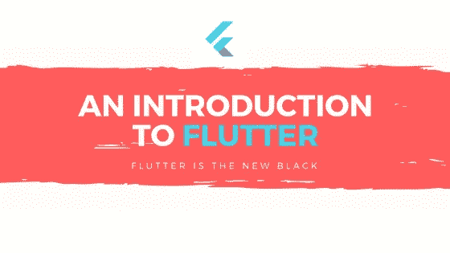
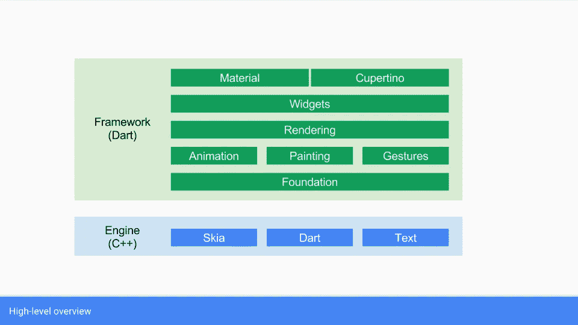
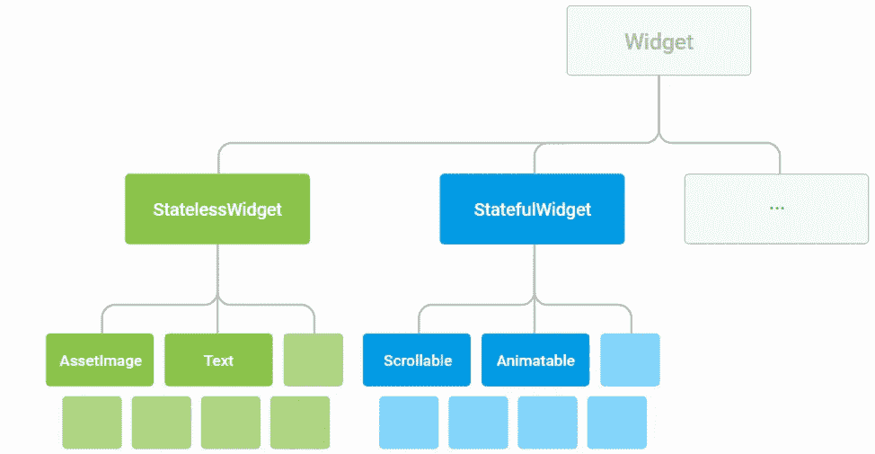

# 颤振导论

> 原文：<https://medium.com/hackernoon/an-introduction-to-flutter-1363f1bbe324>

在这篇文章中，我想解释什么是 Fluter，我们为什么要关注它，以及它是如何工作的。

> “Flutter 是一个移动应用 SDK，用于从单个代码库为 iOS 和 Android 构建高性能、高保真的应用。”— flutter.io

[Flutter](https://hackernoon.com/tagged/flutter) 是开源的，由[谷歌](https://hackernoon.com/tagged/google)开发。

> Flutter 的第一个版本被称为“Sky ”,运行在 Android 操作系统上。它在 2015 年 Dart 开发者峰会上亮相——维基百科

已经在 2017 年 5 月以稳定发布 Alpha 的形式向全球发布。

它的主要目标是让开发者能够在不同的平台上交付感觉自然的高性能应用。

## 我们为什么要关心颤振？

Flutter 被谷歌和其他公司用于生产，与 [Firebase](https://github.com/flutter/plugins/blob/master/FlutterFire.md) 和其他移动应用 SDK 一起工作，并且是开源的。

对我来说，这可能是唯一的原因，但还有更多。

1.  利用 Dart 语言的所有功能，我们可以用更少的代码做更多的事情
2.  我们可以使用 Flutter 快速构建我们的应用原型
3.  我们可以使用内置的材料设计和 iOS 风格的小部件来创建漂亮的、高度定制的用户体验

## 颤动特征

Flutter 有很多特性，让我们深入研究一下主要的 3 个特性。

## **快速发展**

用 flutter 开发时，可以使用一个叫做热重载的特性。热重装构建和运行您的项目快于一秒钟。这实际上有助于快速开发和更快地解决错误。

## **反应式框架**

Flutter 附带了一个现代化的反应式框架，其中包含一组丰富的小部件和一个用于动画、手势、2D 等的 API。

## **原生功能访问**

Flutter 让你使用你的 Java/Kotlin of ObjC/Swift 的一段代码访问 Android 和 iOS 的原生平台 SDK。

## 核心原则

颤振是围绕 3 个原则定义的

## 千层饼很好吃

颤振是围绕层组织的。每一层都建立在前一层的基础上。

从图上我们可以看到，Flutter 的底层部分是一个用 C++构建的引擎。它使用谷歌的 [Skia](https://en.wikipedia.org/wiki/Skia_Graphics_Engine) 图形库提供低级[渲染](https://en.wikipedia.org/wiki/Rendering_(computer_graphics))支持。

图表的高层部分是用 Dart 编写的框架。它提供了处理动画、手势、渲染、小部件等的库。

有了这一层，开发人员可以通过在顶层使用元素或向下定制应用程序的一些行为，用更少的代码做更多的事情。

## 一切都是小部件

在飘动中，一切都是一个小部件。小部件是我们用来创建扑动应用程序的用户界面的基本构件。

> 每个小部件都是用户界面一部分的不可变声明。—颤振. io

颤振应用程序的所有小部件都形成一个层次结构，其中一个小部件是其他小部件的组合，每个小部件从其父部件继承属性

## 成分>遗传

为了用其他小部件的属性创建一个强大的小部件，我们用这些小部件组成了我们的小部件。

## 结论

本文是我对颤振的简单介绍。

如果你想试试旋舞，我邀请你在官方网站上了解更多。

我也邀请你去颤振社区:

*   [与颤振工程师和用户实时聊天](https://gitter.im/flutter/flutter)
*   [在我们的邮件列表](https://groups.google.com/d/forum/flutter-dev)中讨论颤振、最佳实践、应用程序设计等等

**资源**

[颤振. io](http://flutter.io)

[**扑(软件)——维基百科**](https://en.wikipedia.org/wiki/Flutter_(software))

感谢您的阅读，在此之前**愿{code}与您同在**我的朋友！

*原为发表于* [*开发者之旅*](http://developer-journey.com/2018/02/08/introduction-to-flutter/) *。*