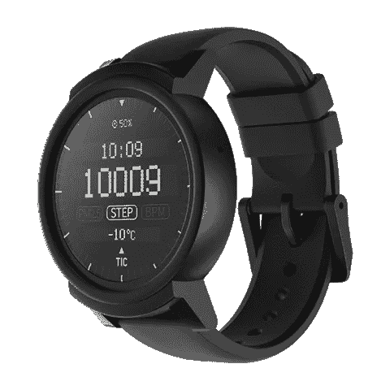
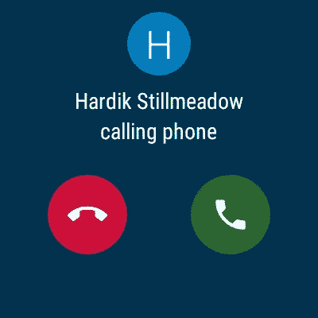
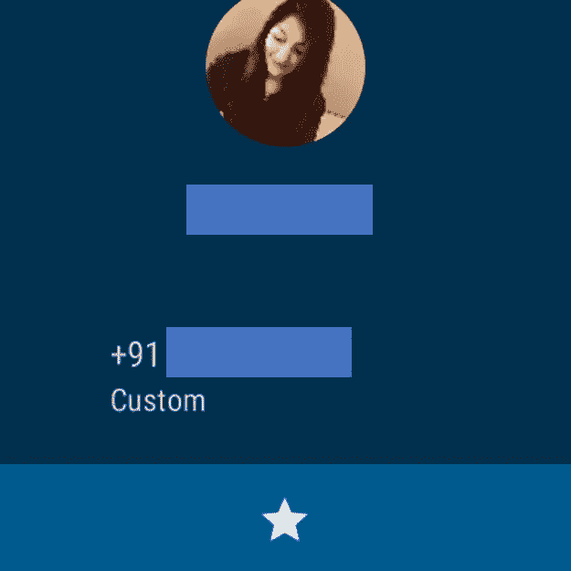

# 一位 iOS 用户用 Ticwatch E 对 Wear OS (Android Wear)的评测

> 原文：<https://medium.com/hackernoon/an-ios-users-review-of-wear-os-android-wear-with-the-ticwatch-e-e865d58e33a6>

*这篇文章将对 Wear 操作系统的某些应用和方面进行非常有选择性的回顾，以及它如何为 iOS 用户所接受*

自 2014 年 Moto 360 首次发布以来，我等待了近 4 年，终于在上个月决定买一款智能手表。当时我的主要设备是 Nexus 4。去年三月我换了一部 iPhone，但是我不想买苹果手表，因为它太贵了(废话！).所以我最后从 Mobvoi 拿到了一个 Ticwatch E。

The Ticwatch E is a cheap smartwatch from Mobvoi that runs the latest Wear OS by Google (image source: [https://cdn.shopify.com/s/files/1/1427/2170/products/ticwatche-black_left_large.png?v=1517322991](https://cdn.shopify.com/s/files/1/1427/2170/products/ticwatche-black_left_large.png?v=1517322991))

# 第一印象

甚至在第一次打开我的 Ticwatch 之前，我就从 App Store 把 Wear OS 应用程序安装到了我的 iPhone 上。它为你提供了如何设置新手表并将其与 iPhone 配对的清晰说明，还能帮助你登录谷歌账户。我尝试了几次将我的 Ticwatch 与我的 iPhone 配对，但在几次重启后，我终于成功了。我认为这更多的是与 Ticwatch 有关，而不是 Wear OS 或 Wear OS 的 iOS 应用程序——但愿如此。我做的第一件事是浏览可用的表盘。相当不错的收藏！我选择了一个最喜欢的，然后继续探索更多的 Wear OS。我马上把手表连上 WiFi，打开了 Play Store。我看到了一些熟悉的应用程序，如谷歌 Fit 和优步，我立即安装了它们，但首先没有多少应用程序需要安装。我可以理解原因是我用的不是安卓手机，但这仍然有点令人失望。应用程序开发人员—请在您的 iPhone 应用程序中支持 Wear OS😊

# 通知

Wear OS 上的通知，当与我的 iPhone 配对时，效果真的很好！它可以实时显示所有的通知，并在你的手腕上轻轻一推，让你知道有新的通知。你可以向右滑动来关闭通知，这也会关闭你的 iPhone 上的通知。在最底部还有一个“全部清除”部分是通知滑块，你可以用它来清除所有的通知。

但你不能在 Messenger 或 WhatsApp 上回复信息，不像在 Apple Watch 上。对于一些人来说，这可能是一个问题或不足，但对我来说这不是一个很大的问题。

You can also receive or reject a phone call

# 谷歌助手

为了能够使用谷歌助手，你需要连接到 WiFi，它可以完美地工作！就像任何其他平台/设备上的助手一样，你可以向谷歌询问任何事情，它会向你显示有用的信息，如今天的天气，或取决于你问它的位置。

The Google Assistant works flawlessly just like on any other platform

# Google Fit

Wear OS 上的 Google Fit 非常适合设置您的日常目标、锻炼计划以及测量您的心跳。这些信息会与 Wear OS 的 iOS 应用程序同步。我对测试它并不特别感兴趣，但这个计步器和我的苹果健康计步器非常相似，所以我认为它能正常工作。

# 不完整的东西:联系人应用程序

The Contacts app cannot be used to place calls and just shows a contact’s phone number

在能够直接从你的 Wear OS 智能手表上接听或拒绝来电之后，只有能够拨打电话才有意义，对吗？进入联系人应用程序，一开始我抱着很大的期望打开了它。它确实显示了你 iPhone 上的所有联系人，但仅此而已。您可以查看某人的电话号码，但不能给他们打电话。作为一名开发人员，这是我始料未及的，因为我知道通过 iPhone 通过应用程序/蓝牙拨打电话非常简单。谷歌应该做些什么？

# 其他预装应用

其他预装的应用程序，如闹钟应用程序、秒表应用程序、计时器应用程序和提醒应用程序都可以正常工作。请注意，提醒应用程序等应用程序可与您的 Google 帐户配合使用，并与您的 Google 帐户同步。在用于 Wear OS 的 iOS 应用程序中，您可以选择您的苹果日历，以便提醒应用程序使用它来代替您的谷歌日历。

# 关于 Ticwatch E 的一些事情

如果你想在 iPhone 上试用 Wear OS，Ticwatch E 是一个不错的选择，但不是市场上最好的。我总是不得不面对的最常见的问题是定期从我的 iPhone 断开蓝牙连接。这种情况经常发生，有时会变得令人恼火。这种屏幕也不是最好的，但足够亮，可以在户外使用。App Store 上的 Ticwatch 应用程序似乎从未与手表配对，因此，手表上的一些应用程序，如 Ticwatch 自己的健身追踪器，是无用的。但由于谷歌 Fit 可以在手表上运行，这对我来说不是问题。电池寿命是有希望的，在蓝牙和定位服务打开的情况下可以持续近 2 天。如果你同时打开了 WiFi 和蓝牙，它会很快耗尽。总的来说，Ticwatch 是一款不错的 Wear OS 智能手表——*仅适用于 Android 手机用户*。对于 iOS 用户来说，肯定有一些其他的 Wear OS 智能手表可以与你的 iPhone 形成更好的组合。

# 结论

对于 iOS 用户来说，Wear OS 是 watchOS 的绝佳替代品。如果你对苹果的 UI 不是很挑剔，而谷歌的 Material UI 对你很管用，那么你绝对应该尝试一下。它几乎做了苹果手表能做的一切，但价格极低。Wear OS 在某些方面有所不足，但这是因为苹果封闭的生态系统以及应用开发者未能在其 iOS 应用中支持 Wear OS。但你仍然可以在 iPhone 的 Wear OS 上完美运行优步、谷歌地图和 AccuWeather 等应用。谷歌新更新的 iOS 版 Wear OS 应用前景看好，让我对 iOS 设备 Wear OS 的未来充满希望。