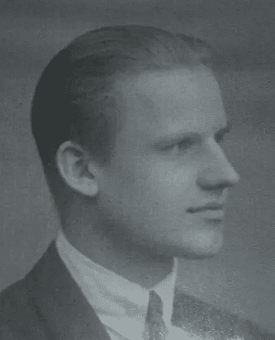

# 献给我祖父的颂歌

> 原文：<https://medium.com/hackernoon/an-ode-to-my-grandfather-8ee2cf260da9>

Tor Svanholm

我从没见过我父亲那边的祖父。他在我出生前两年去世了。尽管如此，他说的一些事情仍然留在我的记忆中，我希望有一天能把它们传递给我自己的孩子。他有一句特别的话，多次激发了我的神经细胞。

*“你能省却的，你就拥有了”*

我父亲经常这么说。起初我不明白这是什么意思，但即使当我最终认为我做了一些其他的，对这句话的不同解释似乎总是浮现在脑海中。这些话比乍看上去更深刻地描述了人类精神的局限。分配某物是什么意思？事实上，拥有某物意味着什么？对我来说，这个表达是关于所有权的定义。我把它解释为“拥有某物就是控制某物，如果你能抑制住控制某物的冲动，你就有效地拥有了它，因为那东西发生了什么不再与你有关”。你可能听说过关于财产的说法，他们倾向于最终拥有你，而不是相反。我祖父的名言反过来说，如果你真的想拥有某样东西，你首先需要拥有的是你对它的想法。

在大多数冥想练习中，你学会了如何在思想进入你的头脑时注意到它们。有些人认为没有自我这种东西，这些短暂的想法就是我们真正的样子。在某种意义上我们没有自由意志。根据这方面的理论，在任何给定的时刻，我们真正能做的就是注意到我们经过时的冲动。唯一的选择就是不在场，向他们屈服。以渴望的冲动为例。你所能做的，在更深的层次上，就是注意这种冲动。然后也许，*只是也许，*你将能够克服你的欲望，获得一点控制权，一点所有权。从这个意义上说，你真正拥有了你不想要的东西。可以说，这种形式的所有权甚至比你实际拥有你并不真正需要的东西更纯粹。

留意你的渴望，因为它们可能会占用你的时间。顺便说一句，时间是你唯一真正有价值的东西。