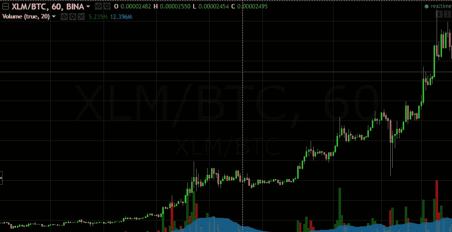

# 斯特拉颂歌

> 原文：<https://medium.com/hackernoon/an-ode-to-stella-r-eea1883d9c13>

斯特拉颂歌

我们如何知道何时去月球？

你是我找到的第一个[密码](https://hackernoon.com/tagged/crypto)。

读了白皮书，认为这项技术真的会大放异彩。

11 美分的时候，我还在观望。

作为象征的火箭。什么会出错？然而我仍然非常善变。

我太天真了。17，877，236，352 循环供给？市值只有 3000 亿？百万分之一的机会都没有。

不知所措，选择了快速刺激。

买了狗屎硬币。得到狗屎收益。觉得为时已晚。

即使只卖 30 美分，我还是在观望。

以为你会一直在我身边。以为有时间交往，在镇上过一夜。

即使是快速上升到 50，急剧下降到 45，我也很兴奋，但也很想跳水。

潜水没来。你正走向成名。

现在我抬头看着你的 [ATH](https://hackernoon.com/tagged/ath) ，希望我能搭上你的便车。