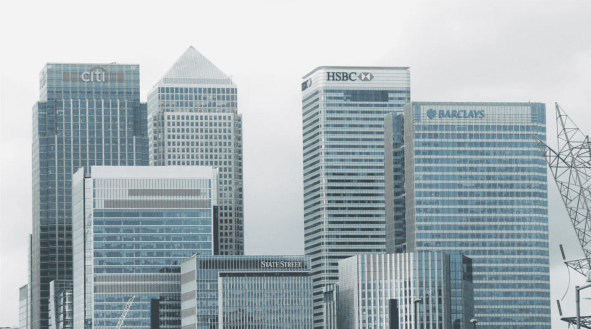

# 关于比特币和加密货币给银行的公开信

> 原文：<https://medium.com/hackernoon/an-open-letter-to-banks-about-bitcoin-and-cryptocurrencies-b0c7ef9b7c62>

亲爱的银行经理先生:

这封信对我来说不容易写。我已经是你 20 多年的顾客了。当我买第一辆车时，你为我提供了贷款；我买第一套房子的时候，你帮我安排了抵押贷款，你甚至帮我创办了第一家公司。我们一起经历了这么多。

我告诉你一个小秘密。

你是我的第一次！别担心，我知道我不是你的。我想这就是为什么这段感情对我来说比你更重要。

你可能没有注意到我们的关系已经发生了变化，自从那次金融危机以来，你一直很忙，我们在一起做的事情越来越少。我从超市拿到了最后一笔贷款，因为他们的利率更高，我的最后一笔抵押贷款是从另一家银行拿到的。这些天来，我只是利用你来替我保管钱和支付我的账单。

我们就像黑夜中过往的船只，我担心如果我们不说话，我们可能会分开。

最近我交了一个叫比特币的新朋友。一种加密货币，我称之为 Crypto，你可能听说过她。她是新鲜和令人兴奋的，我希望你也能了解她。我希望你能让她成为我们关系的一部分。

我知道我既不是银行经理，也不是经济学家，你有所有这些关于为什么加密会失败的论点，但我是一个在日常生活中使用加密的人，我知道这对我来说将是一个不断增长的需求，我希望我们分享这一经验。

我知道你很害怕，或者你只是不明白。也许你认为比特币是一个庞氏骗局，每个人购买它只是为了赚快钱。当然，我们中的一些人是这样的，就像我们中的一些人在网络繁荣时买了股票，当它崩溃时亏损了。但是看看之后发生了什么，我们得到了一些世界上最重要的公司:亚马逊、谷歌和脸书。

看看其他发生的很酷的事情；苹果为我们创造了这些神奇的手机，它们可以用互联网做各种很酷的事情。这些设备不仅仅是打电话；它们允许我们阅读书籍，访问数百万首歌曲，跟踪我们的运动，甚至找到爱情。

我想你会同意互联网是非常酷的，互联网泡沫带来了大量的资本和开发商进入市场，以找出如何最好地利用它。

关于 Crypto 的事情是它在做同样的事情；你可能认为这是一个泡沫，或者听到金融评论员说确实如此，但泡沫并不是一件坏事。你可能会听到所有这些骗局和黑客的故事，但这个泡沫也将资本、聪明人和开发者带入 Crypto，以推动创新。不要听比尔·盖茨的，恐怖分子也在使用窗户，正如 Naval 所说，年轻的比尔·盖茨会在区块链上建造房屋。

我知道你听说过区块链，你听说过它能做一些很酷的事情，对吗？但你在质疑我们是否需要比特币，但正是因为比特币，我们才有了区块链。我们对此非常忠诚，所以不能缺一不可。

你可能想知道为什么我们喜欢加密？首先，我承认，我们中的一些人从中赚了很多钱，如果这不是一个重要因素，我会撒谎。我们也希望在未来从中赚钱，我们可以看到比特币如何改变世界，所以我们中的一些人将继续投资于它。你看，我们需要全球货币，但我们不信任任何中央机构来管理它，因为比特币是去中心化的，它解决了这一需求。

目前把我们所有的钱都留给你是没有什么意义的，我是说你过去的确给过我们一些利息，但现在那几乎不存在了。不要以为我们没有注意到你仍然把我们的钱借给别人以获取利润，我们不介意，但是你和我们分享这些利润吗？不再是了。

我们喜欢它还有其他原因。你看，它有一个叫做审查阻力的东西，这意味着我们可以花掉它/转移它，而不必给出理由，一旦我们创建了一个交易，它就发生了，这很酷。最近我从银行取了 2000 英镑，你问我这是干什么，你这个爱管闲事的家伙。我没有意识到我必须向你解释我自己，而且当我说我是一个毒品贩子的时候，我不认为银行职员明白这个笑话。

用密码汇款的另一个好处是它非常快，这是你们还没有弄明白的。我非常感谢你为我提供网上银行服务所付出的努力，这太棒了。我也喜欢我的手机应用程序，但让我们换个角度来看，亚马逊可以用飞机给我寄一个包裹，比我通过互联网汇款还要快。我的意思是，来吧，我知道你没有物理船舶我的英镑纸币穿过池塘，你所做的只是更新数据库，但我不得不等待几天，并支付费用的乐趣。

Crypto 的另一个好处是我们可以自己拥有它。我知道我们应该相信你，但是现在在英国，你只能保证保护 85，000 个这样的东西。是的，这可能比我们大多数人拥有的都要多，但是难道我们没有权利保护我们所有的血汗钱吗？

你可能认为银行不太可能出现问题，但我们在希腊和塞浦路斯的朋友不敢苟同，因为你开始偷他们的钱，为他们政府对各自经济的管理不善买单。我怀疑我们在津巴布韦或委内瑞拉等地的朋友有任何保护。

此外，在金融危机期间，当你们用那些我们听说过的有趣的衍生品玩彩票时，你们中的一些人几乎消失了。只有当政府介入时，我们才得救。很恐怖的时期，对吧？你必须原谅我们没有 100%信任你。

你知道，我最近进入比特币挖矿是因为我告诉过你，我在你的一个分行花了三个小时填写所有这些表格，并不得不等待一周的决定，稍后我会告诉你更多关于这一点的信息。当我购买采矿设备时，它花费了 7 万美元，在发送加密货币后，它在不到 10 分钟内确认，花费不到 1 美元。我不知道我怎么能和你一起把那笔钱寄到中国；我想我需要一次会议，一些文件和一次审讯，谁知道你会因此向我收费。

记得我刚才提到我想开的银行账户，你说不行。我也试过你的几个朋友，他们也说不行。他们说他们看不到这笔钱的来源，我可能在洗钱。这是一个奇特的指控，尤其是因为我经营着多家企业，从未被判过罪。此外，如果你深入调查，你必须非常愚蠢地使用比特币进行犯罪，现在追踪钱的去向非常容易。

显然，我认为你害怕了，这可能是你的朋友杰米戴蒙如此反对的原因，尽管我认为他现在正在改变他的观点。

比特币不会消失；我买得更多，我的朋友买得更多，很多人买得更多。如果我们认为这是一个更好的存放钱的地方，那么你可以借出去的就更少了。然后呢？你将不得不向你的竞争对手借钱，这对你来说将会变得更加昂贵，而你赚的钱将会少得多。也许一开始只会一点点，但我推荐你读一读马尔科姆·格拉德威尔的《引爆点》，那个留着一头乱发的家伙。我给你留了一个链接，算了，如果你想要，我给你买一本？

你需要考虑的另一个问题是，随着我们用 Crypto 买东西变得越来越容易，我们也将做更多这样的事情，为什么？嗯，如果没有你对所有这些人收取的那点点%的商业费用，它应该会更便宜。技术不喜欢中间商。

Reference: [https://www.cardswitcher.co.uk/2017/01/card-payment-processing-fees/](https://www.cardswitcher.co.uk/2017/01/card-payment-processing-fees/)

你可能认为这还不是一个威胁，就像有些怪人在别人去 Blockbuster 的时候收到了邮寄到他们家的 DVD，但后来流媒体出现了，Blockbuster 现在在哪里？还有，HMV、塔唱片公司和所有我们喜欢的杂志和报纸都怎么了？那些未能创新的公司已经挖了很多公司的坟墓。

基础设施正在发生变化，商家正在推出加密解决方案，不久之后，你会看到用比特币支付和用贝宝支付一样多。贝宝花了时间，一开始有点痛苦，但他们坚持下来了，现在我们很多人都在用他们，为什么？好吧，归结起来就是这个叫做易用性的东西，在每个网站上创建一个账户并输入你的卡的详细信息是一项艰苦的工作。用 PayPal 简单登录要容易得多。

如果有人让我们的事情变得更容易或更便宜，我们倾向于使用它。

当我们用 Crypto 进行简单的登录时，如果零售商将节省下来的费用转嫁给你，那么东西会更便宜。是的，对于一杯咖啡来说这可能是微不足道的，但是对于一台电视来说呢？一辆车？一栋房子？一旦我们越来越多地使用它们，我们也可能用它们来喝咖啡。这些费用也与旅行有关，我们很多人旅行，但在国外花钱时不得不支付所有这些昂贵的费用。我们的加密账户是无国界的，所以这些费用是不存在的。

所以，如果我们不在你们这里存钱，也不使用我们的借记卡和信用卡，那么我们为什么需要你们呢？我们可以在公开市场上买到的其他东西，没有抵押贷款和贷款的忠诚度，我们会从任何提供最佳利率的人那里得到它们，甚至可能不是银行，可能是我们的超市。我们不在乎；我们只想要最好的价格。

你明白了吗？

这么多年未能实现现代化，认为你的模式没有威胁是不正确的，对吗？我们的英雄中本聪先生给我们带来了麻烦。你应该谷歌一下他，他挺酷的，尽管如果你看到一些关于这个叫克雷格·赖特的家伙的东西，那不是他，别担心，他只是一个假装成聪的可笑的人。

我自己使用 Crypto 已经有一段时间了，我注意到有很多年轻人对它感到兴奋。同样的人，他们不买 CD 是因为他们可以让 Alexa 播放一首歌，同样的人，他们不看电视是因为他们在 YouTube 上找到了他们想要的东西。他们对复杂的股市毫无兴趣，从小玩电脑游戏就用虚拟货币长大。当然，你的爷爷奶奶可能还是会来银行和你聊天，但是这些年轻的小伙子和姑娘们怎么办？你一定已经注意到一些年轻人喜欢的新的现代纯互联网银行，Revolut 甚至增加了加密货币买卖。

所以我跟你说实话，你有两个选择:

# 选择 1 —忽略它

但是就像当我忽略一个账单时，它不会消失，当我处理它时，它通常会让我付出更多，也许是罚款。我想你可能也有同样的问题。去看看 Circle，他们刚刚以 4 亿美元买下了我们使用的名为 Poloniex 的交易所。我保证这在一两年内会看起来很便宜。比如脸书以 10 亿美元收购 Instagram，几年后又以 190 亿美元收购 Whatsapp。

你拖得越久，它就会变得越贵:

1.  如果您选择通过收购其他公司来将 Crypto 集成到您的业务中，那么他们将会变得越来越昂贵，最好的公司可能已经离开了。
2.  你将失去那些已经转向在你之前采用 Crypto 的竞争对手的客户。

# 选择 2 —适应

我想我们可以同意，不可避免的是，你将不得不现代化，并面对我们需要加密的事实。马克·卡尼不会成为你的闪亮骑士，反正我们都认为他是个白痴。一旦你的客户开始转向别处，而你能借出去的钱变少了，你就会觉得自己就像那些没有在 30 美元、300 美元、3000 美元买入比特币的人一样。

我知道你喜欢挖出这些黄色金属块，然后把它们埋回地下，但就像约翰·普费弗最近在午餐时告诉我的那样:“100 年后，当我们乘坐我们的千年猎鹰四处飞行时，你认为我们会把黄色金属块用作价值储存手段吗？”你也应该读读约翰的白皮书，他是一个非常聪明的人，你很快就会意识到这不仅仅是一些虚构的神奇的互联网货币。

我们需要密码，我们需要银行服务。不用担心；Crypto 不会取代法定货币(显然这就是法定货币，我最近才发现)。我知道有一些自由主义者说比特币将取代货币，但我也知道政府不会允许这样做。看看美国，你看到[参议院关于虚拟货币的证词了吗？没有吗？我认为你应该看看，尤其是这个家伙克里斯托弗·吉安卡洛，我们喜欢他，他理解我们，无论如何，如果美国想要加入，那么整个世界都会在某个时候拥有它。甚至中国！](https://www.youtube.com/watch?v=iWQmQ_0Ovxs)

这种关系将是共生的，我们将在一些事情上使用我们的英镑和美元，在另一些事情上使用我们的密码，我们可能会与任何使这变得最容易的人合作。你看，此时此刻，你没有让银行业变得简单，而是让它变得令人头疼。你知道最近你收了我 50 英镑，因为我在一个账户上透支了，而另一个账户却有盈余。没错。所以即使我不欠你钱，你还是向我收费，这种行为让我觉得你是个混蛋。

我没有换银行的唯一原因是我太忙了，以至于我没有写下所有的直接借记和我需要转移的东西。我会的，这在我的待办事项列表上。所以你有一些时间，但不是很多。

我的建议是，去开一个比特币基地账户，他们不是银行，但他们看起来有点像。看看里面，你会看到他们给你一个英镑、欧元和美元的账户，还有我的比特币、莱特币和以太币的账户。总之，这是一个幸福的金融大家庭。

点击账户，你可以看到你可以像在银行一样发送和接收密码，但是记住我之前说的速度和成本。菲亚特的只是为了平衡和购买密码，所以还没有威胁到你，但他们会在未来吗？

另外，看看金库，它有点像储蓄账户，尽管像你一样，我们没有任何利息。但是，如果比特币基地做抵押和贷款，并使用加密，那么我们可能会得到一些利息。不用担心；他们可能不会，金库只是为了安全，我们大多数人在比特币基地没有太多的密码，只有一点点；我把我的放在一个叫硬件钱包的东西上，埋在一个地下碉堡里，有护城河，武装警卫和鳄鱼。当你进入这个领域时，你会很快学会安全。

比特币基地，很酷吧？

如果当我登录我的银行账户时，我的活期存款和储蓄旁边有一个比特币账户，那将会非常酷。你可能会给我比比特币基地更好的费用。我肯定会买一些密码并和你一起保存，因为把我的钱从银行转到比特币基地有点麻烦。此外，我认为你添加一个比特币钱包会比比特币基地提供银行服务容易得多。老实说，我不认为他们会提供银行服务，但我相信有一天一家大银行会收购他们。可能价值连城。

这一切有意义吗？

看，加密不会消失，就像我的朋友加文对我说的:你不能撤销区块链，你也不能让它脱离比特币。我保证，如果你不看，那么你的竞争对手也会看。为什么要等他们？为什么不引领潮流？为什么不成为拥有加密技术的创新银行呢？你这样做不会失去任何客户，反而会获得一些新客户。

我知道这很可怕，但拜托，互联网是可怕的，你适应了，你终于找到了网络和移动银行。你不觉得无视加密货币，面临被甩在后面更可怕吗？

爱彼得 x

Peter McCormack 是一名自由博客作者和播客。你可以在他的网站上了解更多， [*比特币做了什么*](https://www.whatbitcoindid.com/) *并在*[*Twitter*](https://twitter.com/whatbitcoindid)*上关注他。*

*他的* [*播客*](https://www.whatbitcoindid.com/podcast/) *可在 iTunes、Google Play、SoundCloud、YouTube、Stitcher 和 TuneIn 上获得，所有* [*链接可在他的网站*](https://www.whatbitcoindid.com/podcast/) *上获得。*