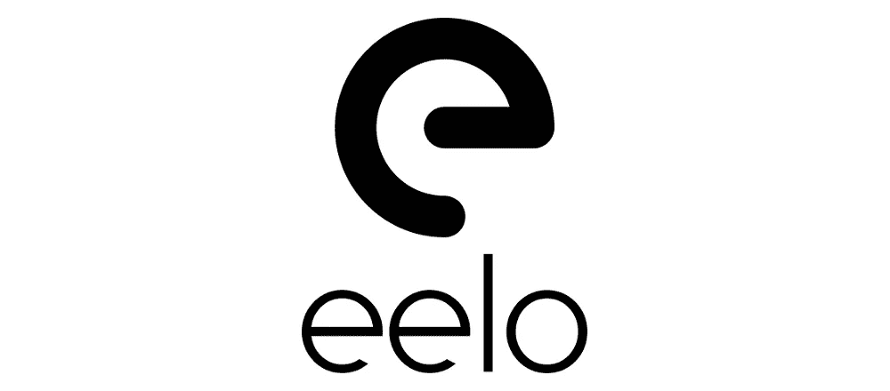

# eelo 创始人致埃隆·马斯克的公开信

> 原文：<https://medium.com/hackernoon/an-open-letter-to-elon-musk-from-eelo-founder-6d6feafb53a2>

亲爱的埃隆:

自上世纪 90 年代以来，你已经凭借 Paypal、SpaceX、特斯拉、Hyperloop 和 OpenAI 等伟大项目改变了世界。我注意到你已经将特斯拉专利发布到公共领域，并且开源了 Hyperloop 和 OpenAI 项目。

在你们的项目背后，我感受到了一个单一的行动方向:赋予人们权力，同时让世界变得更美好。

今天，数字巨头正在全球范围内大规模滥用个人和企业数据，目的只是为了推动他们的业务。更糟糕的是，这是在安装一个由一小撮人控制的全球监控系统。从长远来看，这种情况甚至威胁到民主。

20 年前，我创建了 Mandrake Linux，这是第一个真正关心用户体验的 Linux 发行版。它赋予了数百万用户权利。

现在，我开始启动 eelo，这是一个公益项目，因为我想为这场数据隐私灾难提供一个可信的“消费者就绪”的替代方案。我想让个人和企业拥有更明智的选择。为他们提供一条摆脱数字奴役的途径。

对 eelo 的兴趣越来越大。为了帮助我们取得成功，我们正在寻找更多向善的力量加入。我们需要像你这样的人来支持这个项目并做出贡献。

亲爱的埃隆，我们来谈谈吧？

亲切的问候，

盖尔·杜瓦尔

/支持 eelo 早期开发！加入我们的 [Indiegogo 活动](https://www.indiegogo.com/projects/eelo-a-mobile-os-and-web-services-with-values-android)和[成为我在 Patreon 的赞助人](https://www.patreon.com/eelo)！/

/这封公开信最初是[发布到我的个人网站](https://www.indidea.org/gael/blog/an-open-letter-to-elon-musk-from-eelo-founder) /

/伊洛人的故事[从这里开始](https://hackernoon.com/leaving-apple-and-google-my-eelo-odyssey-introduction-d22741f990d7) /