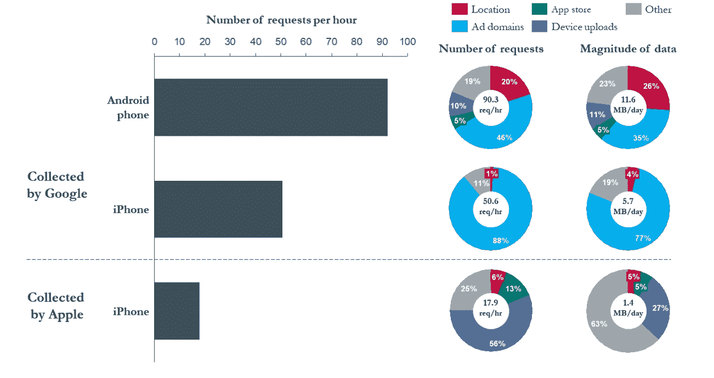

# 致蒂姆·库克关于用户数据隐私的公开信，来自/e/ Founder

> 原文：<https://medium.com/hackernoon/an-open-letter-to-tim-cook-from-e-founder-14ae6c7d1f6f>

亲爱的蒂姆·库克，

我确信苹果公司有优秀的沟通和公关策略师。

在过去的 6 个月中，隐私问题迅速增加:首先是专家，然后是媒体，现在是普通人，他们意识到他们的个人信息被许多政府、运营商和公司出于各种目的永久捕获的程度。

人们开始看到这一切是如何威胁到他们的私生活，甚至在全球范围内威胁到民主的。

特别是，你的策略师知道，拥有全球 80%智能手机市场的谷歌在这个问题上处境艰难，因为他们的商业模式本质上依赖于收集个人数据，并通过广告从中获利。

这对苹果来说是一个绝佳的沟通机会，因为苹果的商业模式是销售设备，而不是做广告。此外，与谷歌的 Android 相比，iOS 更关注安全性(以及某些方面的隐私)，这可能是真的。

蒂姆·库克(Tim Cook)最近几次提到数据隐私问题，解释威胁，赞扬欧盟的新 GDPR 法规，并呼吁美国制定类似的法律。当然，声明“苹果更喜欢保护其客户的个人数据。"

然而，你似乎忘记了一些关于苹果和 iOS 的事实:

1- iOS(和 MacOS)大多是专有系统。这意味着用户(在这种情况下，实际上是软件专家)只能相信你的声明，而不能验证你正在使用的技术是安全的，并保证你的用户免受所有隐私威胁。另一方面，如果您的操作系统和服务器软件是作为开源软件发布的，这可以通过专家的验证。

2-您明确承认您正在使用个人信息为苹果公司谋利: [*“个人信息将仅由苹果公司共享以提供或改进我们的产品、服务和广告；不会出于营销目的与第三方共享。”*](https://www.apple.com/legal/privacy/en-ww/)

3- [谷歌向苹果支付谷歌搜索作为 iOS 默认引擎的费用](https://www.businessinsider.com/google-paid-apple-3-billion-remain-iphone-default-search-engine-analyst-estimate-2017-8?IR=T)，估计每年高达 90 亿美元！这使得[用户的个人数据可以全天收集并以每小时 17.9 次请求的速率发送到 Google](https://digitalcontentnext.org/wp-content/uploads/2018/08/DCN-Google-Data-Collection-Paper.pdf)——结果**用户数据收集总量为 1.4 MB/天！**

Source: [Google Data Collection Paper](https://digitalcontentnext.org/wp-content/uploads/2018/08/DCN-Google-Data-Collection-Paper.pdf)

在 [/e/Foundation](https://e.foundation/) ，我们首先为用户建立了一个新的移动生态系统:它尊重他们的个人数据隐私，它是开源的，我们尽可能地让它对爸爸妈妈用户有吸引力。

我们认为开源是带来可验证隐私的唯一途径，而不是简单的声明和声誉。

我们还认为，一个有吸引力的移动生态系统应该是可取的，但又是负担得起的，我们不会出售带有我们系统的 1000 美元设备，因为这将减少地球上大多数人拥有它们的机会。

[/e/](https://e.foundation)

[/e/ first beta 已经推出](https://hackernoon.com/leaving-apple-google-e-first-beta-is-here-89e39f492c6f)，从去年 9 月开始，面向众多智能手机设备，我们欢迎大家支持它。你会吗？

我们的项目是真正的[争取自由和民主的社会项目](https://hackernoon.com/eelo-is-more-than-tech-its-a-societal-project-for-freedom-and-democracy-951ea5c8f162)。

你真诚的，

gal Duval/e/创始人。

在 Twitter 上关注我[在乳齿象上关注我](https://twitter.com/gael_duval)/