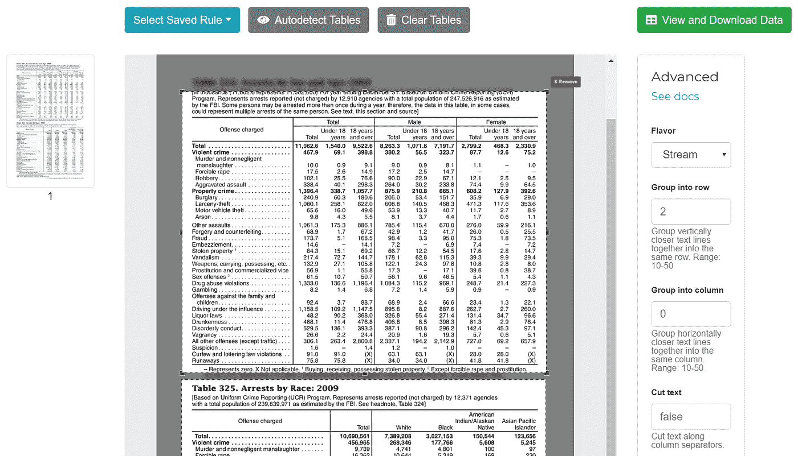
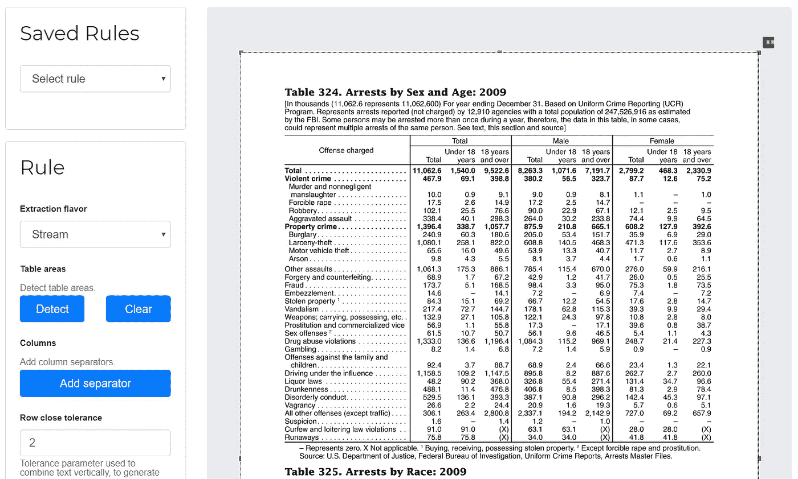

# 一个将表格从 pdf 提取到 CSV 的开源工具

> 原文：<https://medium.com/hackernoon/an-open-source-science-tool-to-extract-tables-from-pdfs-into-excels-3ed3cc7f22e1>

> Excalibur 是一个免费的开源工具，可以帮助您轻松地从 pdf 中提取表格数据。我最初是为我的[网站](https://www.vinayakmehta.com/2018/11/26/open-source-tool-extract-tables-pdfs-excels/)写这篇文章的。


Photo by [Patrick Tomasso](https://unsplash.com/photos/Oaqk7qqNh_c?utm_source=unsplash&utm_medium=referral&utm_content=creditCopyText) on [Unsplash](https://unsplash.com/search/photos/books?utm_source=unsplash&utm_medium=referral&utm_content=creditCopyText)

*借用我之前的博文* [*的前三段话*](https://www.vinayakmehta.com/2018/10/03/camelot-python-library-extract-tables-pdf/) *因为它们完美地解释了为什么从 pdf 中提取表格很难。*

PDF ( [可移植文档格式](https://en.wikipedia.org/wiki/PDF))诞生于[Camelot 项目](http://www.planetpdf.com/planetpdf/pdfs/warnock_camelot.pdf)以创建“一种在各种机器配置、操作系统和通信网络之间交流文档的通用方式”。基本上，目标是使文档可以在任何显示器上查看，并可以在任何现代打印机上打印。PDF 是建立在 PostScript(一种页面描述语言)之上的，PostScript 已经解决了“随处查看和打印”的问题。PDF 封装了创建“随处查看和打印”文档所需的组件。这些包括字符、字体、图形和图像。

PDF 文件定义了将字符(和其他组件)放置在相对于页面左下角的精确的 **x，y** 坐标上的指令。通过将一些字符放得比其他字符更近来模拟单词。类似地，通过将单词放置在相对较远的位置来模拟空格。那么表格是如何模拟的呢？你猜对了——通过将单词放在电子表格中。

PDF 格式没有表格结构的内部表示，这使得很难提取表格进行分析。可悲的是，许多开放的数据存储在 pdf 中，而 pdf 最初并不是为表格数据设计的！

# Excalibur:将表格从 pdf 提取到 CSV

Excalibur 是一个从 pdf 中提取表格数据的 web 界面，用 Python 3！它由[卡梅洛特](https://camelot-py.readthedocs.io/)驱动。你可以在[查看精彩的文档，在](https://excalibur-py.readthedocs.io/)阅读文档，在 [GitHub](https://github.com/camelot-dev/excalibur/) 上关注进展。

**注意** : Excalibur 仅适用于基于文本的 pdf，不适用于扫描文档。(正如 Tabula [解释的](https://github.com/tabulapdf/tabula#why-tabula)，“如果你可以在 PDF 查看器中点击并拖动选择表格中的文本，那么你的 PDF 就是基于文本的”。)

# 如何安装神剑

安装完 [ghostscript](https://www.ghostscript.com/) (见[安装说明](https://camelot-py.readthedocs.io/en/master/user/install-deps.html))后，就可以简单的使用 pip 来安装 Excalibur 了:

```
$ pip install excalibur-py
```

**注意**:你也可以从[发布页面](https://github.com/camelot-dev/excalibur/releases)下载 Windows 和 Linux 的可执行文件，直接运行！

# 如何使用神剑

使用 pip 安装后，您可以使用以下命令初始化元数据数据库:

```
$ excalibur initdb
```

然后使用以下命令启动 web 服务器:

```
$ excalibur webserver
```

就是这样！现在您可以访问 [http://localhost:5000](http://localhost:5000/) 并开始从您的 pdf 中提取表格数据。

1.  **上传**PDF 并输入您想要提取表格的页码。
2.  转到每一页，通过在表格周围画一个方框来选择表格。(您可以选择跳过这一步，因为 Excalibur 可以自动检测表格。点击“**自动检测表格**”查看 Excalibur 看到的内容。)
3.  从“**高级**”中选择一种风格(格或流):**格，**用于由线条组成的表格，或者**流，**用于由空白组成的表格。
4.  点击**查看并下载数据**查看提取的表格。
5.  选择你喜欢的格式(CSV/Excel/JSON/HTML)点击“**下载**”！

# 表检测升级

Camelot 是支持 Excalibur 的 Python 库，它实现了两种方法来从两种不同类型的表结构中提取表: **Lattice** ，用于由线条组成的表，以及 **Stream** ，用于由空白组成的表。Lattice 在 v0.1.0 中给出了很好的结果，因为它能够检测单个 PDF 页面上的不同表格，而 Stream 将整个页面视为一个表格。

但上周，卡梅洛特 v0.4.0 版的发布解决了这个问题。 [#206](https://github.com/socialcopsdev/camelot/pull/206) 增加了 Anssi Nurminen 的[硕士论文](https://github.com/socialcopsdev/camelot/pull/206)中描述的表格检测算法的实现，能够在单个 PDF 页面上检测多个*流*类型的表格(大部分时间)！您可以在下面的图片中看到不同之处。



Both *Stream*-type tables detected in v0.4.0

相对于



Whole page being treated as a table in v0.3.0

# 在 Labworm 上投票排名第一

神剑在 11 月的第二周被选为 Labworm 的第一名！Labworm 是一个平台，引导科学家找到他们研究的最佳在线资源，并通过促进开放科学来帮助调解知识交流。

# 为什么是另一个 PDF 表格提取工具？

既有开放的( [Tabula](https://tabula.technology/) 、[pdf plumb](https://github.com/jsvine/pdfplumber))工具，也有闭源的( [Smallpdf](https://smallpdf.com/) 、 [Docparser](https://docparser.com/) )工具，广泛用于从 pdf 中提取数据表。他们要么给出一个不错的输出，要么悲惨地失败。没有中间地带。这是没有帮助的，因为现实世界中的一切，包括 PDF 表格提取，都是模糊的。

Excalibur 使用 Camelot，这是为用户提供对表提取的完全控制而创建的。如果您无法使用默认设置获得您想要的输出，您可以调整“**高级**”设置并完成工作！

关于为什么创建卡梅洛特的更详细的描述，你也应该看看我之前的博客[的“更长时间阅读”部分。使用 **Ctrl + F** 。](https://www.vinayakmehta.com/2018/10/03/camelot-python-library-extract-tables-pdf/)

# 前方的路

重申我在上面谈到的“更长的阅读时间”一节，看到开源工具不能每次都给出好的表格提取输出是一件痛苦的事情。看到闭源工具上的付费墙令人沮丧。我认为付费墙不应该阻挡通向开放科学的道路。我相信 Camelot 是我们在 SocialCops 的一次成功尝试，解决了从基于文本的 pdf 中准确提取表格的问题。神剑通过一个漂亮的网络界面让任何人都更容易接触到卡梅洛特的美好。

但是在图像和基于图像的 pdf 中仍然有大量的公开数据。最先进的光学字符识别软件被锁在付费墙后面。

> “目前，专有的 OCR 软件大大优于免费和开源的 OCR 软件，因此，根据公共机构需要执行的 OCR 工作的数量和类型，公共机构的投资可能是值得的。”— [如何打开数据—使用 pdf](https://how-to.usopendata.org/en/latest/The-Basics-of-Open-Data/Working-with-PDFs/)

因此，下一步是通过为 Camelot 和 Excalibur 添加 OCR 支持，使任何人都可以轻松地从图像或基于图像的 pdf 中提取表格(或任何其他类型的数据)。如果你想对此贡献你的想法，请在 [#101](https://github.com/socialcopsdev/camelot/issues/101) 上添加你的评论。您还可以查看[贡献者指南](https://excalibur-py.readthedocs.io/en/master/dev/contributing.html)，了解关于贡献代码、文档或测试、报告问题和提出改进的指南。

如果 Excalibur 已经帮助您从 pdf 中提取表格，请考虑通过[成为 OpenCollective](https://opencollective.com/excalibur) 的支持者或赞助商来支持它的发展！

还有，不要再把开放数据发布成 pdf 了，继续查！:)

**感谢**Christine Garcia 提供反馈和编辑建议。