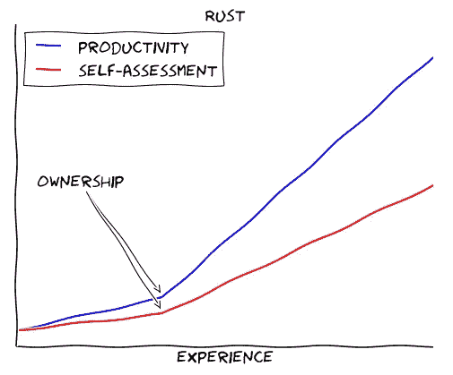
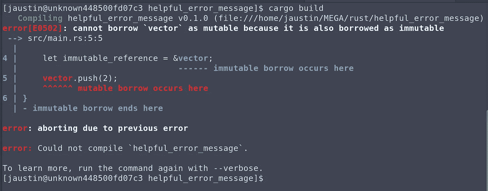
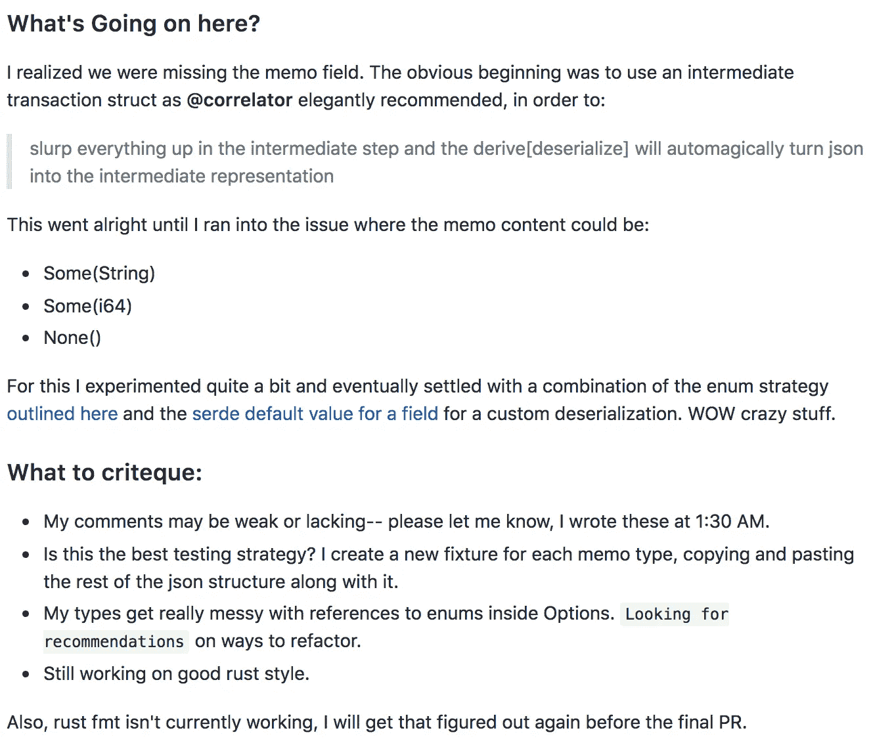

# 开源 SDK 和 Serde Magic:我作为 Rust 社区成员的头两个月

> 原文：<https://medium.com/hackernoon/an-open-source-sdk-and-serde-magic-my-first-two-months-as-a-member-of-the-rust-community-333444af761e>

我已经经历了将近两个月的生锈之旅，大多数时候我仍然会有这种感觉:

因此，我可以肯定 Rust 学习曲线的典型描述:



Credit: [https://matthias-endler.de/2017/go-vs-rust/](https://matthias-endler.de/2017/go-vs-rust/)

当然还有针对[借款检查器](https://doc.rust-lang.org/1.8.0/book/references-and-borrowing.html)的持续战争:



然而，在过去的两个月里，我确实取得了很大的进步。我有:

*   阅读最多的[锈书(第二版)](https://doc.rust-lang.org/book/second-edition/)
*   阅读部分[编程生锈](http://shop.oreilly.com/product/0636920040385.do)
*   听了几乎所有的新的 Rustacean 播客(必须的)
*   写的一个简单的 [CLI 游戏](https://github.com/robertDurst/rust-cli-game)
*   出版[我自己的板条箱](https://crates.io/crates/stellar_vanity)
*   成为[开源贡献者](https://github.com/kbacha/stellar-sdk)

那么为什么会生锈呢？毕竟，使用像 Ruby、Go 或 JavaScript 这样的语言，我可以在这一点上编写许多全栈应用程序。为什么要担心类型和所有权以及所有那些废话？

**清喉咙**

在 Rust，有一些安全保证… *是的，你知道，典型的说教。*

> 这可能足以引起我对 rust 的兴趣，但这不是我决定坚持下去的原因——最终吸引我的是这个社区。

# 我在 Rust 社区的经历


在完成 Rust [书](https://hackernoon.com/tagged/book)的几章并成功编写了一个(有问题的)链表后，我发现自己渴望开始一个 Rust 项目。这将是区块链，使用最酷的板条箱，甚至可能变成真正的大东西(所有典型的兴奋过度、雄心勃勃、不切实际的前期项目想法)。在深入研究代码之前，我决定在 Github 中寻找一些动力。在这次探索中，我偶然发现了 Rust Stellar-SDK 项目。

我决定向项目负责人发送电子邮件，解释我的情况:

> 你好，
> 
> 我目前在 Stellar 实习，开始学习 rust。
> 
> 我在 github 上四处窥探，发现了你的 SDK，它看起来很棒，看起来也在积极开发中。
> 
> 我很想知道更多！
> 
> 最后，正如我所说的，我正在努力学习 rust——所以我正在寻找一些有趣的项目，与那些有耐心与 rust 新手一起工作的人一起真正投入进去:)

仅仅几个小时后，我就收到了回复:

*   建议从哪里开始
*   对项目的全面解释
*   非常热情的欢迎，在我生锈的旅程中提供帮助

快进一个月…

在这一点上，我已经做了 5 个贡献，这个项目有 6 个贡献者，我已经开始将这个 SDK 用于[的另一个附带项目](https://github.com/robertDurst/tipmebch)，我甚至亲自见到了我的一个贡献者。很酷吧？


## 社区的故事:我最近的公关

我最近的公关故事强调了 rust 社区的帮助。

在使用 SDK 客户端库 0.1.0 版本的过程中，我意识到我们缺少了一个字段，特别是事务资源的 memo 字段。所以，我[开了一个问题](https://github.com/kbacha/stellar-sdk/issues/202)并率先进行了修复。

## 概述:

我们正在构建一个完全用 Rust 编写的一流 SDK。这个 SDK 与位于 stellar-core 客户端之上的 Horizon API 服务器进行通信。

SDK 中的每个端点方法都从 Horizon 服务器接收数据。当 SDK 接收数据时，它必须将这些数据反序列化为一个 rust 数据结构——为此，我们利用了出色的 [serde](https://crates.io/crates/serde) 库。这些数据结构是 SDK 中的资源。下面是事务资源。正如您所看到的，这个资源有许多字段，但是它没有 memo 字段。

我的工作，如上面链接的问题所述，是添加备忘录字段。

```
#[derive(Deserialize, Debug, Clone)]
pub struct Transaction {    
    id: String,    
    paging_token: String,    
    hash: String,    
    ledger: u32,    
    created_at: DateTime<Utc>,    
    source_account: String,    
    #[serde(deserialize_with = "deserialize::from_str")]
    source_account_sequence: u64,    
    fee_paid: i64,    
    operation_count: u32,    
    envelope_xdr: String,    
    result_xdr: String,    
    result_meta_xdr: String,    
    fee_meta_xdr: String,
    // INSERT MEMO HERE
}
```

那么什么是备忘录呢？

如 Stellar 文档中所定义:

## [备忘录](https://www.stellar.org/developers/guides/concepts/transactions.html#memo)

可选的备忘录包含可选的额外信息。解释这个值是客户的责任。备忘录可以是以下类型之一:

*   `MEMO_TEXT`:使用 ASCII 或 UTF-8 编码的字符串，最长 28 字节。
*   `MEMO_ID`:64 位无符号整数。
*   `MEMO_HASH`:一个 32 字节的哈希。
*   `MEMO_RETURN`:一个 32 字节的哈希，旨在被解释为发送方退款的交易的哈希。

## 最初的计划:

在与项目的其他成员讨论之后，我首先想到的是使用中间反序列化技术。关于示例，请参见此处的[。](https://github.com/kbacha/stellar-sdk/blob/master/client/src/resources/asset.rs#L302)

因此，我创建了一个中间事务，这是上面事务结构的一个几乎完整的克隆，但是具有:

```
memo_type: String,
memo: Option<String>
```

这似乎是一个合乎逻辑的解决方案，因为所有的备忘录都有一个类型，但不是每个备忘录都有一个值。不幸的是，在有值的备忘录中，有一种类型 memo id 是整数，而其余的都是字符串。由于 rust 是一种严格类型化的语言，这就使事情变得复杂了。

因此，为了处理两个 memo 值(一个整数或一个字符串)的可能性，我决定创建另一个中间结构，一个中间 memo 值。在这一点上，这里是我的:

1.  中间交易
2.  事务反序列化功能
3.  中间备忘录
4.  备忘录反序列化功能
5.  备忘录结构
6.  交易结构

仅仅添加一个字段就要做很多工作，不是吗？有点让你想知道:

## 重构开始:

一旦我有了一个工作版本(并通过一系列测试证明了它的工作)，我就提交了一份 PR 来解释这个庞然大物，并列出我特别需要帮助的地方:



通过在我们的 [gitter](https://gitter.im/stellar-sdk) 和 PR 线程上的对话，我开始了重构，并立即削减了一些明显的臃肿。然而，即使在几轮重构之后，我仍然看到一个 PR 增加了 200 多行代码，只增加了一个字段(不包括测试)。

## Rust 社区力挽狂澜:

尽管这段代码仍然很难看，但我为自己写的代码感到骄傲——记住，我对 rust 编程语言还很陌生，这些代码都是我自己写的。所以，[我决定在 r/rust 上发布](https://www.reddit.com/r/rust/comments/8fx3d2/whats_everyone_working_on_this_week_182018/dyfe2g0/?context=0)“大家这周都在忙些什么”几天后，serde 板条箱的创造者 [David Tolnay](https://github.com/dtolnay) 审查了我的公关。

> 这是一种避免复制所有事务字段的方法，它将 memo 表示为一个扁平的相邻标记的 enum，其中包含反序列化为无标记 enum 的数据。

```
#[derive(Deserialize, Debug)]
struct Transaction {
    id: String,

    /* other fields */

    #[serde(flatten)]
    memo: Memo,
}

#[derive(Deserialize, Debug)]
#[serde(rename_all = "lowercase", tag = "memo_type", content = "memo")]
enum Memo {
    Text(String),
    Id(i64),
    Hash(String),
    Return(String),
    None,
}
```

哇，不可思议！有了上面的修改，我的 PR 从:

1.  中间交易
2.  事务反序列化功能
3.  中间备忘录
4.  备忘录反序列化功能
5.  备忘录结构
6.  交易结构

简单来说:

1.  备忘录结构
2.  交易结构

本质上，使用一些厚颜无耻的 serde 技巧，我能够将我的 PR 减少到不到 50 行(不包括测试)。

# 结论

TL；博士:rust 社区太神奇了！我旅程中最精彩的部分都可以归功于 rust 社区:

*   Stellar SDK 团队非常乐意接纳我，并且有耐心帮助我。
*   David Tonlay 慷慨地为我最近的 SDK PR 重构提供了支持。
*   我每天上班路上听的新的 Rustacean 播客(Chris Krycho)如果你在读这篇文章，我很想再订购一件 t 恤
*   提供全天候帮助的锈[不和](https://discordapp.com/invite/WctVz9)
*   还有更多……

当然，拥有是困难的，我仍然没有完全理解它。当然，看起来借贷方经常故意与你作对。当然，鲁斯塔西人可能仅仅和地鼠一样酷。当然，你可以折衷一下，用 JS 3x 倍的速度编写这个应用程序。

然而，尽管如此，rust 社区非常欢迎你，当你准备退出时(或者当你遇到另一个终身错误时砸碎你的电脑)，它会在那里等你。如果您还没有接触或找到一个令人兴奋的开源项目，我强烈建议您尝试一下！

> 一个社区的伟大最准确的衡量标准是其成员富有同情心的行为。
> ——科丽塔·斯科特·金

*免责声明:虽然作为工作的一部分，我确实参与了许多开源 Stellar 项目，但我 100%在空闲时间为 Rust Stellar SDK 做贡献，从不在工作场所(通常在晚上 10 点至凌晨 12 点之间)。我没有开始这个项目，我也不是主要的维护者。我只是一个新手，希望在为一个令我兴奋的项目做贡献的同时学习 rust。*