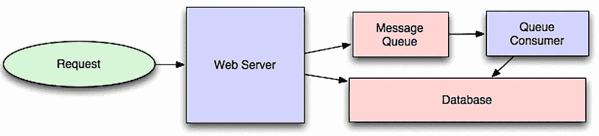
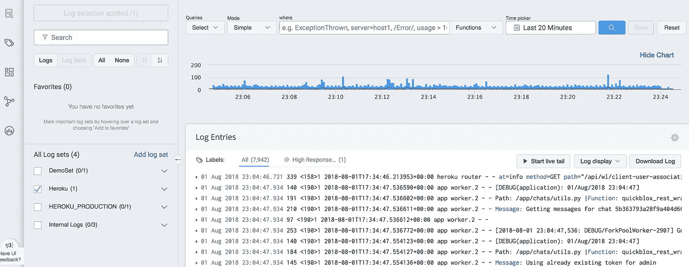

# (固执己见的)网站架构入门指南

> 原文：<https://medium.com/hackernoon/an-opinionated-beginners-guide-to-start-up-architecture-9cda2a3ba581>

*快速入门！*



当勾画出你的后端架构时，大量的选择可能会令人困惑。**决策疲劳是真实的。**

对于您选择的每一个工具，您都必须考虑社区支持，它没有考虑的边缘情况，是否有针对它的最佳实践等等。

**大多数基于网络的早期创业公司在头一两年都可以使用相当相似的架构。你将有一个应用层，一个异步任务层，缓存，一个数据库服务(从关系数据库开始，除非你真的知道你在做什么)，一个文本搜索服务和作为对象存储的 S3。**

在 [TapChief](https:///www.tapchief.com) ，我们花了很多心思来把这些做好。我们试着用 Solr 进行搜索，并意识到它并不适合我们。早期的 Redis 服务提供商过于挑剔，价格昂贵。

我列出了 TapChief 内部使用的一套**工具，它们经受住了时间的考验。希望这是一个启动他们后端架构的好方法。**

# 赫罗库

Heroku 消除了许多令人头痛的部署问题。部署到它就像编写“git push heroku”一样简单，不管您为一个给定的服务运行了多少实例(dynos)。

它还有很棒的附加服务，如 Redis、Postgres 和 AMQP。几乎没有任何对平台的锁定，你应该能够很容易地退出，因为你的代码库根本不知道 Heroku。

> Heroku 是建立在 AWS 之上的，所以如果你真的需要，你可以让一些更昂贵的服务在 AWS 上运行，让 Heroku 在同一个 AWS 区域运行其他服务。

我们通过 Nginx 和 gunicorn 部署我们的服务，并启用 gevent 实现额外并发。

```
web: bin/start-nginx gunicorn -c config/gunicorn.py tapchief.wsgi --worker-class gevent --log-file -
```

# 姜戈

一个乏味稳定的框架，有一个非常有用的管理面板功能。如果你在一家初创公司从事后台运作，你会非常感激这一点。

> Django 是一个无共享的框架，这意味着扩展它就像并行运行更多实例一样简单。它历史悠久，广受欢迎，拥有大量经过良好测试的库。StackOverflow 提供了大量的答案，可以在你遇到困难时帮你解决问题。

您也可以为您的应用程序使用 Rails 或 Play 框架。两者都遵循相似的无共享 MVC 类型的结构。但是 Django 管理面板似乎是一个独特而有用的特性。

# 类型

我承认，我想念这里的爪哇。我们是一家初创公司，我们没有太多的测试覆盖面。因为我们认为一个对象是一个字符串而实际上它是一个列表而看到运行时异常是令人痛苦的。

我们所做的是为我们使用的大多数函数的 docstring 中的所有参数编写类型。每当皮查姆认为我们在做一些不靠谱的事情时，我们就让它对我们大喊大叫。

# 皮查姆

使用真正的 IDE。它能让你毫不费力地进行重构，告诉你什么时候没有恰当地使用编码约定，并突出潜在的错误。我听说 Visual Studio 已经变得很好，比 PyCharm/IntelliJ 更少占用内存。

# 芹菜

您将需要异步性。您的应用程序服务不应该执行长时间运行的任务。相反，它应该将其卸载到一个队列中，工作进程应该在后台拾取并处理这些任务。

> 这是如何让你的应用实现规模化的关键部分。

芹菜也是设定周期性任务的好方法。想要发送关于有多少用户注册的自动化每日分析报告吗？芹菜可以覆盖你。

CloudAMQP 是 Heroku 上该系统的消息代理(队列)部分的可靠提供者。

# 雷迪斯

缓存是构建可扩展的低延迟解决方案的另一个关键部分。不经常改变的普通读取查询可以被缓存，以防止它们导致数据库命中。

> 请记住，您的数据库通常是最难扩展的。尤其是如果你去一个关系型商店。因此，使用您的缓存来“保护”您的数据库免受大量读取。

RedisGreen。Heroku 上有很多 Redis 的附加提供者。但这可能是最便宜的，并且具有最全面的指标仪表板。

# Postgres

Heroku Postgres。这是 Heroku 官方支持的附加组件。而且很优秀。每月 50 美元，您就可以获得每日自动备份、出色的指标、回滚能力，以及随时快照和下载数据库的快捷方式。

Django 和 Postgres 玩得特别好。

# Django Rest 框架

将 UI 层抽象为 Rest APIs 比使用 Django 的模板系统更好。通过这种方式，您可以支持多个不同的客户端。Django 的 Rest 框架在这里是一个很好的选择。

# S3

不要从后端提供静态内容。像 Django 这样的应用服务器尤其不是为此而设计的。Nginx 仍然是一个合理的选择。

# 云耀斑

使用像 CloudFlare 这样的 CDN 来缓存和交付静态文件。

# 棱角分明？反应？Vue？

我们在 TapChief 用过 Angular。我们绝对喜欢它！

我们喜欢结构化的固执己见的框架，它消除了选择一起使用哪些包的认知负担。这种包含电池的方法是我们喜欢 Django 胜过 Flask 的原因。我们发现 Angular，Universal 和 NativeScript 取得了非凡的成功。

但不知何故，社区的其他人似乎都在 React 和最近的 VueJS 周围聚集。*耸耸肩*

我真的不知道在这里选什么。(挑有棱角的！)

# 日志条目

这是一个简单的点击式免费解决方案，可以获取过去 7 天的日志。非常容易安装，并作为 Heroku 的附加软件提供给你在那里托管的任何服务。应该有更广泛的日志选项的付费计划，但我们不需要探索它们。



## 弹性搜索

搜索是您应该从应用服务器和主数据库中卸载的首要任务之一。而 ElasticSearch 为 Python 提供了一个非常好的 DSL。

Heroku 上的 Bonsai ElasticSearch 对我们来说是一种简单的扩展方式和可靠的选择。

# 可量测性

这通常与并发性混为一谈。(水平)可伸缩系统是指添加更多机器会导致系统能够处理的工作负载线性增加的系统。

> Django 在这里很棒，因为它是无国籍的。一个 Django 实例不足以满足您所有的请求？好吧，只要在你的负载平衡器后面再加几个就行了。(嘘..这个用 Heroku 超级简单)。

就并发性(每个系统的请求数)而言，基于 Go 的 REST API 服务可能会做得更好。但是使用 Nginx 缓冲您的请求并在启用 gevents 的情况下使用 gunicorn，您可以走得很远。

当然，这里真正的瓶颈是您使用的关系数据存储。这些产品的横向扩展能力不如 NoSQL 同类产品。使用 Django 和 NoSQL 商场来解决这个问题是完全可能的。

但是要确保您的系统负载足够重，以保证 NoSQL 系统能够增加额外的复杂性。

# 抽象

听说过软件工程的[基本定理](https://en.wikipedia.org/wiki/Fundamental_theorem_of_software_engineering)吗？

***间接*** 。软件中的大多数问题都是因为一层对另一层做了某些假设。

好吧，好吧，这不是一个真正的定理，但值得注意的是，计算机科学中有多少问题可以通过一个额外的间接层来解决。

> 作为架构师，你的目标是保持系统的灵活性。

经典的 Django MTV 架构假设通过 ORM 访问关系存储。胖模型，即业务逻辑与通过 ORM 生成的对象相结合是很常见的。

如果您以后需要将 NoSQL 用于一些繁重的事务性对象，该怎么办呢？移除所有的商业逻辑将是一件痛苦的事情。

相反，我们可以在视图和 ORM 之间保留一个服务层。我们的业务实体可以是普通的 Python 对象。(Java 世界中对 POJOs 的称呼)。

您可以通过一个接口访问它们，不管它们是来自 ORM 还是您为 NoSQL 商店构建的另一个适配器。

这是不是有点过了？这实际上取决于您的用例。如果您确定需要非常快速地处理这种工作量，这种方法是可行的。

> 如果你能在一两年内坚持使用 Postgres 和 Redis，你可能就不应该为此而烦恼。你可以慢慢地将你想要的实体提取出来，转移到 NoSQL 的商店。不管怎样，你都不太可能想把整个数据库都搬到 NoSQL。

你会注意到这是一个非常单一的架构。面向服务的体系结构可能是您最终的方向，但是在您应该积极尝试寻找产品市场适应性的时候，从这个方向开始通常会减慢开发。

请注意，您可能必须迁移到 SOA，并尽可能将不同的概念分开。这样，您将能够在以后将不同的实体剥离到它们自己的服务中。

# 阅读黑客新闻

谷歌*“hacker news golang vs Java”*。你会看到在野外使用不同技术的人们之间的高质量讨论。

Hackernews 已经建立了一个伟大的社区，社区里的人都是做东西的。人们分享他们使用新语言、框架和技术的经验。可以把它看作是技术领域表现更好的 Reddit。

Hackernews 上关于选择“正确”框架的有趣的[讨论](https://news.ycombinator.com/item?id=16332091)。

> 我知道这实际上不是架构的一部分，但是讨论有助于形成您对各种工具的权衡的理解。

试图将所有的部分组合在一起以构建一个可扩展的架构是令人难以置信的。但这是后端工程真正有趣的部分。快速交付与“正确”架构之间的权衡。缓存什么以及在哪里缓存。何时转移到 NoSQL 商场。积累多少技术债才能得到产品清晰。

经营自己的初创企业？告诉我们您使用什么堆栈/工具/架构。听到别人在用和我们一样的工具，总是让人感到安慰！

想要一个不那么面向工具的技术架构设计指南吗？你应该看看罗伯特·c·马丁的《T4 清洁建筑》。

或者更快地了解一下后端架构:[https://github.com/donnemartin/system-design-primer](https://github.com/donnemartin/system-design-primer)