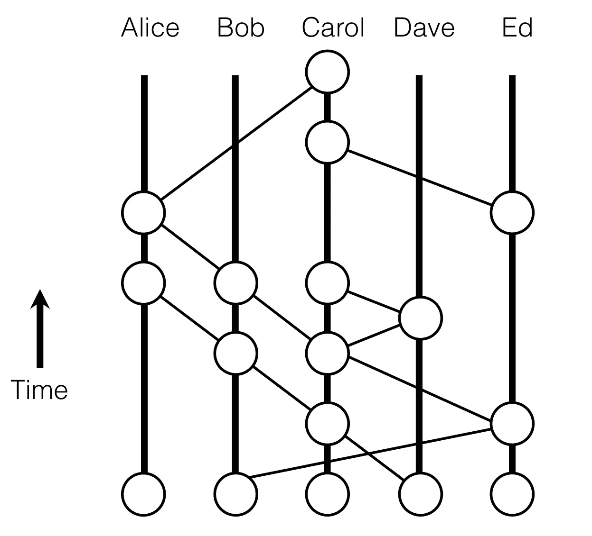
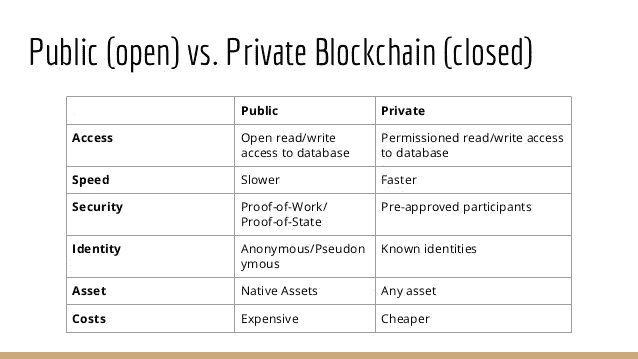

# 哈希图概述

> 原文：<https://medium.com/hackernoon/an-overview-of-hashgraph-b0900a1fd7bf>

Simple Overview of the Hashgraph Protocol

分布式账本技术(DLT)是一种系统，在这种系统中，我们共享信息，我们不单独信任彼此，但我们信任整个团队。DLT 允许我们对事务的顺序和时间戳达成共识。

# **介绍哈希表**

Hashgraph 是由 Swirlds 开发的。漩涡的联合创始人兼首席技术官是 Leemon Baird，他在美国空军学院获得了学士学位，并在卡内基梅隆大学获得了计算机科学博士学位。

Hashgraph 是一个 DLT。然而，hashgraph 不是区块链，因为它不是建立在一系列的块上。Hashgraph 最好被描述为一个有向无环图。

其他 DLT 解决方案可能是安全的，但它们不是特别快或公平。以下用例要求公平和速度:

*   在股票市场上撮合买卖双方
*   暗池
*   在线视频游戏
*   拍卖
*   谁先归档很重要
*   专利
*   域名

Hashgraph 修复了以前的 DLT 所面临的许多缺陷:Hashgraph 非常快、安全、公平。让我们逐一检查这些要点。

## **哈希图快**

与其他 DLT 相比，Hashgraph 的吞吐量非常高。即使只有一个碎片，它也能实现每秒几十万次的交易。此外，hashgraph 的延迟很小——事务发送出去只需要几秒钟。

Hashgraph 通过所谓的“八卦协议”达到这个速度

## **Hashgraph 是安全的**

hashgraph 的一致性算法是异步拜占庭容错(异步 BFT)。这意味着，如果在一个网络中有任何两个给定的交易，我们作为一个社区可以就这些交易的顺序达成一致。它还假设系统中不超过⅓的人试图破坏系统。

异步 BFT 是拜占庭容错的最强形式。有了它，有一个时刻，你 100%确定你有共识。它使用一个数学证明，这样你就永远不会弄错你达成共识的时间。异步 BFT 允许网络经受住恶意节点、防火墙和 DDOS 攻击。异步拜占庭共识算法并不新鲜:它们在三十年前就存在了。当时，它们的问题是，那些算法太慢了，你永远不会使用它们。如上所述，hashgraph 能够通过 gossip 协议解决速度问题。

让我们将异步 BFT 与其他一些共识算法进行对比，比如我们轮流成为领导者的分布式利害关系证明。问题如下:如果攻击者可以一次关闭一台计算机，那么他们就可以关闭你的整个网络，因为他们需要做的只是关闭系统的领导者。当一台新的计算机成为领导者时，攻击者需要做的就是继续跟踪新的领导者并攻击他们。

## **哈希图是公平的**

Hashgraph 还提供了公平的排序和公平的时间戳。让我们以股票市场为例，首先关注为什么公平排序很重要。如果我出价购买 X 的股份，一秒钟后你出价购买 X 的股份，我的出价应该比你的优先。但是如果由于某种原因网络出现混乱，你的出价比我的优先，那就非常糟糕了。股票市场的交易排序非常重要:华尔街的高频交易公司花费数百万美元将提交报价的时间缩短了几毫秒。

公平的时间戳也很重要，因为它让您相信社区作为一个整体而不是一个矿工标记了时间戳。假设有一个付款纠纷，有人声称你没有按时付款。但实际上你在截止日期前付了钱。Hashgraph 解决了这个问题，因为它使用了你可以诉诸法庭的加密证据。你可以去法院说“事实上，根据这个时间戳，我确实在最后期限之前把钱寄给了约翰。这不仅仅是一名矿工的意见，而是整个社区对时间戳的贡献”。

关于 Hashgraph 有几个关键点需要提及。第一，Hashgraph 没有加密货币。其次，它没有公共分类账。相反，Hashgraph 是一个*许可的*分类账。

你可能会问:无论如何，公开的和许可的分类账有什么区别？

## **公共分类账和许可分类账:它们是什么，为什么你用其中一个而不用另一个**

在公共账本中，任何人都可以是网络中的一个节点。以市值最大的公共账户比特币为例。任何人都可以使用比特币的密钥，任何人都可以加入网络，任何人都可以成为矿工，在帮助网络运行时获得报酬。任何人都可以看到网络上的交易，任何人都可以在比特币链上编写新的区块(只要他们遵循构成有效比特币区块的参数)。

另一方面，许可分类帐需要许可(因此得名)才能在网络上或对网络执行某些活动。许可分类帐可以限制能够在区块链上进行交易的人和组，并且限制能够在链上写入新块的人和组。许可分类帐的所有者可以决定谁可以是网络上的交易验证者。本质上，有权限的分类帐要求您拥有运行完整节点的权限。

那么，为什么要使用许可分类帐而不是公共分类帐呢？在您不希望普通人能够运行完整的分类帐节点的情况下。

许可分类账对于那些关心保密的行业非常有用。金融业就是这种行业的一个很好的例子。暗池(也称为黑池)，用于交易证券和衍生品的私人论坛，将是金融业的一部分，在这里需要许可，而不是公共分类账——你会希望暗池的每个节点都需要许可，节点之间的通信都要加密。Hashgraph 的许可分类账将为场外衍生品市场带来透明度和公平性。swirleds 还非常关注 hashgraph 的安全性:swirleds 实际上已经实现了符合加密标准的加密，以保护绝密的政府信息。

# 结论

## 共享世界:Hashgraph 的愿景

Leemon Baird 在一次采访中表示，公司名称“漩涡”是短语“共享世界”的组合词。Leemon 发现的一个问题是，尽管我们拥有可以让我们与地球上几乎任何人交流的技术，但我们比以往任何时候都感到更加缺乏社交联系。麻省理工学院的研究员雪莉·特克在她的书《单独在一起的 T2》中研究了这一现象。 Leemon 认为，之所以会出现这种情况，是因为技术让我们在与他人进行技术交流时分心，而不是专注于他人。共享世界可以解决这个问题。

漩涡的目标是让人们自发地、安全地、自己创造共享世界，而不需要依赖任何人或任何事。想象一下，你可以在自己构建的共享世界中创建自己的快速、安全、公平的股票市场。

此外，漩涡旨在让人们免费做所有这些事情。这将消除对广告商的需求，因为如果服务器可以免费运行，那么就没有必要为不存在的服务器成本做广告。这对广告业有着巨大的影响；它将消除基于为广告监视人们行为的行业。

披露:以上所有内容均基于 Hashgraph 网站的信息以及 Leemon Baird 在 YouTube 上的采访和谈话。我写这篇文章没有报酬，也不是 Hashgraph 团队的员工。

你可以通过捐赠 ETH 或其他 ERC20 令牌到这个地址来支持我:0x 0 BCB 78d 67 d8d 929 DC 03542 a5 aedef 257 f 378 e 513

想直接联系我吗？你可以在我的简历中找到我的电子邮件。