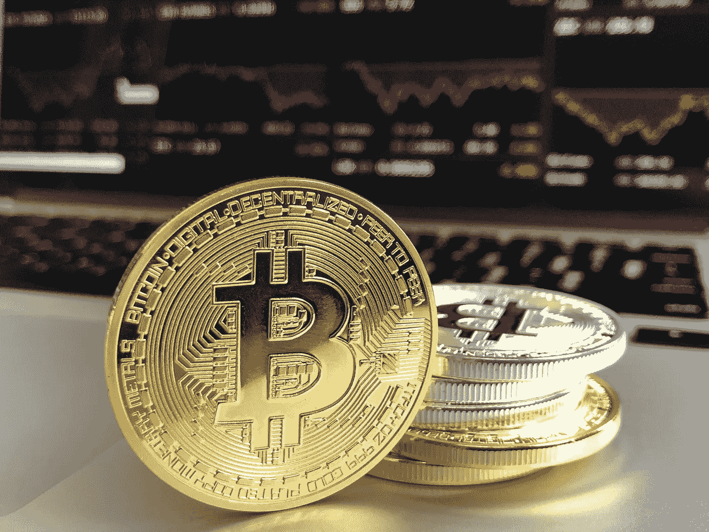

# 美国股票上市和私募发行概述

> 原文：<https://medium.com/hackernoon/an-overview-of-stos-and-private-offerings-in-the-us-f11906581872>

你拥有一家初创公司，或者在曼哈顿拥有一栋办公楼，你已经听到了很多关于将你的资产转化为安全令牌的传言。您可能有许多问题，比如“什么是安全令牌？”，“为什么我应该使用安全令牌？”，以及“我该怎么做？”。我将帮助回答这些问题，并解释为什么发行安全令牌只是传统安全发行的更快、更现代、更有价值的扩展。

什么是安全令牌？

“安全令牌”在法律上等同于传统证券。证券和安全令牌之间的唯一区别是记录所有权的方式。简而言之，安全令牌是一种在区块链上被转化为数字资产的证券。如果这听起来对你来说很陌生，看看德勤整理的这本有帮助的[初级读本](https://www2.deloitte.com/insights/us/en/topics/emerging-technologies/blockchain-technical-primer.html)，它解释了区块链技术的基础。

简单介绍一下:区块链是计算机网络(节点)上共享的交易的永久性分类账。为了将一笔交易加入分类账，它必须由网络中的其他成员核实，然后存储在所有先前块的序列“链”末端的一个条目“块”中。由于在区块链上验证和存储数据的性质，有几个特征使其成为记录和转移资产所有权的理想机制:

1.  它是不可信的——因为分类账在网络中的所有节点之间共享，没有一方负责诚实地输入每个条目。相反，各成员必须共同努力达成共识，消除对中央权威机构的信任。
2.  它是透明且不可变的——所有事务的记录都存储在先前块的“链”上。这些是无法改变的。通过使用区块链，各方不再需要维护各自的总账:相反，他们可以使用区块链的共享记录。

我从[港](https://harbor.com/)的首席执行官乔希·斯坦那里听到了一个有用的资产令牌化类比。他将安全令牌和证券的区别等同于电子邮件和普通邮件的区别。在电子邮件出现之前，书面通信又慢又低效。由于寄信所付出的努力，人们并没有那么频繁地寄信。不仅如此，收信人还要等几天才能收到信。

电子邮件使交流变得更加高效和普遍。想想你发送的所有电子邮件。对于他们中的多少人，你会花时间写一封信，在信封上写地址，把信放进信封，舔，封，贴邮票，然后寄出？令牌化提供了一个更有效的证券市场和一个更大更活跃的证券市场的前景。就像从蜗牛邮件到电子邮件的演变导致书面交流更加高效和普遍一样，证券令牌化将使交易更加频繁和高效，并将使投资者能够接触到更多的资产类别。

为什么发行者应该使用安全令牌？

与传统的安全相比，发行安全令牌有许多优点。主要的好处可以分为透明度、自动结算、细分、全球可用性和流动性。

**透明度:**

每个交易的透明性意味着区块链可以作为您的安全令牌所有权的公共记录。目前，要求私人发行者保持一个记录其证券所有权的资本化表，这可能是昂贵的。在被要求上市之前，公司最多只能拥有 2000 名股东。正因为如此，大多数私营公司限制其股东转让股份，从而剥夺了投资者和员工的流动性，损害了他们的利益。通过令牌化，可以将法规编码到令牌中，允许发行者授权交易，而不必担心与 SEC 法规冲突。发行代币而不是证书消除了记录成本，增加了股东的流动性。

**自动结算:**

通过区块链结算交易降低了交易成本。在传统的证券交易中，有几方负责作为可信的中介来帮助结算交易。例如，中央对手清算在交易过程中充当可信的第三方，以防止任何一方违约。在证券代币交易中违约是不可能的，因为交易只有在双方都有足够的资金支付其债务的情况下才能被确认。因此，没有必要让寻租的第三方参与交易。

令牌化也大大减少了事务时间。传统的公开股权交易在 T+2 结算。这意味着交易在启动后 2 个工作日内得到确认。因此，如果你在周一购买股票，交易实际上要到周三才能完成。私人股本交易可能需要 30 至 90 天才能完成。一旦在区块链上确认了代币的交换，就确认了安全代币交易。几乎所有的安全令牌都是在以太坊网络上发行的，以太坊上的块确认平均时间为 10-20 秒，因此令牌化将结算减少了几个数量级。

**细分:**

让我们回到曼哈顿的那栋办公楼。假设它价值 1 亿美元。试图出售价值一亿美元的资产总是很困难，最终会导致你以低于全价的价格出售资产。这种折扣背后有几个原因:首先，因为愿意购买如此大规模资产的买家数量有限，其次，因为买家了解资产的非流动性，不愿意为难以转售的资产支付这么多。现在想象一下，你可以把你的办公楼分成一百万股自由流通的股票。通过令牌化，几乎所有投资者都有能力拥有一块纽约房地产，这增加了需求，而且因为股票是流动的，投资者愿意为房地产的每一部分支付更多的钱。你刚刚以高于原本的价格卖掉了这栋楼，仅仅是因为所有权被象征性地转让了。

**全球供货:**

将你的证券令牌化不仅为美国的小投资者打开了投资机会，也为全世界各个层次的投资者提供了更容易的途径。以传统方式购买外国证券是一个复杂的过程。即使这些证券是可获得的，它们也常常被层层成本和晦涩所包裹。通过代币化，中国或比利时的投资者可以很容易地购买你的产品，从而增加全球需求和流动性。

所有这些优势使得安全令牌比传统令牌更有价值。正如我在观察曼哈顿建筑的象征化时提到的，流动性增加通常会导致价值增加，因为投资者愿意为他们知道可以轻松交易的资产支付更多的钱。可分性的提高、费用的降低、结算速度的加快以及全球的可获得性都有助于提高令牌化资产市场的流动性，从而提高令牌的价值。所有权的自动结算和自动记录也增加了代币的价值，因为在代币交易中中间人和管理者损失的价值要少得多。

**安全令牌是如何提供的？**

**技术**

令牌化的好处应该是显而易见的，但是对资产进行令牌化的途径可能不那么清晰。没有区块链编程的背景，将很难把资产转化为可用的令牌。幸运的是，有几个专门用来帮助创建和发行安全令牌的平台。从技术角度来看，绝大多数安全令牌都是 ERC-20 令牌——这些令牌建立在以太坊区块链之上，符合 ERC-20 技术标准。本质上，ERC-20 标准引入了令牌应该遵循的一组规则，以确保它们彼此之间以及与以太坊网络之间能够正常交互。这有一个额外的好处，即创建一个简单且广泛可用的代码模板，可用于创建 ERC-20 令牌。从技术角度来看，在以太坊上创建 ERC-20 令牌的行为相当简单，在安全令牌发行平台的帮助下，它可以像选择名称、股票代码和令牌供应一样简单。

除了 ERC-20 标准，以太坊上还有新的安全令牌标准提案，如 ERC-1400 和 ERC-1450。

**符合性**

在加密货币的早期，最初的硬币发行(ico)是在不考虑美国安全法规的情况下提供的。这主要是因为通过这些 ico 发行的代币是所谓的“公用代币”，并不代表传统证券。这并不意味着它们本身不是证券，就像这个[针对加州食品应用 Munchee 的停止令](/new-alchemy/munch-on-this-the-future-of-icos-after-the-sec-crackdown-c95430f7d447)所证明的那样。SEC 最近的声明让代币发行的监管变得更加清晰。SEC 主席 Jay Clayton 发表的类似于 [this](https://coincenter.org/entry/sec-s-clayton-use-of-a-token-can-evolve-toward-or-away-from-being-a-security) 的声明表明，令牌是否为证券的判定是基于个案的。这个决定主要是通过应用[豪威测试](https://www.investopedia.com/terms/h/howey-test.asp)做出的。

安全令牌的分类没有不确定性。根据定义，安全令牌是证券。因此，它们必须遵循与任何其他产品相同的法规。在美国围绕证券发行的监管框架中导航是一个令人困惑和困难的过程。许多安全令牌发布平台也将帮助您做到这一点。选择哪种豁免在很大程度上取决于所提供的证券、筹集了多少资金、谁可以投资以及各种其他因素，因此我准备了最常用的筹款豁免的快速总结，以帮助澄清每种豁免之间的差异。

**Reg CF**

优点:

*   Reg CF 向所有美国投资者开放。
*   简单的备案流程 Reg CF 发行要求发行人提交 SEC 表格 C

缺点:

*   最高 107 万美元/年
*   证券被限制一年
*   需要财务报表
*   报告—提供 Reg CF 产品的公司成为报告公司，必须提交年度和半年度报告。

Reg CF 非常适合寻求从活跃的客户群中筹集少量资金的公司。Reg CF 允许公司以其他企业家过去使用 Kickstarters 的方式进行融资，尽管他们不是出售 iPhone 配件或棋盘游戏，而是出售股权或其他一些证券。使用 Reg CF 有利于发行人，因为它创建了一个积极参与的投资者群体，为项目做免费广告。不利的一面是，相对于能够筹集到的资金，这是一个复杂的过程。发行人在完成后成为一个报告公司。

**Reg A+**

Reg A+产品分为两层。一级资本允许最高 2000 万美元的加薪。第 2 级允许最高 5000 万美元的加薪。

优点:

*   最高 5000 万美元
*   向认可和未认可的投资者开放。
*   证券不受限制
*   试水——利用 Reg A+的公司可以从潜在投资者那里获得兴趣指标，以确定是否值得继续进行正式的 Reg A+审批流程。

缺点:

*   困难的认证过程—Reg A+的认证过程既昂贵又耗时。美国证券交易委员会的审查过程通常需要 3 个月左右，进行一级发行的公司也必须接受国家审查。
*   报告—根据 Reg A+执行二级发行的公司必须向 SEC 提交年度和半年度报告(一级发行不要求报告)。

Reg A+发行的主要好处是，出售的证券将不受限制。这些证券可以立即交易，允许投资者立即利用令牌化提供的流动性优势。此外，Reg A+发行面向所有人，而不仅仅是合格的投资者，如果你试图获得广泛的投资者基础，这是一个很好的选择。使用 Reg A+的缺点是困难和昂贵。注册过程是所有豁免中最困难的，可能需要很长时间——通常超过 90 天。

**规则 D 第 504 条**

优点:

*   任何人都可以投资
*   简单的归档过程—发行人必须向 SEC 提交表格 D

缺点:

*   最高 500 万美元
*   只有在特定情况下才允许一般招标
*   证券通常是受限制的

Reg D 规则 504 对于希望募集 500 万美元或更少资金的发行人来说是个好消息。相对来说比较容易，而且是面向普通大众的。不利之处在于，通过 Reg D 出售的证券通常受到限制，并且通常不允许进行一般的招揽。如果已经有很多投资者感兴趣，这很好，但如果你希望宣传你的产品并围绕你的业务建立兴奋感，这就不太好了。

**规则 D 第 506(c)条**

优点:

*   无限提高金额
*   允许一般招标
*   简单的归档过程—发行人必须向 SEC 提交表格 D

缺点:

*   所有投资者都必须获得认证——本质上，你只能通过机构和富人筹集资金。
*   证券受到限制

Reg D 506(c)是美国最常用的私人筹款豁免。它之所以受欢迎，是因为备案过程简单，你可以打广告，你可以筹集无限量的资金。唯一的不利之处是，这些证券将受到限制，你必须确保所有投资者都得到认可。

**Reg S**

优点:

*   无限提高金额
*   只要不针对任何美国投资者，一般征集是允许的

缺点:

*   不能卖给美国投资者
*   证券是受限制的——一般来说，根据 Reg S 出售的证券在一年内不能转售给美国投资者

Reg S 是针对希望向美国以外的投资者出售证券的美国发行人和外国公司的法规。这并不是真正的豁免。这在更大程度上是美国将司法管辖范围扩大到境外发行的证券，试图阻止这些证券回流到美国投资者手中。当发行人同时向美国和国际投资者出售时，Reg S 通常与其他豁免之一结合使用。

**组装在一起**

希望这篇文章已经让您相信了标记化的优点。下一步是找到合适的合作伙伴来帮助你把你的资产变成一个象征。像[证券化](https://securitize.io/)或者前面提到的[港](https://harbor.com/)这样的平台专门从事安全令牌的创建和发行。一旦发行，这些代币可以在二级交易所上市，增加代币持有者的流动性。标记化不应该是可怕的或陌生的，它只是一种更快、更好、更便宜的表示资产所有权的方式。

*免责声明:这些观点仅代表我个人，并不代表 Sharespost 或我可能建议或投资的任何公司的观点。我不是律师，也不提供法律、商业或税务建议。*

*请关注我的*[*Twitter*](https://twitter.com/John1wu)*，*[*Medium*](/@John1wu)*，以及*[*LinkedIn*](https://www.linkedin.com/in/johnwu87/)*如果你想连接。*