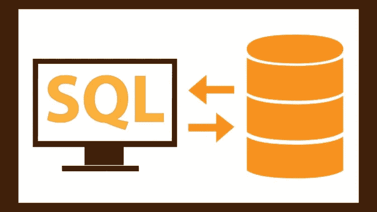

# 一个 SQL cheatsheet，包含您可能需要的一些最常见的查询

> 原文：<https://medium.com/hackernoon/an-sql-cheatsheet-with-some-of-the-most-common-queries-that-you-may-need-d198b2a83678>

Img source: udemy.com

作为开发人员一直在使用的最著名的语言之一，至少了解一些关于 SQL 的知识会很有帮助。当然，你可以参考它的一个在线文档，或者在 w3schools.com 查阅，但是你也可能更喜欢一个快速的小抄，你可以用它来刷新你的知识或者学习一些你以前可能没有学过的东西。一个相对较新的 [Github 存储库](https://github.com/enochtangg/quick-SQL-cheatsheet)已经创建，至少在撰写本文时是这样，其中包含一些您可能在日常任务中使用的最常见的 SQL 命令。

它包括查找和修改数据、报告、连接、查看以及修改表格的命令。下面是分为六类的命令列表。

## **1。查找数据查询**

## 选择:用于从数据库中选择数据

*   SELECT * FROM table _ name

## DISTINCT:过滤掉重复值并返回指定列的行

*   SELECT DISTINCT column _ name

## 其中:用于过滤记录/行

*   SELECT column1，column2 FROM table_name WHERE 条件；
*   SELECT * FROM table_name 其中条件 1 和条件 2；
*   SELECT * FROM table_name WHERE 条件 1 或条件 2；
*   SELECT * FROM table _ name WHERE NOT condition；
*   SELECT * FROM table _ name WHERE condition 1 AND(condition 2 OR condition 3)；
*   SELECT * FROM table _ name WHERE EXISTS(SELECT column _ name FROM table _ name WHERE condition)；

## ORDER BY:用于按升序或降序对结果集进行排序

*   SELECT * FROM table_name ORDER BY 列；
*   SELECT * FROM table_name ORDER BY 列 desc；
*   SELECT * FROM table _ name ORDER BY column 1 ASC，column 2 desc；

## 选择顶部:用于指定从表格顶部返回的记录数

*   SELECT TOP number columns _ names FROM table _ name WHERE 条件；
*   SELECT TOP percent columns _ names FROM table _ name WHERE 条件；
*   并非所有数据库系统都支持 SELECT TOP。MySQL 的等价物是 LIMIT 子句
*   SELECT column _ names FROM table _ name 限制偏移量，计数。

## LIKE:WHERE 子句中使用的运算符，用于搜索列中的特定模式

*   %(百分号)是一个通配符，代表零个、一个或多个字符
*   _(下划线)是代表单个字符的通配符
*   SELECT column _ names FROM table _ name WHERE column _ name LIKE pattern；
*   比如“a%”(查找任何以“a”开头的值)
*   像“%a”(查找任何以“a”结尾的值)
*   如“%或%”(查找任何位置有“或”的值)
*   LIKE '_r% '(查找第二个位置有“r”的任何值)
*   如“a_%_% ”(查找任何以“a”开头且长度至少为 3 个字符的值)
*   LIKE '[a-c]% '(查找任何以“a”、“b”或“c”开头的值

## IN:允许您在 WHERE 子句中指定多个值的运算符

*   本质上，IN 运算符是多个 or 条件的简写
*   SELECT column _ names FROM table _ name WHERE column _ name IN(value 1，value2，…)；
*   SELECT column _ names FROM table _ name WHERE column _ name IN(SELECT 语句)；

## BETWEEN:运算符选择给定范围内的值

*   SELECT column_names FROM table _ name，其中 column _ name 介于 value1 和 value2 之间；
*   SELECT * FROM Products WHERE(value 1 和 value2 之间的 column _ name)AND NOT column _ name 2 IN(value 3，value 4)；
*   SELECT * FROM Products，其中 column_name 介于#01/07/1999#和#03/12/1999#之间；

## **NULL:字段中没有值的值**

*   SELECT * FROM table_name，其中 column_name 为 NULL
*   SELECT * FROM table_name，其中 column_name 不为 NULL

## AS:别名用于为表或列分配一个临时名称

*   从表名中选择列名作为别名；
*   从表名中选择列名作为别名；
*   选择列名作为别名 1，列名 2 作为别名 2。
*   SELECT column_name1，column_name2 +'，'+ column_name3 作为别名；

## UNION:用于合并两个或多个 SELECT 语句的结果集的运算符

*   UNION 中的每个 SELECT 语句必须具有相同的列数
*   列必须具有相似的数据类型
*   每个 SELECT 语句中的列顺序也必须相同
*   SELECT columns _ names FROM table 1 UNION SELECT column _ name FROM table 2；
*   UNION 运算符仅选择不同的值，UNION ALL 将允许重复

## ANY|ALL:运算符，用于检查 WHERE 或 HAVING 子句中使用的子查询条件

*   如果任何子查询值满足条件，ANY 运算符将返回 true
*   如果所有子查询值都满足条件，则 ALL 运算符返回 true
*   SELECT columns _ names FROM table 1 WHERE column _ name 运算符(ANY | ALL)(SELECT column _ name FROM table _ name WHERE 条件)；

## **GROUP BY:通常与聚合函数(COUNT、MAX、MIN、SUM、AVG)一起使用的语句，用于按一列或多列对结果集进行分组**

*   SELECT column_name1，COUNT(column _ name 2)FROM table _ name WHERE 条件 GROUP BY column _ name 1 ORDER BY COUNT(column _ name 2)desc；

## **HAVING:这个子句被添加到 SQL 中，因为 WHERE 关键字不能与聚合函数一起使用**

*   SELECT COUNT(column_name1)，column _ name 2 FROM table GROUP BY column _ name 2，其中 COUNT(column_name1) > 5。

## **WITH:通常用于检索分层数据或在查询中多次重用临时结果集。**也称为“常用表表达式”

*   递归 cte 为(
*   选择 c0。*从类别 c0 开始，其中 id = 1 #起点
*   联合所有
*   选择 c1。*从类别作为 c1 连接 c1 上的 cte . parent _ category _ id = cte . id
*   )
*   选择*
*   来自 cte

## **2。数据修改查询**

## **插入:用于在表格中插入新的记录/行**

*   向 table_name (column1，column2)中插入值(value1，value 2)；
*   INSERT INTO table_name 值(value1，value 2…)；

## **更新:用于修改表中已有的记录**

*   UPDATE table _ name SET column 1 = value 1，column2 = value2 WHERE 条件；
*   UPDATE table _ name SET column _ name = value；

## **删除:用于删除表中已有的记录/行**

*   从 table_name WHERE 条件中删除；
*   DELETE * FROM table _ name

## **3。报告查询**

## **计数:返回出现的次数**

*   SELECT COUNT(DISTINCT column _ name)；

## **MIN()和 MAX():返回所选列的最小/最大值**

*   SELECT MIN(column _ names)FROM table _ name WHERE 条件；
*   SELECT MAX(column _ names)FROM table _ name WHERE 条件；

## **AVG():返回数值列的平均值**

*   从表名 WHERE 条件中选择 AVG(列名);

## **SUM():返回数值列的总和**

*   SELECT SUM(column _ name)FROM table _ name WHERE 条件；

## **4。连接查询**

## **内部连接:返回在两个表中都有匹配值的记录**

*   从表 1 的表 1 内部联接表 2 中选择 column_names，column _ name = table 2 . column _ name；
*   SELECT table1.column_name1，table2.column_name2，table3.column_name3 FROM((关系上的表 1 内部连接表 2)关系上的内部连接表 3)；

## **左(外)连接:返回左表(表 1)中的所有记录，以及右表(表 2)中的匹配记录**

*   SELECT column _ names FROM table 1 LEFT JOIN table 2 ON table 1 . column _ name = table 2 . column _ name；

## **右(外)连接:返回右表(表 2)中的所有记录，以及左表(表 1)中的匹配记录**

*   SELECT column _ names FROM table 1 RIGHT JOIN table 2 ON table 1 . column _ name = table 2 . column _ name；

## **完全(外部)连接:当左表或右表中有匹配时返回所有记录**

*   SELECT column_names FROM table1 完全外部联接 table 2 ON table 1 . column _ name = table 2 . column _ name；

## **自联接:常规联接，但表是与自身联接的**

*   SELECT column_names FROM table1 T1，table1 T2 WHERE 条件；

## **5。查看查询**

## **创建:创建一个视图**

*   将视图 view_name 创建为 SELECT column1，column2 FROM table_name WHERE 条件。

## **选择:检索视图**

*   SELECT * FROM view _ name

## **删除:删除一个视图**

*   删除视图 view _ name

## **6。变更表格查询**

## **添加:添加一列**

*   ALTER TABLE TABLE _ name ADD column _ name column _ definition；

## **修改:改变**列的数据类型

*   ALTER TABLE table_name 修改 column _ name column _ type

## **删除:删除一列**

*   请删除列 column _ name

这是在撰写本文时，在这个项目的主分支上发布的完整列表。您可以回过头来参考[以查看这个列表](https://github.com/enochtangg/quick-SQL-cheatsheet)以及这些查询的其他潜在的添加和改进。