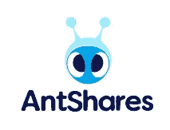

# 中国低估的区块链市场对你来说是个好消息

> 原文：<https://medium.com/hackernoon/an-undervalued-blockchain-market-in-china-is-good-news-for-you-d0c010170622>

## 为什么投资中国区块链项目可能是你做过的最好的决定

现在是区块链的西部荒野。似乎每天都有数十个新的 ico 和项目进入我的视野。coinmarketcap.com[上有 1426 个项目(自从我开始写这篇文章以来已经增加了 36 个)，仅仅是决定哪些代币值得你花钱的前景就令人生畏。我认为通常人们会选择三条路中的一条。一些人分散投资于市值最高的硬币——比特币、莱特币、Dash、以太币——并持有。这就像指数基金相当于加密投资。他们的资产可能会随着市场增长，有望获得可观的回报。**如果你想接触一些 crypto，但又不想它消耗你的生活，就这么做吧。**但大多数人想要更多；这个市场发展如此之快，以至于几乎每周都会有另一个项目的价值突然飙升。当你站在场外看着一枚象征性的火箭升空时，FOMO 是发自内心的。因此，许多人选择了第二种选择:在 Reddit 和 Twitter 上闲逛，阅读评论，试图抓住下一个众所周知的瓶子里的闪电。本质上:试着在船离开车站前登船。这没什么不好；有时候很管用。 ***但为什么会这样:因为市场是如此的不理性*** *。*因为市场可能会受到业内少数大人物的巨大影响。**Reddit 上的那些人，*他们知道的不比你多。*事实如此**。有时候从这些“骗子”身上淘金是可能的，因为有足够多的人正在做你正在做的事情。如果有足够多的人突然想要购买代币；它会爆炸。](https://coinmarketcap.com/)

这就是为什么约翰·迈克菲可以改变市场，杰米·戴蒙的评论可以暂时摧毁比特币。但是第三个选择是真正的钱从哪里来。第三个选择是做跑腿工作；*读数*，*读数*，更有*读数*。在每个人都开始谈论之前，寻找被低估的股票并进行投资。很简单，但肯定不容易。这就是为什么更多的人不这样做。

我发现了一个我认为被低估的市场类别。这是中国的 ICO 市场。但是我的目标不是让你盲目听从我的建议。因此，在本文中，我将提出我的论点，说明为什么我认为这个市场被低估了，支持这个论点，并概述一些我认为最有潜力的项目。我还想提供一个中国区块链市场的概况；我们熟悉西方的许多大公司: *Y-Combinator* 、*美国运通*、*等*。当像这样的伙伴关系被宣布时，它们是有分量的。但中国也有同等分量的对等物，但大多数西方人并不熟悉。因此，为了有效地评估这个领域的项目，我们需要充分了解这个领域。

# 为什么是中国？

在这篇文章中，我强调了为什么我认为中国市场可能是下一个大爆发的市场。我将大体上附和我所写的。

从政治角度来看，中国有能力挑战美国的全球超级大国地位。中国的 GDP 增长速度位居第 14 位(6.7%，而美国为 1.6%)，仅次于美国。顺便提一下，我知道 GDP 不一定是经济实力或潜力的最佳指标，但就我们的目的而言，它足以提供中国在世界上的经济地位的粗略指标。无论退出跨太平洋伙伴关系是否符合美国的最佳利益，有一点是清楚的，即中国从填补真空中受益。凭借庞大的劳动力和宽松的监管，中国能够快速有效地利用新的经济机遇。他们在可再生能源方面的努力就是例证。中国并不以环保意识著称，但它现在是世界上最大的可再生能源投资国。

> 此外，中国的政治结构意味着发展会很快。因为他们是一党制国家，所以他们可以快速发展并引领世界可再生能源的发展。这里没有权力平衡，也不需要像美国那样吸引一个拖延发展的分裂的选民基础。

我相信区块链将是中国的下一个大投资。对 ico 和交易所的禁令可能是暂时的。正如我在《新经济》的文章中所说:中国知道区块链将会极具破坏性。他们在发布区块链五年计划时展示了这一点。中国禁止交易所和 ico*因为*他们认识到区块链的潜力。如果他们不理解它的意义，他们永远不会禁止它。他们禁止它，因为他们想控制它；因为他们*会*控制它。他们禁止它来展示他们的肌肉，建立他们的力量，并给他们时间来制定一个计划，如何以及何时前进。当收养来临时，很难影响事情的发展；更容易的是施加早期的限制，并确定破坏的方向。

新加坡已经接受了区块链的潜力，他们的进步展示了采用该技术可能带来的潜在经济影响。认识到区块链和加密货币将扰乱当前的行业并取代就业，新加坡认为这种扰乱与其说是就业的损失，不如说是就业的重新聚焦。一些职业会受到影响，但是新兴产业最终会使经济受益，减少中间人，刺激经济增长。

当中国有了他们的计划，他们将有可能成为世界领先的区块链技术国家。随着经济快速发展的能力，当中国开放 ICOs 和区块链发展时…小心。

我们已经看到区块链公司和项目在这一领域崭露头角。

# 好吧…但是是什么让这些项目被低估了呢？

我认为有两个原因导致这个行业被低估。首先，我相信人们既低估了中国进入这个领域后将会拥有的力量，也怀疑中国是否会。这是一个合理的担忧；然而，我相信我的上述分析，中国将是一个大玩家。因此，我认为这是一个从人们的恐惧中获利的机会。

然而，这些项目的价值也超越了中国。他们中的许多人在全球区块链领域有着重要的应用，拥有出色的团队和强大的技术。但是他们的西方营销很弱:糟糕的英文网站，糟糕的白皮书翻译，有限的社交媒体。这在一定程度上是因为他们无法从美国国内筹集 ICO 资金，而是一开始就把重点放在亚洲市场。但正因为如此，大多数西方人对这些公司一无所知。如果没有足够的出版资料，如果没有与团队的直接联系，就很难有效地理解项目。然而，这些项目也认识到这限制了他们，并努力改善他们的西方营销。在 Antshares 更名之前想想 NEO。

NEO is much better…

如果你看看这两个因素，西方营销的缺乏和对中国不确定性的担忧，人们没有有效地评估这个市场。结合中国将很快开放区块链开发的事实——我认为他们会的——以及这些公司肯定会改善他们的营销(他们已经在这么做了)，我认为我们有一个机会。在被低估的市场中处于底层的机会。

# 谁是这个领域的参与者？

区块链项目在中国的发展与在西方有着根本的不同。在西方，ICOs 是王者。但是，要筹集大量的 ICO 资金，早期的重点必须放在营销上。通常，只有在成功的 ICO 之后，开发才开始。只有在筹资、营销和开发之后，项目方法才能建立投资者和企业。它本质上强调营销。这就是为什么弗洛伊德·梅威瑟的支持如此重要。

Three ICO investments later…

相比之下，在中国，筹款的功能不同。中国区块链与有权有势的首席执行官和传统风险投资公司联系筹集资金。他们并不主要关注 ico 来产生现金。然而，由于这种筹资差异，市场营销的重要性降低了，而技术和产品设计的重要性增加了。创投资本家关心的远不是市场营销，而是底层的基础技术。本质上，这些项目获得机构支持，然后开发强大的产品，然后专注于营销。这是一种自上而下和自下而上的方法。**在美国，这关乎公共资金。在中国，这是私人资金。**由于这种差异，中国项目的投资者和支持者极大地显示了他们的潜力。

因此，了解以下中国“重量级人物”很重要。其中包括著名的投资公司、孵化器、企业和平台。

## [GBIC](http://gbic.io/) (全球区块链创新资本)

GBIC 是区块链项目的全球孵化器。他们用人力资本、营销和公关援助、网络和发展资源来支持他们的投资。他们的网络包括许多国际投资者和交易所。GBIC 支持*星云*、 *DeepBrain* 、*物联网链*、 *Aelf* 、 *Eximchain、Zeepin、WePower* 。

## [分不实](http://fenbushi.vc/)

Vitalik Buterin 是 Fenbushi 的普通合伙人，fen bushi 是一家投资区块链项目的中国风险投资公司。他们最好的投资已经变成了*[*Factom*](https://www.factom.com/)[*SiaCoin*](https://sia.tech/)和 [*ZCash*](https://z.cash/) 。*

## *[链接 VC](http://www.linkvc.com/)*

*另一家强大的新加坡风险投资公司。他们已经支持 *TenX* 、 [*Quoine*](https://quoine.com/) 、 [*雷电网*](https://raiden.network/) 、*物联网链*(见下)。*

## *[FBG 资本](https://www.fbg.capital/)(金融科技区块链集团)*

*FBG 资本是一家总部位于新加坡的区块链和数字资产投资公司。FBG 资本在亚洲区块链产业中占有举足轻重的地位。得到这家公司的支持是一次重大的信任投票。他们支持的项目包括 *ADEX* 、 *Zilliqa* 、*物联网链*、 *Aelf* 、 *LoopRing* 和*星云*。他们为项目提供战略价值。正如 GBIC 的李灿明所说，“他们的网络由顶级基金、交易所和全球加密领域的主要投资者/影响者组成。”*

**

****BAT* :** [**百度**](http://www.baidu.com/)**——**[**阿里巴巴**](https://www.alibaba.com/)**——**[**腾讯**](https://www.tencent.com/en-us/)*

*这是中国最有实力的三家公司。任何支持或与他们的联系都是巨大的。*

## *[**复星集团**](https://www.fosun.com/language/en/aboutus/1.html)*

*中国最大的私人投资集团之一。他们投资了 OnChain。*

## *[红杉亚洲](http://www.sequoiadb.com/en/)*

*红杉亚洲是中国著名的大数据管理公司；它们旨在管理企业大数据的集成、存储和管理。*

## *[BitMain](https://www.bitmain.com/)*

*中国最大的矿业集团之一。他们拥有巨大的投资能力。他们是和欣的主要支持者。*

**

> *[近地天体委员会](https://neo.org/)*

*有趣的是中国区块链空间内的伙伴关系和合作的数量。近地天体理事会就正在开发的近地天体数据应用程序提出建议；开发人员从一个项目跳到另一个项目；OnChain 和 NEO 紧密合作。我对此的看法是，它与 NEO 实现智能经济的愿景非常一致。近地天体理事会明白，近地天体只能是其中的一个组成部分。必须存在多种应用程序、协议和平台——互连且可互操作；这些将实现智能经济的所有方面，包括数字资产和身份。NEO 了解推动经济发展所需的技术。因此，它积极支持有助于实现这一愿景的项目。NEO 委员会的投资向我表明，该项目是更大的智能经济生态系统的一部分；在我看来，这非常有价值。OnChain 和 NEO 一起致力于开发支持更大生态系统的产品。他们有一个非常强大的网络，并为他们支持的项目带来实质性的支持。*

## *[OnChain](http://www.onchain.com/en-us/)*

*关于 OnChain-NEO 生态系统的更多信息，请浏览我的 NEO 文章。现在，简单解释一下。NEO 的创始人大和 Erik Zhang 在 OnChain **创办了一家名为 [**的公司。** *他们不是同一个公司，但他们的利益一致，他们是合作伙伴。OnChain 的系统被称为 DNA(分散式网络架构)，旨在与中国企业和政府合作。 **Neo 充当 DNA 协议的前身。**最终，DNA 为企业开发公共、私人和财团区块链。**这些区块链然后链接到 NEO，加入分散经济。** 企业于是拥有了私有和公有区块链的所有好处。将 Neo 视为基本的公共区块链，将 OnChain 视为其企业区块链的对等物(即大企业在区块链运作的一种手段)。然后，他们可以连接起来，得到最好的两个世界。*](http://www.onchain.com/en-us/)***

## *[QTUM](https://qtum.org/en/)*

*作为 NEO 的竞争对手，QTUM 也是一个在中国发展的平台。QTUM 是以太坊和比特币技术的混合体，中间插入了自己的技术。QTUM 利用比特币的安全性，同时将虚拟机和可定制的区块链用于智能合约和类似以太坊的去中心化应用。与 NEO 上面的段落类似，QTUM 的支持表明该项目正在支持一个更大的生态系统。*

## *[罗杰·林](https://www.linkedin.com/in/limroger/)*

*罗杰·林是中国最重要的顾问和投资者之一。他是 NEO Global Capital 的合伙人，NEO Global Capital 是一家战略上隶属于 NEO 的投资基金。*

# *谁被低估了？*

*我认为 NEO 和 QTUM 都将受益于[未来](https://hackernoon.com/tagged/future)中国区块链的发展。尤其是 NEO，在我看来，与该领域的其他平台相比，从根本上被低估了。但是我已经广泛地写了这方面的内容，不想白费力气。如果你对完整的近地天体评估感兴趣，请参考[这个。](https://hackernoon.com/neo-versus-ethereum-why-neo-might-be-2018s-strongest-cryptocurrency-79956138bea3)*

*正如 Brad Laurie 所说，评估项目最有效的方法是检查技术和协议，然后是团队和合作伙伴关系，最后是应用程序和与现实世界企业和业务的联系。*

## *[顶点](https://apex.chinapex.com/)*

***国际奥委会 1 月 29 日—象征符号:CPX***

***简要总结:** APEX 背靠 [Chinapex](http://www.chinapex.com/) ，这家公司的 AI 平台协助企业进行数据收集和管理。基本上，它们帮助公司管理客户的数据。Chinapex 在上海运营，拥有 200 多家企业客户。*

***APEX 的重要性:** APEX 将数据控制权交还给用户和消费者。APEX 不希望用户数据被企业和供应商控制和出售，而是希望用户能够控制这些数据，并在分享这些数据时获得回报。他们已经拥有 250 多名客户，其中 32%将在 APEX 发布时参与试运行。假设你是一个用户，你可以与他们的应用程序互动，设定价格并决定你想要分享的信息。这些信息将进入智能合同。从那里，企业可以购买这些信息。这些信息随后进入 APEX 的业务平台，为公司提供高级数据分析。*

***支持:** APEX 也得到一系列[合作伙伴](http://cdn.chinapex.com.cn/med/videos/to/partners-overview-apex.pdf)的支持，包括*微软 Azure* 、*亚马逊网络服务*、*阿里云*、*甲骨文云中国*、*百度*、*腾讯*、 **OnChain、**以及 **NEO 委员会**。*

***西方竞争:** [基本注意力令牌](https://basicattentiontoken.org/)试图控制你的互联网数据，但这仍然不包括 APEX 的目标。 [Datum](https://datum.org/) 无疑是一个竞争对手，但 APEX 与一家已经强大的拥有数百家企业客户的数据管理公司捆绑在一起的事实给了他们巨大的优势。*

***分析:**这些靠山说明企业支持认真。APEX 与 OnChain 和 NEO 的联系突出表明，这两个项目都将 APEX 视为其智能经济愿景的基本组成部分。*

**

*But where would I find my [Jesus Toast](https://img.buzzfeed.com/buzzfeed-static/static/enhanced/webdr06/2013/3/29/13/enhanced-buzz-30592-1364579213-17.jpg?downsize=715:*&output-format=auto&output-quality=auto)?*

***关注点:**和许多这样的平台一样，拥有一个成功的市场很大程度上取决于有多少用户。没有买家和卖家，你就不可能拥有易贝。APEX 将需要促进这种采用。*

## *[活套](https://loopring.org/en/index.html)*

***在交易所交易——令牌符号:LRC——在** [**【币安】**T5 可用】](https://www.binance.com/?ref=10928176)*

***简要概述:** LoopRing 是一种去中心化、自动化的交易执行协议，通过独特的 ***环*** 匹配系统进行智能交易。本质上，环形结构可以一次将多个订单链接在一起，并同时执行它们。想象一下比尔想用 [REQ](https://hackernoon.com/request-network-is-more-than-just-paypal-2-0-it-could-revolutionize-the-finance-world-87b54bb455) 买 [RLC](https://hackernoon.com/blockchains-need-iexec-the-market-just-hasnt-realized-it-yet-5597c743cd0a) ，陈细洁想用 [POWR](/theblock1/how-power-ledger-s-decentralized-energy-market-will-change-electricity-forever-e14868a20047) 买 REQ，丹尼尔想用 RLC 买 POWR。LoopRing 可以连接三个买家，同时执行这些订单，而不是用所有的额外交易成本逐一执行这些订单。*

***为什么 LoopRing 如此重要:** LoopRing 为区块链带来了流动性和信任。LoopRing 在区块链和交易所之间传递信任。因为交易是同时进行的，所以没有必要信任交易对手。如果我想买 RLC，我不需要先卖 ETH，再买 RLC。我可以在卖出 ETH 的同时立即买入 RLC。从更大的角度来看，这对于 NEO 等平台在创建一个可以安全高效地交换资产的生态系统方面发挥着重要作用。*

***撑腰:** *FBG 资本**QTUM 基金会**NEO 理事会**红杉亚洲**

***竞争:** LoopRing 在行业内竞争激烈。LoopRing 与其他交换协议竞争，如 Kyber Network、0x 和 Bancor。*

***分析:** FBG 资本为 LoopRing 带来合法性和强大的支持。QTUM 和 NEO 看到了 LoopRing 协议为各自平台带来信任和流动性的潜力。LoopRing 的强大后盾，以及在中国的独特关系，使其在竞争中占据优势。它的戒指技术也是独一无二的。*

***顾虑:**自从更新了 Coinmarketcap 上的流通供应量后，我认为这个项目的估值太高了。734，089，390(流通供应量)x 1.43 美元(每代币价格)= 1，049，747，827 美元。超过 10 亿美元，我不认为现在是购买的时候。*

## *[DeepBrain](https://www.deepbrainchain.org/)*

***交易所交易——令牌符号:DBC——在** [**库币**](https://www.kucoin.com/#/) **和** [**火币**](https://www.huobi.pro/finance/) 上可用*

***简要概述:**今天，人工智能开发需要巨大的计算能力，因此需要大量的资金。DeepBrain 使用分散的计算能力来降低这个行业的成本和障碍。除此之外，他们还支持数据共享市场。隐私也是他们平台的前沿。DBC 估计他们可以削减 70%的人工智能开发成本。*

***deep brain 的重要性:** DeepBrain 为中国的区块链网络带来了应用。大多数项目致力于构建生态系统，较少关注特定的用例。*

***支持者:**最大的支持者是近地天体委员会和来自达洪飞的投资。该领域的其他重要风险投资公司也进行了投资，如[戈壁合伙人](http://www.gobivc.com/en)、 [GSR Ventures](http://www.gsrventures.cn/en/) 和[科林斯塔资本](http://www.collinstar.com/#Home)。他们也得到了 GBIC 的支持。*

***西部竞争:** [奇点](https://singularitynet.io/)依然是 DeepBrain 最大的竞争。*

***分析:**NEO 撑腰鼓舞人心；对我来说，这表明 NEO 对他们的生态系统和基础有足够的信心，开始开发 dApps。DeepBrain 有强大的机构支持。与奇点相比，DeepBrain 在中国市场的联系给了他们安全感。中国利用他们自己的产品和项目。在我看来，奇点和 DeepBrain 并没有真正竞争。*

***顾虑:**一个顾虑是他们无法为必要的发展和快速增长提供一个可行的环境。由于 DeepBrain 的市场，他们非常依赖网络效应(用户给平台带来的价值)。DeepBrain 团队需要在营销方面取得长足进步，以促进这些网络效应。GBIC 的支持将对此有所帮助。*

## *[Elastos](https://www.elastos.org/)*

***ICO 完了；尚未上市——象征符号:ELA***

***简要概述:**和欣是中国最具雄心的项目之一。Elastos 的目标是创造一种新型的分散式互联网，由区块链技术提供动力。通过他们的平台，开发人员可以创建连接到 Elastos 区块链但实际上不在其上运行的 dApps 这是一个大规模的扩展解决方案。此外，用户可以轻松获得数字内容的身份。害怕有人会偷你的照片？给它一个数字身份并用 Elastos 保护它。*

**

*所有这些功能都可以在任何操作系统上使用，所以你可以在 iPhone 上使用这些分散的应用程序。但是这些 dApps 有内置保护，称为 *Elastos Runtime* ，防止它们“直接”连接到互联网。这有助于防范恶意软件。他们的主要区块链通过 PoW 进行保护，并利用比特币的计算资源。当一名矿工在比特币区块链上“开采”一个区块时，他同时也在埃拉斯托斯区块链上开采一个区块。*

***为什么 Elastos 如此重要:** Elastos 为区块链带来了可用性和可扩展性。它专注于创建一个强大的生态系统，可以像今天的互联网一样访问。借助这一平台，和欣能实现一系列区块链应用。和欣是帮助 NEO 实现全球愿景的关键。*

*支持: Elastos 得到了比特大陆的支持和资助。他们也是 Antpool 的合作伙伴。这是中国最大的两家矿业公司。他们还与近地天体委员会合作。*

***竞争:** Elastos 正在打造一个一体化解决方案。以太坊需要许多合作的 dApps 来实现 Elastos 的潜力。虽然有许多平台可以创建 dApp 和一种新型的互联网(EOS、AION、Cardano ),但 Elastos 在东方的定位让它们没有直接竞争。但是 Elastos 已经有了一个工作的主区块链。他们正在发展中。这是巨大的。*

***分析:** Elastos 是一个大胆的项目。通常对于这种规模的项目，这是一个巨大的*如果。如果他们能交货。如果他们知道自己在做什么。但是和欣已经有了一个有效的主链。他们与中国矿业巨头的合作伙伴关系确保了他们已经可以使用该平台的计算能力。与 NEO 的互操作性也为两个平台带来了巨大的价值。**

***顾虑:**需要问的问题是，区块链世界能支撑多少平台？和欣当然面临着激烈的竞争。我确实认为他们提供了一个其他人没有的解决方案。*

## *[**星云**](https://nebulas.io/)年代*

***在交易所交易—令牌符号:NAS —在** [**现货**](https://www.huobi.pro/) 可用*

***简要概述:**在中国之外，Nebulas 更专注于西方，因此较少遭受其他地区项目所面临的广告障碍。Nebulas 拥有一个排名算法，可以有效地为区块链项目和合同赋值，并允许用户进行搜索。Nebulas 有自己的 VM，支持 dApp 开发。高效的升级系统允许快速的可扩展性。它完全兼容以太坊智能合约。他们背后有一个认可的团队。*

***Nebulas 为何重要:** Nebulas 通常被称为区块链的*谷歌。有了他们的区块链搜索引擎，这似乎是合适的。但是星云中真正的天才是他们如何利用他们的排序算法。要在搜索引擎中对项目进行排名，需要有一些既定的价值体系。判断一个区块链项目、dApp 或协议与另一个项目、dApp 或协议的某种方式。Nebulas 为区块链设计了一套价值体系。这种价值体系使 Nebulas 能够有效地“评估”用户和帐户，并给予相应的奖励。结合 dApps、智能合约和其他高级功能，Nebulas 是第三代区块链项目的有力竞争者。**

***支持方:** *FBG 资本*、 *GBIC* 、 [500 Startups](https://500.co/) (一家实力雄厚的风投投资孵化公司)。*

*竞争: Nebulas 面临着其他第三代平台的激烈竞争，如 EOS、Cardano 和 AION。然而，Nebulas 试图完成的事情使他们处于一个不同的联盟。*

***分析:**在 *FBG* 和 *500* *初创公司*的支持下，Nebulas 看起来将成为第三代区块链市场的有力竞争者。我也不会惊讶地看到与以太坊或其他平台的合作，将 Nebulas 的排名系统带到船上。*

***顾虑:**与这个市场中的任何平台一样，竞争是一个顾虑。然而，我相信 Nebulas 的技术确实很特别。*

## *[**物联网链**](https://iotchain.io/)*

***交易所交易——令牌符号:ITC——在** [**现货**](https://www.huobi.pro/) 上有售*

**

***简要概述:**物联网链旨在成为物联网(IoT)的中国平台——想想西方的 IOTA。物联网链使用 DAG 技术来支持物联网预期的巨大交易负载。然而，与 IOTA 不同，ITC 利用委托状态证明(物联网链，称为 PBFT)来达成共识。为了提高可伸缩性，DAG 的小部分被分解，并由该 dpo 单独管理。*

***为什么物联网链如此重要:**中国将有可能成为物联网革命的领导者。与企业很好地集成并促进采用的令牌将与 IOTA 的成功相匹敌。*

***支持者:**物联网链有领汇资本和 FBG 资本的投资。他们正在与中国的企业合作，包括八家能源和技术公司。物联网链也得到了 GBIC 的支持。*

***竞争:**物联网链在中国市场还没有任何竞争。在西方，物联网链正在与 IOTA 和 Raiblocks (XRB)等其他 DAG 协议竞争。*

***分析:**物联网链有强大的技术，大企业做后盾，机构投资显著。他们已经有了一个工作原型。目前它只能在较小的交易所使用，因此它的市场是有限的。我认为它有很大的增长空间，有机会在中国物联网市场占据领先地位。*

***顾虑:**我对物联网链有一些与 IOTA 相同的顾虑，特别是中央协调员必须监管网络。具有大量微交易的 DAG 系统可以在没有中央协调器的情况下运行；在此之前，主要由一个中央协调者来监管网络。此外，IoT Chain 的西方和英语营销一直很残酷。然而，他们有一个白皮书修订版即将推出，并与 GBIC 合作，这显示了前景。*

**

## *[本体**本体**本体](https://ont.io/)*

***不会有 ICO 尚未上市——象征符号:ONT***

***简要概述:**本体是区块链和商业之间的纽带。他们的母公司 OnChain 已经与中国企业和政府建立了良好的关系(点击了解更多关于 T2 的信息)。本体创建了一系列高级应用程序，以便企业可以创建私有链，保持对其信息的控制，与其他私有链和更大的本体网络互连，并连接到像 NEO 这样的公共链。像具有可选功能的可定制私有链、数字身份(ONT ID)和高级信任发布系统(实体可以向其他实体发布信任，并且所有信任都可以追溯到最初的发布者)这样的服务使得本体成为一个非常雄心勃勃的项目。*

***为什么本体很重要:**本体是 NEO 和其他公共区块链的信任网络。NEO 建立在支持智能经济、连接企业和实现互联世界的前提下，所有这些都基于区块链的安全。利用 NEO VM 的本体为这一愿景提供了另一个关键组件:**可编程信任**。没有本体论，尼欧只是另一个公共的区块链。*

***支持者:**本体是来自 [OnChain](http://www.onchain.com/en-us/) 的项目。OnChain 是第一家加入 [Hyperledger](https://www.hyperledger.org/) 的中国区块链公司，是*微软中国*多个项目的战略合作伙伴，w [与](http://www.8btc.com/onchain-ribenjingjichanyesheng)日本经济产业省合作，[当选毕马威中国 50 强](https://assets.kpmg.com/content/dam/kpmg/cn/pdf/en/2016/09/2016-china-leading-fintech-50.pdf)金融科技公司，p [与阿里巴巴合作为阿里云](https://siliconangle.com/blog/2016/10/20/onchain-partners-with-alibaba-for-blockchain-powered-email-evidence-repository/)提供电子邮件认证服务，获得复星集团投资此外，本体由 **NEO 委员会提供支持。***

*竞争:我还没有看到 NEO 和 Ontology 所能达到的规模。*

***分析:**正如我所说，有了他们的支持和与 NEO 的合作，很明显，本体论是 NEO 成功的一个巨大关键。他们完美地互相恭维。近地天体提供了基础，将网络的所有组成部分连接在一起。Ontology 为希望连接到大区块链网络的企业和政府提供了一个平台。*

*就区块链项目而言，我认为这是最安全的项目之一。关键将是看他们是否能真正继续登上企业。*

## *[**MatrixChain**](https://www.matrixchain.io/)*

***1 月 16 日 ICO 令牌符号:MAN***

***简要概述:** MatrixChain 将 AI 与区块链融合。MatrixChain 以一些独特的方式使用人工智能，最终简化了用户体验。**人工智能可以审计智能合同和代码，以确保不存在漏洞和错误。**用户可以用简单的脚本语言输入智能合同的规格；然后，人工智能将规格转换为智能合同。但这不是一项简单的任务；AI 需要从规范中推断智能合约的*目的*是什么，然后启用它。AI 还将根据环境和使用输入优化区块链协议。本质上，区块链将不断优化，以解决实际使用，没有硬分叉。*

*MatrixChain 使用混合 PoW 和委托 PoS 协议。区块链被分成不同的部分，挖掘和共识分别发生以增加可伸缩性(想想[分片](http://searchcloudcomputing.techtarget.com/definition/sharding))。但与其他 PoW 模型不同，计算节点不仅仅是解决无意义的算法。矿工们进行马尔可夫链蒙特卡罗(MCMC)计算——如果你的大脑在读这些的时候死了，坚持住。MCMC 计算对于解决某些算法非常重要。即使是简单的解释也超出了本文的范围，但是要认识到 MCMC 对于真实世界的大数据应用是至关重要的。因此，矩阵挖掘实际上对解决现实世界的问题很有用。*

***matrix chain 为何重要:**人工智能和区块链是近年来最具革命性的两项发展。我个人一直在寻找两者的优雅结合。我认为 MatrixChain 提供了这一点。*

**

*The Future of AI?*

***支持者:** MatrixChain 由 [*中国人工智能协会*](http://caai.cn/) *，*与 *HyperLedger、*合作，并获得了来自区块链风投和孵化器 [Torque Capital Partners](https://www.torque.vc/) 的投资。*

***竞争:**虽然像 DeepBrain Chain 和 Singularity 这样的项目正在利用区块链作为连接人工智能开发者和计算资源的分散化市场，但我没有发现任何项目与 MatrixChain 的人工智能集成直接竞争。然而，考虑到 MatrixChain 是一个用于智能合约和 dApp 开发的平台，它与其他平台如 EOS、以太坊和 Cardano 存在竞争，*

***分析:**虽然区块链平台之间的竞争非常激烈，但识别具有新技术实现(如 Nebulas 排名算法)的平台非常重要。MatrixChain 对 AI 的使用也属于这一范畴。我相信人工智能会给区块链带来巨大的好处。MatrixChain 是这一进步的先锋。*

***顾虑:**没有很强的技术背景，我很难评论与整合 AI 和区块链有关的障碍。然而，我确信有许多错误，就像与编码相关的人为错误(奇偶钱包灾难和 DAO hack)一样，错误是代价高昂的。*

*我可以写的项目数不清。**中国有一些令人印象深刻的发展，上面的概述只是冰山一角**。我计划在以后的文章中深入探讨这些提到的项目。以上只是对每个项目的简要分析；请在投资前做额外的研究。*

*在我感兴趣的其他项目中，我将在以后的文章中进一步讨论:*

*   *[**Zilliqa**](https://www.zilliqa.com/)**—**一个先进的区块链平台，具有分片等扩展解决方案。有 FBG 资本的支持*
*   *[**NEX**](https://neonexchange.org/)**——**NEO 的分散式交换和交易协议。得到了近地天体委员会的支持。*
*   *[**钥匙**](https://www.thekey.vip/)**——**为 NEO 和 OnChain 带来数字身份验证。来自 OnChain、NEO、Roger Lim、中国联通(领先的电信公司)的投资。*
*   *[**万链**](https://wanchain.org/) **—** 一个平台实现一系列高级金融选项。与 ICON 和 AION 组成的[区块链互通联盟](https://www.coindesk.com/new-alliance-sets-out-to-boost-blockchain-interoperability/)的一部分。*
*   *[**exim chain**](https://www.eximchain.com/)**——**中国的一个供应链平台。由 GBIC 支持*
*   *[**Aelf**](https://aelf.io/)**——**一个去中心化的云计算解决方案——think[iExec](/@noamlevenson/blockchains-need-iexec-the-market-just-hasnt-realized-it-yet-5597c743cd0a)。由 FBG 资本和 GBIC 支持。*
*   *[**zee pin**](https://www.zeepin.io/)**——**为创意内容创建一个平台，出版商可以在这里保护他们的数字内容。得到了近地天体委员会和 GBIC 的支持。*
*   *[**三位一体**](http://trinity.tech/)**——**雷电为 NEO。有效的链外结垢解决方案。*
*   *[**华尔顿连锁**](https://www.waltonchain.org/)**——**华尔顿是中国一家人脉广泛的供应链企业。他们使用 RFID 技术来促进供应链流程中的产品转移。他们与中国企业有着紧密的合作关系。*
*   *[**高性能区块链(HPB)**](http://www.gxn.io/en.html) —一个具有支持技术的高度可扩展的区块链，允许它与业务和企业集成。得到了近地天体委员会的支持。*
*   *[**VeChain**](https://www.vechain.com/#/)**——**向商家和企业提供 BaaS(区块链即服务)。已经与现实世界的商业相结合。*

# ***其他重要注意事项***

*中国的区块链公司正在开发一个生态系统。在美国，他们正在开发 dApps。在美国，以太坊提供了一个没有方向的框架。这并不是要贬低以太坊的成功；令人印象深刻的是，他们支持大约 85%的 dApp 开发。然而，以太坊并没有将 dApp 的开发集中在任何特定的方向上。它是真正去中心化的。任何人都可以开发任何东西，不管它是否对生态系统有益。相比之下，中国区块链公司，尤其是 NEO，非常注重创造一个整体的、有凝聚力的愿景。企业、政府和公众都可以安全高效地共享资产、连接和利用区块链的愿景。为了实现这一愿景，他们必须将 dApp 开发的重点放在这一愿景上。*

**

*在美国，市场认为每个行业都将被颠覆和分散。我不同意这种观点。我同意今天存在着一套不太理想的规则来管理我们的世界。但我认为人们有一种乌托邦式的观点，认为这些规则是由我们这个*集中的*、*工业*、*集中的*世界创造的。然而，我认为规则超越了生态系统。规则创造了生态系统，而不是相反。这意味着破坏这些“规则”的想法是天真的。它们不能被破坏。区块链要想成功，就必须在这些规则内运作。现在这并不意味着区块链不能做好事。它可以在改善世界的框架内做出改变，增强现有产业，提供更好的社会流动性，并排除中间人。但是权力决定方向的基本规则将永远存在。*

> *生态系统没有创造规则，是规则创造了生态系统。*

*我的观点是，中国的区块链项目认识到了这一事实，而美国的项目却没有。在中国，区块链公司意识到*信任*、某种程度的*集中化*(NEO 委员会)和*互操作性*是长期成功的关键。正如布拉德所言，“如果没有这种信任体系，尤其是在中国，企业将永远无法触及区块链。”他们被创建来与现有的机构合作。是的，中国的项目更集中；但这并不是分权与集权的问题。这是一种妥协，将已建立的业务引入一个分散的框架。上面提到的所有项目都是非常基于现实世界的项目。他们务实，致力于在中央集权的世界中工作。*

# ***总结***

*2018 年将被证明是一个决定性的时刻，不仅对整个区块链来说如此，对中国在生态系统中的作用来说也是如此。中国会继续置身事外吗？或者他们会在改变我们的世界中扮演积极的角色？中国有潜力将区块链世界置于其背后，并取得巨大进展。我觉得是*什么时候的问题，*不是*如果的问题。**

*而*当*中国做的时候，会是这些项目；凭借他们的制度支持、革命性的设计和以技术为先的方法；那种好处。所以，开始复习你的普通话，打开你的笔记本，开始阅读。*

> *我要感谢 Brad Laurie，他有着非凡的洞察力和丰富的信息。你可以在这里关注他的 YouTube 频道。你也可以在推特上关注他[@布拉德 _ 劳里](https://twitter.com/Brad_Laurie)。NM 是你可以关注的另一个极好的资源 [@ByteSizeCapita](https://twitter.com/ByteSizeCapital) l。他们似乎每天都在发现另一颗未经雕琢的钻石。此外，我要感谢来自 [GBIC](http://gbic.io/) 的团队，他们展示了许多杰出的中国项目。*

***在 Twitter 上关注**我:[@ noamlevinson](https://twitter.com/noamlevenson)。如果你想支持我的研究，并有兴趣购买密码，你可以使用我的推荐链接到 [**币安**](https://www.binance.com/en/register?ref=WOAUAW25) 或 [**比特币基地**](http://You'll both get free Bitcoin when a friend buys or sells $100 of crypto) ，当你进行交易时，你会帮助我。*

****免责声明:我已经投资了前面提到的许多项目。我目前没有持有这些项目的任何硬币。这不是投资建议，仅仅是我对项目的看法。自己做研究。****

*我喜欢收到问题或建议，所以请留言吧！*