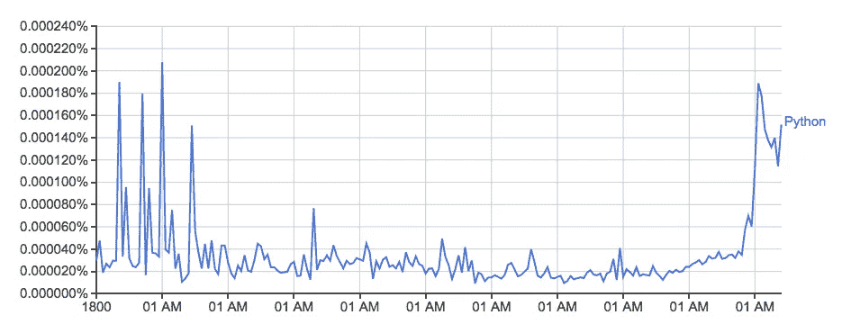
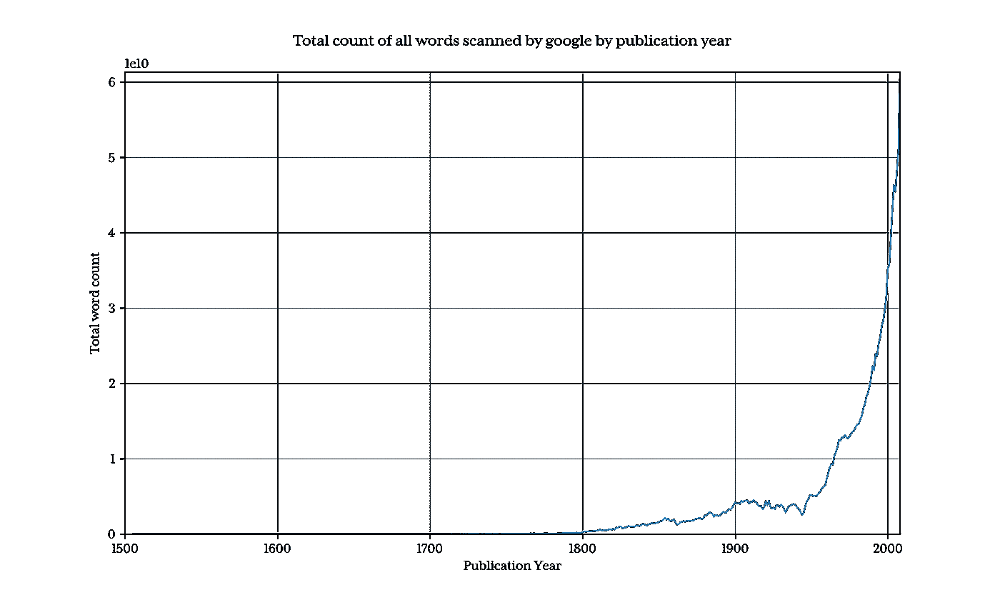
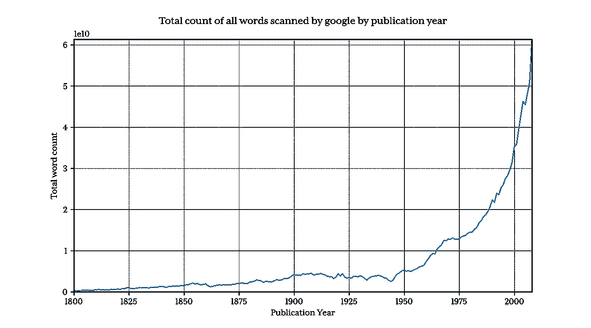
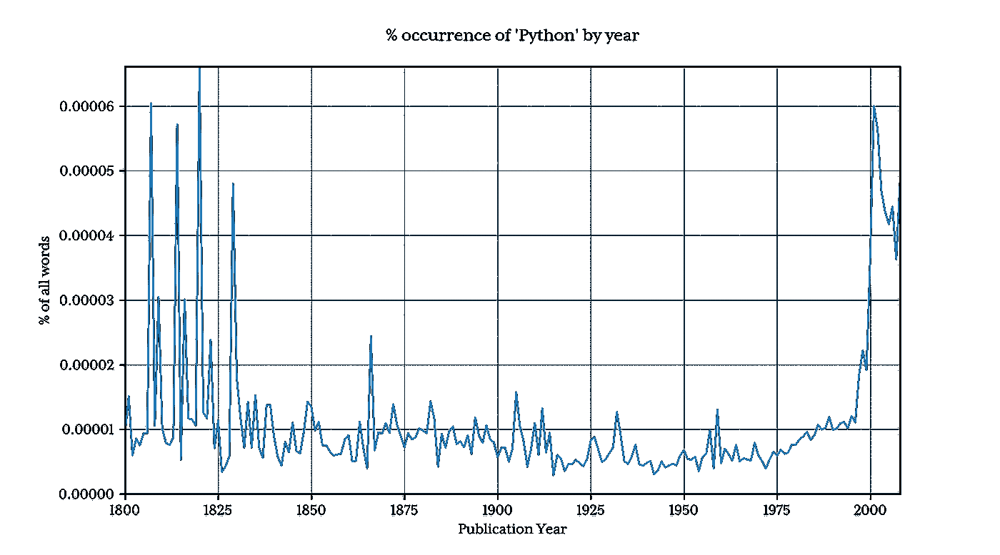
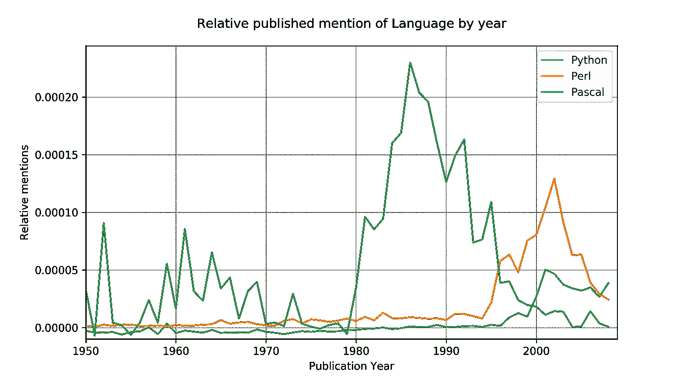
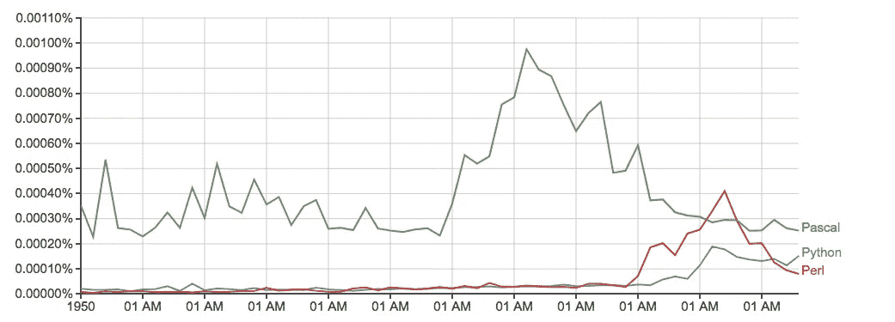

# 用 python 分析 14 亿行

> 原文：<https://medium.com/hackernoon/analysing-1-4-billion-rows-with-python-6cec86ca9d73>

## 使用 pytubes、numpy 和 matplotlib

Google Ngram viewer 是一个有趣/有用的工具，它使用 Google 从书籍中扫描的大量数据来绘制单词的用法。以单词 *Python* (区分大小写) *:* 为例



Untitled graph taken from: [https://books.google.com/ngrams/graph?content=Python&year_start=1800&corpus=15&smoothing=0](https://books.google.com/ngrams/graph?content=Python&year_start=1800&corpus=15&smoothing=0) charting the usage of the word ‘Python’ over time.

它来自谷歌的 n-gram 数据集，一个特定单词或单词序列在每个出版年度被谷歌图书发现次数的日志。虽然不完整(不包括所有出版过的书！)，这套书有几百万本，包括 16 世纪到 2008 年出版的书。数据集可以在这里免费下载[。](http://storage.googleapis.com/books/ngrams/books/datasetsv2.html)

我决定看看使用 Python 和我的新数据加载库来再现上面的图形有多容易: [PyTubes](http://github.com/stestagg/pytubes)

## 挑战


1 克的数据集在磁盘上扩展到 27 Gb，这对于读入 python 来说是相当大的数据量。总的来说，Python 可以轻松处理千兆字节的数据，但是一旦数据被析构和处理，速度就会慢很多，内存效率也会降低。

总共有 14 亿行(1，430，727，243)分布在 38 个源文件中，总计 2400 万(24，359，460)个单词(以及 POS 标记单词，见下文)，统计时间在 1505 年至 2008 年之间。

当处理 10 亿行时，事情会变得很慢，很快。而原生 Python 并没有针对这种处理进行优化。幸运的是, [numpy](https://github.com/numpy/numpy) 非常擅长处理大量的数字数据。通过一些简单的技巧，我们可以使用 numpy 使这种分析变得可行。

在 python/numpy 中处理字符串很复杂。python 中字符串的内存开销非常大，numpy 只在字符串长度已知且固定的情况下才真正处理字符串。在这种情况下，大多数单词都有不同的长度，所以这并不理想。

## 加载数据

> 以下所有代码/示例都是在 2016 款 Macbook Pro 上运行的，配有 **8 GB ram** 。具有适当数量 ram 的硬件/云实例应该表现得更好

1 克计数以一组制表符分隔的文件形式提供，如下所示:

```
Python 1587 4 2
Python 1621 1 1
Python 1651 2 2
Python 1659 1 1
```

其中每行包含以下字段:

```
1\. Word
2\. Year of Publication
3\. Total number of times the word was seen
4\. Total number of books containing the word
```

为了生成所请求的图，我们只需要知道一些信息，即:

```
1\. Is the word the one we’re interested in?
2\. Year of publication
3\. Total number of times the word was seen
```

通过提取这些信息，可以避免处理可变长度字符串数据的开销，但是我们仍然需要比较字符串值，以确定哪些行与我们感兴趣的字段有关。这就是 pytubes 的用武之地:

大约 170 秒(3 分钟)后， *one_grams* 是一个大约有 14 亿行的 numpy 数组，如下所示(为清楚起见添加了标题):

```
╒═══════════╤════════╤═════════╕
│   Is_Word │   Year │   Count │
╞═══════════╪════════╪═════════╡
│         0 │   1799 │       2 │
├───────────┼────────┼─────────┤
│         0 │   1804 │       1 │
├───────────┼────────┼─────────┤
│         0 │   1805 │       1 │
├───────────┼────────┼─────────┤
│         0 │   1811 │       1 │
├───────────┼────────┼─────────┤
│         0 │   1820 │     ... │
╘═══════════╧════════╧═════════╛
```

从这里开始，只是用 numpy 方法计算一些东西的问题:

## 每年的总字数

Google 显示了每个单词出现的百分比(一个单词出现的次数/当年发表的总字数),这在某种程度上比原始字数更有用。为了计算这个，我们需要知道总字数是多少。

幸运的是 numpy 让这变得非常简单:

这个图表显示了谷歌每年收集了多少单词:



显而易见的是，在 1800 年之前，数据量迅速下降，因此可能会扭曲结果，隐藏有趣的模式。为了反驳这一点，我们只包括 1800 年以后的数据:

它返回 13 亿行(只有 3.7%的单词是 1800 年以前记录的)



## Python 按年百分比

获得 python 的%计数现在出奇的容易。

使用使基于年份的数组 2008 元素变长的简单技巧意味着每一年的索引等于年份数，因此找到 1995 年的条目只是获得第 1995 个元素的问题。

为此甚至不值得使用 numpy 操作:

绘制结果字数:



这与谷歌的版本非常相似:


实际的%数字根本不匹配，我认为这是因为可下载的数据集包含了用各种词类标记的单词(例如:Python_VERB)。这个数据集在 google 页面上没有很好的解释，并且提出了几个问题:

*   如何使用 Python 作为动词？
*   “Python”的计数包括“Python_VERB”的计数吗？等等。

幸运的是，很明显，我使用的方法产生了与 google 足够相似的图形形状，相对趋势不受影响，因此对于这次探索，我不打算尝试修复它。

## 表演

Google 在大约 1 秒钟内生成图表，相比之下，使用这个脚本需要大约 8 分钟，但这是合理的。谷歌字数统计的后端将从数据集的大量准备视图开始工作。

例如，预先计算每年的总字数并将其存储在一个查找表中可以节省大量时间。同样，将字数存储在单个数据库/文件中并索引第一列将消除几乎所有的处理时间。

然而，这次探索*所展示的是，使用 numpy 和羽翼未丰的 pytubes，使用标准的商用硬件和 Python，在合理的时间内从原始的十亿行数据集中加载、处理和提取一些任意的统计信息是可能的。*

# 语言战争

为了用一个稍微复杂一点的例子来证明这个概念，我决定比较三种编程语言的相对提及率: **Python、【Pascal】、**和 **Perl。**

源数据非常嘈杂(它包括所有使用的英语单词，不仅仅是编程语言提及，例如，python 也有非技术含义！)为了对此进行调整，我们做了两件事:

1.  仅匹配名称的标题大小写形式(python，而非 Python)
2.  在 1800 年到 1960 年之间，每种语言的提及次数已经被平均百分比数所转移，假设 Pascal 作为一种语言在 1970 年被首次提及，这应该给出一个合理的基线。

## 结果:



对比 Google ( *无任何基线调整*):



运行时间:10 分钟多一点

编码:[https://gist . github . com/stestagg/910859576 f 44 f 20 e 509822365414290d](https://gist.github.com/stestagg/910859576f44f20e509822365414290d)

## 未来 PyTubes 的改进

目前，pytubes 只有一个整数的概念，即 64 位 int。这意味着 pytubes 生成的 numpy 数组对所有整数使用 i8 dtypes。在某些情况下(比如 ngrams 数据)，8 字节整数有点过分，浪费内存(这里的完整 n 数组大约是 38Gb，使用更好的 dtypes 可以很容易地减少 60%)。我计划很快增加一些 1、2 和 4 字节整数支持([https://github.com/stestagg/pytubes/issues/9](https://github.com/stestagg/pytubes/issues/9))

更多过滤逻辑 Tube.skip _ unless()方法是过滤行的一种简单方法，但是缺少组合条件(AND/OR/NOT)的能力。对于某些用例来说，这将大大加快减少加载数据量的速度。

更好的字符串匹配——像 startswith、endswith、contains 和 is_one_of 这样的简单测试很容易添加，并且在加载大量字符串数据时显著提高了有用性。

*一如既往，* [*补丁*](https://github.com/stestagg/pytubes) *更受欢迎！*