# 分析加密货币的交易指标

> 原文：<https://medium.com/hackernoon/analyzing-trading-indicators-for-cryptocurrencies-7bf9d1d3d7e6>

Modified from Photo by Kevin Ku from Pexels [https://www.pexels.com/photo/coding-computer-data-depth-of-field-577585/](https://www.pexels.com/photo/coding-computer-data-depth-of-field-577585/)

> TL；DR:利用每小时的数据，而不是每天的数据，同时分析加密货币的技术指标信号，加密货币交易似乎对一些精选的硬币有一些价值，但不是所有的。

我们在[的上一篇文章](https://hackernoon.com/do-technical-indicators-really-work-on-cryptocurrencies-aab1ae3d6df3)中总结道，当技术指标被孤立应用时，在预测分析师可能寻找的未来回报类型时往往是无效的。在本文中，我们将我们的方法应用于更细粒度的数据，看看这个结果是否仍然成立。

在文章“[中对我们的过程进行了更详细的概述，技术指标真的对加密货币有效吗？](https://hackernoon.com/do-technical-indicators-really-work-on-cryptocurrencies-aab1ae3d6df3)”。但是对于那些没有足够时间通读的人来说，这里有一个研究结果的快速概述和细节。

## 调查结果摘要

*   总体而言，较低的布林线交叉看起来有希望成为上行预测指标。
*   VeChain 看起来仍然像一个离群值，忽略它进行技术分析。
*   当它起作用时，预测能力似乎是短暂的，可能不会超过 12 小时。
*   DASH 似乎对 RSI 和 MFI 下跌指标的反应很好，在很多时间段都是一致的。
*   上布林交叉似乎对一些硬币(EOS，LSK，文和 ZEC)很有效，但对所有硬币并不一致。

# 分析

如果你已经做到了这一步，你一定对这个分析是如何工作的感兴趣。继续阅读，了解更多。

## 方法

1.  我们根据在 CoinMarketCap.com 上市的市值选择了前 20 种加密货币。
2.  我们选择一个分析时间段，并取消任何在该时间段内没有足够数据产生有意义结果的硬币。在这种情况下，我们选择了 2017 年 9 月 1 日至 2 月 8 日(此初稿的日期)的分析期。选择这一时间框架是因为它的新近性以及在此期间观察到的大多数加密货币的正回报和负回报。
3.  我们定义了一组常用的技术指标，典型的交叉事件周期 MFI 为 20/80，RSI 为 30/70，等等。
4.  我们分析这些指示器事件的出现次数，以确定它们是否值得分析。如果某件事只发生了几次，那么可能没有足够的统计能力。
5.  我们为正面和负面指标定义了成功标准，以衡量它们的有效性。对于预测价格上涨的指标，我们衡量比平均回报率高多少。对于预测价格下降的指标，我们测量未来价格在零下多远。
6.  在事件发生后的多个时间段内重复步骤 5 中的分析:在该分析中使用 1、6、12 和 24 小时。

使用 [Gatsiva API](https://gatsiva.com) 和 Python / MatPlotLib 的组合进行可视化分析。

## 硬币分析

在我们的测试期间，以下硬币符合市值和足够数据的标准。

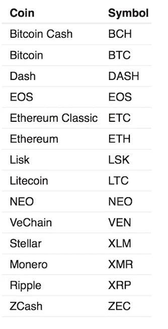

Table 1\. Coins Analyzed

## 事件分析

因为这是每小时的数据，所以这些规则中的大多数规则的发生率明显高于我们的每日数据分析。以下是按货币分类的技术指标事件发生率热图。

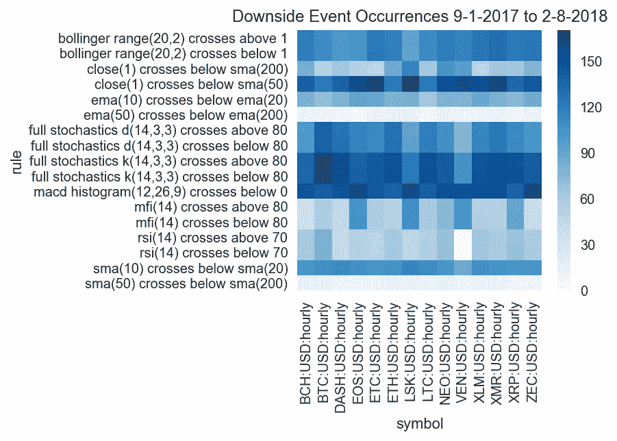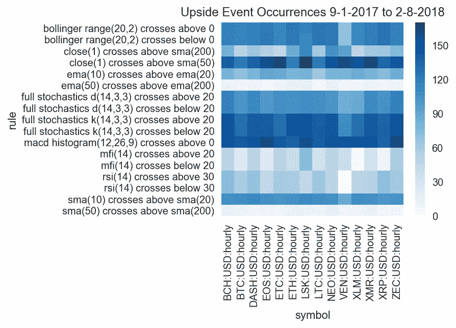

Downside / Upside Event Occurrence Comparisons

从这些图表中，我们可以做出一些观察:

*   我们可以看到，对于大多数货币来说，均线/均线在 50/200 交叉是相对罕见的事件。
*   此外，我们注意到 mfi/rsi 交叉出现的频率比 macd 柱状图、随机指标和布林线区间低得多。
*   最后，我们在所有被分析的货币中看到相对相同的模式。

现在让我们继续，看看实际结果。请记住，在查看以下图表时，我们已经定义了以下方法来对这些技术指标事件进行评分。

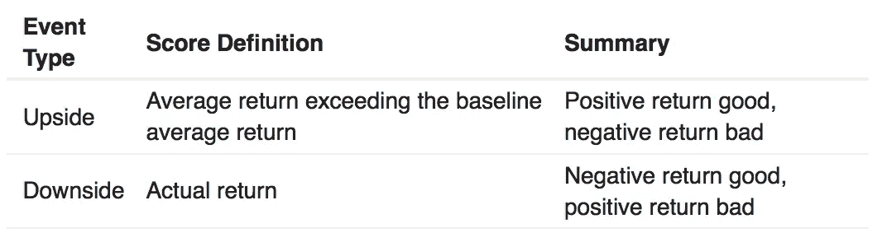

Table 2\. Scoring Approach

## 分析有利结果

以下图表以热图形式显示了每种货币的每个技术指标事件的得分。绿色分数表示表现良好。在这种情况下，良好的表现是一个平均回报率，超过了正常的平均回报率，否则，如果我们不注意信号。

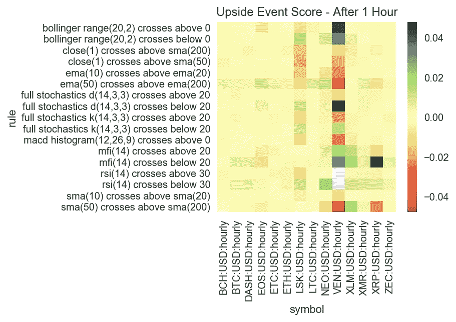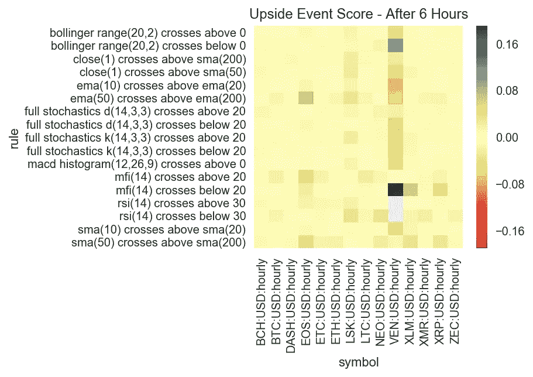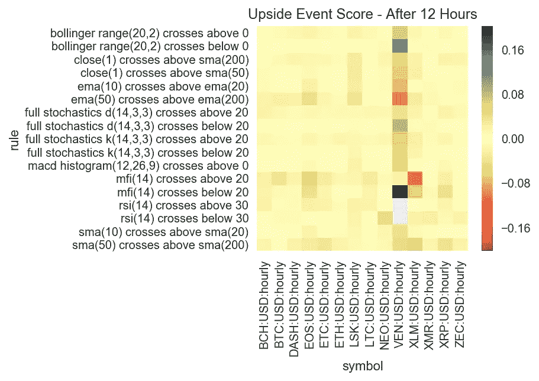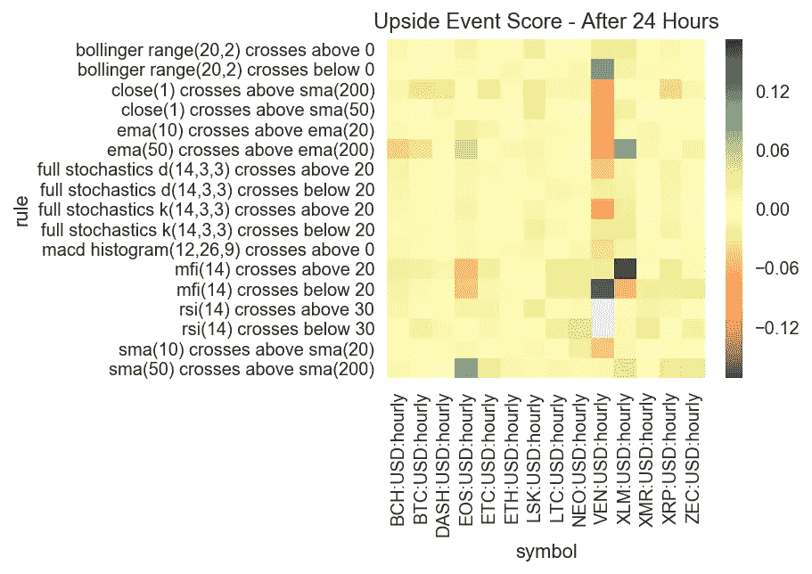

Upside performance results for 1, 6, 12, and 24 hours after event

从这些图表中，我们可以得出以下结论:

*   **“布林带下穿 0”看起来很有希望**，但我们需要再次记住，我们主要是处于一个*上升只有*回报的环境中。
*   在技术分析方面，VeChain 看起来仍然像个局外人。虽然看起来它在上行分析中表现不错，但在下行分析中你会发现它表现很差。
*   一些硬币似乎对 sma(50) / sma(200)交叉反应良好，包括 [BTC](https://hackernoon.com/tagged/btc) 、DASH、EOS 等，以及 XLM。但我们需要认识到这些事件发生的频率要低得多。
*   1 小时后比 6 小时后有更多的阳性结果，这表明**可能有某种程度的预测能力，但它可能是短暂的**。

## 分析负面结果

好了，现在我们来看看下行的技术指标。请记住，在这种情况下，正回报绩效标记为红色，而负回报绩效标记为绿色。这是因为下行指标应该预测价格的下行。

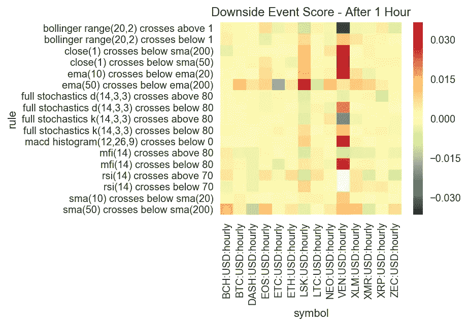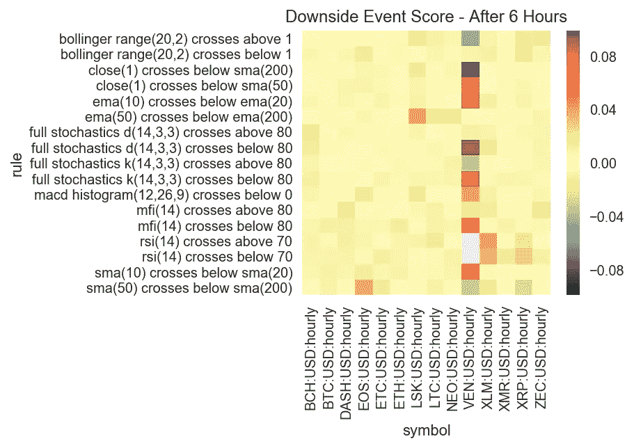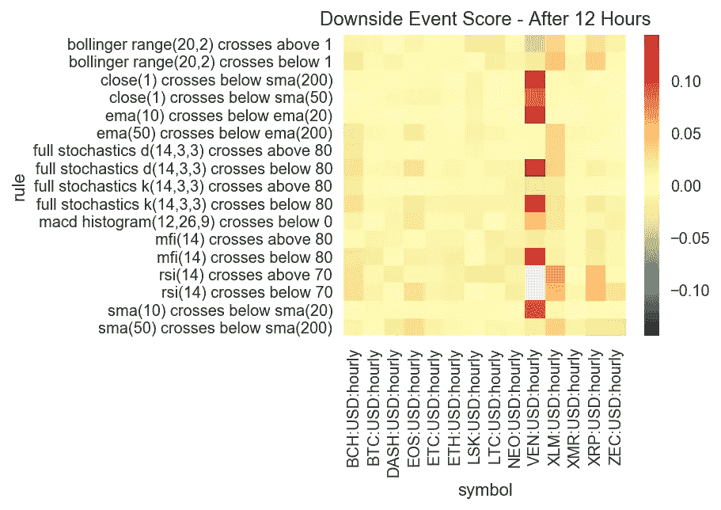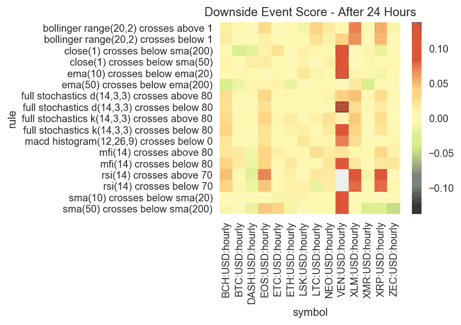

Downside performance results for 1, 6, 12, and 24 hours after event

从这些图表中，我们可以得出以下结论:

*   **DASH 似乎在许多时间段内对 RSI 和 MFI 事件反应良好。**
*   **布林线顶部似乎对一些硬币很有效** (EOS、LSK、VEN 和 ZEC)，但对所有硬币并不一致。
*   **大多数效应似乎都是短暂的**，因为回报会在 24 小时内转为正值(当预测负面结果时是不好的)。
*   **VEN 混乱不堪**，与其他加密货币的反应完全不同。

## 未来分析

我们总是喜欢在文章的后面跟进接下来会发生什么，或者我们已经错过了什么。我们在内部进行的一些观察包括:

*   使用区间而不是交叉:我们使用简单的交叉，事件区间可能更适合这个市场。幸运的是，Gatsiva API 现在支持 x%以内的类型指示器来允许这种情况发生。
*   **调整指标时间段:**正如我们在之前的文章中提到的，我们从经验中得知，当用于加密货币时，股票中使用的技术指标的标准时间段需要调整。我们的[遗传算法研究](/@gatsiva/using-genetic-algorithms-to-find-signal-in-cryptocurrency-noise-43206c5b2ad0)已经证明了这一点。探索哪些参数最适合这些指标将是一项值得做的工作。
*   **观察这些回报如何随时间变化:**这是 Gatsiva 已经用我们的[置信带变动分析](https://twitter.com/gatsiva/status/957495638786232322)做的。通过观察一段时间内指标的趋势，我们能够看出技术指标的趋势是变好还是变坏。
*   **应用“可预测性”的不同定义:**看待可预测性的方式不止一种。选项可能包括使用中间值而不是平均值，寻找回报的最小或最大阈值等。

## 进一步阅读

如果您有兴趣更多地了解这一分析背后的一些基本概念，我们建议您阅读以下补充材料:

*   [技术指标真的对加密货币起作用吗？](https://hackernoon.com/do-technical-indicators-really-work-on-cryptocurrencies-aab1ae3d6df3)
*   [用信任带交易加密货币](https://hackernoon.com/trading-cryptocurrency-with-confidence-bands-cffd523f3e4b)
*   [技术指标和叠加图](http://stockcharts.com/school/doku.php?id=chart_school:technical_indicators)

## 关于盖茨比

在 Gatsiva，我们提供 API 和工具，使分析师能够进行与上述类似的研究。我们还提供研究和教育文章，帮助交易者和分析师确定技术信号的可行性。

此外，Gatsiva 使用机器学习和遗传算法来寻找实际工作的技术指标事件，并跟踪它们在一段时间内的表现。我们认为，与使用通用指标(如本分析中提供的指标)相比，这是一个强大的优势。

要了解更多信息，您可以访问我们在[https://gatsiva.com](https://gatsiva.com/)的网站，或者关注我们在[https://twitter.com/gatsiva](https://twitter.com/gatsiva)的分析。

最后，如果你喜欢你刚刚读到的:请随意给这篇文章添加书签，鼓掌，或者留下评论！它帮助我们帮助更多的人！