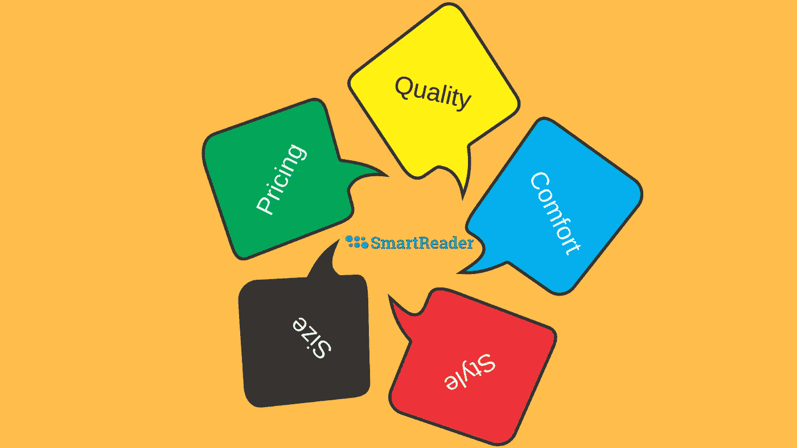
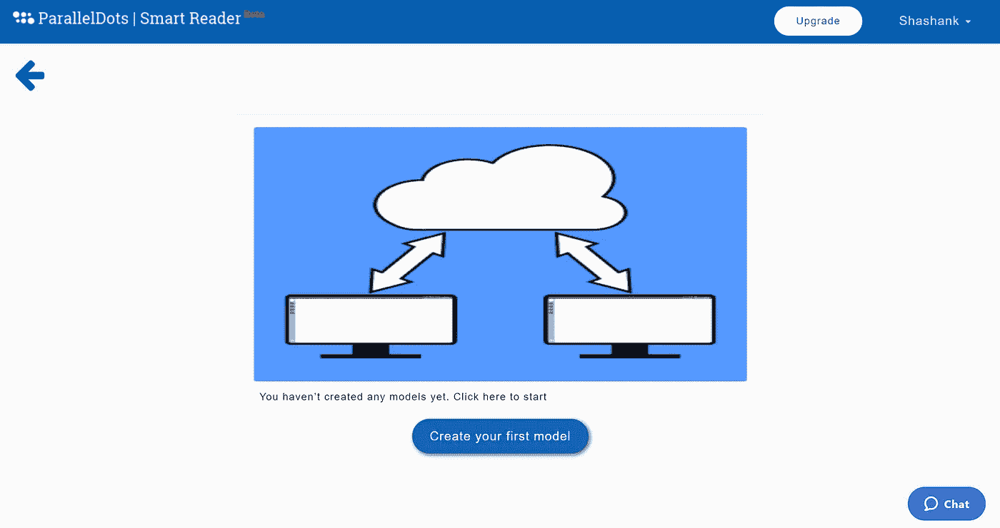
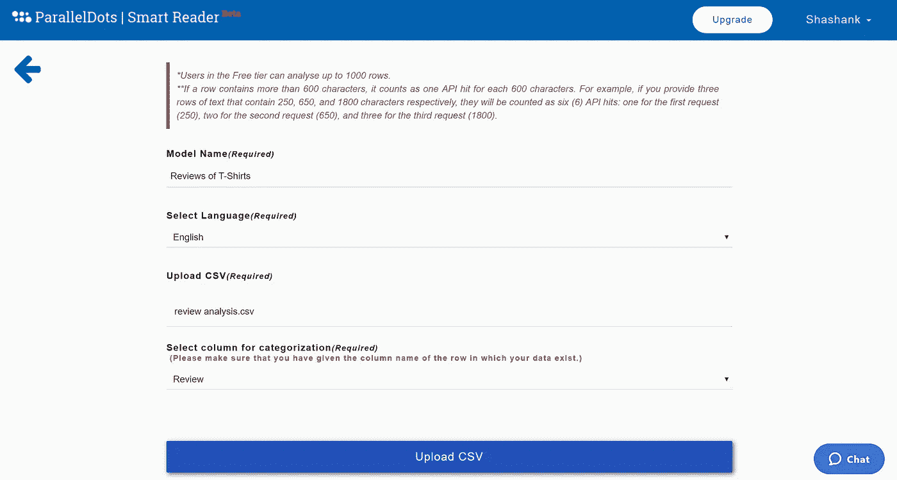
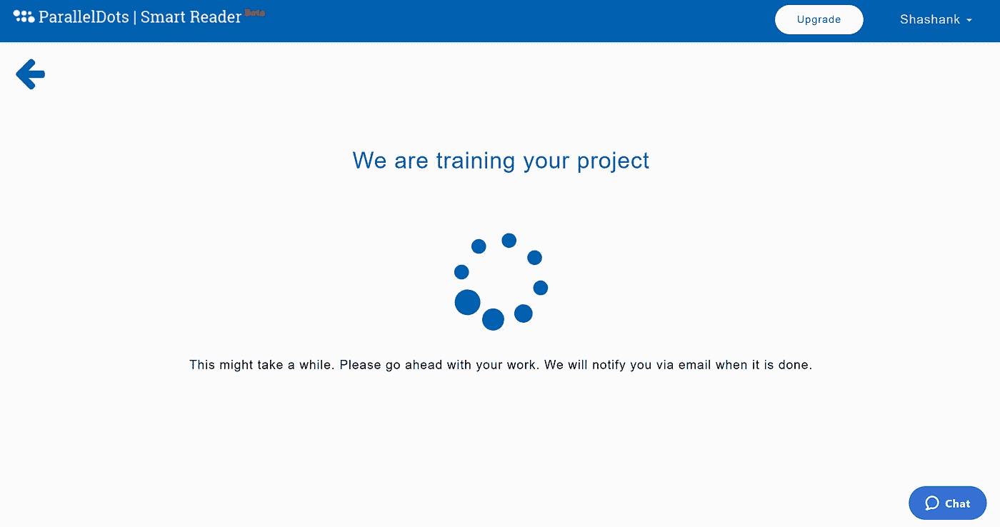
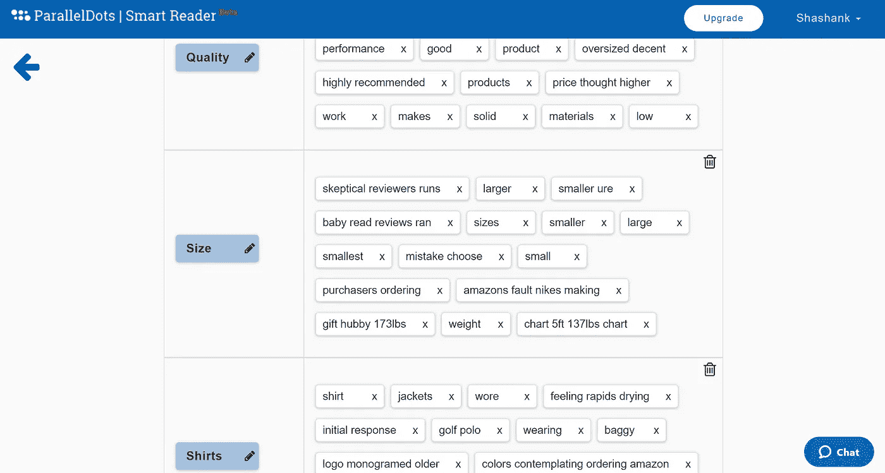
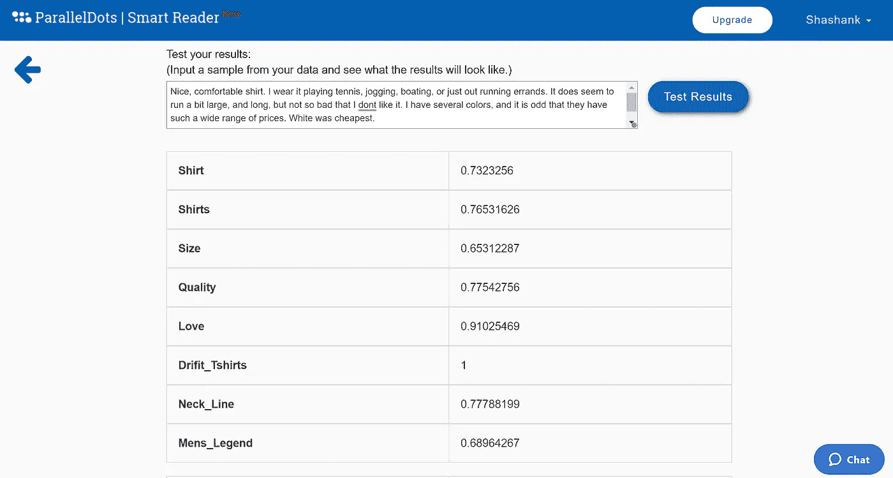
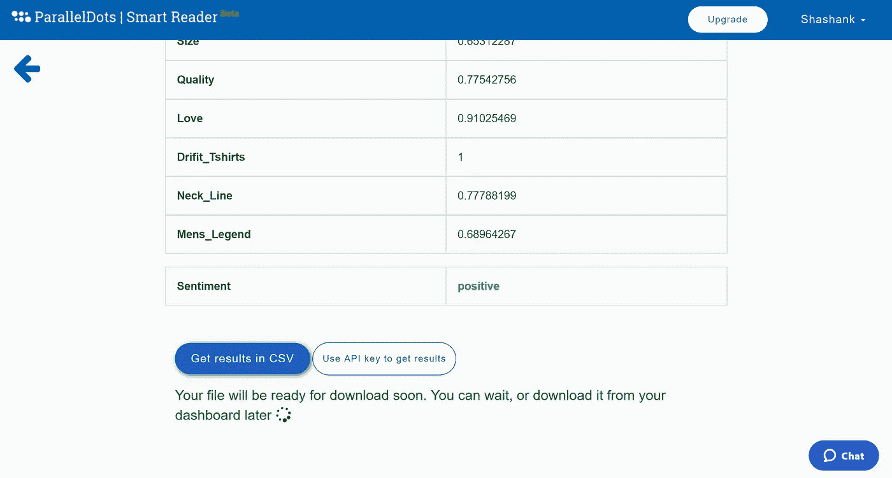
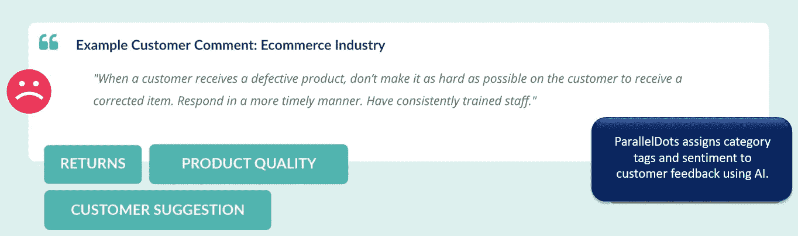

# 使用机器学习分析电子表格中的逐字注释

> 原文：<https://medium.com/hackernoon/analyzing-verbatim-comments-in-spreadsheets-using-machine-learning-8fdb4169151>

机器学习使得在数据丰富的世界中创造有意义的见解变得更加容易。这包括来自[客户调查](https://blog.paralleldots.com/product/customer-survey-analysis-without-any-coding/)的数据、定性原始研究和在线逐字评论。在一个企业的生命周期中，会产生各种各样的投入。需要挖掘这些数据以获得可操作的见解，这可以显著影响企业的品牌价值。

你可能已经发起了一个新的营销活动，并希望审查客户情绪。你可能设计了一个新产品，需要更多地了解 B2B 客户对该解决方案的评价。有许多面向研究的系统旨在创建更多的数据，但很少能帮助你有效地挖掘它们。这就是机器学习的用武之地。

# 机器学习如何帮助分析数据集

机器学习可以帮你完成繁重的工作。它可以*分析逐字的评论*并从现有的数据集中引入新的见解。该算法需要一些时间来理解数据集的情绪、质量和上下文，通常称为训练过程。在这个学习阶段过去后，可以更好地挖掘数据集以获得高质量的见解。

该算法通过挖掘跟踪到特定标签的关键短语来解密数据集的输出。训练过程分析原始输入，以创造其背后更深层次的意义。理想情况下，添加手动输入来创建这些标签，以便算法可以跟踪不同数据点之间的关系。这使得*文本挖掘客户评论*、*分析调查回复*和清理反馈会议变得更加容易。

# 如何分析电子表格上的逐字注释

逐字的评论起初可能会带来挑战，但在机器学习的帮助下，分析它们可以变得容易和简单。在 ParallelDots，我们创建了一个名为 [SmartReader](http://smartreader.paralleldots.com/) 的工具，允许任何人快速准确地分析逐字评论，而无需编写一行代码。根据可用数据的数量，该软件可能需要 10 到 15 分钟来根据您的数据训练算法。然而，当试图*分析拥有数百万个数据点的调查反馈*时，这个过程可能会花费更长的时间。

# 以下是你如何使用 SmartReader 来分析你的文字数据:

*第一步—* 你需要[在](https://user.apis.paralleldots.com/signing-up) [ParallelDots](https://paralleldots.com/) 注册来创建你的账户[登录](http://smartreader.paralleldots.com/login)到 [SmartReader](http://smartreader.paralleldots.com/) 。登录后，您可以继续为您的数据集创建一个新项目，也称为模型。

*步骤 2 —* 接下来，您可以在工具中上传您的 CSV 文件。文件成功上传后，您需要选择包含要分类的逐字数据的列。

*步骤 3 —* 单击“下一步”，算法现在将在提供的数据集上进行训练。整个过程大约需要 10-15 分钟，您可以在后台继续执行其他任务。您甚至可以在数据训练过程中关闭该选项卡。完成后，我们会通过电子邮件通知您。

*步骤 4 —* 培训过程结束后，将向您推荐一些从数据本身提取的主题。你可以点击这些话题获得合适的关键词推荐。主题及其关键词的组合对于获得高分类准确度至关重要。您可以添加自己的主题和/或删除推荐的主题。同样，您可以添加或删除与主题相关的关键字。这一步需要手动输入数据集的领域知识，以确保正确设置主题和关键字。

*步骤 5 —* 仪表板底部有一个输入框，您可以在其中输入文本/短语来检查分类作业的质量。这将帮助您在您的终端执行一些基本的测试，以确保分类工作正常。如果您认为结果不是最佳的，您应该修改该主题的关键字列表。

SmartReader 相信将人类的聪明才智和技术工具结合起来，可以减少逐字编码等繁琐过程所需的时间。

*步骤 6 —* 一旦您对主题和[关键词组合](http://smartreader.paralleldots.com/)感到满意，您可以将结果下载回一个 csv 文件，其中包含您按主题分类的逐字记录。SmartReader 工具还将对您的逐字数据进行情绪和情感分析。然后，您可以创建一个数据透视表来分析您的数据，并获得关键的见解，如“您的产品的哪些功能与最多的负面评论相关？”

# 使用机器学习的好处

挖掘数据的最大挑战之一总是与编码正确的参数有关。SmartReader 背后的复杂算法已经解决了这一问题。通过机器学习的力量，你可以对几行数据[进行分类和标记，而无需你自己编写一行代码](https://blog.paralleldots.com/product/use-keyword-extractor-in-excel-without-coding/)。软件完成所有繁重的工作，而您不到 30 分钟就能得到结果。

市场上很少有数据挖掘工具，SmartReader 是其中之一。除此之外，还可以创建[自定义分类器](https://www.paralleldots.com/custom-classifier)，使用情感分析和情绪分析，这样就可以得到一个基于机器学习的强大数据分析器。你也可以安装 [Excel 插件](https://www.paralleldots.com/excel-plugin)和 [Google Sheets 插件](https://www.paralleldots.com/google-sheet-add-on)来对你的数据文件进行更多的分析。

我们希望你喜欢这篇文章。请[注册](http://user.apis.paralleldots.com/signing-up?utm_source=blog&utm_medium=banner&utm_campaign=paralleldots_blog)一个免费的 ParallelDots 账户，开始你的 AI 之旅。你也可以在这里查看 parallel dots ' AI API[的演示。](https://www.paralleldots.com/text-analysis-apis)

这里可以阅读原文[。](https://blog.paralleldots.com/smartreader/analyzing-verbatim-comments-on-spreadsheets-using-machine-learning/)