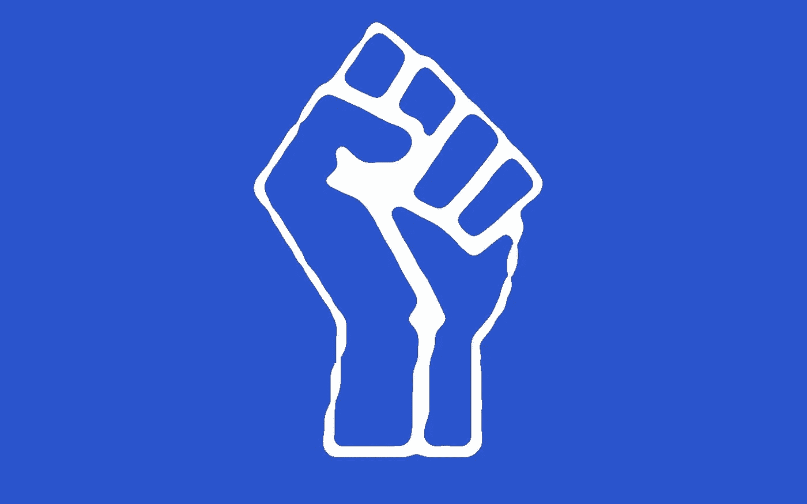

# 无政府主义者领导每一次革命，你有勇气要求吗？

> 原文：<https://medium.com/hackernoon/anarchists-lead-every-revolution-are-you-brave-enough-to-demand-it-263f5532cb49>

## 金钱、金融和对让我们变得更穷的规则的公然漠视

# 金融、网络朋克和无政府主义者联合起来

*   不要让别人发号施令。
*   拒绝按他们的调子跳舞。
*   创造我们想要的未来。

**解除银行业务，让财富民主化，省钱，让我们更富有**

# 你为什么不利用你的权力和影响力？

仅仅因为它们一直以来的方式而以现在的方式存在的事物会让你感到厌恶。当某些事物存在的理由不再正确时，就需要提出问题，必须开发替代方案。进步取决于我们提出这些问题的意愿和我们做出必要改变的能力。

更重要的是，当那些问题被忽视或者答案不是我们想听到的时候，我们可以站出来，被计算在内。

**我们必须认识到这是我们剥削和反抗的标志！**

独自一人我们是弱者，团结在一起我们是强者。互联网使得一个比历史上任何时候都更大、更有组织、更有凝聚力的*得以存在。所需要的只是团结一致的意愿。*

## 现有机构反对我们

重塑现有模式对他们没有任何好处。他们必须通过对抗即将到来的进化、创新和进步来捍卫他们的地盘，以保护他们所拥有的。

**柯达没有发明数码相机是有原因的**

## 他们所有的利润都来自电影

# 朋克银行

*   **我们的使命:**解除银行业务
*   **我们的承诺:**实现财富服务的民主化
*   **我们的方法:**让你省钱、让你更富有的奖励

# 协作不是固定的

我们可以一起讨价还价，为所有人实现更好的结果。这是一个组织问题。让我们驾驭它，互联网以前所未有的规模实现了这一目标。

我们通过行动和选择来决定什么是成功的。

通过做出同样的选择，我们可以控制赢家和利润。

如果你能买到你的可乐并从品牌增长中获利，为什么还要买可乐呢？财富不必被少数投资者和创始人垄断。一个更加分布式的所有权模型可以出现，这是由互联网实现的。互利的行动可以协调充实。

## 行动和习惯决定公司的发展

我们可以相应地采取行动。

参与会得到公平的回报。

股票价值因为你的选择和行动而增长。

去中心化的，分散的所有物的所有权，参与增加你和其他人的财富。

这是我们能够共同实现的未来

# 异议不一定要表达出来

相反，我们可以创造我们认为应该存在的产品和服务。我们可以改变或忽略当前的规则，或者我们可以创建全新的规则来更好地满足我们的需求。

我们可以接受我们继承的世界是固定的，也可以改变它。

> 当你长大后，你会被告知这个世界是这样的，你只能活在这个世界里。
> 
> 尽量不要太撞到墙上。试着拥有一个美好的家庭，享受快乐，存一点钱— **那是一种非常有限的生活。**
> 
> **一旦你发现一个简单的事实，生活会变得更加广阔:你周围的一切你称之为生活的东西都是由不比你聪明的人组成的，你可以改变它，你可以影响它，你可以创造你自己的东西让别人使用。**
> 
> 一旦你明白了这一点，你就再也不会和以前一样了

# 这是我们可以一起实现的

**我们可以拒绝世界的存在，并创造出我们想要存在的现实**

## 实现这一目标的第一步是做出选择

*   接受当前存在的东西
*   相信我们值得更好的

他们是唯一的两个选择。

什么都不做意味着你接受这个世界的存在，做出我们应该得到的更好的选择打开了一系列可能性的大门。

我们可以决定未来。我们可以创造它。我们可以共同受益。

# [领导革命](http://www.nexves.com)