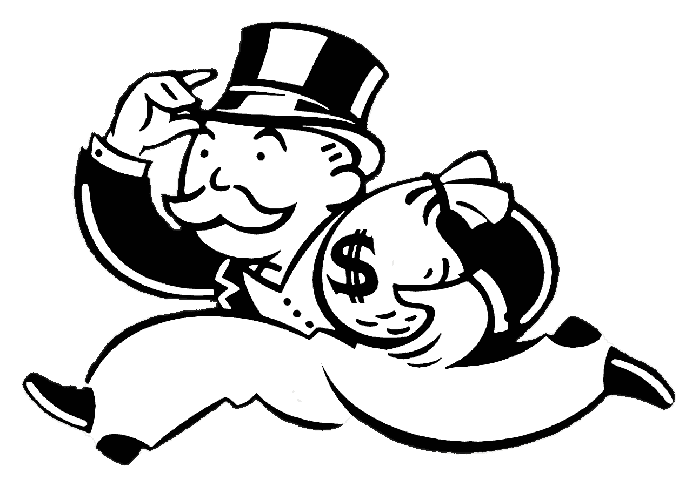

# 仅限无政府主义者——如果你喜欢被亿万富翁剥削，不要读这个

> 原文：<https://medium.com/hackernoon/anarchists-only-if-you-enjoy-being-exploited-by-billionaires-dont-read-this-4746178aacd7>

我相信明天会比今天更好。

这是我每天早上起床的原因。我每天都坚持不懈地去影响我们生活的世界。

我拒绝接受别人告诉我的一切。

当事情没有意义时，当回报似乎在各方之间不公平时，我会问为什么。如果答案缺乏真正的定义，未能集中在有问题的细节上，或者这个人试图把它当作显而易见的事情，我知道有些事情是可以改变的。

这个世界被传统智慧、普遍共识和围绕公认规范的教条所束缚。为了克服这些困难，我们必须认识到，世界上的一切之所以存在，是因为像你一样的另一个人所做的决定。

如果你打翻了苹果车，你就会被认为是麻烦制造者。很好。

世界上没有什么是存在的，因为它是由一个更伟大的存在注定的。

我们没有把人送上月球，因为有人给了我们实现这一目标的技术能力。我们从未发展农业，因为我们继承了如何耕作的知识。疫苗从未从天而降，使我们能够保护数百万人，拯救数十亿人的生命。

一切都源于实验。

现在存在的一切，只是目前最好的例子。

但是就像每个实验一样，它们是需要改进的对象。

进步是由我们拒绝我们继承的规则的意愿决定的。莱特兄弟因为相信人类能飞而被嘲笑，不断被告知如果我们注定要飞，我们就会有翅膀。

只有他们不愿意接受这种压力，才能让我们腾飞。

叛徒、暴发户和无政府主义者改变未来。

世界是由那些拒绝接受愚蠢的智慧的人塑造的。白痴就是接受别人告诉你的一切，却不问与每个人都能看到的基本问题相关的问题。

勇敢是拒绝接受狗屁答案。

疯狂是拒绝接受摆在你面前的真相。

看看你周围。到处都有问题盯着你。

除非我们接受我们的权力地位，否则解决方案不会到来。邪恶胜利的唯一必要条件是好人什么都不做。剥削行为继续存在的唯一要求是聪明人永远不要问问题。

如果我们允许我们继承的规则、产品和服务保持不变，世界就不会进步。

我们有责任改善我们接触到的每一样东西。

# 朋克银行

我对此的贡献是拒绝相信那些把我们带到全球崩溃边缘的银行家和机构是控制我们金钱和金融命运的合适人选。

为什么我们应该相信他们告诉我们应该使用的产品和服务是保护我们的正确工具？

我们凭什么再相信他们告诉我们的任何事。

我们被利用作为工具，使他们能够进行破坏性的冒险，这被框定为确保金融繁荣的燃料，但这怎么可能是真的呢？他们在用我们的钱进行赌博的同时，也在处理危险——部分准备金的美妙之处在于，他们能够增加被信任的资本，以承担更大的风险。

我们的回报是什么？

微不足道的利息支付。简而言之，由于通货膨胀，任何存在银行的钱都在贬值。与此同时，银行能够以高于通胀的利率放贷，提高自身估值，同时投机风险最高的金融工具，这些工具的存在只会扩大贫富差距。

最富有的 1%和剩下的 99%之间的差距从未如此之大。然而，政府、监管者和机构规定了我们增加财富的能力。

你是一个老练的投资者吗——你觉得老练吗？

到底是什么决定了你是不是？

你银行里有多少钱。

未经认证，未展示能力，不了解任何/所有风险。只是你有多少钱。如果你的银行账户里有 25 万英镑，你就可以参加，如果没有，你就不能参加。

你能发现一个开始出现的模式吗？

他们需要我们的钱去冒更大的风险来充实他们自己和我们当中最富有的人，然而我们自己却无法跨越这个鸿沟。

我们的钱让经济车轮旋转，但我们这样做的回报是由于通货膨胀造成的财富损失。

去他妈的。

去他妈的。

我们可以一起创造新的东西。

让我们把自己放在这个新经济模式的中心。

让我们直接受益于我们的钱所创造的价值。

让我们自己的财富成倍增长，而不是其他人。

这意味着收回控制权，改变每一条规则。银行如何处理我们创建的所有数据，他们知道我的所有支出，对其他客户也一样，但他们有没有告诉过我我可以节省多少钱？

如果银行关心我们，他们就会这么做。他们会帮助他们的顾客。他们从来没有。他们不想蚕食自己的市场。

银行业已经存在了 300 年，它已经走到了尽头。它现在存在只是因为它一直都是这样，而不是因为它是最好的解决方案。

是时候拒绝了。

我们需要拒绝参与一个被操纵的系统。

我们可以一起。帮助我们改变世界。相信更好。

# 我们在一起是纽带