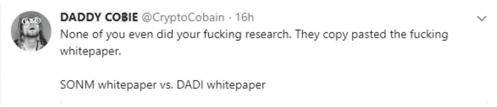

# 剖析一个强大的 ICO

> 原文：<https://medium.com/hackernoon/anatomy-of-a-strong-ico-f48ff09b47bf>

当我看到来自 [@CryptoCobain](https://twitter.com/CryptoCobain) 的推文时，我很震惊，在这样一个公共论坛上，竟然有人会如此大胆地逐字复制一份白皮书。但是 CryptoCobain 推特上的一条评论让我惊讶不已……“我不在乎，我是来赚钱的。”

让历史证明，根据 ICO 排行榜，DADI 收入 2875 万美元，SONM 4200 万美元。钱确实赚了，我不反对。我也希望筹集到一大笔钱。但这关乎目的和价值。

我保证这篇文章不会说教，当然，各种各样的腐败诡计都发生在企业界。但我在 ICO 世界看到的是暂停所有的商业现实——这些现实迟早会到来。你好，大约在 1993-1996 年的互联网！

首先也是最重要的是你的名誉不能被收回的原则。一旦被破坏了，就再也找不回来了。然而，在 ICO 的土地上，你几乎可以做你喜欢做的事情——只要市场营销是巧妙的，而且泵车和垃圾车可以像 12 个月大的拉布拉多犬一样在交易所里忙碌。

我们都知道这场赛跑将会结束。对于那些进来得有点晚、坚持得有点久的人来说，将会有一场大屠杀，就像待宰的猪一样。

**什么是强 ICO？**

那要看你的意图和心态了。对许多人来说，这是一种利用资金快速赚大钱的系统化方式。对其他人来说，这是为了维护区块链社区的诚信，他们往往对基于技术的项目非常感兴趣。一小部分，但有希望增长的部分，正在寻找商业上可行的项目，其中 ICO 是一些令人敬畏的东西的开始。

我坚定地属于后一类。对我来说，一个企业需要服务于一个目标并传递价值。但我也看到了“我们相信科技”的愚蠢。因为伟大的想法并不意味着伟大的事业。

对我来说，强有力的 ICO 包括以下内容:

*   *代币供应分配:*一个 ICO 是个开始，那么为什么这么多 ICO 会把绝大部分的代币供应用于代币销售活动呢？这告诉我，他们将缺乏未来的规模，未来的社区和未来。资金都花完了会怎么样？一个强大的 ICO 有足够的资金来筹集所需的资金，但手头有代币用于他们需要建立的社区的利益，这使得代币具有利用率/相关性。
*   *代币效用:*除了拥有代币并能够出售之外，还有什么？强大的 ICO 建立了一个社区，拥有令牌的人参与其中。这是真正的力量，因为作为社区的一部分，你可以也应该影响你的代币的价值和增长。
*   *商业模式:*企业的商业可行性如何？未来的收入来源是什么？很少看到这些来源得到解决。似乎大部分收入来自在“生态系统”中出售的代币。但这只是简单的拙劣经济学。
*   *竞争和差异化的职位:*创业、发展和扩大业务非常困难——失败率非常高。这是我对“我们信任的技术”人群感到相当恼火的地方。事实:最好的技术或最酷的想法很难胜出。一个有竞争力的商业模式、战略和差异化定位对一个“伟大的产品”至关重要。否则我们会有一个非常不同的世界。要有一个真正强大的 ICO，你必须对你的产品或服务如何具有竞争力有一个强烈的愿景。句号。
*   *不要依赖有风险的 B2B 关系，也不要踩到巨头的脚趾:*当你审视那些被大肆宣传的将“搞垮脸书、取代全球媒体、重新定义银行业”的 ico 时，问问自己，这有多现实？是的，我确实知道巨人倒下了，但很少是因为一个实体。要想真正具有破坏性，并在现任者不可避免的攻击中幸存下来，需要一场协调一致的运动。仅在这一点上，我估计 80%的 ico 会因为资金耗尽和被压扁而烧毁。

当然，总的来说，任何企业的正常元素都需要具备:优秀的团队、治理、能力和对成功的强烈渴望。

有像 [@CryptoCobain](https://twitter.com/CryptoCobain) 这样自封的警察在巡逻真是太好了。因为键盘上的剪切&粘贴功能可以产生如此巨大的财富是完全错误的。

*(不好意思，忍不住那一点说教。)*