# 区块链艺术。图像包括区块链中的小猫。循序渐进的指导。

> 原文：<https://medium.com/hackernoon/andrii-ryzhenko-blockchain-art-images-kitties-instruction-4c748ae71e0a>

[区块链](https://hackernoon.com/tagged/blockchain)变得越来越商品化，不仅仅是极客可以使用。你可以试试看！
今天我们将一起度过 10 分钟，在以太坊网络上输入有趣的小猫！这是在互联网上填写成为你自己的艺术信息！

将是免费的:)

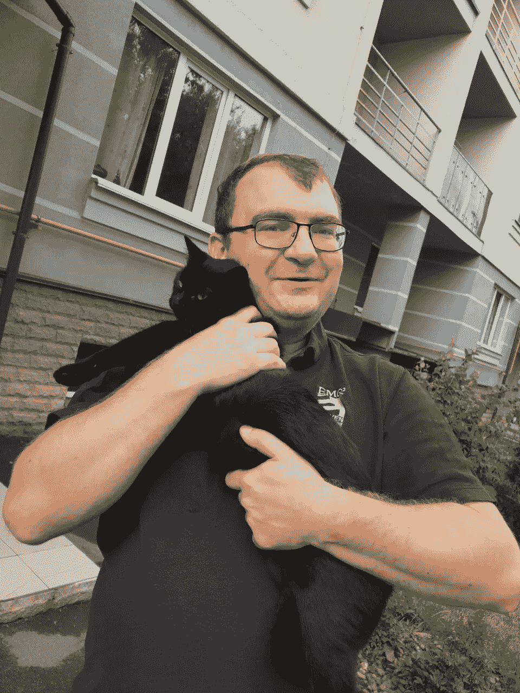

Her name is Bagira. She is a street cat supported by the community

基本上，我们有两个主要选择:

1.  高级。使用过渡存储层，如 IPFS 发送文件或扫描，并只保存区块链散列。哈希保证文件是原始的，没有人可以取代它来伪造。

阅读一篇文章以获得逐步说明:

```
[Develop blockchain “Trusted Diploma” verification system in 15 minutes. Step by step instruction](/@andrii.ryzhenko/develop-blockchain-trusted-diploma-verification-system-in-15-minutes-step-by-step-instruction-fdcf37a244ab)
```

2.第二个解决方案是简化消息并存储原始文本图片。

# 图片创作

从一个简单的图像开始:

```
./\…/\.
=‘•..•’=
.♥**♥
(.\.||./.)♥¸.•*°☼
 ƸӜƷ♥* ♥*
```

很漂亮，不是吗？

我们不能在区块链以太坊直接输入文本。仅支持十六进制格式。

转到任何工作在线转换器。我更喜欢这个

[](https://onlinehextools.com/convert-string-to-hex) [## 在线十六进制工具

### 世界上最简单的使用十六进制数据的实用工具集合。将十六进制数字转换为其他数字…

onlinehextools.com](https://onlinehextools.com/convert-string-to-hex) 

复制这张图或者找一些更可爱的。

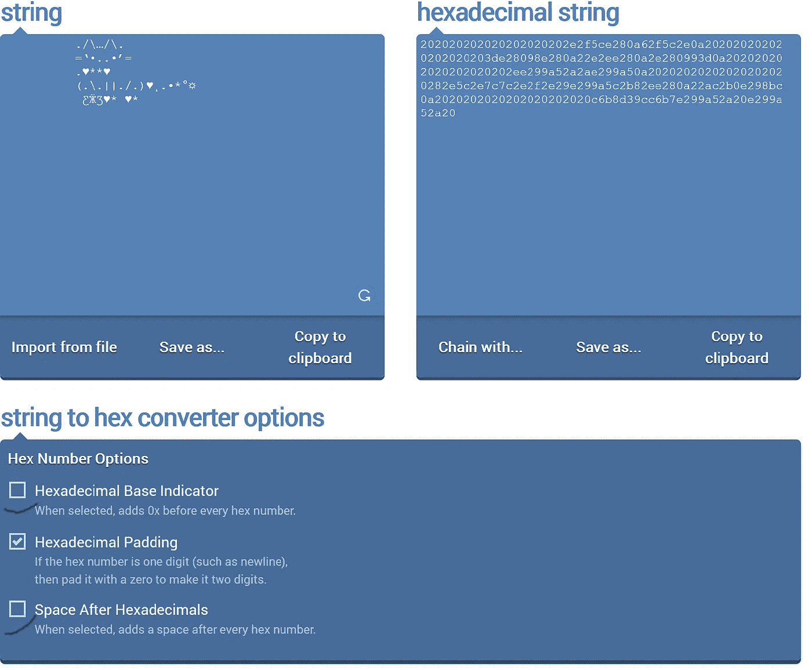

# 发送到网络

为 Firefox 或 Chrome 浏览器安装 MetaMask 插件:

去 [metamask.io](http://www.metamask.io) ，按照网站上的说明或者阅读一篇文章

```
[Develop blockchain “Trusted Diploma” verification system in 15 minutes. Step by step instruction](/@andrii.ryzhenko/develop-blockchain-trusted-diploma-verification-system-in-15-minutes-step-by-step-instruction-fdcf37a244ab)
```

问一些自由醚[https://www.rinkeby.io/#faucet](https://www.rinkeby.io/#faucet)

我用的是谷歌+，但是技术 twitter 也是一个不错的选择。

如果你是一个优秀的学者，你会看到这样的东西:

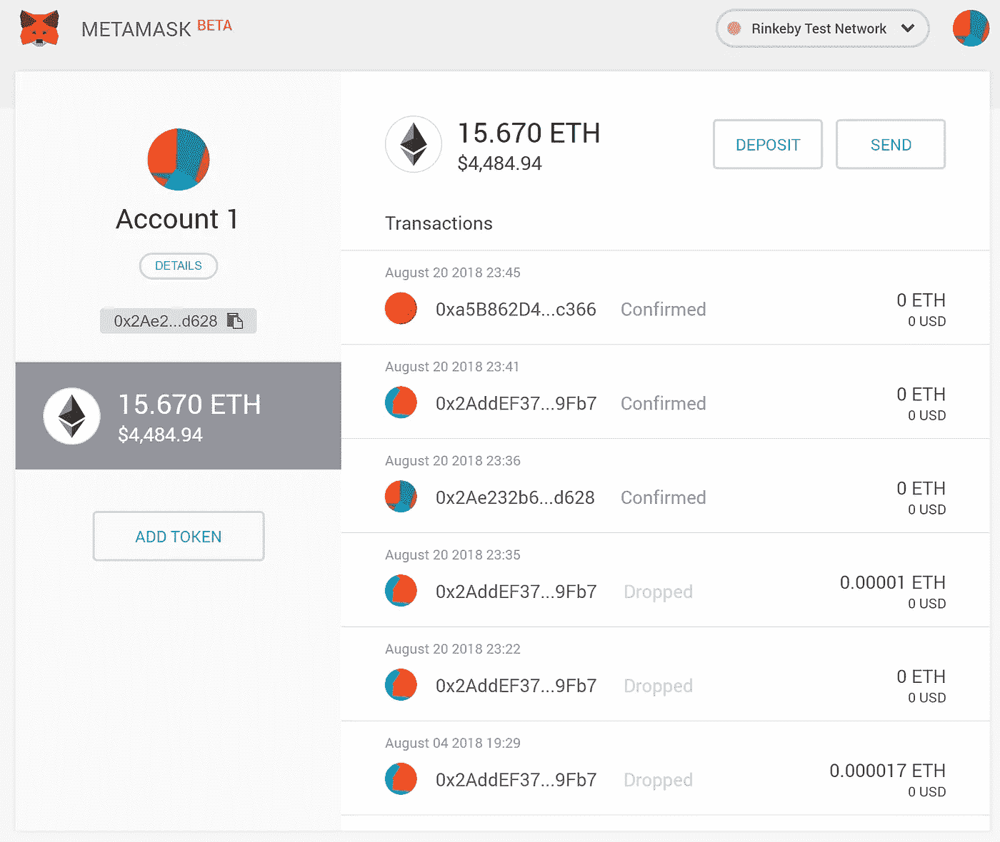

点击发送按钮

To:选择相同的帐户或输入 my 进行测试—我会看到您正在阅读这篇文章:

0x2ae 232 b 69256941 b03a 199 CCB 5 f 19 c 9 ad 948d 628

在 Etherscan 查看我的帐户

 [## Rinkeby 帐户、地址和合同

### 以太坊区块链浏览器、API 和分析平台

rinkeby.etherscan.io](https://rinkeby.etherscan.io/address/0x2ae232b69256941b03a199ccb5f19c9ad948d628) 

你还相信比特币或以太坊对所有公开交易的犯罪资金都有好处:)

金额:输入 0.00001 或选择任意金额

自定义 Gas:将 0 添加到两者中作为测试网络。

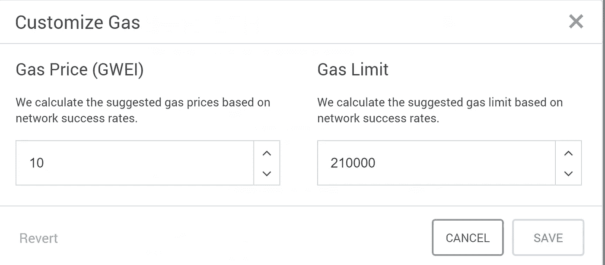

十六进制数据:从十六进制转换器输入文本

给我的猫:

```
202020202020202020202e2f5ce280a62f5c2e0a202020202020202020203de28098e280a22e2ee280a2e280993d0a202020202020202020202ee299a52a2ae299a50a20202020202020202020282e5c2e7c7c2e2f2e29e299a5c2b82ee280a22ac2b0e298bc0a2020202020202020202020c6b8d39cc6b7e299a52a20e299a52a20
```

在元掩码处确认交易。等待确认。

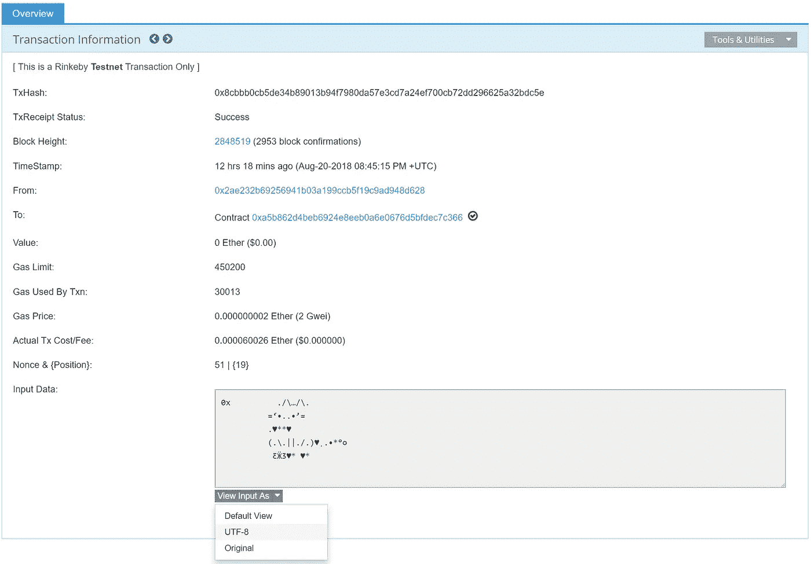

你准备好更高级的东西了吗？

你可以扫描互联网，找到任何你喜欢的猫，女孩或男孩。

或者直接用这个链接。

 [## CatStuff: Cat ASCII 艺术

### CatStuff:网站上数以千计的家猫图片，一个关于猫、游戏等等的巨大信息库。

user.xmission.com](https://user.xmission.com/~emailbox/ascii_cats.htm) 

但是当你试图发送更大的图片时，你会得到错误。测试一下有没有空。

这只是一个包，超屏蔽团队仍然没有修复它。

# 连接我的钱包

最佳解决方案—使用更高级的钱包。

## 安装(可选)

*   前往[https://www.myetherwallet.com](https://www.myetherwallet.com)
*   创建新钱包，
*   输入口令
*   保存文件和密钥
*   选择访问交叉元掩码。

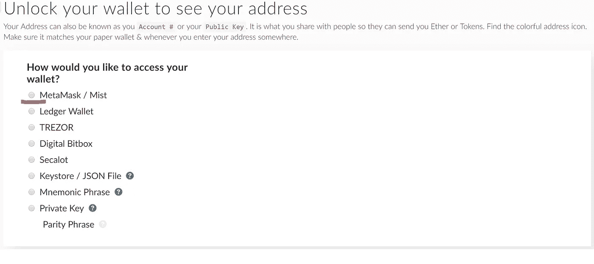

为什么这是最佳解决方案？期权不需要向外界(包括 myetherewallet 网站)传输任何私人信息。

单击连接到元掩码:

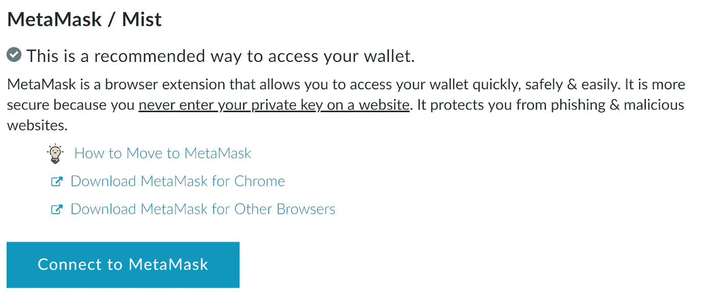

## 创建交易

然后在菜单中选择发送交易

https://www.myetherwallet.com/#send-transaction

选择 Rinkeby 网络

选择元掩码

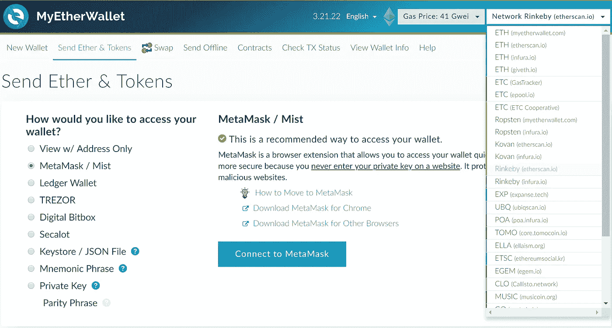

开始填写交易字段:

*   收件人地址:从您自己地址的右边部分复制
*   金额:最小值或 0.000001
*   汽油限额:7000000 就够了

您可以随时查看 Rinkeby 以太坊网的相关信息:

[](https://www.rinkeby.io/#stats) [## 林克比:以太坊测试网

### 存档节点通过将整个链从源块下载到当前头来同步区块链…

www.rinkeby.io](https://www.rinkeby.io/#stats) 

好的，你的最终转会窗口应该是这样的:

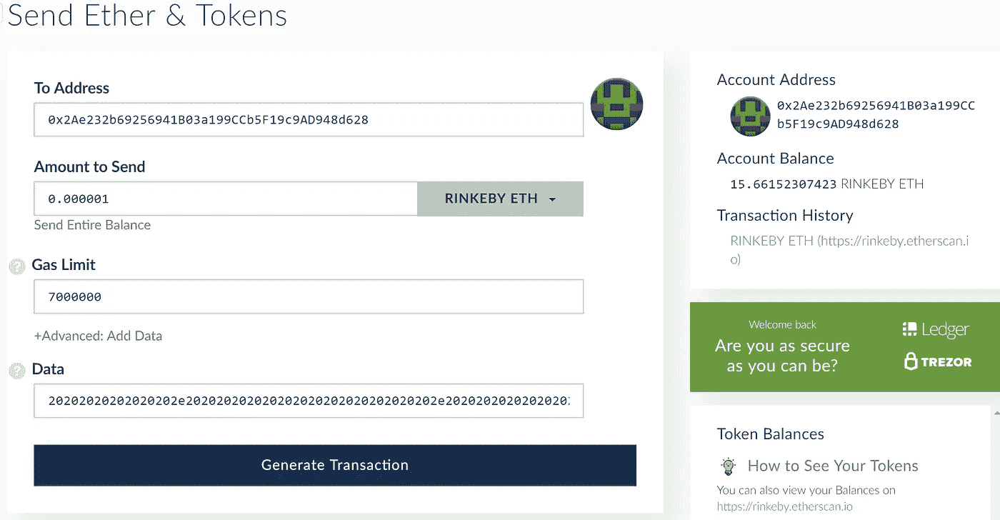

再次进入转换器，输入酷图片。

【https://onlinehextools.com/convert-string-to-hex 

我对一只肥猫的选择。

单击生成事务，然后发送事务。

从 MyEtherWallet 端确认:

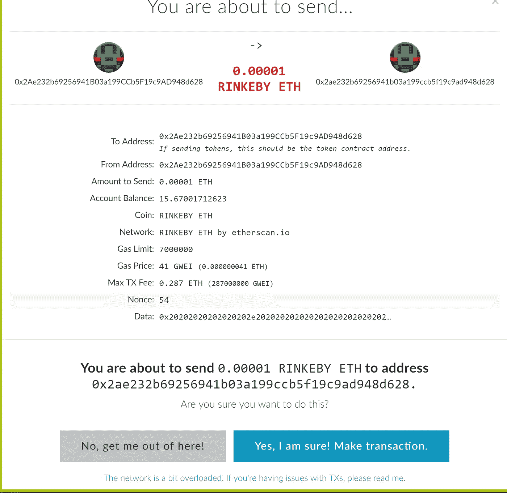

然后从元掩码方面进行确认。

单击页脚中的“验证交易”按钮。我的例子

 [## Rinkeby 事务 0x 94 deee 7 ddcb 093 C3 a43c 04859 a7a 0 FBC 363 BD 88025 EAE 093 b 09 e 527 cf 27772 FD

### 0 x 94 deee 7 ddcb 093 c 3a 43 c 04859 a 7a 0 FBC 363 BD 88025 EAE 093 b 09 e 527 cf 27772 FD 的 Rinkeby (ETH)详细交易信息

rinkeby.etherscan.io](https://rinkeby.etherscan.io/tx/0x94deee7ddcb093c3a43c04859a7a0fbc363bd88025eae093b09e527cf27772fd) 

等待交易确认，因为我们与区块链的工作是近 15-20 秒，以确认一个新的区块。

重新加载页面。

检查状态字段值是否为“成功”。

将源视为 UTF-8。

恭喜你！你在区块链的第一件艺术品已经开始运作了。:)

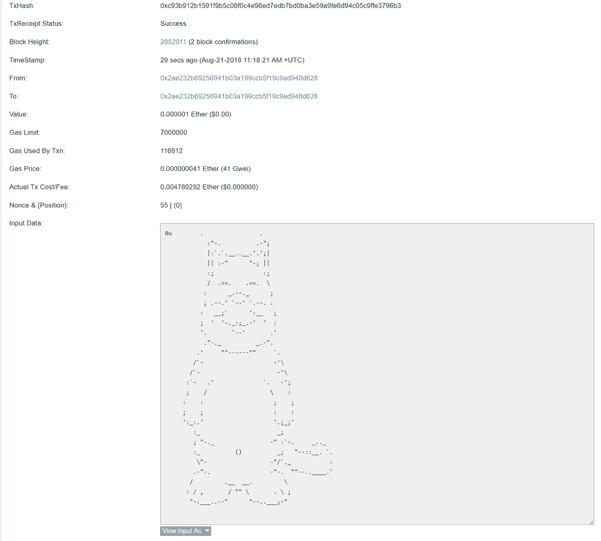

基本上我们是限制在 100KB 附近的文件大小(需要测试)。
以太坊的交易成本为 21 000 gas，数据的
成本为每字节 68 gas，Gas 限制值接近 7700000。

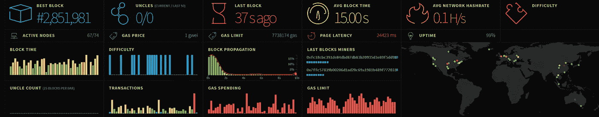

好吧！创建了一个约 49.0 KB 的事务并对其进行了测试。

你可以在地址 49.0 KB 上查看

 [## Rinkeby 事务 0x 9 dcee 1089 dbb1 f 120605 bb 5 DD 1046895 ed 52477 db 659 f 13 CAD 0027 adec 450665

### 0 x9 dcee 1089 dbb1 f 120605 bb 5 DD 1046895 ed 52477 db 659 f 13 CAD 0027 adec 450665 的 Rinkeby (ETH)详细交易信息

rinkeby.etherscan.io](https://rinkeby.etherscan.io/tx/0x9dcee1089dbb1f120605bb5dd1046895ed52477db659f13cad0027adec450665) 

但是当我把它增加到 98K 时，它失败了。

作业！您可以测试并找到实际的大小限制。

# 接下来呢？

如果你想存储 100 MB 的大文件(蒙娜丽莎的扫描或者你的护照),请阅读下一篇文章

[](/@andrii.ryzhenko/develop-blockchain-trusted-diploma-verification-system-in-15-minutes-step-by-step-instruction-fdcf37a244ab) [## 在 15 分钟内开发区块链“可信文凭”。逐步指令

### 在网上冲浪时，我注意到几篇关于 Emercoin 和 Bitfury 集团成功故事的文章。

medium.com](/@andrii.ryzhenko/develop-blockchain-trusted-diploma-verification-system-in-15-minutes-step-by-step-instruction-fdcf37a244ab) 

不要忘记分享这篇文章，以帮助其他人发现和阅读它。

非常感谢！你最多可以鼓掌 50 次👏！

尝试使用基本指南对 EOS 进行同样的操作:

# [EOS 的第一步:账户、钱包、密钥对、测试网、转移代币、验证交易](https://hackernoon.com/andrii-ryzhenko-eos-first-steps-account-wallet-keypair-testnet-transfer-tokens-validate-transactions-cc470b713abe)

接下来由我来读

```
Lessons One and Two from the session:1\. [Develop blockchain “Trusted Diploma” verification system in 15 minutes. Step by step instruction](/@andrii.ryzhenko/develop-blockchain-trusted-diploma-verification-system-in-15-minutes-step-by-step-instruction-fdcf37a244ab)2\. [Developing pirates “Black Label” voting system. Blockchain Smart Contract on Solidity](/coinmonks/developing-pirates-black-label-voting-system-6618378aae03)
```