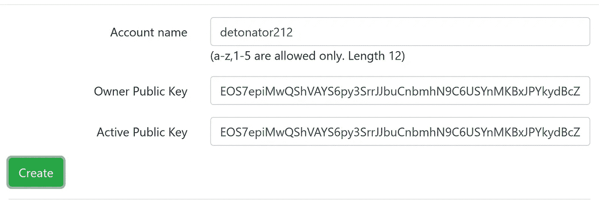
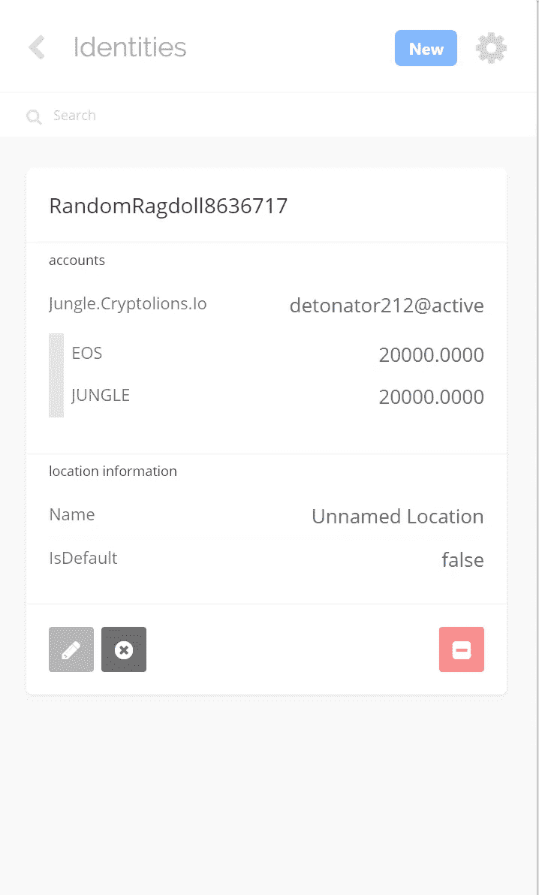
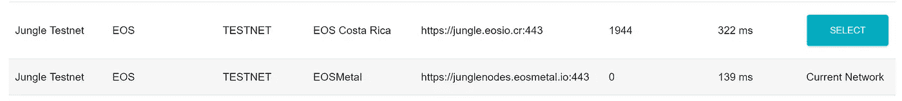
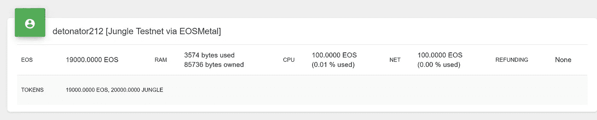
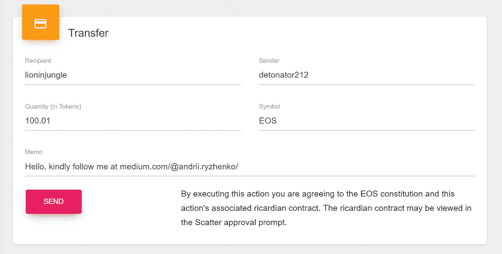
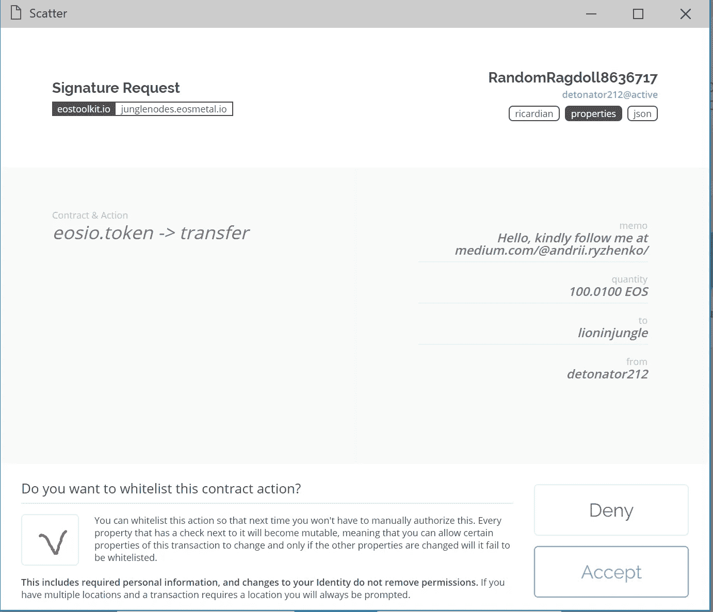
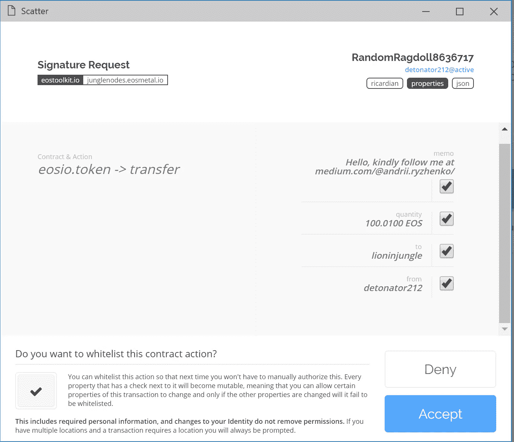
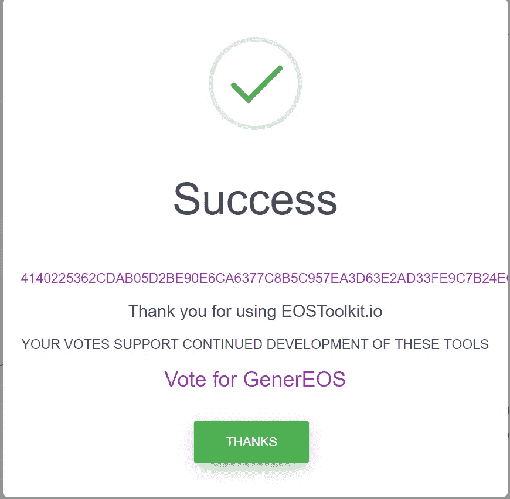
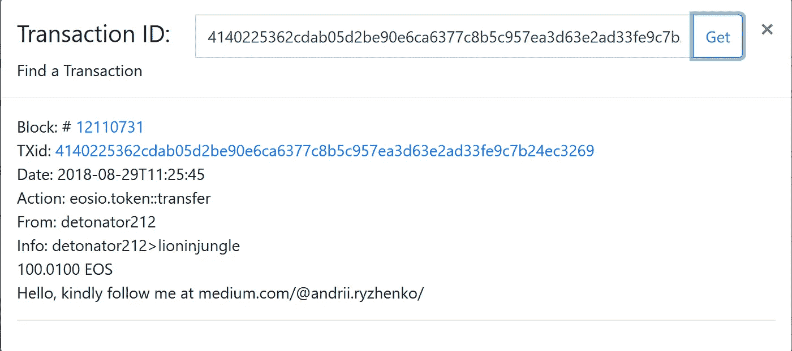
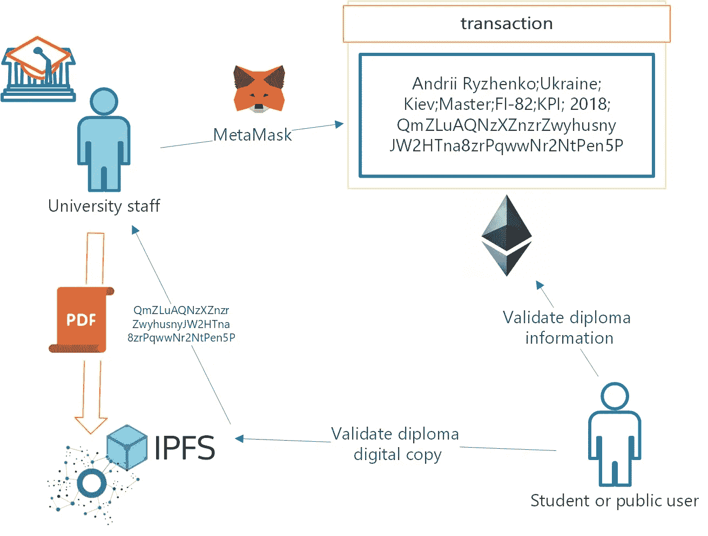

# EOS 的第一个婴儿步骤:帐户，钱包，密钥对，测试网，转移令牌，验证交易。没有命令行。

> 原文：<https://medium.com/hackernoon/andrii-ryzhenko-eos-first-steps-account-wallet-keypair-testnet-transfer-tokens-validate-transactions-cc470b713abe>

6 月 9 日 0100 UTC 时，EOS Mainnet 发射组投票“开始”启动 EOS Mainnet 发射。

EOS 还年轻，大部分环境都是刚刚开发，但是一些必备的东西是有的，而且……管用！

如果你有实际的 EOS 帐户，请跳过这篇文章。

我们在面向教育的会议上按部就班地讲解了 15 分钟。

```
1\. [Develop blockchain “Trusted Diploma” verification system in 15 minutes. Step by step instruction](/@andrii.ryzhenko/develop-blockchain-trusted-diploma-verification-system-in-15-minutes-step-by-step-instruction-fdcf37a244ab)2\. [Developing pirates “Black Label” voting system. Blockchain Smart Contract on Solidity.](/coinmonks/developing-pirates-black-label-voting-system-6618378aae03)
```

> **重要的**。它的教育指南不要用它来进行真正的资金转移！

# 创建密钥对

我们将创建一个不带钱包的密钥对。

最常见的解决方案是命令行工具。但是我们很懒。

*   转到链接

 [## EOS 密钥生成

### 编辑描述

nadejde.github.io](https://nadejde.github.io/eos-token-sale/) 

*   单击注册 EOS 密钥

继续之前，请在多个安全位置备份下面显示的私钥。

您应该制作多个副本(包括 USB 记忆棒等外部存储设备)并将所有副本保存在单独的安全位置。

*   单击注册 EOS 密钥

我的例子:

公钥`EOS7epiMwQShVAYS6py3SrrJJbuCnbmhN9C6USYnMKBxJPYkydBcZ`

私钥`5Jqnrmm9qmRMx6yMXTEgQ4N5WZsqGgEP5mi8VjS1hD7sFzTMoZt`

## 注意:我只能为 TESTLAB 共享我的私钥。任何人都可以从你的账户转账

> 没有办法恢复您的私钥。您必须立即保存它，否则您将无法访问您的 EOS 令牌

# 在 Jungle Testnet 中创建帐户:

*   转到 Testnet 网站监视器:

 [## 丛林 EOS 网络监视器(CryptoLions.io)

### EOS 网络监视器。由 CryptoLions.io

dev.cryptolions.io](http://dev.cryptolions.io/#home) 

你必须在 EOS 区块链上创建账户:

*   单击创建帐户



遵循说明:

*   输入您的首选帐户名，并从密钥对中复制公钥作为“所有者公钥”
*   从密钥对中复制相同的公钥作为“活动公钥”
*   查一下网络回答是这样的:

```
executed transaction: a24e939de87fc041e5dbdab87a94058749b2a87ac7a8d75a0b8f2152528f7ee5 344 bytes 5633 us 2018–08–28T22:19:34.612 thread-0 main.cpp:455 print_result ] warning: transaction executed locally, but may not be confirmed by the network yet# eosio <= eosio::newaccount {“creator”:”eosio”,”name”:”detonator212",”owner”:{“threshold”:1,”keys”:[{“key”:”EOS7epiMwQShVAYS6py3… # eosio <= eosio::buyram {“payer”:”eosio”,”receiver”:”detonator212",”quant”:”10.0000 EOS”} # eosio.token <= eosio.token::transfer {“from”:”eosio”,”to”:”eosio.ram”,”quantity”:”9.9500 EOS”,”memo”:”buy ram”} # eosio <= eosio.token::transfer {“from”:”eosio”,”to”:”eosio.ram”,”quantity”:”9.9500 EOS”,”memo”:”buy ram”} # eosio.ram <= eosio.token::transfer {“from”:”eosio”,”to”:”eosio.ram”,”quantity”:”9.9500 EOS”,”memo”:”buy ram”} # eosio.token <= eosio.token::transfer {“from”:”eosio”,”to”:”eosio.ramfee”,”quantity”:”0.0500 EOS”,”memo”:”ram fee”} # eosio <= eosio.token::transfer {“from”:”eosio”,”to”:”eosio.ramfee”,”quantity”:”0.0500 EOS”,”memo”:”ram fee”} # eosio.ramfee <= eosio.token::transfer {“from”:”eosio”,”to”:”eosio.ramfee”,”quantity”:”0.0500 EOS”,”memo”:”ram fee”} # eosio <= eosio::delegatebw {“from”:”eosio”,”receiver”:”detonator212",”stake_net_quantity”:”100.0000 EOS”,”stake_cpu_quantity”:”… # eosio.token <= eosio.token::transfer {“from”:”eosio”,”to”:”eosio.stake”,”quantity”:”200.0000 EOS”,”memo”:”stake bandwidth”} # eosio <= eosio.token::transfer {“from”:”eosio”,”to”:”eosio.stake”,”quantity”:”200.0000 EOS”,”memo”:”stake bandwidth”} # eosio.stake <= eosio.token::transfer {“from”:”eosio”,”to”:”eosio.stake”,”quantity”:”200.0000 EOS”,”memo”:”stake bandwidth”}
```

# 更新帐户余额

*   来自 testnet 网站:

 [## 丛林 EOS 网络监视器(CryptoLions.io)

### EOS 网络监视器。由 CryptoLions.io

丛林.隐狮.木卫一](http://jungle.cryptolions.io/#home) 

*   点击“水龙头”
*   输入您的帐户名称

我的名字例子是引爆者 212

*   点击发送硬币按钮
*   查看交易详情
*   再次点击发送硬币按钮

用截图查看信息:


检查帐户状态

*   点击“账户历史”
*   检查交易并点击账户信息

```
**Balance:** 
10000.0000 EOS
10000.0000 JUNGLE**Account Info:** 
Created: 2018–08–29 01:19:35
Last code Update: —Active Key: EOS7epiMwQShVAYS6py3SrrJJbuCnbmhN9C6USYnMKBxJPYkydBcZ
Owner Key: EOS7epiMwQShVAYS6py3SrrJJbuCnbmhN9C6USYnMKBxJPYkydBcZRAM used 3446 bytes / quota: 85736 bytesNET bandwidth:
 staked: -1
 delegated: 100.0000 EOS 
 current: 0 / available: 19313814 bytes
 max: 19313814 bytesCPU bandwidth:
 staked: -1
 delegated: 100.0000 EOS
 current: 0 / available: 3685015 time 
 max: 3685015 timeVoter Info:
 Proxy: 
 Producers: 
 staked: 2000000
 last vote weight: 0.00000000000000000
 proxie vote weight: 0.00000000000000000
 is proxy: 0
 deferred trx id: undefined
 last unstake time: NaN-aN-aN aN:aN:aN
 unstaking: undefined
```

# 为谷歌浏览器安装散点插件

> Scatter 是一个浏览器扩展，允许您为多个区块链签署交易，并向 web 应用程序提供个人信息，而无需暴露您的密钥或填写表单。

**来自网络链接**

[https://get-scatter.com/](https://get-scatter.com/)

**来自 Chrome 商店**

[去 Chrome 商店](https://chrome.google.com/webstore/detail/scatter/ammjpmhgckkpcamddpolhchgomcojkle)

**来自储存库**

*   克隆存储库
*   在 Windows 系统上，您需要运行`npm install --global --production windows-build-tools`
*   `npm install`获取依赖关系
*   将`.env.example`文件复制到`.env`
*   `npm start`编译一个`build`文件夹。

## 将开发版本安装到 Chrome 中

*   打开 **Chrome** ，在地址栏中输入`chrome://extensions/`
*   点击`Load unpacked extension...`按钮，指向您刚刚创建/构建的文件夹(*文件夹中应该有一个 manifest.json】)。*

如果你是一个真正的极客，你可以阅读 https://get-scatter.com/docs/dev/getting-started 的手册

## 不要忘记您的密码，并保存助记符！

# 收集身份信息

转到[http://jungle.cryptolions.io/#home](http://jungle.cryptolions.io/#home)

1.  点击 API 端点或[http://jungle.cryptolions.io/#apiendpoints](http://jungle.cryptolions.io/#apiendpoints)，复制节点信息(使用第一个)和实际连接端口:

```
[**http://jungle.cryptolions.io:18888**](http://jungle.cryptolions.io:18888)
http://dev.cryptolions.io:38888
http://193.93.219.219:8888
http://dev03.cryptolions.io:8890
http://jungle.eosblocksmith.io:8888
http://jungle.cryptolions.io:18888
http://35.231.85.248:8888
```

2.转到[http://jungle.cryptolions.io:18888/v1/chain/get_info](http://jungle.cryptolions.io:18888/v1/chain/get_info)

或者输入您的实际 IP 和端口

检查结果并复制您的链 ID

```
chain_id”**038f4b0fc8ff18a4f0842a8f0564611f6e96e8535901dd45e43ac8691a1c4dca**”
head_block_num12091765
last_irreversible_block_num12091434
last_irreversible_block_id
”00b8802a555138ce2d69ba91eecf28b6cb85b0d8e1b96c21eadd723b776f9653"
head_block_id”00b881751af6f5401645b1456829d75d95a24af0708fc118f53d5f0ddebd140f”
head_block_time”2018–08–29T08:41:03.000"
head_block_producer”turboturtle1"
virtual_block_cpu_limit200000000
virtual_block_net_limit1048576000
block_cpu_limit199900block_net_limit1048576
server_version_string”v1.2.2-dirty”
```

# 设置散布插件

*   点击 Chrome 上的迅猎兽插件图标。
*   跳过基本配置(因为我们没有使用默认支持的 EOS mainnet)

## 注册新网络

*   单击设置
*   选择网络
*   点击“新建”按钮
*   在表单中填写信息:

名称:*丛林.隐狮. io*

域名: *jungle.cryptolions.io*

选择: *http*

端口 *18888*

链码 ID:*038 F4 b 0 fc 8 ff 18 a4 f 0842 A8 f 0564611 f 6 e 96 e 8535901 DD 45 e 43 AC 8691 a1 C4 DCA*

## 注册密钥对

*   输入密钥对名称
*   复制您的私钥
*   单击保存

## 创建标识

*   选择您的*丛林*网络并保存密钥对
*   单击导入
*   选择活动的@帐户
*   救援

享受使用散点图。

## 测试帐户标识

转到散布插件。

*   选择身份并单击按钮:


检查您的 EOS 和丛林代币余额



选择性地重新启动您的浏览器—您已准备好进行交易

# 连接网络钱包

去 scattellet.com，输入丛林测试网的 IP，修复它 3 个小时，然后发现:

…

…

…

丛林网络不支持 scattellet。


aaaaaaaaaaaaaaaaaaaaaaaaaaaaaaaa

转到备选方案:

 [## EOSToolkit.io |一个 EOS 网络钱包

### EOSToolkit 是管理 EOS 账户的主要免费开源接口。创建，转让，股份，投票和更多…

eostoolkit.io](https://eostoolkit.io/) 

*   点击“更改网络”章节
*   选择丛林测试网络



在同一部分检查您的帐户连接或推它



# 转移代币

*   点击转移代币或[https://eostoolkit.io/transfer](https://eostoolkit.io/transfer)
*   单击附加帐户并选中它

来自 http://jungle.cryptolions.io/#home[的](http://jungle.cryptolions.io/#home)复制任何用户名或使用我的帐户作为收件人姓名:

引爆装置 212

数量:100.01



*   点击发送

等待分散弹出窗口

*   单击“是否要将此合同行动列入白名单？”



*   标记所有字段:



*   单击接受

如果你幸运的话，你会成功地看到这个消息



# 验证交易

*   去 http://jungle.cryptolions.io/#home
*   点击账户历史[http://jungle.cryptolions.io/#accountHist](http://jungle.cryptolions.io/#accountHist)
*   输入您的帐户名称并检查最后一次交易:

```
**Block: #** [12110731](http://jungle.cryptolions.io/#)
**TXid:** [4140225362cdab05d2be90e6ca6377c8b5c957ea3d63e2ad33fe9c7b24ec3269](http://jungle.cryptolions.io/#tx:4140225362cdab05d2be90e6ca6377c8b5c957ea3d63e2ad33fe9c7b24ec3269)
**Date:** 2018–08–29T11:25:45
**Action:** eosio.token::transfer
**From:** [detonator212](http://jungle.cryptolions.io/#accountInfo:detonator212)
**Info:** [detonator212](http://jungle.cryptolions.io/#accountInfo:detonator212)>[lioninjungle](http://jungle.cryptolions.io/#accountInfo:lioninjungle)
100.0100 EOS
Hello, kindly follow me at medium.com/@andrii.ryzhenko/
```

*   转到我的帐户(或您的收件人)


*   检查交易细节



恭喜你，你是❤区块链 EOS 的初级用户

# 摘要

我可以说 EOS 设计比以太坊更人性化:

*   帐户名与公钥
*   交易主体中的可读消息与仅十六进制格式(hello SPAM)的对比

环境很年轻，会发展。但是没有 geek 命令行也可以运行所有基本功能。

如果您需要 EOS 主网的说明，请评论文章

## 非常感谢！别忘了你最多可以鼓掌 50 次！❤

敬请关注 Medium 和 LinkedIn[https://www.linkedin.com/in/andrii/](https://www.linkedin.com/in/andrii/)

阅读更多内容…


## [开发盗版“黑标”投票系统。关于稳固性的区块链智能合约。15 分钟逐步指令](/coinmonks/developing-pirates-black-label-voting-system-6618378aae03)

.

.

.



## [15 分钟开发区块链“可信文凭”验证系统。逐步指令](/@andrii.ryzhenko/develop-blockchain-trusted-diploma-verification-system-in-15-minutes-step-by-step-instruction-fdcf37a244ab)