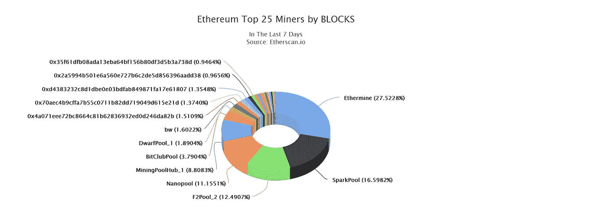
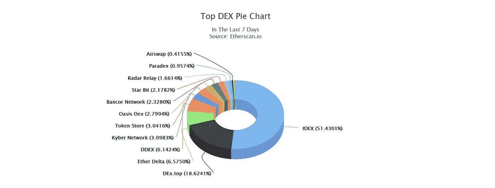
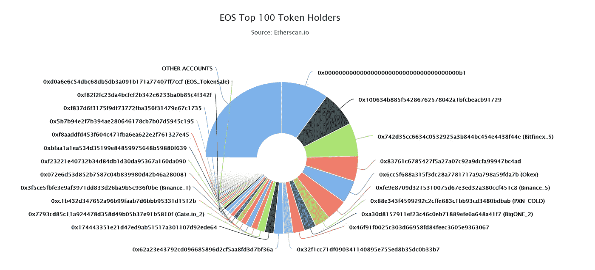
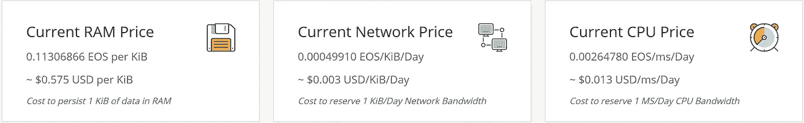

# 关于 EOS 的五个关键神话——下一个以太坊杀手？

> 原文：<https://medium.com/hackernoon/andrii-ryzhenko-five-key-myths-about-eos-next-ethereum-killer-ed062f21d17f>

你好，我亲爱的密码读者！

如果你对神话感兴趣，请跳过这篇文章，阅读我最喜欢的故事:

*   《美国众神》是尼尔·盖曼写的一部小说。小说的电视改编见[美国众神(电视剧)](https://en.wikipedia.org/wiki/American_Gods_(TV_series))
*   **荷马笔下的*伊利亚特***


但是如果你是一个对 EOS 感兴趣的技术人员，你可以继续当前的文章。

# 神话之前的一些数字

**EOS vs 以太坊**

市值:70 万 BTC 对 3 00 万 BTC

每日交易: [60 万](https://etherscan.io/chart/tx)对 [40 万-60 万](https://eosflare.io/)

但是很多 EOS 交易没有转账类型([推广、购买资源、新账户、](https://eosauthority.com/blog/types_of_transactions_on_eos_accounts)等)。)

非零余额账户: [~ 15 400 000](https://bitinfocharts.com/top-100-richest-bitcoin-addresses.html) (？)与 [310，000](https://eosflare.io/) (因为并非所有 EOS 账户都是免费的)

节点:18 000 对 21(总共 400 个备用节点)

***我们可以看到，以太坊仍然是 DApp 世界的王者，但 EOS 走在了前面。***

# 神话列表

我们将遵循关于 EOS 的五个简单神话:

*   M1。真正的分权
*   M2。最快的[区块链](https://hackernoon.com/tagged/blockchain)
*   M3。方便用户的
*   M4。自由交易
*   M5。命令行[极客工具](https://hackernoon.com/tagged/tool)

如果你想看最受欢迎的流言，请在评论中注明

# M1。分散

EOS 比以太坊更去中心化这个神话的主要核心。

神话专家提供了来自以太扫描的图表:



要控制以太坊网络，你需要一个有 4-5 个主要矿池的联盟，而 EOS 有 21 个(或 14 个)生产商。

是真的吗？

不会，因为你不能拿生产商和矿工比。

以太坊矿工只是网络的奴隶。矿工池是一个临时结构，只能做有限的事情:

*   交易重复支出
*   忽略事务队列
*   创建新的分叉

但是因为这个池子是一个暂时的联盟:在任何韭菜通知操控之后，人们开始向另一个池子迁移。但是如果我们谈论以太坊的社区，没有人(包括维塔利科·布特林或加文·伍德)能提供任何快速的变化。

例如，Bitman 控制了将近一半的比特币市场，但没有人担心比特大陆只是一个矿工，只能创建一个新的分叉或破坏网络声誉，但不能控制区块链本身。

或者看看[分散交易订单跟踪器](https://etherscan.io/stat/dextracker)的情况



但是对于 EOS 来说情况却大不相同:

## 发展变化

**街区制作人**是 EOS 网络的权威和策展人。在 DPoS 系统中，块生产者运行底层网络层来处理 EOS 上的所有事务。总共将有 21 个数据块生产者和另外 400 个备份节点，它们会忽略这 21 个数据块生产者的活动

EOS 生产者可以:

*   写块(挖掘角色)
*   验证事务(挖掘角色)
*   EOS 每生产一个街区就奖励一次生产者
*   **对提案进行建议和投票**

[Block.one](https://block.one/) 是最重要的玩家，控制着 10%的代币。

[实际上，包括交易所在内的前 100 家账户控制着近 75%的代币。](https://etherscan.io/token/tokenholderchart/0x86fa049857e0209aa7d9e616f7eb3b3b78ecfdb0)

另外 25%的用户是不活跃的，主要是正式授权。

由于我们有委托-利益相关证明模型，我可以想象，为了完全控制网络，在媒体支持下，将近 30%的令牌作为赌注就足够了。

因为另外 70%的用户可以是不活跃的或者了解真实情况。



## 控制现金

丹尼尔·拉利默获得巨额资金后。
但是你知道这种现金或者 ICO 以太坊的使用信息吗？

比如，你还记得攻击以太坊网络的决定吗？

你觉得是网络持有者还是制作人认可的？

没错。

如果一小群人控制着超过 10 亿美元而没有任何报告，我们能说这是一个分散的社区吗？

如果丹尼尔需要 5-10%的代币来改变余额？他可以花现金购买。

把这个和以太坊比较一下。以太坊最初 1800 万美元的众筹和项目开发资金现在由以太坊基金会管理，这是一家总部位于瑞士的非营利实体。

## dpo:被政府攻击或关闭的风险

> EOS 中完整节点的数量将会更少。丹·拉里默有一个叫做 DPOS 的概念，他说在 DPOS，你只需要网络中的 100 个节点，在这些完整的节点之间达成共识，其他人都是瘦客户端。它(EOS)声称可以处理更多事务的另一个原因是，这些完整节点的要求(带宽、计算)要高得多。这是实现可伸缩性的一种方式。
> 
> 问题是，如果您有 100 个节点，系统会更加集中。你可以拒绝服务他们。因为你必须为他们投票，获胜的节点将是所有人都知道的节点。所以攻击运行节点的人要容易得多。互联网服务提供商可以关闭它们，公司可以关闭它们，政府可以相当容易地关闭它们。

Vitalik 的基本论点是，完整节点更少，它们很容易被识别，可以被政府关闭。

但是试着模拟一个什么结构会关闭以太坊的情况？完全没有，因为它更分散。

## 摘要

看起来这是丹尼尔·拉里默和他朋友的玩具。但现在它是最受欢迎的玩具，并正在大力发展。但是如果我能想象没有维塔利克的以太坊，但是你能想象没有丹尼尔的 T2 的未来吗？

# M2。最快的区块链

EOS 比以太坊快得多。目前预计实际速度接近每秒 4000 次交易。在修改代码和添加更强大的生产者硬件之后，它可以增加。

但是为什么 EOS 比以太坊快呢？

EOS 有另一个共识的主要原因，安全和逻辑模型。不是更好，只是另一个！

主要速度关键因素:

## 共识:

委托风险证明(delegated-Proof-of-stage，简称 dPoS)是一个由一组称为分级委托的主节点验证的区块链。确认交易只需要 14 个节点。

EOS 旨在允许节点验证部分状态。这意味着并非所有节点都需要运行每个合同。这反过来意味着，您可以了解您所关心的应用程序和合同的状态，而无需占用大量资源。

以太坊仍然在运行，且需要巨大计算，并且对于所有具有 18 000 个节点的网络都是如此。例如，支持 PoA consensus 的以太坊每秒可以支持 80 个或更多的事务，而 PoW 只能支持 15 个。

## 安全性:

EOS 是用户注册的公共区块链。二等兵区块链希望最小化安全验证。例如，private Hyperledger Fabric 每秒最多可支持 7500 笔交易。

由于 EOS 信任自己的用户和生产者开发团队削减了两个关键的东西:

**Merkle 树**是以太坊的主要计算瓶颈，被 EOS 踢出。

> EOS 说他们可以处理更多事务的原因来自两个方面。其中之一是以太坊有很多 EOS 没有的协议特性。例如，其中之一是 Merkle 树。因此，如果你想证明任何交易，那么网络中的任何人都可以证明。你实际上不需要那么多的计算能力来证明那个账户的状态是某个数字，并且交易被包括在内。EOS 没有这个。(с)维塔利克·布特林

[](https://steemit.com/eos/@dan/response-to-vitalik-buterin-on-eos) [## 对 Vitalik Buterin 关于 EOS - Steemit 的反应

### 在上述视频进行到 8:20 分钟时，Vitalik Buteran 说:EOS 说他们可以处理更多数据的原因是…

steemit.com](https://steemit.com/eos/@dan/response-to-vitalik-buterin-on-eos) 

> 为了支持 merkle 证明的有效生成及其验证，具有包括所有块的 merkle 树是有用的。通过跟踪树的前沿，可以在增量的基础上计算该树。

[](https://github.com/EOSIO/eos/issues/8) [## 所有区块 id 的持续增长默克尔第 8 期 EOSIO/eos

### 为了支持 merkle 证明的有效生成及其验证，有一个 merkle…

github.com](https://github.com/EOSIO/eos/issues/8) 

[区块链平台 EOS 发现包含关键安全漏洞](https://www.scmagazineuk.com/blockchain-platform-eos-found-containing-critical-security-vulnerabilities/article/1472602)

参见[以太坊交易的生命周期](/blockchannel/life-cycle-of-an-ethereum-transaction-e5c66bae0f6e)

EOS 不是区块链最快的，但是对于 DApp 环境来说，每秒 4000 tx 的速度已经足够满足实际需求了。

# M3。用户友好的区块链

正确。这是一个真实的神话。EOS 是一个用户友好的区块链。

## 用户名

*   EOS 支持比公共地址更灵活的用户名

```
detonator212
```

和...相对

```
EOS7epiMwQShVAYS6py3SrrJJbuCnbmhN9C6USYnMKBxJPYkydBcZ
```

## 事务内部的消息

*   EOS 支持事务内部的可读消息。你可以像在银行交易一样发送详细信息！在以太坊中，你在阅读之前将它从十六进制转换。

阅读下一篇文章，将其与以太坊进行比较

[](https://hackernoon.com/andrii-ryzhenko-blockchain-art-images-kitties-instruction-4c748ae71e0a) [## 区块链艺术。图像包括区块链中的小猫。循序渐进的指导。

### 区块链变得越来越商品化，不仅仅是极客可以使用。你可以试试看！今天我们将度过…

hackernoon.com](https://hackernoon.com/andrii-ryzhenko-blockchain-art-images-kitties-instruction-4c748ae71e0a) 

## 插件和 UX 工具

*   EOS 有自己的元蒙版——散点和所有基本工具

 [## EOSToolkit.io |一个 EOS 网络钱包

### EOSToolkit 是管理 EOS 账户的主要免费开源接口。创建，转让，股份，投票和更多…

eostoolkit.io](https://eostoolkit.io/) 

# M4。免费交易费

我们不能诚实地说交易费真的是免费的。

为了使用区块链，用户需要标记他们的代币(锁定在一定时间内不可转让)。关于[如何免费构建去中心化应用的更多细节。](https://bytemaster.github.io/article/2016/02/10/How-to-build-a-decentralized-application-without-fees/#)

但是对于大多数操作，用户不需要付费(小额支付包含在基本账户创建中)。通常，希望 DAapp 的所有者创建智能合同并支付运营费用。

这是 EOS 和以太坊之间的主要区别，因为在以太坊中，支付是由运行智能合约功能的用户提供的。

作为应用程序的所有者，您必须提供主要资源:

**CPU** 需要桩子。随时取消堆叠以收回您的 EOS 令牌

```
CPU Bandwidth is measured as your average consumption in microseconds over the last 3 days. CPU bandwidth is temporarily consumed when you send an action or transaction but decreases over time returning to 0\. The longer your transaction runs, the more CPU bandwidth it will consume.
```

**必须购买 RAM**

```
RAM is required to store data on the blockchain and must be purchased. You get a set number of bytes of storage based on the current RAM market price. The price automatically adjusts up and down with buying and selling action. When you release storage you can sell RAM back to recover EOS at the current ram market price.
```

**网**需要股份。随时取消堆叠以收回您的 EOS 令牌

```
Network Bandwidth is measured as your average consumption in bytes over the last 3 days. Net bandwidth is temporarily consumed every time you send an action or transaction but decreases over time returning to 0
```



查看 EOS 的当前价格。通过在线 EOS 资源规划器获得 IO 网络存储和带宽资源:

 [## EOS 资源规划

### ERP 是一个免费的开源工具，可以显示 EOSIO 网络存储和带宽资源的当前价格。

www.eosrp.io](https://www.eosrp.io/) 

# M5。极客专用的命令行工具

这不是真理神话！实际上，您可以从 GUI 提供所有必要的操作:

*   创建账户
*   创建密钥对
*   转移 EOS 或令牌
*   从网站页面简单付款

如果您想点击参加考试网，请链接:

[](https://hackernoon.com/andrii-ryzhenko-eos-first-steps-account-wallet-keypair-testnet-transfer-tokens-validate-transactions-cc470b713abe) [## EOS 的第一个婴儿步骤:帐户，钱包，密钥对，测试网，转移令牌，验证交易。

### OS 还年轻，大部分环境都是刚刚开发，但是一些必备的东西是有的，而且……管用！

hackernoon.com](https://hackernoon.com/andrii-ryzhenko-eos-first-steps-account-wallet-keypair-testnet-transfer-tokens-validate-transactions-cc470b713abe) 

对于 mainnet 链接:

 [## EOSToolkit.io |一个 EOS 网络钱包

### EOSToolkit 是管理 EOS 账户的主要免费开源接口。创建，转让，股份，投票和更多…

eostoolkit.io](https://eostoolkit.io/) 

# 摘要

EOS 是一款创新型区块链，具有令人印象深刻的独特优势:

*   快速性能
*   近乎自由的交易
*   开发环境和工具
*   强大的社区

但是我个人认为以太坊仍然是区块链的国王。