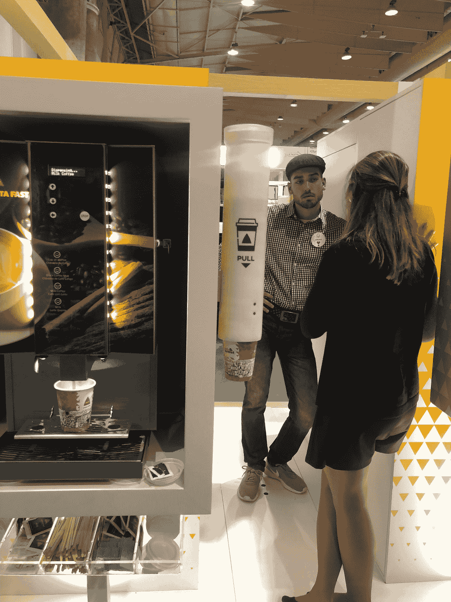

# 网络峰会 2018:明年见？

> 原文：<https://medium.com/hackernoon/andrii-ryzhenko-web-summit-2018-see-you-next-year-d5acccf77069>

## 为什么我不期待 2019 年网络峰会

网络峰会是欧洲最拥挤的活动——今年它聚集了 70，000 名与会者，包括客户、领导、学生和数百名客户参与和[领导产生机构](https://datarob.com/lead-generation-agency/)。光是这个数字听起来就令人印象深刻。过高的期望和过多的广告。但是网络峰会不负众望吗？我们来分解一下。

# 期望:一流的会谈。

事实:许多讲座似乎是赞助的，而且一般都很平庸。以穿着豹纹睡衣上台的演讲者为例，他们试图插入一些营销废话。有太多像机器人索菲娅这样受欢迎的人，以及像微软、三星和其他公司这样的市场领导者赞助的讲座。一些当地的大人物、政治家、博客作者和几个被遗忘的全球品牌代表。

# 期望:结识新的有趣的人。

事实:网络峰会的确是与各行各业的人见面和交流的地方。每个人看起来都很开放:你可以和任何人开始交谈，并很容易找到公司在夜间峰会期间出去喝酒。

# 期望:一流的观众。

现实:不可能。太多的学生和年轻的专业人士。许多与会者来参观葡萄牙和里斯本。平均下来，观众水平极低。如果我们把人群分成几层，会有像 IBM 这样的大公司的员工，他们除了重复他们的指导方针之外，没有什么新的东西可以讲。然后是学生和有抱负的专业人士。遇到典型的首席技术官或至少是决策者的可能性约为 3%至 5%。像任何其他会议一样，与会者忙于收集礼物和免费水瓶。

# 期望:产品公司和创业公司。

事实:基本上，广告站和隐蔽的服务公司销售开发人员，但试图通过一个创业公司。一旦你深入挖掘，就会发现创始人们把他们的想法建立为 Alpha，而实际上，他们是作为一家服务公司来运营的。尽管如此，还是有很多合法的创业公司。测试版初创公司也很受欢迎，它们提供了学习大量新事物的机会。

还有一点要提的是——大量来自俄罗斯的公司将自己更名为英国创业公司。另一方面，乌克兰公司体面而自豪地代表了他们的国家。

# 期望:人人机会均等。

现实。网络峰会赠送了太多的门票，例如，女性与会者的门票只有€40 英镑，而€的标准价格是 425 英镑。很多本地公司。有的买了阿尔法三个，便宜很多。

总而言之，定价政策远非透明和性别中立。可悲的是，像网络峰会这样引人注目的事件为男性和女性提供了不平等的机会。我不知道这样的政策促进了什么，但肯定不是平等权利。

# 期待:三个动作满满的日子。

事实:头两天出席人数最多，会谈的质量不相上下。第三天在出席人数和发言人方面要弱得多。

# 期望:一流的服务。

事实:这个活动太大了，无法提供完美的服务。这就是为什么服务水平可以用仅仅好来形容。

# 期望:网络峰会是一个你很容易找到客户的地方。

事实:当然也有例外，但是统计数据却告诉我们事实并非如此。如果我们以乌克兰的服务公司为例，Softserve 带来了 80 名员工。另一家服务公司 ELEKS 带来了 20 个。询问他们平均工资[数字营销专员工资](https://datarob.com/lead-generation-specialist-inbound-outbound-marketing/)。展台上的许多公司都是服务公司。加上当地公司和东欧与会者的涌入。西方公司的代表性不足。确实有一些专业人士可以吸引潜在客户，但网络峰会更像是一种鼓舞人心的活动，而不是一个专门的会议。

# 我对 2018 年网络峰会的看法

网络峰会的好处是里斯本本身和一些新的、有趣的创业公司。不幸的是，不利的一面是广泛的听众、主持人，以及明显的赞助式演讲。

给主持人一个建议:不要把**明显赞助的会谈**安排在上午。不管他们给你多少钱。如果我想看穿着奇怪的西装和拖鞋的人，我会看电视节目。

我想要的是学习如何让互联网为全人类所用，并倾听那些渴望改变世界的人们。去看一些不同的东西。如今，机器人索菲亚是任何活动的常客，但不再是创新或抵抗。

我所目睹的是大量的人为了赚钱而被推入广告的枷锁中。我不想成为羊群中的一只羊。所以我的选择是不支持网络峰会这样的大型活动。

**再见网络峰会——你曾经很棒！**