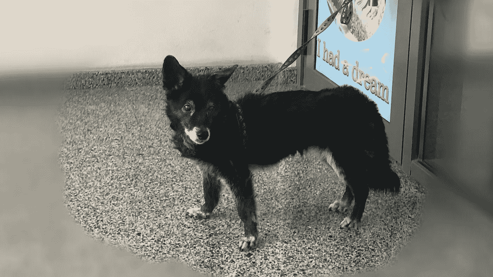
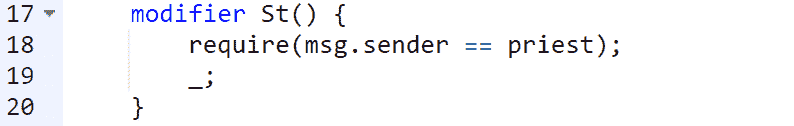
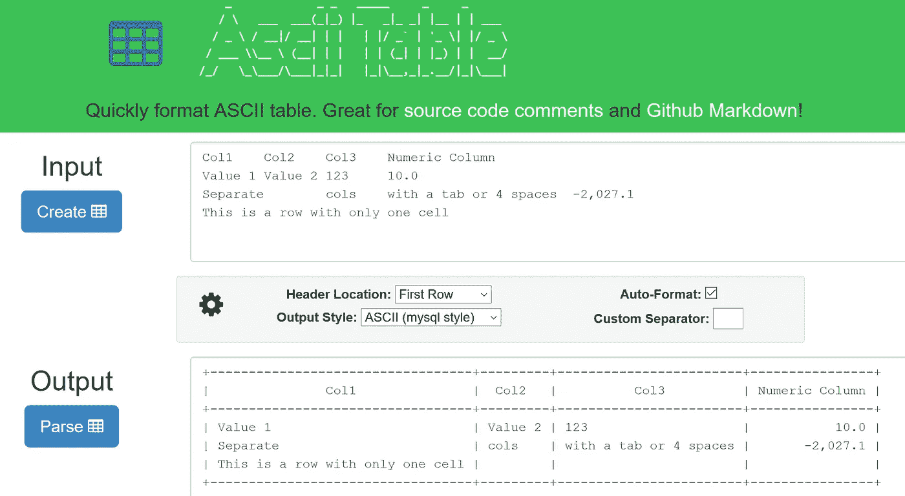
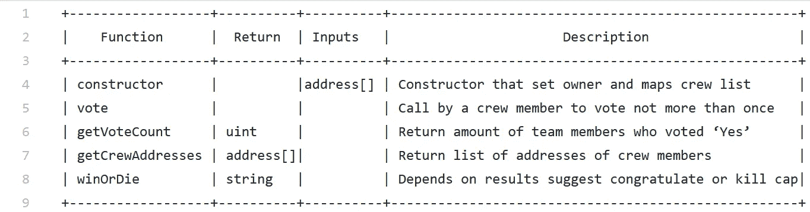
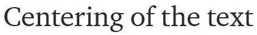
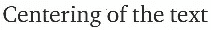
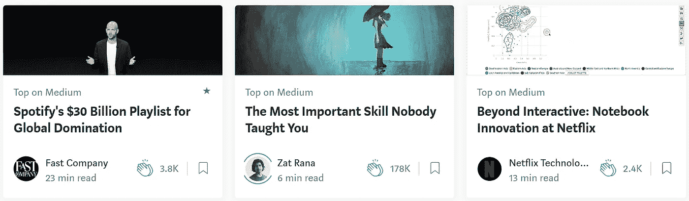
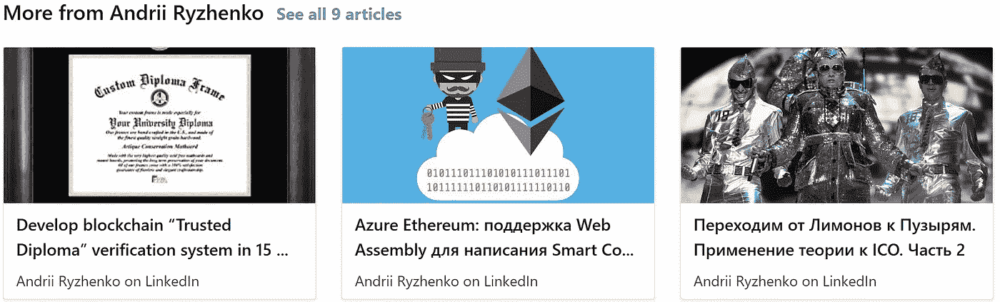

# 为什么中是痛，如何局部修复？三个免费的简单生活窍门

> 原文：<https://medium.com/hackernoon/andrii-ryzhenko-why-medium-is-pain-and-how-to-fix-it-locally-three-free-simple-life-hacks-5817d4d99da9>

我是 Medium 新手，刚刚推了几篇文章。此外，我可以说，媒体对于新作者推广内容来说是非常有限的，主要集中在鲸鱼上。

当我开始在谷歌上搜索这个问题时，我找到了很多类似“为什么要用媒体”的资料，但没有任何真正有用的支持。



Dog waiting owner near a mall. Kyiv Aug 2018

我会尽力修好它。从三个最上面的袋子开始。

# 1.谷歌引擎索引速度慢

在谷歌开始索引文章之前，作者必须等待几天。因为媒体必须在同一时刻传递你的想法，这是非常具有破坏性和无动机的。
此外，scan-bot 可能会复制您的内容并发布到自己的垃圾网站上。

## 解决办法

*   使用技术(第二)twitter 通过发送实际链接和更新来提高索引速度。
*   不要在谷歌索引之前将内容复制到 LinkedIn 或脸书，因为机器人可以窃取并复制到垃圾网站。
*   使用[谷歌](https://hackernoon.com/tagged/google) +技术账户来提高大多数关键文章的索引速度
*   始终使用所有 5 个标签。每个流行的标签都有自己的 feed，它真的可以改善索引。放上艺术、儿童、比特币——没关系——使用所有 5 个标签！
*   检查站点:medium.com(您的内容)。例如，我在谷歌上查看这个请求:

```
site:medium.com andrii ryzhenkosite:linkedin.com pulse andrii ryzhenko
```

# 2.表格或代码的截图。形成限制

将数据复制为屏幕截图时，您会丢失很大一部分内容。仅将截图作为最后的选择。看看我一个月前的老例子:



总是推送最大文本内容！

## 解决方法

## GitHub gits 的表格和代码。

首先，你要创建一个表结构。去…

【https://ozh.github.io/ascii-tables/】T5[T6](https://ozh.github.io/ascii-tables/)

填充表格数据，复制输出



前往 github.com，注册(可选)并点击“新要点”或直接[前往 https://gist.github.com/](https://gist.github.com/)

将表输入到编辑器中，如果需要，请修复它。我最后一个截图的例子:



点击**创建公共要点**按钮。

从要点复制链接，插入到媒体，并按下回车键。我的例子是带有文本的表格:

## 编队代码

Ctrl + Alt + 6 =将一个文本块变成/开始一个新的 ***代码*** 样式

```
constructor( address[] _crewAddresses) payable public {
        nextCapitan = msg.sender;
        crewList = _crewAddresses;
        voteCount = 1;
        for (uint i = 0; i < crewList.length; i++) {
            crew[crewList[i]] = true;
        }    
}
```

## 使用外部网站:

您必须知道 Medium 支持外部内容的网站:

> Youtube、Vimeo、Twitter、Vine、Kickstarter、SoundCloud、Instagram、
> 
> Github gists(必须有！).

部分内容最好转移到本网站，并使用可用的信息选项。把它们都尝试一下，找到最好的文章，用例子来验证你的风格。您在使用 gitlab 与 Medium 集成时仍然受到限制，并且只能使用 gits，顺便阅读更多关于 [github 与 gitlab](https://ncube.com/blog/github-vs-gitlab) 的详细信息。

## 文本居中

```
 Sorry, no options, it was fixed. !
              Use manual formation inside of Code boxes or 
                           Images with text 
```



# 3.Medium 只推广顶级作者，并转移普通博主的流量

中型商业模式只关注顶级博客。所有其他员工都想发财。如果你在 LinkedIn 上查看任何帖子的页脚，你会发现同一作者的帖子。

但是媒体总是建议来自完全不同领域的博客作者！

作为读者的媒介，网站正在转移你的流量。

我的技术文章致力于[区块链](https://hackernoon.com/tagged/blockchain)和智能合同。但是 Medium 在我的页脚写了:



如果你转到 LinkedIn 页脚，你只能看到自己的内容



## 解决办法

*   尝试将所有批评文章作为出版物发布。代理处会提拔你。我最喜欢的是黑客正午。
*   在内容的页脚和内部放置更多的 URL。
*   在故事结尾创建一个包含联系人和链接的区域，将读者转移到实际内容。
*   添加令人兴奋的评论和链接，帮助读者跳过中等页脚。
*   记住！灵媒想转移你的听觉！为他们奋斗！

## 非常感谢！别忘了你最多可以鼓掌 50 次！❤

敬请关注 Medium 和 LinkedIn【https://www.linkedin.com/in/andrii/ 

阅读有关数据科学和分析新趋势的更多信息。尝试[雇佣数据研究员](https://datarob.com/hire-data-researcher/)来加速你的业务增长。