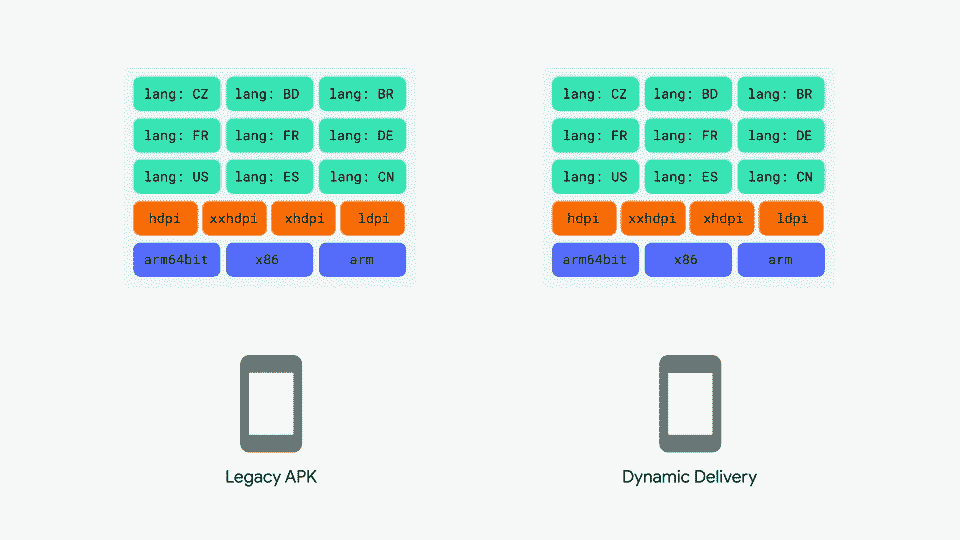
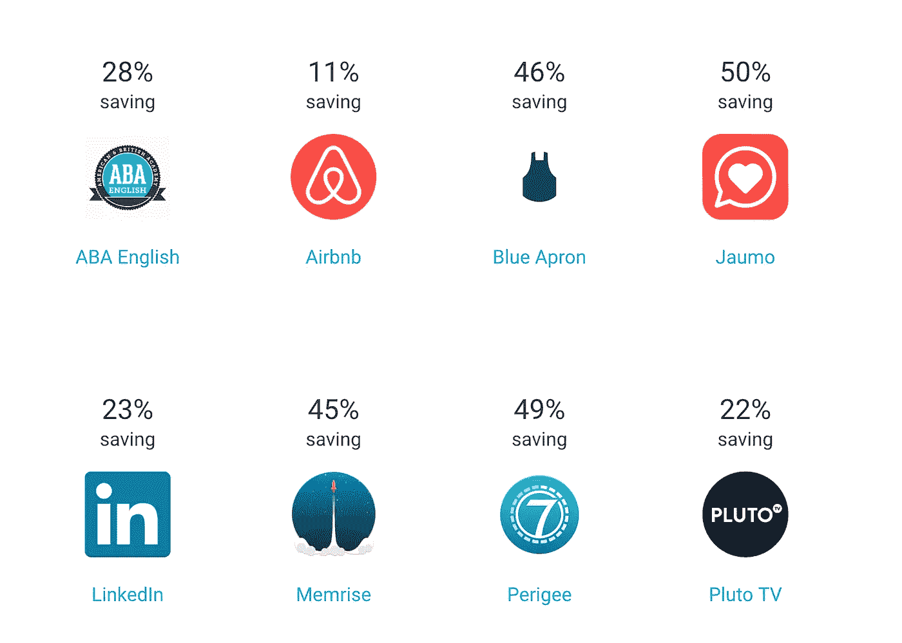
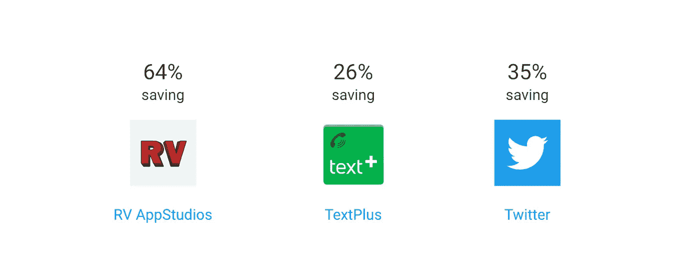

# Android 应用捆绑包

> 原文：<https://medium.com/hackernoon/android-app-bundle-cba5e4bb3ff1>

> **什么是安卓应用捆绑包？**

**安卓应用捆绑**是一种新的应用发布格式或上传格式。这是打包应用程序的改进方法。它包括你的应用程序的所有编译代码和资源，但将 APK 的生成和签署推迟到 Google Play。Android 应用捆绑包让您可以更轻松地在更小的应用程序中提供出色的体验，从而支持各种各样的设备。较小的应用程序不需要重构代码。

> **哇！听起来很棒，对吧？让我们深入了解一下。**
> 
> 在了解 Android 应用捆绑包到底是什么之前，你应该知道**为什么**要使用这种新的发布格式，而不是发布多个 apk(传统方法)？

# 为什么要用安卓应用捆绑？

使用 Android 应用捆绑包有很多好处，但我们将主要检查最重要的一个。

*   动态交付
*   没有更多的 apk
*   缩小的 APK 尺寸
*   动态特征模块

虽然从名字上看很清楚，但我们会逐一介绍。

## **动态交付**

上面的 gif 解释了 Android 应用捆绑包提供的关于动态交付的一切。

Android 应用捆绑包的新发布格式，称为 ***动态交付*** ，使用您的应用捆绑包根据每个用户的设备配置生成和提供更多优化的 apk，以便他们只下载运行您的应用所需的代码和资源。例如，如果您将英语设置为默认语言，则不需要其他语言字符串

## **不再有多 apk**

早些时候，我们曾经构建多个 apk 并管理不同的版本，这个过程是如此的混乱和低效。现在，使用 Android 应用捆绑包，您可以构建一个工件，其中包括您的应用程序的所有编译代码、资源和本地库。您不再需要为多个 apk 构建、签名、上传和管理版本代码。

## 动态特征模块

这些模块包含用户首次下载和安装您的应用程序时，您可以决定不包含的功能和资源。[使用 Play Core 库](https://developer.android.com/guide/app-bundle/#playcore)，您的应用程序稍后可以请求下载这些模块作为动态特性 apk。例如，视频通话功能和摄像头过滤器可以在以后按需下载。

动态功能模块实际上包含**功能**和**资产**，我们可以决定是否要在首次下载和安装我们的应用程序时包含它。用户可以通过使用 [**播放核心库**](https://developer.android.com/guide/app-bundle/#playcore) **请求下载那些特性或模块作为动态特性 apk。**

我们举一个相机 APP 的例子，它也包含滤镜。在应用程序的第一次下载，只有相机模块将被安装，但如果用户需要一些过滤器，然后这些过滤器模块可以作为动态功能 apk 下载。

## **缩小 APK 尺寸**

Google Play 使用分裂 APK 机制，它可以将一个大的应用程序分解成更小的、离散的包，根据需要安装在用户的设备上。平均而言，通过应用捆绑包发布的应用的大小要小 20%。这里有一些数据，你会惊讶地发现

到目前为止，你可能已经了解了 Android 应用捆绑包的概念。

> **更新**
> 
> 将会发表另一篇关于如何实现 ANDROID 应用捆绑包的博客。

如果你已经对这个或下一个博客感到兴奋，添加👏表现出一些爱。💌