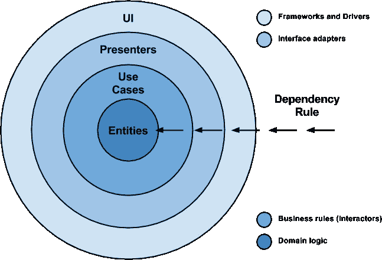

# Android Clean 架构，采用 Kotlin、RxJava 和 Dagger 2

> 原文：<https://medium.com/hackernoon/android-clean-architecture-with-kotlin-rxjava-and-dagger-2-6006be2d0c02>


尽管我们生活在一个敏捷的世界里，有很多时间和精力管理技术可以在你的生活中轻松实现，但是在软件开发中仍然有一些事情可以提高你的生产力和代码的总体质量。

在这篇文章中，我想描述的是以[干净架构](https://8thlight.com/blog/uncle-bob/2012/08/13/the-clean-architecture.html)方式的应用架构。通过在您的项目中实现 Clean，您将拥有用于数据存储、处理和呈现的解耦的、可测试的部分。干净的应用程序非常容易维护，因为可互换的实现，你可以很容易地改变应用程序的每个方面:从 UI 和简单的数据处理到 DB 和 API 框架。

乍一看，你可能会认为干净的架构是一堆抽象的想法，没有“真正的代码”的力量，但是在这篇文章中，我将尝试向你展示这些如何在 Android 端实现。

首先，让我们快速介绍一下项目结构:我将使用视图和演示者来显示应用程序的 UI 部分，并使用 Kotlin+RXJava2+Dagger2 在 network \ db \ cache \等工作中实现干净的架构原则。

# 科特林

Kotlin 的特性极大地简化了 android 开发，不仅允许你使用更小的语言结构，还能在你的应用中保持语义正确的功能。这将让你少考虑实现细节，多考虑整个应用程序的结构。Kotlin 的功能部分将减少代码的副作用，使代码更容易测试和理解。看看[的文章](https://blog.uptech.team/how-kotlin-became-our-primary-language-for-android-3af7fd6a994c)，它解释了为什么值得使用 Kotlin。

# RXJava

RXJava 为处理数据流和线程提供了易于使用的东西。但在我看来，RxJava 的主要目的是为应用程序中的数据流提供通用结构。
说真的，如果你还不熟悉 RxJava，你应该[去看看](https://github.com/ReactiveX/RxJava)。

# 达格人 2

【Android 和 Java 的快速依赖注入器。Dagger2 是一个很棒的库，它允许你把你需要的所有东西注入到你需要的地方，并处理创建的对象的生命周期。Dagger2 用于避免将架构元素相互连接的细节复杂的样板代码。

# 让我们来看看建筑

我们将遵循这个众所周知的图片上的依赖规则来创建一个具有可互换部件的应用程序。



仅仅几个原则( [S O L I D](https://en.wikipedia.org/wiki/SOLID_(object-oriented_design)) )将允许我们分离应用程序的数据获取和处理过程，构建可互换的视图，并保持它们的接口干净简单，同时保持框架和数据层实现的可靠抽象级别。

正如我之前提到的，应用架构的 UI 部分将建立在视图和呈现者之上，你可以在这里[和](/@cervonefrancesco/model-view-presenter-android-guidelines-94970b430ddf)[这里](http://hannesdorfmann.com/mosby/mvp/)找到很好的指南。
数据获取和处理层将作为用例和存储库呈现。

# 样品

从现在开始，我们将检查更改用户电子邮件的功能以及在每一层上执行的操作。
如果你不熟悉清洁架构方法，你应该看看费尔南多切哈斯的[文章](https://fernandocejas.com/2014/09/03/architecting-android-the-clean-way/)。

## 数据层

数据层由存储库接口表示。每个存储库与应用程序的一个单独的、定义良好的方面(用户、消息、事件收件箱等)一起工作

> 此存储库的主要目的是处理用户工作流:API 调用创建\获取\修补用户实体。

匕首模块代码:

> 请注意，[@的返回值提供的](http://twitter.com/Provides)注释函数是一个接口，而不是实现。这种方法将允许我们对实现进行巨大的改变，而不改变“客户端”代码。

## 畴层

领域层的元素是用例。UseCase 的作用是组合数据层元素，执行数据操作的组合。

> 另一件重要的事情是应用程序的每一层都有不同的实体。当依赖性反转原理以另一种方式工作时，额外的场减少。
> 每层不同实体的目的是减少内层可能依赖的信息量。例如，在应用程序的域和表示层中，您的实体不需要 api 版本，您只需要数据层中的这个属性。

## 表示层

表示层由两个元素组成:一个被动视图和一个具有表示逻辑的表示器。视图是完全被动的，所以当执行任何 UI 动作时，它只调用 presenter 函数，Presenter 决定在一个或另一个 UI 事件上必须执行什么动作。

查看:

演示者:

# 调用堆栈

这是一次快速的分层。现在让我们来看一下当用户按下 confirm 按钮时调用堆栈。

首先，调用视图中的按钮点击监听器。

```
*confirmButton*.*onClick* **{** presenter.onConfirmButtonClicked()
**}**
```

然后 view 调用演示者的方法。在 presenter 中，我们使用*validation utils . is valid email(view . getemailinput())*验证用户输入，如果输入无效，则显示用户验证错误消息。我们设置 observable 使用 observeOn()操作符在指定的线程上执行它的发射和通知。如果我们不需要在某个线程上执行操作，我们就让用例或知识库来设置 observable 将要工作的线程。

```
changeUserEmailUseCase.changeUserEmail(view.getEmailInput()) .observeOn(AndroidSchedulers.mainThread())
```

最后，我们订阅项目排放，指定“快乐”和“错误”情况。

```
....subscribe(
 { //Email is successfully changed },
 { //Error while changing email }
)
```

用例本身将使用存储库的实现来执行电子邮件更改操作。

```
appUserRepository.changeUserEmail(email)
    .map { DomainMapper.fromDataUserToDomain(it) }
```

它还通过减少外层依赖性或添加显示内容可能需要的字段，将元素映射到可理解的 UI 层类型。

存储库将使用 DB、Firebase 或 API 执行电子邮件更改操作，在本地内存中缓存结果，并通过 RxJava 主题向订户分发新信息。

# 结论

你仍然可以花时间将特性部分从你的代码中分离出来，以在你的项目中创建某种代码可重用性，或者你可以使用这种在 Android 中组织事物的方式，这允许你为你的客户和顾客创建一个可测试和可维护的解决方案。构建易于更改的应用程序，因为它的各个部分都是基于功能的，有保证的，你不会因为微小的更改而重写一半的应用程序，顺便说一句，这会让你的客户讨厌。

# 链接

[Kotlin 语言文档&教程](https://kotlinlang.org/)
rx Java 和[rx Android](https://github.com/ReactiveX/RxAndroid)
[dagger 2 集成示例，教程&文档](https://google.github.io/dagger/)
[干净的架构— Android 之道](https://fernandocejas.com/2014/09/03/architecting-android-the-clean-way/)作者费尔南多·切哈斯
[鲍勃大叔的架构](https://8thlight.com/blog/uncle-bob/2012/08/13/the-clean-architecture.html)
[Git 回购一个工作示例](https://github.com/uptechteam/CleanArchExample)

*如果您觉得这很有帮助，请点击*👏下面这样其他人也可以欣赏。本文原载于 [***UPTech 团队博客。***](http://blog.uptech.team) *关注我们，获取更多关于如何打造优秀产品的文章*