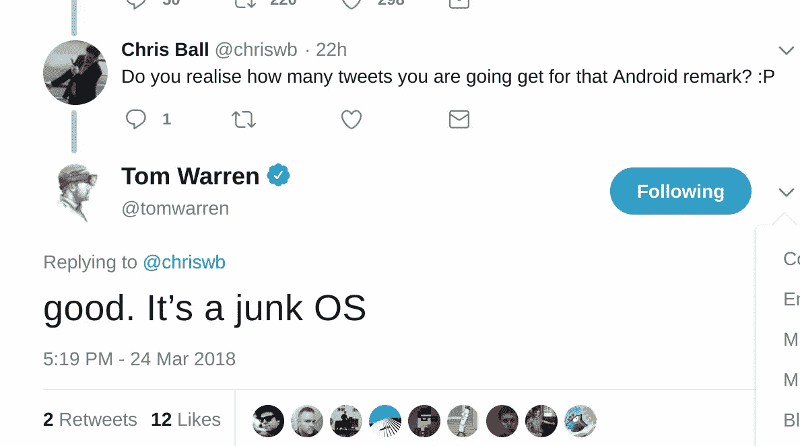
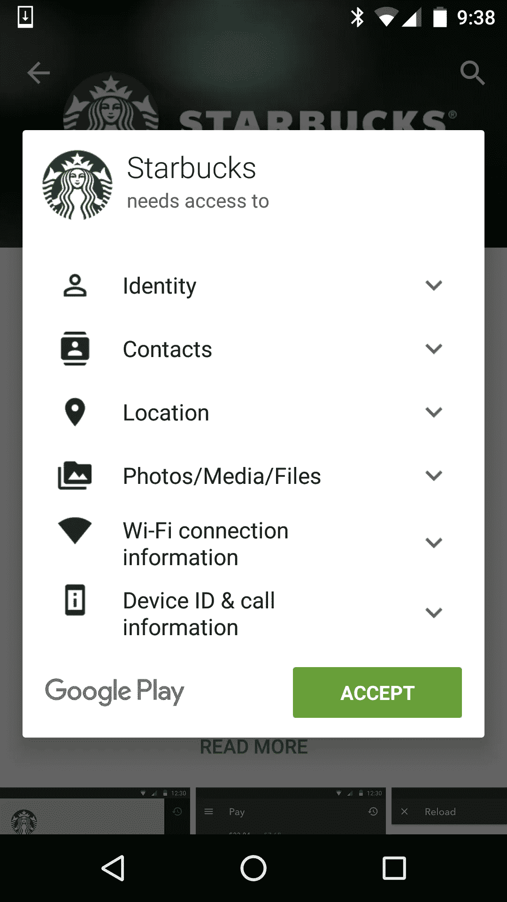

# 安卓是垃圾操作系统

> 原文：<https://medium.com/hackernoon/android-is-a-junk-os-ed4bf2bd983>

Android, according to Tom Warren

## 至少汤姆·沃伦是这么认为的

好了，你们走吧，伙计们。我们得到了我们需要的所有确认:一条汤姆·沃伦的推特

科技网站 [The Verge](https://www.theverge.com/) 的工作人员汤姆·沃伦(你可能听说过)今天在推特上发起了一场仇恨游行，称安卓为“垃圾操作系统”，因为几年前，脸书收集了选择加入 T5 的**T3 员工的通话记录和短信，并向脸书提供了这些信息。**

修卡，对吗？

沃伦显然对 Android 怀有一些怨恨，因为这已经是[而不是](https://twitter.com/tomwarren/status/922747326090891264)他第一次因正常预期行为而将 Android 称为“垃圾操作系统”。也许是因为它杀了他宝贵的 Windows Phone OS？谁知道呢。

## 交易

事情是这样的:在 Android Marshmallow (6.0)之前，Android 要求你预先选择一个应用程序需要的所有权限。因此，如果一个应用程序需要访问你的摄像头、麦克风、通话记录和信息，你必须在安装时授权，否则你无法安装该应用程序。

一些人认为这是一个坏主意(而[一些人仍然认为这是一个比你需要授予](https://hackernoon.com/the-android-heretic-issue-1-runtime-permissions-suck-26501d39dacb)的每个权限都弹出一个窗口更好的主意)。哪种方法更好是个人观点，但事实就是如此。

在这种情况下，脸书要求访问通话记录和短信，用户必须接受这些权限才能安装应用程序。他们照做了，脸书收集了这些信息。

虽然我不认为脸书是一个良性实体(我有一个账户，我并不经常使用)，但我也不是一个锡纸阴谋论者。无论如何，我个人不介意他们从我的手机收集信息，如果他们事先征得我的同意的话。

## 那么，沃伦的问题是什么？

显然，汤姆·沃伦认为，如果用户在安装脸书应用程序时没有阅读许可列表，那是安卓的错，他将许可对话框比作“没人阅读”的 EULA 协议。真的吗？

让我们看看一般的 Android 权限对话框，前棉花糖

这里有一个[EULA 页面的链接。](https://termsfeed.com/blog/sample-eula-template/)

几乎不是一回事，是吗，沃伦先生？

我对汤姆·沃伦在 Twitter 上如此尖锐的言论的问题是，他试图假装当用户决定安装一个应用程序时，个人责任不起作用。

据他所说，隐含的解决方案？限制操作系统允许开发者和用户做的事情，因为人们不阅读许可列表，但也想保留以后抱怨的权利，这被认为是正常的行为。

以下是我对此的看法。

即使在我成为 Android 开发人员之前，如果我突然得知脸书可以访问我的通话记录(如果我真的在乎的话，YMMV ),因为我在安装应用程序时没有阅读带有权限的小弹出窗口，我会立即告诉自己“天哪，伙计，下次读权限列表，不要这么傻”,而不是抱怨脸书和/或 Android。

但这太合乎逻辑了，对今天的“这不是我的错，即使是我的错”社会要求太高了，对吗？嘿，这个替代方案怎么样？或许教育人们在授予权限时要更加小心，因为在当今科技主导的环境中，这是隐私不可或缺的一部分？

尽情享受你制造的愤怒吧，汤姆·沃伦。它可能会让你今天获得一些点击，但至少对我来说，它只会让你失去信誉。